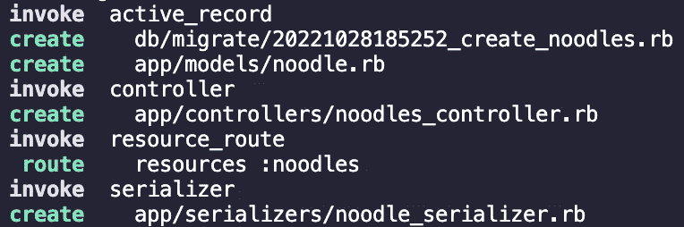

# 从 Ruby on Rails 中的自定义路线获取

> 原文：<https://medium.com/codex/fetch-from-a-custom-route-in-ruby-on-rails-834e7a014fed?source=collection_archive---------19----------------------->

任何使用过 Ruby on Rails 的人都能体会到它的高效——这是开发人员的梦想！通过终端中的一个快捷行，我们可以为所需的类创建迁移、模型、控制器和序列化程序文件。

```
$ rails g resource Noodle shape base origin
```

给了我们这个终端输出:



在终端中运行 rails g 资源时创建的迁移、模型、控制器和序列化程序文件。

除了上面的文件，这一行还为这个类在数据库中的对应表添加了“资源”。

```
# routes.rbRails.application.routes.draw do
 resources :noodles
end
```

从 routes 文件中的这一行开始，我们就自动获得了 RESTful 路径。换句话说，每个资源行为我们的五个主要操作设置了路径:索引、显示、创建、更新和销毁。

```
# routes.rbresources :noodles*# the one line above does the same job as the five lines below combined*get ‘/noodles’, to: ‘noodles#index’get ‘/noodles/:id’, to: ‘noodles#show’post ‘/noodles’, to: ‘noodles#create’patch ‘/noodles/:id’, to: ‘noodles#update’delete ‘/noodles/:id’, to: ‘noodles#destroy’
```

我们现在要做的就是在我们的控制器文件中定义这些 CRUD 动作。简单，搞定！

但是，如果我们需要另一条[路线从](https://guides.rubyonrails.org/routing.html)获取数据，这条路线不属于我们给出的五条主要路线，那该怎么办呢？例如，也许我们的每一种面条都有评论，我们希望只获取特定面条的评论，而不是数据库中的所有评论。进入[自定义路线](https://levelup.gitconnected.com/how-to-write-custom-routes-in-rails-872df2ca4d39)！

## 设置它

定制路线的设置风格[与我们从资源中获得的路线风格](/@zerminaejaz/understanding-ruby-on-rails-explicit-routes-and-creating-custom-routes-ec682b64b15)相同，如上图所示。我们从 HTTP 动词(get、post、put、patch、delete)开始，然后是字符串形式的 URL 路径、逗号、“to:”形式的 URL 路径，最后是由 hashtag 分隔的一个字符串形式的控制器和动作名称:

```
# routes.rb# route templateHTTP verb 'URL path', to: 'controller#action'# applied to an example get ‘/noodles/:noodle_id/reviews’, to: ‘reviews#specific_noodle’
```

一旦这一行被保存在我们的 routes.rb 文件中，下一步就是转到我们指定的控制器文件并定义我们指定的操作:

```
# reviews_controller.rbdef specific_noodle
 render json: Review.where(noodle_id: params[:noodle_id])
end
```

## 使用它

现在我们有了自己独特的路线，最好的部分是能够看到我们首先想要的数据！我们可以通过运行我们的服务器来测试我们的路由是否有效，然后前往 Postman 或托管我们服务器的浏览器。*记住:只有 get 请求可以在浏览器中测试——对所有其他 HTTP 请求使用 Postman。*


如何在 Postman 中测试我们新的自定义路线？


如何在浏览器中测试我们新的自定义路线？

如果我们同意返回的数据，我们现在可以将这个路由应用到我们的前端获取请求。我们从中获取的 URL 将与我们的自定义路由中的 URL 路径具有相同的端点。我们获取的方法也将匹配我们自定义路由中的方法。

```
// Frontend.js (frontend file)fetch(`/noodles/${*noodle*.id}/reviews`)
 .then(*res* => *res*.json())// Recall our custom route URL path: ‘/noodles/:noodle_id/reviews’
```

就是这样！

虽然 Ruby on Rails 给了我们很多快捷方式，但它也被设计成易于定制的。让后端做繁重的工作，并使用自定义路线筛选出准确的所需数据！

## 参考

[](https://guides.rubyonrails.org/routing.html) [## 导轨从外部布线- Ruby on Rails 导轨

### 从外向内进行导轨布线本指南涵盖了导轨布线面向用户的功能。阅读本指南后…

guides.rubyonrails.org](https://guides.rubyonrails.org/routing.html) [](/@zerminaejaz/understanding-ruby-on-rails-explicit-routes-and-creating-custom-routes-ec682b64b15) [## 了解 Ruby on Rails 显式路由并创建自定义路由

### “Ruby on Rails，或 Rails，是在 MIT 许可下用 Ruby 编写的服务器端 web 应用程序框架。Rails 是一个…

medium.com](/@zerminaejaz/understanding-ruby-on-rails-explicit-routes-and-creating-custom-routes-ec682b64b15) [](https://levelup.gitconnected.com/how-to-write-custom-routes-in-rails-872df2ca4d39) [## 如何在 Rails 中编写自定义路线

### 我项目的大部分后端都是用 Ruby on Rails 构建的。在……工作期间，我学习并使用 Ruby on Rails

levelup.gitconnected.com](https://levelup.gitconnected.com/how-to-write-custom-routes-in-rails-872df2ca4d39)