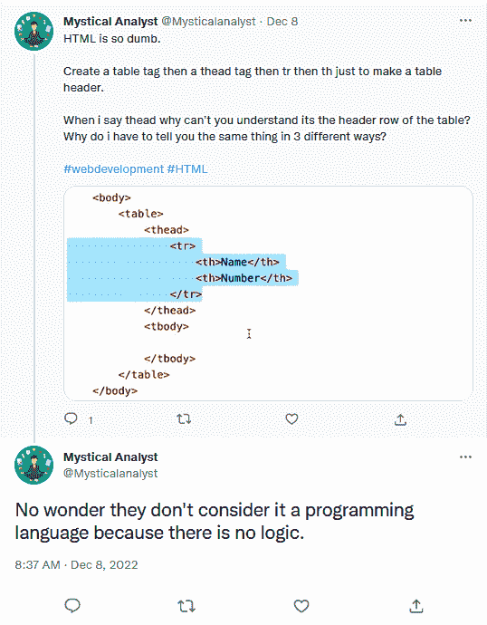

# FFS，你们这些小丑能不能学会正确地写 HTML 表格！！！

> 原文：<https://medium.com/codex/ffs-would-you-clowns-learn-to-write-html-tables-properly-48801df59833?source=collection_archive---------0----------------------->

我最近在越来越热的垃圾箱大火上看到了这个，这场大火被称为“马斯基街头艺人管理不善的灾难”

笑是当我第一次看到这个的时候，我的眼睛直接看向了代码“他的范围在哪里？”

现在我可以原谅不知道作用域或者 TBODY 行也可以有标题…或者没有意识到 header 和 heading 实际上不是同一个东西，它们有不同的用途。