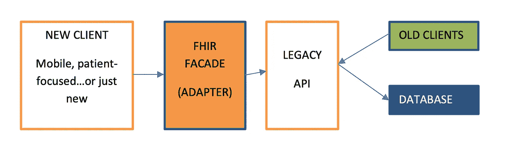
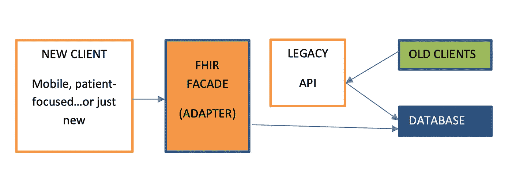
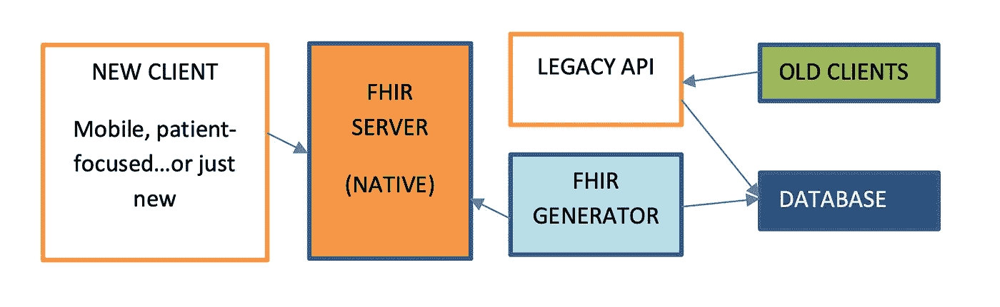
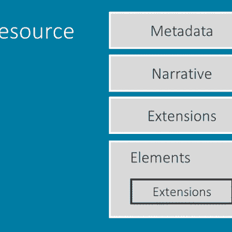

# 面向开发人员的 FHIR:第 8 部分

> 原文：<https://medium.com/codex/fhir-for-developers-part-8-53ba2f88798f?source=collection_archive---------13----------------------->

## FHIR 实施策略

到目前为止，在面向开发人员的 FHIR 系列中，我们研究了 FHIR 规范的不同方面和组件。从定义 FHIR、FHIR 资源、配置文件、交换模块、客户端、服务器等开始。所有这些都是 FHIR 的构建模块，在开始实际的 FHIR 实现之前，理解这些是很重要的。

在了解了 FHIR 及其组件的基础知识之后，您可能会想到一个问题:从哪里开始实施，或者我们如何将 FHIR 集成到您现有的实施中。决定如何开始、从哪里开始，以及实现 FHIR 应用程序的实现策略应该是什么，这不是一件容易的事情。

## 期待什么？

在本文中，我们将研究一下在 FHIR 应用程序的实现中可以使用哪些不同的实现策略。在继续实施之前，我们将了解一下您可能需要考虑的不同因素。我们还将了解在什么情况下应该使用什么策略。

# 战略

现在，当谈到实现 FHIR 时，有不同的策略可用。选择什么样的策略将取决于你当前的系统是如何实现的，以及你的最终目标是什么。每种策略都有它自己的优点和缺点，我们需要在最终决定使用哪种策略之前考虑这些优点和缺点。

## 通用服务器

当我们在实现中使用大部分 FHIR 资源时，会用到这些。此外，实现通用的 FHIR 服务器更容易。一般来说，这些类型的 FHIR 服务器都有自己的存储选项，并且可能还带有其他一些特定于服务器的功能。既有通用 FHIR 服务器(如 HAPI 服务器)的开源实现，也有专有服务器(如谷歌、微软服务器等)。由于我们实施的是完整的 FHIR 服务器，因此实施成本高于实施一般的 FHIR 服务器。

通用 FHIR 服务器

## **特定服务器**

当我们需要在现有应用/传统应用中引入 FHIR 时，会用到这些功能。即使您没有实现遗留应用程序，而是从全新的实现开始，如果您正在开发一个简单的 FHIR 应用程序，您也可能希望考虑这个服务器。在这种情况下，当我们只需要使用给定列表中的几个 FHIR 资源来实现确切的特定需求时，最好实现这些类型的服务器。实现特定的 FHIR 服务器也更便宜，但是随着系统复杂性的增加，成本可能呈指数增长。有不同的 FHIR 外观或适配器可用于实现特定的服务器。

*   **选项 1** :现有系统可访问和存储非 FHIR 数据。适配器将理解 normal 和 FHIR，并在需要时提供对两者的访问。

图像源 HL7

*   **选项 2:** 现有系统可访问和存储非 FHIR 数据，并将保持独立工作。适配器将直接连接到数据库并提供 FHIR 访问。

图片来源:HL7

> **什么是适配器？**适配器是您现有传统应用之上的一个 FHIR 层。这些适配器被用作小型 FHIR 服务器，只实现 FHIR 服务器的特定部分。这还将包括映射器实现，它将用于将您的遗留数据映射到 FHIR 模型，并且还包含 FHIR APIs 的实现。您可以在 HAPI FHIR 中查看 FHIR 普通服务器实现，以实现您自己的定制适配器

*   **选项 3** :现有系统访问和存储非 FHIR 数据，很难直接在数据上实现适配器。在这种情况下，我们将使用转换层将现有数据转换为 FHIR 数据。现在我们可以使用翻译后的数据实现一个 FHIR 通用服务器。

图片来源:HL7

## 智能飞行

这是您可以用于实施的另一个重要策略。智能 FHIR 建立在开放 id 和 oAuth 规范的基础上，允许您连接到不同的 EHR 提供商，以满足您的 FHIR 数据需求。这是一种非常流行和简单的方法来实现和开发 FHIR 应用程序，而不需要设置任何 FHIR 服务器。您可以在 FHIR 上轻松连接和访问支持 SMART 的 EHR 数据。但是像任何其他 FHIR 实现策略一样，这也有一些限制。由于 FHIR 服务器并没有在你这边实现，所以你对它的控制很少，你的数据只能依赖你的 EHR 提供商。

智能飞行

# 决策因素

在决定选择上述哪种策略之前，我们需要回答一些基本问题，这些问题将有助于我们决定实施 FHIR 系统的策略。这些也是采用某种策略和不采用另一种策略的决定因素。

## 新的还是旧的？

我们需要首先发现我们需要实施什么样的制度。该系统是新的还是全新的实现？该系统是否是一个遗留系统，我们需要为其迁移以实施和创建 FHIR 应用程序？基于对上述问题的回答，我们可以决定你应该采取什么样的策略。如果我们只是要实施一个新的系统，那么最好从一开始就全面使用 FHIR，并使用一些通用服务器，这将有助于你从第一天起就成为 FHIR 生态系统的一部分。但是如果你的答案是否定的，你可以选择一些特定的 FHIR 服务器，它们会帮助你将你的应用程序的某个部分迁移到 FHIR 上。

## 复杂？

您可能想要回答的另一个问题也是一个决定性因素是您的实现的复杂性。您想要实现的系统是否庞大而复杂？你要实现的系统是简单的吗？如果您的系统非常复杂，并且您将需要许多 FHIR 资源来实现整个系统，那么您最好购买一台通用的 FHIR 服务器。但是如果你的答案是相反的，你不需要一个非常复杂的系统，你只需要使用少量的 FHIR，那么你可以使用特定的 FHIR 服务器来定位特定的 FHIR 资源。

## 成本？

在进行任何 FHIR 实施之前，您需要考虑的另一个非常重要的问题或决定因素是实施的成本。如果您的资源有限，并且成本是您的决定因素，那么您可能更喜欢特定的 FHIR 服务器，而不是通用的 FHIR 服务器。通用 FHIR 服务器是具有更多功能的 FHIR 的更广泛的实现，导致更高的成本，但是这种成本可以通过使用一些开源实现来避免。如果您正在实现特定的 FHIR 实现，那么您可以避免通用 FHIR 服务器带来的成本，因此它是成本有效的，但它只是为您节省了初始成本，而要实现通用 FHIR 服务器，您需要更多的手动编码，因此需要更多的资源。

# 摘要

在开始实施 FHIR 时，有许多策略可供选择。您可以从通用 FHIR 服务器、特定 FHIR 服务器中进行选择，或者选择实现智能 FHIR 应用程序。我们还研究了在选择实施策略时需要考虑的不同因素。最后，我们可以有把握地说，非实施战略是完美的，每一个战略都有其利弊。选择哪种策略将取决于您自己的具体用例。

如果你喜欢我的作品，请**喜欢并分享**这篇文章(而且是免费的:)。还有，做 [**关注**](/@jaideeppahwa1) me 更多这样的文章。

另外，请查看我的完整 FHIR 开发者系列:

[贾迪普·帕瓦](/@jaideeppahwa1?source=post_page-----53ba2f88798f--------------------------------)

## 面向开发人员的 FHIR

[View list](/@jaideeppahwa1/list/fhir-for-developers-ea551cc4840c?source=post_page-----53ba2f88798f--------------------------------)9 stories

另外，看看我的其他作品:

 [## 数据结构被高估了？

### 每个开发人员都想知道答案的问题。

medium.com](/geekculture/data-structures-are-overrated-bead721dfa4e)  [## 软件工程师&不眠之夜

### 软件工程师失眠的主要原因？

medium.com](/geekculture/software-engineers-sleepless-nights-9272d5233582)