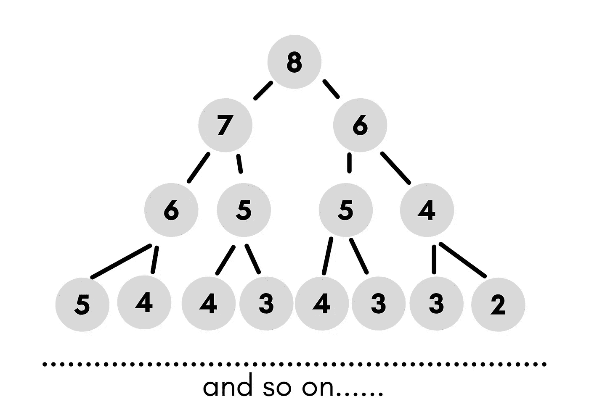
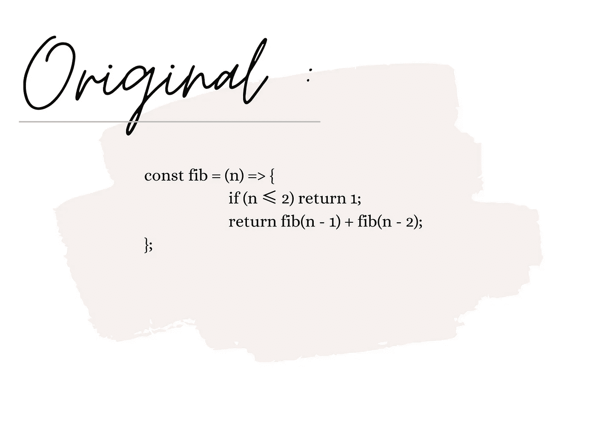
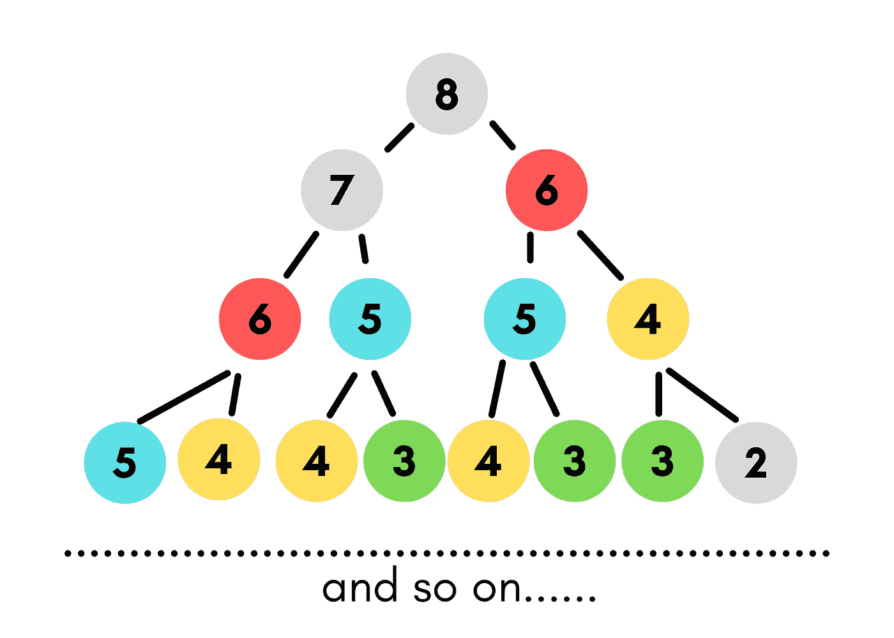
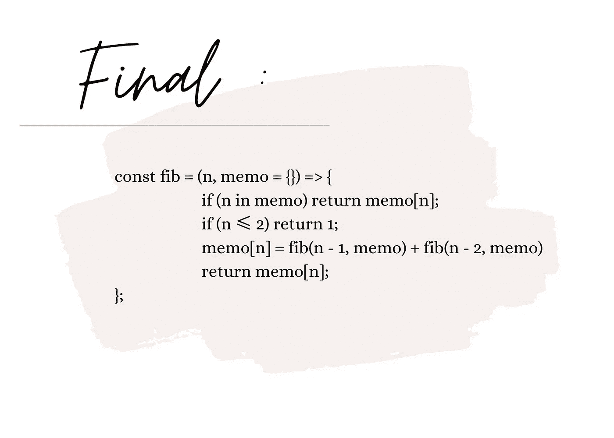
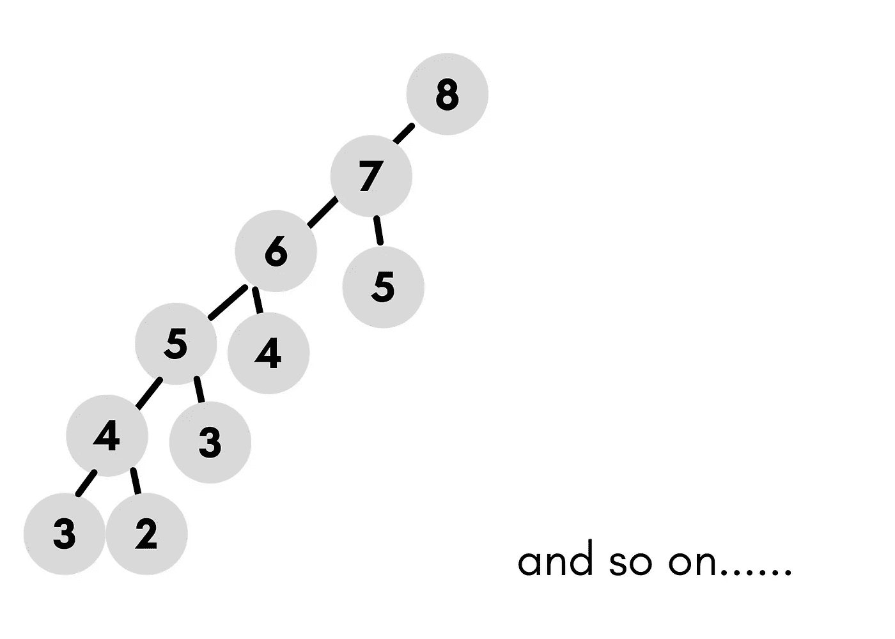

# 斐波那契数列——JavaScript、递归和记忆

> 原文：<https://medium.com/codex/fibonacci-sequence-javascript-recursion-memoization-74d997900ff8?source=collection_archive---------5----------------------->

斐波纳契数列到底是什么？我们先来分解一下——什么是序列，什么是数列。数学中的数列是创造某种模式或遵循某种规则的一系列数字的总和。当这组数字遵循某种模式时，这就被归类为一个序列。

斐波纳契数列是一系列数字，其中每个数字称为一个斐波纳契数。在这个序列中，fib 数是它前面两个数的和。请参见下面的示例:


现在我们有了斐波纳契数列的线索，让我们做一些递归问题的解决。

***问题:*** 写一个函数‘fib(n)’,它接受一个数作为参数。该函数应该返回斐波那契数列的第 n 个数字。在我们的例子中，让我们做第 8 个数字。

我们想要序列中的第 8 个数字——你要怎么做呢？让我们把它画出来:



你能认出它遵循的模式吗？这种模式将最终结束，并触及其基本情况。请记住，这些向下计数的数字是 n，而不是序列中的实际数字。下面我们来试试这个功能:



原始纤维功能

让我们看看函数的第一行:

```
if (n≤2) return 1; 
```

*   这是因为序列的前两个数字(不包括 0)是 1。

现在让我们看看第二部分:

```
return fib(n-1) + fib(n-2); 
```

*   将 n 之前的数字和该数字之前的数字相加。

在您的控制台中键入此内容，并测试其功能。

```
console.log(fib(6)); //8 - Great this works
console.log(fib(7)); //13 - Great this works as well
console.log(fib(8)); //21 - Great this works, did we solve it?
```

当你尝试时会发生什么:

```
console.log(fib(50)); 
// oh no it's like it's taking forever! What's happening?this is JS... remember the callstack and that JS is single threaded!
```

记住这是 JavaScript——单线程程序。一句话就让你意识到发生了什么， ***callstack*** *。如果我们考虑时间和空间复杂性类别，我们会意识到时间复杂性是花费这么长时间的原因= > O(2^n)时间是问题所在。换句话说，这在调用堆栈中花费了太长时间。它在说:*

```
fib(50) ≈ 2^50 steps 
answer: 1.12e + 15 // This is a big number!
```

显然这需要很长时间，因为这是一个很大的数字。所以我们发现了问题…怎么才能修复我们的函数呢？让我们做一些记忆。什么是记忆化？

**记忆化**是*一种优化技术，主要用于通过存储昂贵的函数调用的结果并在相同的输入再次出现时返回缓存的结果来加速计算机程序。*换句话说，我们将存储以前的结果，然后我们不必再次计算它们。

转换函数的第一步——让我们回到节点树，你能看到所有重复的节点吗？



让我们使用记忆化，因为我们在树中看到重复的子节点

很好，你可以看到模式和树中的子节点。现在你能想象树从 50 开始，会有多少重复的子节点吗？！难怪计算答案要花很长时间。让我们添加更多的逻辑来包含我们函数中的记忆。

让我们用 JavaScript 来思考。JS 里什么是快动作？在这种情况下，我们将使用一个 JavaScript 对象。键将是一个参数，值将是返回值。

```
const fib = (n, memo={}) => {
 ....
}
```

memo 对象在这里做的是，如果你没有传入第二个参数，默认情况下它会创建一个“memo”JS 对象。

接下来，我们将添加另一个条件来检查 memo 内部是否存在(n ),如果存在，则返回。

```
if (n in memo) return memo[n];
```

之后，我们需要写出:如果不在 memo 中，计算它，然后存储在 memo 对象中。

```
memo[n] = fib(n-1) + fib(n-2)
```

那么让我们返回备忘录:

```
return memo[n];
```

太好了，它来了！等等，我们好像遗漏了什么。让我们再来看看这个:

```
const fib = (n, memo={}) => {
            if (n in memo) return memo[n];
            if (n ≤ 2) return 1;
            memo[n] = fib(n-1) + fib(n-2) //what's missing here?
            return memo[n];
};
```

我们需要确保 memo 对象正在被使用——通过引用传递。在代码中引用备忘录，在那里你将数字相加。好了，现在它应该是这样的:



恭喜你，你现在已经在这个函数中使用记忆来加速结果了！测试它—键入*console . log(fib(50))；*在你的控制台看看你做了什么！你会意识到，通过使用记忆化来解决这个问题，你减少了从原始函数中进行递归调用的次数。

让我们把这一课带回家——回想一下节点树的图表。既然我们将前面的节点存储在 memo 对象中，那么我们的最终函数现在看起来是什么样的呢？在下图中，您可以看到我们确实缩小了树或整体时间复杂度，这意味着现在速度快了很多。



采油树的记忆图—最终

如果你逗留了这么长时间并阅读了——谢谢！我很高兴我可以教一些人，一些我今天为了好玩而学的东西！没有奋斗，就没有进步——继续学习！

❤️xoxo-尼科尔