# 使用 Tableau 仪表板中的参数筛选日期

> 原文：<https://medium.com/codex/filter-dates-using-parameters-in-tableau-dashboards-592808221567?source=collection_archive---------1----------------------->

## 一些画面

## 在 Tableau 中过滤日期的最简单方法

有没有觉得日期->编辑筛选选项太局限，不实用？或者日期范围滑块很难自定义？

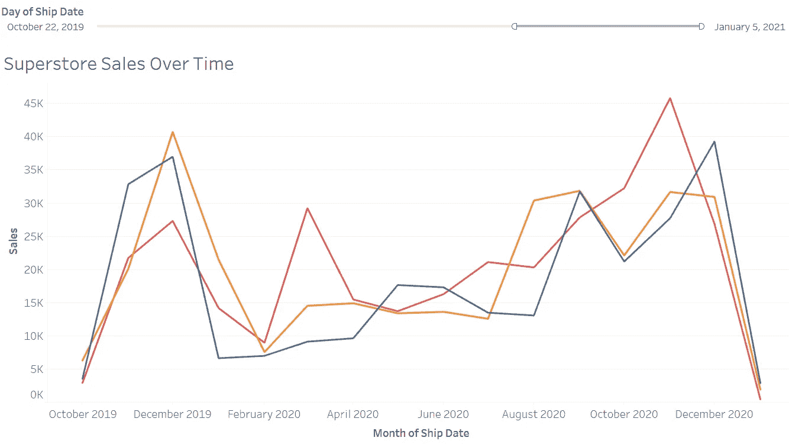

按作者从参数中不带日期过滤器的可视化

别担心！这一次，我将分享一个教程，关于如何制作**‘开始日期’，‘结束日期’，和‘按日期过滤’**按钮，这些按钮可以按选定的日期变量过滤整个仪表板。阅读结束时，您将知道如何使用参数构建一个用户友好且高度可定制的日期过滤器！

**Tableau 的超级商店**数据集用于**可视化超级商店随时间的销售，根据类别进行颜色编码。**

开始吧:)。

1.  **将所需的度量拖至列，将维度拖至行。**

*发货日期*变量将在此用作日期变量。请注意，****日期变量必须是连续的**，而不是默认的离散变量，以便可视化随时间的变化。**

**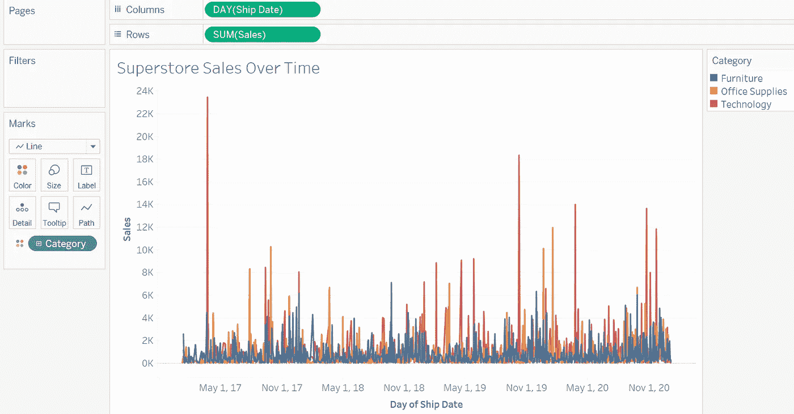**

**作者不带参数的可视化**

****2。提示:Tableau 有一个日期功能，用户可以通过点击左边的'-' & '+'按钮轻松地在日期部分之间切换。****

**从最小到最大粒度*发货日期*可变日期部分，年- >季度- >月- >周- >日。**

**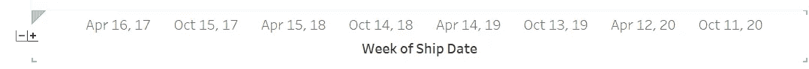**

**Tableau 的日期部分功能(按作者)**

****3。创建“开始日期”、“结束日期”和“筛选日期”参数。****

**“开始日期”将作为决定开始日期的按钮，而“结束日期”决定结束日期。**

**“筛选日期依据”将为仪表板用户提供选择日期筛选方法的灵活性，在本例中，我们提供了三个选项，“开始日期至结束日期”、“开始日期至昨天”和“开始日期至今天”进行演示。**

**不幸的是，该超市数据集仅包含截至 2021 年 1 月 5 日的发货日期，因此，它不能清楚地显示“今天”和“昨天”，因为它不是每天更新的。然而，各种选项是完全可定制的，例如，您可以添加“仅今天”，“开始日期到上个月”，“最小日期到最大日期”等。**

**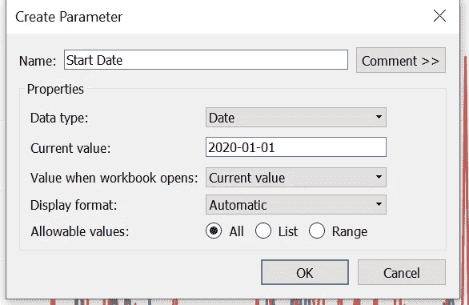****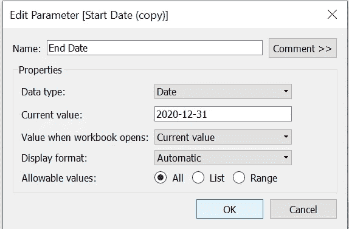****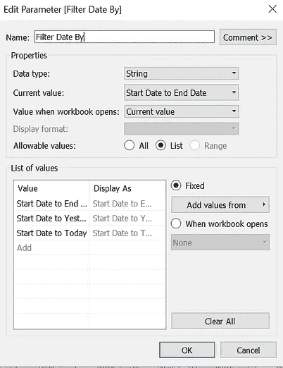**

**作者的“开始日期”、“结束日期”和“过滤日期”参数**

****4。创建一个@filter_date 计算来定义参数(使它们工作)。****

**我喜欢用' @ '来区分参数定义计算和其他计算。如果仔细观察计算，您会注意到上面的代码定义开始日期，而下面的代码定义结束日期。请注意，这段代码是针对我们放在“过滤日期”参数中的三个选项的，您必须根据您放在那里的选项来编辑代码，这大部分可以利用 Tableau 的日期函数来完成。**

**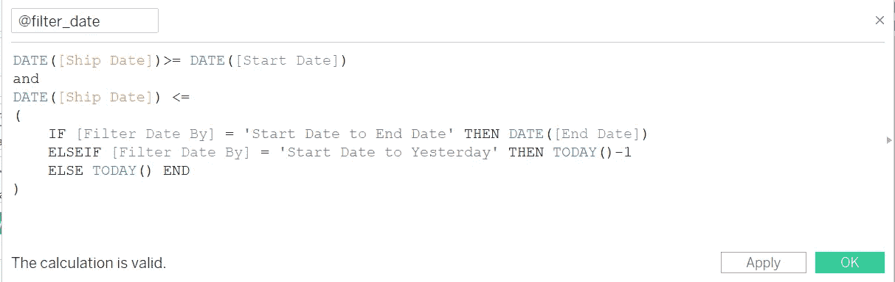**

**@filter_date 按作者计算**

****5。将@filter_date 拖到过滤卡上，然后选择“True”来激活工作表的计算。****

**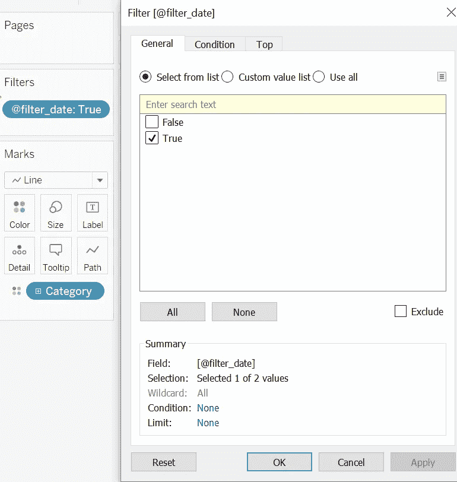**

**按作者编辑@filter_date**

****6。自定义日期过滤器完成！您可以继续尝试过滤器并设计仪表板。****

**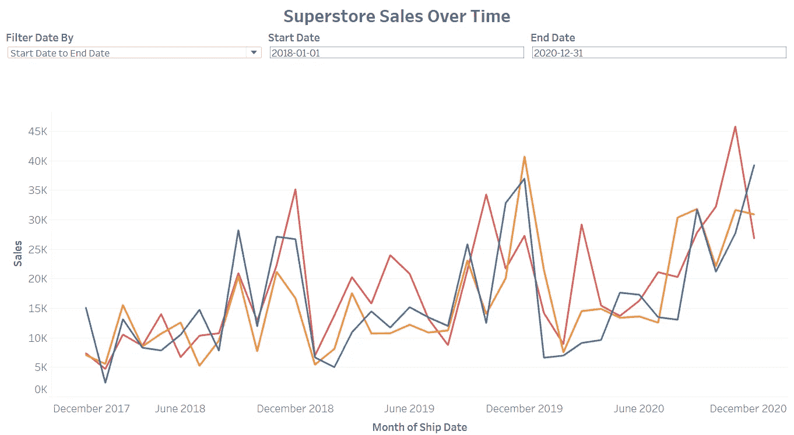**

**作者自定义日期仪表板设计**

****7。附加提示:您可以更改“开始日期”和“结束日期”参数的“当前值”,使视图更加动态。****

**例如，我希望结束日期参数总是今天的日期。因此，首先，我必须创建一个计算字段，它将把今天的日期作为输出。然后，将参数的当前值更改为我刚刚创建的 Today Calculated 字段。在仪表板中，结束日期将自动设置为“22–05–2022”，即该可视化的创建日期。**

**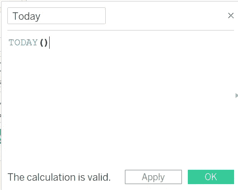****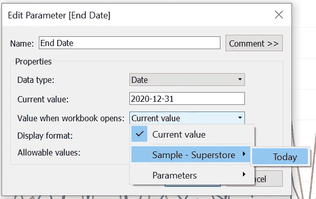**

**由作者编辑参数的当前值**

**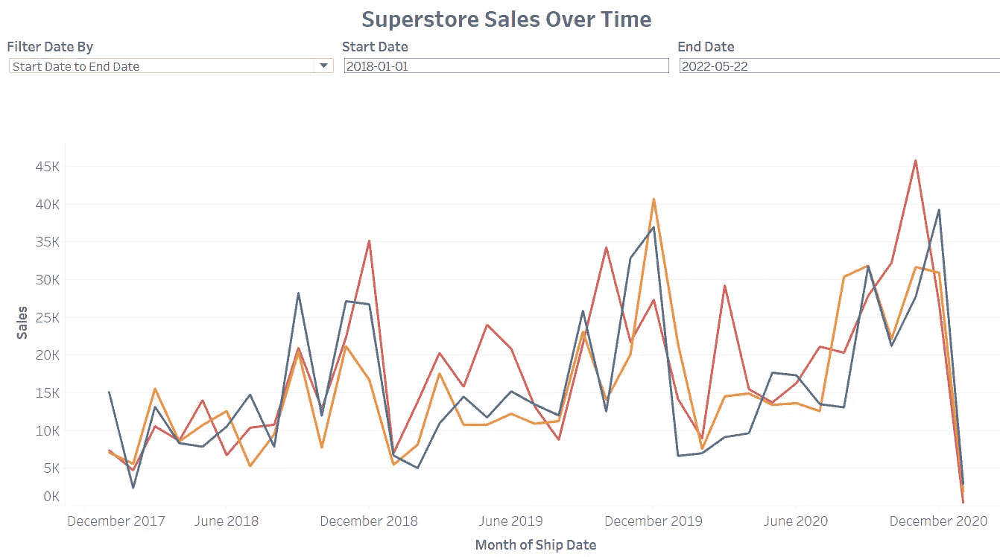**

**作者的最终可视化外观**

**好吧！自定义日期教程到此结束:)不要忘记探索 Tableau 的各种日期函数，它们可以进一步提升您的自定义日期过滤器。**

***如有任何疑问，可通过*[*LinkedIn*](https://www.linkedin.com/in/sharon-regina/)*联系我。希望本文能帮助您通过在可视化中应用自定义日期参数来做出更有影响力的数据驱动决策:)。***