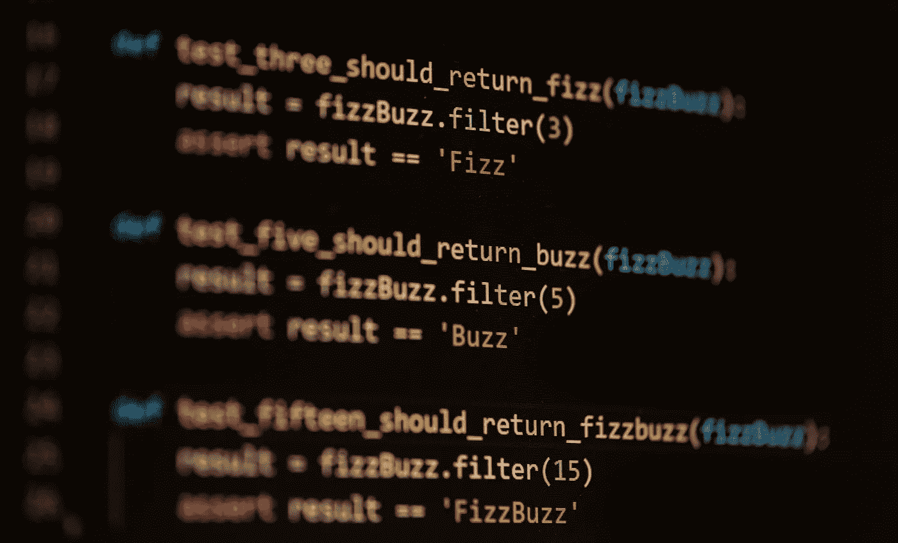

# 最后，我自我承诺编写单元测试

> 原文：<https://medium.com/codex/finally-im-self-committed-to-write-unit-tests-7ac5768ada04?source=collection_archive---------5----------------------->

你有多长时间没有遇到过在一个充满糟糕代码的讨厌项目中修复 bug 或添加新功能的挫折了？这周我已经开始着手一个了。问题是这个项目本身很有趣，很有创意，但是代码..哦天哪..代码是可怕的，充满了千行文件，代码气味，糟糕的命名和长等。并不是说我在最初的几年里没有写过这样的代码，但是希望你能理解我的观点。

当我读到这段代码时，我感到很恼火。起初，我很想尽可能快地进行更改，保持以前的开发团队介绍的那种粗心的编码方式。然后我想到了所有可能出错的事情，比如引入新的错误和永恒的调试会话；请记住，这对我来说是一个新项目，我只是在学习主要的领域规则。

## 重构是必由之路？

经过深思熟虑，我得出结论，在添加新的更改之前，我应该重构代码。我知道这是显而易见的，不可能是另一种方式，但我一直在努力，直到我接受这个事实。无论如何，一个更大的问题出现了:解决方案中没有一个单元测试。

偶然的机会，你读过马丁·福勒的《重构:改进现有代码的设计》吗？如果你没有，我强烈建议你做！Fowler 解释说，如果没有测试，就不能重构代码。因为如果你碰巧这样做了，你就不能确信你没有破坏功能。重构并不意味着破坏过程中的功能；否则不是重构，大多是删除和重做。

这就是我的问题:没有测试，没有重构的可能性(至少以福勒的方式)。但是 Fowler 在他的书中考虑了像我这样的情况，只是他推荐阅读另一本书来知道如何进行:Michael Feathers 的《有效地使用遗留代码》。这本书彻底改变了我对单元测试的看法。

在我的职业生涯中，我有机会学习如何编写好的单元测试。我已经了解了如何识别测试场景、测试数据边界、减少测试脆弱性、解耦、嘲讽 vs stubbing、TDD(我确信首先编写测试是有益的，因为特定的原因)、测试测试等等。我已经将这些知识应用到我的工作中，并努力和我的同事们一起推广，受益是显而易见的。然而，老实说，有时我会避开单元测试，主要是因为懒惰或截止日期。但是现在我下定决心*再也不推遗留代码*。

## 停止编写遗留代码

是的，你没看错，我说的是遗留代码。因为 Feathers 教会我，没有单元测试的代码就是遗留代码。仔细想想，这很有道理。我们通常认为遗留代码是什么？好吧，我们可以说是我们从另一个程序员那里收到的旧的糟糕的代码(那个程序员可能是我们过去的自己)。但这并不是全部。遗留代码是关于你很难阅读和理解的代码。更重要的是，遗留代码是您不愿意更改的代码。

换句话说，一旦我们将闪亮的新代码(没有单元测试)推入存储库，它就自动成为遗留代码🤯。

> “没有测试的代码是糟糕的代码。写得再好也没用；不管它有多漂亮、面向对象或者封装得多好。通过测试，我们可以快速且可验证地改变代码的行为。没有它们，我们真的不知道我们的代码是变好了还是变坏了。”迈克尔·费哲

那么，我们如何确保我们的代码不会成为遗产？通过编写干净的代码，我们尽最大努力使我们的代码对新人来说是可读的，通过使用抽象来分离我们的组件，这样更容易改变。这些都是好东西。但是我们如何证明我们的代码没有腐烂呢？我们是否确信干净代码的概念对每个人都是最好的？干净的代码本身能保证新来者能够自信地引入新的变化吗？

## 拯救单元测试

答案是否定的。这就是单元测试发挥作用的地方。无论我们认为我们的代码有多好，都不足以让未来的开发者或我们未来的自己安心。单元测试是向其他人提供信任的唯一方式。我们专门讨论单元测试，因为它们很快，可以在几秒钟内(最多几分钟)频繁运行。

Feathers 一书讲述了从遗留代码到优秀代码所需的技术。这不是一项容易的任务，但他的建议无疑使它变得更容易忍受。我强烈推荐给任何面临我这种情况，有时感到不知所措的人。它对我的新项目帮助很大，看到它一天比一天变得更加强大是一件令人愉快的事情。

## 我的新承诺

我为那些不幸使用我留下的代码的人感到难过，因为我知道处于他们的位置是什么感觉。编程应该是快乐的工作，我真的想为这个目标做出贡献，不仅是为了我未来的自己，也是为了我的同事。让我们承诺再也不写没有测试的代码，直到不再有遗留代码！好像那是可能的😅