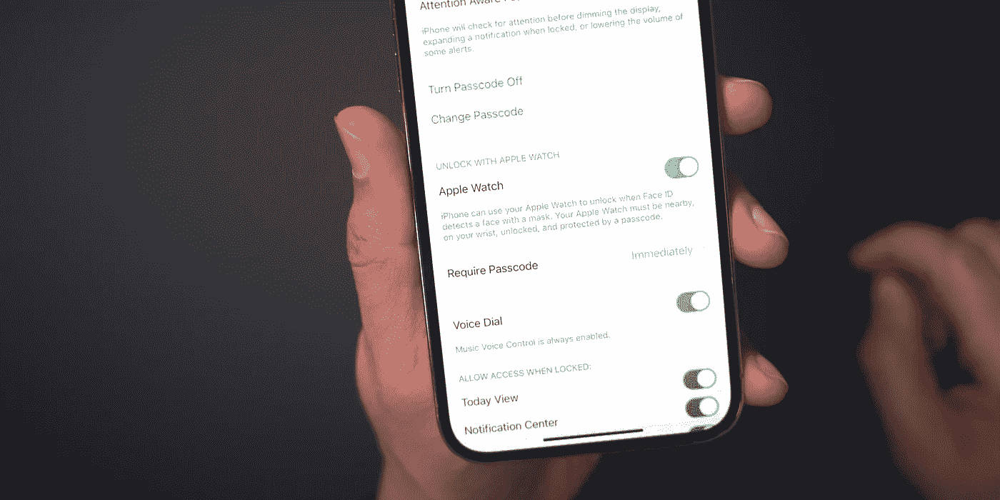

# 最后:iOS 14.5 修复了 Face ID 戴面具的问题

> 原文：<https://medium.com/codex/finally-ios-14-5-fixes-mask-wearing-with-face-id-971375216296?source=collection_archive---------5----------------------->

## [法典](http://medium.com/codex)

9to5mac

苹果即将发布的 iOS 版本 14.5 推出了一项新功能，让 Face ID 可以戴着口罩工作。和苹果的 MacBooks 一样，用户将可以用 Apple Watch 解锁他们的 iPhones。

一旦用户同时启用了 iOS 14.5 和 watchOS 7.4，就可以在设置中启用该功能。默认情况下，它是关闭的。启用和之后…