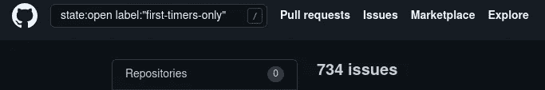
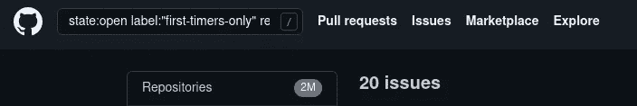
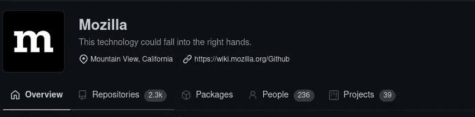
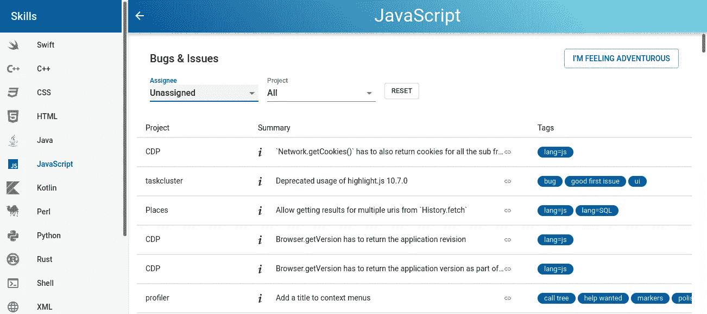

# 寻找你可以参与的开源项目

> 原文：<https://medium.com/codex/find-open-source-projects-you-can-contribute-to-9467f19bc287?source=collection_archive---------11----------------------->

为开源项目做贡献是提高程序员技能的最好方式之一。尤其是如果你一直在学习，从来没有从事过现实生活中的项目。

它还能帮助你说服客户雇佣你做自由职业者，或者更快找到工作。我在 Upwork 的浏览器扩展相关工作的面试比例很高，只是因为我为 Mozilla 的附加项目做出了贡献。

但是找到你能参与的项目比你想象的要难。真正的挑战是找到使用编程语言和库的项目。

在本文中，我将向您展示几个工具，它们可以帮助您更容易地找到您可以参与的开源项目。

# 1.GitHub 滤镜！

GitHub 有“主题”系统，可以很容易地找到特定编程语言或框架的项目，通过访问 URL `github.com/topics/<search keyword here>`你可以找到许多你可能感兴趣的项目。

但是你会很快发现这不是一个有效的方法，因为你需要一个接一个地搜索，而且你可能会发现这个项目对新的贡献者没有任何开放的问题。

最好的方法是使用 GitHub 的搜索过滤器。通过使用您掌握的编程语言或库作为关键字来搜索问题，您会惊讶地发现有多少未解决的问题。

为了增加你发现好的第一个问题的机会，你可以搜索对一个新贡献者来说是好的问题。

您可以使用的最常用标签包括:

*   *仅限第一次来的人*
*   *好第一个 bug*
*   *贡献-启动器*

举个例子，假设我正在寻找与 React 相关的问题，我可以将关键字 React 与标签“好的第一个 bug”结合起来，将搜索结果从大约 700 个减少到我可能感兴趣的 200 个。

在过滤之前进行反应

过滤后进行反应

如果你想复制它，这里是搜索查询的结构。

`state:open label:"<tag>" <keyword>`

有一些免费的网站提供了一个很好的图形界面来使用这种方法进行搜索，其中最受欢迎的是:

*   [待价而沽](https://up-for-grabs.net/#/)
*   [代码分流](https://www.codetriage.com/)
*   [仅限第一次使用](https://www.firsttimersonly.com/)

# 2.code attribute(Mozilla 平台)

说到开源项目，Mozilla 是天堂。就我个人而言，我首先开始为 Mozilla 的项目做出最大的贡献，因为它们使入门变得容易。

也不要认为 Firefox 是他们唯一的项目，Mozilla 目前在 GitHub 上有超过 2300 个存储库，你可以开始为其中的任何一个做贡献。

但是由于 Mozilla 有大量的资源库，很难找到适合你的问题，尤其是那些被 GitHub 和 Bugzilla 分开的问题。

为了使事情变得更简单，您可以使用 Codetribute，这是一个平台，旨在使开发人员能够轻松地找到他们使用 Mozilla 的第一个代码贡献。你将在这里发现的大多数问题，如果不是全部的话，都适合新的投稿人。

Codetribute 的厉害之处在于，可以很容易地通过编程语言进行筛选，还可以只显示未分配的问题。

[共同贡献](https://codetribute.mozilla.org)

# 3.侏儒新人。

GNOME 是一个非常流行的 Linux 桌面环境，对于新的开源贡献者来说，它的库是一个寻找开放问题的好地方。需要注意的一点是，大多数 GNOME 项目都是桌面应用程序。

对于想要开始开源之旅的开发者来说，新来者是一个非常酷的指南，因为它包含了贡献 GNOME 项目的一步一步的指南。

但是最让我们感兴趣的是 GNOME 的 [GitLab](https://gitlab.gnome.org) 中的新人标签。在写这篇文章的时候，GNOME 的 GitLab 有 29k 个开放问题，其中 676 个被标记为“新人”。

这些新问题是一个很好的起点，因为它们通常不太难解决，并且它们帮助你更多地了解项目的结构。

[开放问题与新人标记](https://gitlab.gnome.org/groups/GNOME/-/issues?scope=all&state=opened&label_name[]=4.%20Newcomers)

[来自 GNOME 的新人指南](https://wiki.gnome.org/Newcomers)

# 额外小费

如果您刚刚开始一个开源项目，最好是查找文档或测试单元问题，尤其是如果项目很复杂的话。因为它们通常更容易做，但对学习项目结构很有帮助。此外，必须具备 Git 的基础知识。