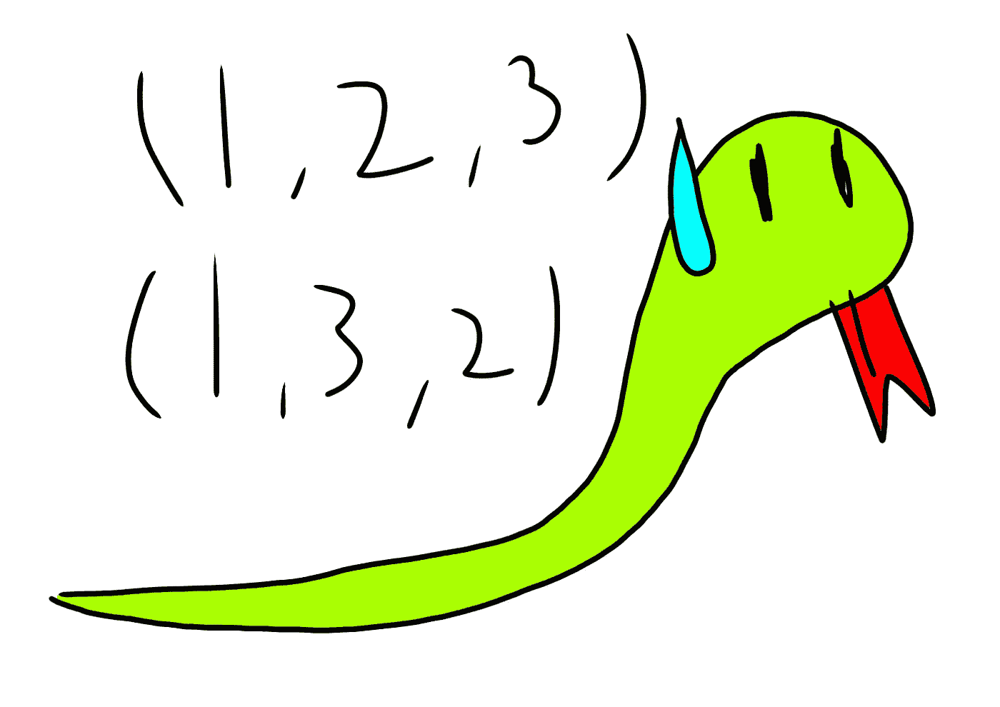

# 为编码面试寻找第 n 种排列

> 原文：<https://medium.com/codex/finding-the-nth-permutation-for-a-coding-interview-db83944fa7be?source=collection_archive---------6----------------------->

我最近参加了一个在线编码面试，面试官给了我这个问题——给定 2 个常数 *k* 和 *n，*从 1 到 *k，*的数列生成排列，返回*n*排列。

# 简单的例子

先说`k=3`和`n=2`。我们用来产生排列的一组数字将从 1 到`k`，也就是…