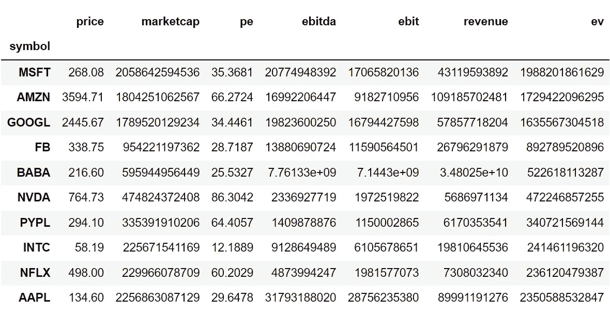
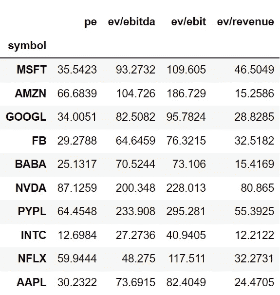
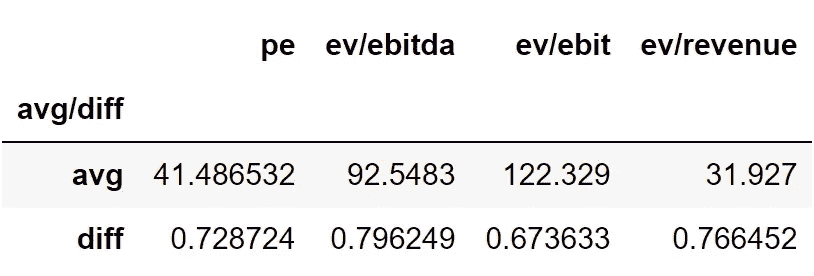

# 用 Python 中的一种简单方法寻找股票的潜在价值

> 原文：<https://medium.com/codex/finding-the-underlying-value-of-a-stock-with-a-simple-approach-in-python-514d18df2758?source=collection_archive---------4----------------------->

## 关于用 Python 实现 CCA 方法评估股票的简单指南


照片由乔纳斯·德尼尔在 [Unsplash](https://unsplash.com?utm_source=medium&utm_medium=referral) 上拍摄

所有在股票市场上市的股票都不是按照其内在价值进行交易，而是高于或低于其内在价值。但是，有了一些金融概念和基本面分析的基本知识，我们可以很容易地计算出一家公司股票的基础价格或实际价格，并据此进行投资。有很多方法可以完成这项工作，但在本文中，我们将采用一种简单而有效的方法，即可比公司分析，简称 CCA。我们将首先探索 CCA 方法是什么，然后，我们将继续到编程部分，我们将使用 Python 编写完整的方法，并找到苹果股票的内在价值。事不宜迟，让我们进入文章吧！

在继续阅读本文之前，请确保您熟悉以下财务概念:收入、市值、企业价值(EV)、市盈率、EBITDA、EBIT，以及一些 Python 编程的基础知识。

# 可比公司分析(CCA)

可比公司分析是通过比较同行业其他类似公司股票的财务指标来评估股票潜在价值的过程。这种方法的基本思想是相似的公司有相似的指标。为了使这种方法成功，我们必须以正确的方式做两件事:

*   **汇集相似的公司:**这是我们遵循 CCA 方法时必须完成的首要任务。CCA 就是将一只股票与一堆其他股票进行比较，我们必须选择正确的相似股票。否则，我们可能会高估或低估股票。例如，如果我们试图计算特斯拉的内在价值，我们必须考虑只属于汽车行业的股票，而不是其他行业的股票，如苹果或英特尔。
*   **选择正确的估值倍数:**这就是挑选用于比较股票的指标的过程。就像选择股票的第一个过程一样，选择错误的倍数可能会导致低估或高估股票。最常用的倍数是市盈率、EV/EBITDA 等等。

在本文中，我们将确定苹果股票的内在价值，方法是首先汇集属于技术板块的正确的类似股票，并考虑估值倍数 P/E 比率、EV/EBITDA、EV/EBIT 和 EV/收入。这就是关于共同国家评估方法的全部内容。现在，让我们继续编程，我们将使用 Python 对整个方法进行编码。在继续之前，关于免责声明的一个注意事项:本文的唯一目的是教育人们，必须被视为一个信息，而不是投资建议等。

# 用 Python 实现

编码部分可以分为如下不同的步骤:

```
**1\. Importing Packages
2\. Extracting the Financial Metrics with IEX Cloud
3\. Formatting the Extracted Data
4\. Calculating the Valuation Multiples
5\. Calculating the Average and Difference of Multiples
6\. Determining the Underlying Value**
```

我们将按照上面列表中提到的顺序，系好安全带，跟随每一个即将到来的编码部分。

## 步骤 1:导入包

将所需的包导入 python 环境是一个不可跳过的步骤。主要的包将会是 Pandas 来处理数据帧、数据操作等等，请求进行 API 调用，NumPy 来处理数组和科学函数。第二个包是用于字体定制的 Termcolor(可选的，但是很好用)。让我们将所有这些包导入到 Python 环境中。

**Python 实现:**

```
**# IMPORTING PACKAGES** 
import pandas as pd
import requests
import numpy as np
from termcolor import colored as cl
```

现在我们已经将所有需要的包导入到 python 中。让我们用 IEX 云强大的 API 端点来拉一些科技股和苹果的财务指标。

## 步骤 2: **用 IEX 云提取财务指标**

在这一步中，我们将借助 IEX 云提供的几个 API 端点，提取十只科技股(微软、亚马逊、谷歌、脸书、阿里巴巴、英伟达、PayPal、英特尔、网飞和苹果)的财务指标(股价、市值、市盈率、EBITDA、EBIT、收入和企业价值)。

**这里有一个关于 IEX 云的说明:** IEX 云提供了大量的 API 端点，包括股票、商品、外汇、期权和加密货币的市场数据。数据是可靠的，在任何编程语言中使用它们的 API 都很容易。API 带有高度可定制的参数，可以帮助获得所需的信息，我真正欣赏 IEX 云的一点是他们在创建精彩文档方面投入的工作和时间。此外，请确保您在 [IEX 云](https://iexcloud.io/)上拥有一个开发者帐户，只有这样，您才能访问您的 API 密钥(使用 API 提取数据的重要元素)。说到这里，我们来看一些数据。

**Python 实现:**

```
**# EXTRACTING THE FINANCIAL METRICS** 
ticker = ['MSFT', 'AMZN', 'GOOGL', 'FB', 'BABA', 'NVDA', 'PYPL', 'INTC', 'NFLX', 'AAPL']

def get_metrics(stock):
    iex_api_key = 'YOUR SANDBOX API KEY'
    fundamentals = []

    # 1\. PRICE

    price_url = f'https://sandbox.iexapis.com/stable/stock/{stock}/price?token={iex_api_key}'
    raw_price = requests.get(price_url)
    price = raw_price.json()    
    fundamentals.append(price)

    # 2\. MARKET CAP

    marketcap_url = f'https://sandbox.iexapis.com/stable/stock/{stock}/stats?token={iex_api_key}'
    raw_marketcap = requests.get(marketcap_url)
    marketcap = raw_marketcap.json()['marketcap']
    fundamentals.append(marketcap)

    # 3\. PE RATIO

    peRatio_url = f'https://sandbox.iexapis.com/stable/stock/{stock}/stats?token={iex_api_key}'
    raw_peRatio = requests.get(peRatio_url)
    peRatio = raw_peRatio.json()['peRatio']
    fundamentals.append(peRatio)

    # 4\. EBITDA

    ebitda_url = f'https://sandbox.iexapis.com/stable/time-series/fundamentals/{stock}/quarterly?token={iex_api_key}'
    raw_ebitda = requests.get(ebitda_url)
    ebitda = raw_ebitda.json()[0]['ebitdaReported']
    fundamentals.append(ebitda)

    # 5\. EBIT

    ebit_url = f'https://sandbox.iexapis.com/stable/time-series/fundamentals/{stock}/quarterly?token={iex_api_key}'
    raw_ebit = requests.get(ebit_url)
    ebit = raw_ebit.json()[0]['ebitReported']
    fundamentals.append(ebit)

    # 6\. REVENUE

    revenue_url = f'https://sandbox.iexapis.com/stable/time-series/fundamentals/{stock}/quarterly?token={iex_api_key}'
    raw_revenue = requests.get(revenue_url)
    revenue = raw_revenue.json()[0]['revenue']
    fundamentals.append(revenue)

    # 7\. ENTERPRISE VALUE

    entvalue_url = f'https://sandbox.iexapis.com/stable/stock/{stock}/advanced-stats?token={iex_api_key}'
    raw_entvalue = requests.get(entvalue_url)
    entvalue = raw_entvalue.json()['enterpriseValue']
    fundamentals.append(entvalue)

    print(cl(f'Extracted {stock} Fundamentals', attrs = ['bold']))

    return fundamentals

msft_fundamentals = get_metrics(ticker[0])
amzn_fundamentals = get_metrics(ticker[1])
googl_fundamentals = get_metrics(ticker[2])
fb_fundamentals = get_metrics(ticker[3])
baba_fundamentals = get_metrics(ticker[4])
nvda_fundamentals = get_metrics(ticker[5])
pypl_fundamentals = get_metrics(ticker[6])
intc_fundamentals = get_metrics(ticker[7])
nflx_fundamentals = get_metrics(ticker[8])
aapl_fundamentals = get_metrics(ticker[9]))
```

**输出:**

```
**Extracted MSFT Fundamentals
Extracted AMZN Fundamentals
Extracted GOOGL Fundamentals
Extracted FB Fundamentals
Extracted BABA Fundamentals
Extracted NVDA Fundamentals
Extracted PYPL Fundamentals
Extracted INTC Fundamentals
Extracted NFLX Fundamentals
Extracted AAPL Fundamentals**
```

**代码解释:**我们首先定义一个名为“get_metrics”的函数，它将股票的符号作为参数。在函数内部，我们首先定义了一个名为‘iex _ api _ key’的变量，在这里我们存储了 API 密钥。你可能注意到我提到了`SANDBOX API KEY`，它只不过是 IEX 云提供给我们的沙盒 API 密钥。更明确地说，在我们创建 IEX 云的开发者账户的同时，团队将为我们提供两种类型的 API 密钥:一种是帮助我们与云环境交互的云 API 密钥，另一种是帮助我们从沙盒环境中拉取数据的沙盒 API 密钥。

我们在这里使用沙盒 API，因为我们试图获取的财务指标数据在云环境中不受支持或不可用，只能通过访问沙盒环境来提取。

在存储了 API 键之后，我们将创建另一个名为“fundamentals”的变量，其中存储了一个空列表，每个财务指标的值将被附加到该列表中。接下来是使用 IEX 云提供的相应 API 端点提取每个财务指标的流程。我在这里不打算解释提取它们的代码，而只解释提取股票价格指标的第一个代码，因为代码结构是相似的。在提取股票价格指标的代码中，我们首先将 API URL 存储到‘price _ URL’变量中。使用请求提供的“get_function ”,我们调用 API，然后将数据以 JSON 格式存储到“price”变量中。

最后，我们将提取的值添加到我们之前创建的“基础”列表中。这同样适用于其余的指标，但只有 API URL 发生了变化。最后，我们调用创建的函数来存储 10 只科技股的财务指标。

## 步骤 3: **格式化数据**

在这一步中，我们将清理和格式化提取的数据。这一步是必不可少的，因为使用 API 端点提取的数据很笨拙，很难直接使用。

**Python 实现:**

```
**# FORMATTING THE DATA** 
raw_data = [msft_fundamentals, amzn_fundamentals, googl_fundamentals, fb_fundamentals, baba_fundamentals, 
            nvda_fundamentals, pypl_fundamentals, intc_fundamentals, nflx_fundamentals, aapl_fundamentals]

fundamentals = pd.DataFrame(columns = ['price', 'marketcap', 'pe', 'ebitda', 'ebit', 'revenue', 'ev'])
fundamentals.iloc[:,0] = range(0, 10)

for i in range(len(fundamentals)):
    fundamentals.iloc[i] = raw_data[i]

fundamentals['symbol'] = ticker
fundamentals = fundamentals.set_index('symbol')
fundamentals
```

**输出:**



作者图片

**代码解释:**首先，我们创建一个名为‘raw _ data’的变量，其中存储了所有提取的十只股票的财务指标。接下来，我们将创建一个新的数据框架“fundamentals”来存储所有原始数据。下一行代码没什么大不了的，只是填充从 0 到 10 的数字，并使其长度适合“raw_data”变量的长度。在下一步中，我们将创建一个 for 循环，用每只股票的实际财务指标填充“基本面”数据，并生成一个结果，如上面的输出所示。清理和格式化数据的整个过程使我们更容易处理数据，并帮助我们更容易理解数据。

## 步骤 4:计算估值倍数

在这一步中，我们将借助之前清理和格式化的数据框架来计算估值倍数，即市盈率、EV/EBITDA、EV/EBIT 和 EV/收入。这些估值倍数将被用作后续步骤的核心组成部分。

**Python 实现:**

```
**# VALUATION MULTIPLES CALCULATION** 
valuation_multiples = fundamentals.copy().iloc[:, 2:].drop('ev', axis = 1)
valuation_multiples = valuation_multiples.rename(columns = {'ebitda':'ev/ebitda', 'ebit':'ev/ebit', 'revenue':'ev/revenue'})

valuation_multiples.iloc[:, 1] = fundamentals['ev'] / fundamentals['ebitda']
valuation_multiples.iloc[:, 2] = fundamentals['ev'] / fundamentals['ebit']
valuation_multiples.iloc[:, 3] = fundamentals['ev'] / fundamentals['revenue']

valuation_multiples
```

**输出:**



作者图片

**代码解释:**我们做的第一步是复制我们在使用 Pandas 包提供的“复制”功能之前创建的“基本面”数据帧，并将其存储到“估值 _ 倍数”中。我们还删除了三个财务指标股票价格、市场资本总额和企业价值，因为这些都是不需要的。同样，这样做的主要思想是匹配长度，这样我们就可以很容易地计算并将结果附加到数据帧中。

接下来，我们根据需要对列进行重命名，然后计算每个估值倍数，我们将 EBITDA、EBIT 和收入分别除以企业价值，并将它们存储到数据框架中的相关列中。从上面的输出可以看出最终的结果，我们得到了 10 只科技股的所有四个预期估值倍数。

## 步骤 5: **计算倍数的平均值和差值**

在这一步，我们将考虑除苹果以外的所有股票的估值倍数，并求出每个倍数的平均值。然后，我们会发现差异只不过是苹果公司的估值倍数与所有九只股票的平均估值倍数之比。

**Python 实现:**

```
**# AVERAGE AND DIFFERENCE OF MULTIPLES** 
index = ['avg', 'diff']
avg_diff = pd.DataFrame(columns = ['pe', 'ev/ebitda', 'ev/ebit', 'ev/revenue'])
avg_diff.iloc[:, 0] = np.arange(0,2)

avg_diff.iloc[0] = valuation_multiples[:9].sum() / 10
avg_diff.iloc[1] = valuation_multiples.iloc[9] / avg_diff.iloc[0]
avg_diff['avg/diff'] = index
avg_diff = avg_diff.set_index('avg/diff')
avg_diff
```

**输出:**



作者图片

**代码解释:**前三行没有什么内容，我们只是创建了一个名为“avg_diff”的新数据帧，用于存储计算的读数，我们用 0 到 2 之间的数字临时填充数据帧，以匹配长度，而不是使用空数据帧，这样有助于我们附加将要计算的值。

剩下的几行是计算，我们首先计算除苹果以外的股票的每个估值倍数的平均值，并将这些值附加到“avg_diff”数据帧中，然后，我们计算苹果的估值倍数与平均值之间的比率，我们刚刚计算了该比率，并将其存储到“avg_diff”数据帧的相应行中。可以观察到代码中有很多“iloc”函数的用法，所以对于那些不知道这个函数是什么的人来说，“iloc”函数是一个切片函数，主要用于选择数据帧中的特定行或列。

## 步骤 6: **确定基础价值**

这是最后也是最有趣的一步，我们将利用之前确定的读数来计算苹果股票的内在或潜在价值。此外，这一步也是最容易的一步。

**Python 实现:**

```
**# CALCULATING THE INTRINSIC VALUE** 
price_diff = raw_data[9][0] / avg_diff.iloc[1]
intrinsic_price = round((sum(price_diff) / 4), 2)
percentage_difference = round(((raw_data[9][0] / intrinsic_price) * 100), 2)

print(cl(f'The listed price of Apple : {raw_data[9][0]}', attrs = ['bold']))
print(cl(f'The intrinsic value of Apple : {intrinsic_price}', attrs = ['bold']))
if intrinsic_price > raw_data[9][0]:
    print(cl(f'The Underlying Value of Apple stock is {percentage_difference}% Higher than the Listed price', attrs = ['bold']))         
else:
    print(cl(f'The Underlying Value of Apple stock is {percentage_difference}% Lower than the Listed price', attrs = ['bold']))
```

**输出:**

```
**The listed price of Apple : 133.8**
**The intrinsic value of Apple : 181.21**
**The Underlying Value of Apple stock is 73.84% Higher than the Listed price**
```

**代码解释:**这里重要的代码只是前三行，其他的都是可选的(但是推荐)。在第一行中，我们定义了一个名为“price_diff”的变量，用于存储苹果当前的上市价格与之前计算的差异读数之间的比率(苹果估值倍数与所有估值倍数平均值之间的比率)。然后，我们通过对刚刚计算出的“price_diff”取平均值来计算苹果股票的内在或潜在价值。在下一行代码中，我们将确定苹果股票的实际上市价格和基础价值之间的百分比差异，并将其存储到“percentage_difference”中。

从输出可以看出，苹果股票的当前或最后交易价格为 133.8 美元，基础价值为 181.21 美元，比当前交易价格高出 73.84%。这是一些迷人的数字，不是吗？通过观察我们从我们的方法中获得的读数，我们可以做多(买入)，因为苹果的股票目前被低估，并有可能在不远的将来出现大幅增长(不是一条投资建议，只是我对结果的想法)。

# 最后的想法！

经过一个势不可挡的过程，我们已经成功地了解了可比公司分析(CCA)是怎么一回事，以及它对现实市场的实际影响。与金融分析领域的其他方法相比，我们所做的甚至比不上一点点。因此，我们在这篇文章中采用的方法仅仅是一个开始，或者是对金融领域更广泛观点的介绍，这篇文章也可以作为一个例子，表明金融不再是一个枯燥或干燥的领域，而是在未来的日子里会变得令人着迷。

话虽如此，你已经到了文章的结尾。如果您忘记了遵循任何编码部分，不要担心。我在最后提供了完整的源代码。就是这样！希望你能从这篇文章中学到一些新的有用的东西。

## 完整代码:

```
# IMPORTING PACKAGES

import pandas as pd
import requests
import numpy as np
from termcolor import colored as cl

# EXTRACTING THE FINANCIAL METRICS

ticker = ['MSFT', 'AMZN', 'GOOGL', 'FB', 'BABA', 'NVDA', 'PYPL', 'INTC', 'NFLX', 'AAPL']

def get_metrics(stock):
    iex_api_key = 'YOUR SANDBOX API KEY'
    fundamentals = []

    # 1\. PRICE

    price_url = f'https://sandbox.iexapis.com/stable/stock/{stock}/price?token={iex_api_key}'
    raw_price = requests.get(price_url)
    price = raw_price.json()    
    fundamentals.append(price)

    # 2\. MARKET CAP

    marketcap_url = f'https://sandbox.iexapis.com/stable/stock/{stock}/stats?token={iex_api_key}'
    raw_marketcap = requests.get(marketcap_url)
    marketcap = raw_marketcap.json()['marketcap']
    fundamentals.append(marketcap)

    # 3\. PE RATIO

    peRatio_url = f'https://sandbox.iexapis.com/stable/stock/{stock}/stats?token={iex_api_key}'
    raw_peRatio = requests.get(peRatio_url)
    peRatio = raw_peRatio.json()['peRatio']
    fundamentals.append(peRatio)

    # 4\. EBITDA

    ebitda_url = f'https://sandbox.iexapis.com/stable/time-series/fundamentals/{stock}/quarterly?token={iex_api_key}'
    raw_ebitda = requests.get(ebitda_url)
    ebitda = raw_ebitda.json()[0]['ebitdaReported']
    fundamentals.append(ebitda)

    # 5\. EBIT

    ebit_url = f'https://sandbox.iexapis.com/stable/time-series/fundamentals/{stock}/quarterly?token={iex_api_key}'
    raw_ebit = requests.get(ebit_url)
    ebit = raw_ebit.json()[0]['ebitReported']
    fundamentals.append(ebit)

    # 6\. REVENUE

    revenue_url = f'https://sandbox.iexapis.com/stable/time-series/fundamentals/{stock}/quarterly?token={iex_api_key}'
    raw_revenue = requests.get(revenue_url)
    revenue = raw_revenue.json()[0]['revenue']
    fundamentals.append(revenue)

    # 7\. ENTERPRISE VALUE

    entvalue_url = f'https://sandbox.iexapis.com/stable/stock/{stock}/advanced-stats?token={iex_api_key}'
    raw_entvalue = requests.get(entvalue_url)
    entvalue = raw_entvalue.json()['enterpriseValue']
    fundamentals.append(entvalue)

    print(cl(f'Extracted {stock} Fundamentals', attrs = ['bold']))

    return fundamentals

msft_fundamentals = get_metrics(ticker[0])
amzn_fundamentals = get_metrics(ticker[1])
googl_fundamentals = get_metrics(ticker[2])
fb_fundamentals = get_metrics(ticker[3])
baba_fundamentals = get_metrics(ticker[4])
nvda_fundamentals = get_metrics(ticker[5])
pypl_fundamentals = get_metrics(ticker[6])
intc_fundamentals = get_metrics(ticker[7])
nflx_fundamentals = get_metrics(ticker[8])
aapl_fundamentals = get_metrics(ticker[9])

# FORMATTING THE DATA

raw_data = [msft_fundamentals, amzn_fundamentals, googl_fundamentals, fb_fundamentals, baba_fundamentals, 
            nvda_fundamentals, pypl_fundamentals, intc_fundamentals, nflx_fundamentals, aapl_fundamentals]

fundamentals = pd.DataFrame(columns = ['price', 'marketcap', 'pe', 'ebitda', 'ebit', 'revenue', 'ev'])
fundamentals.iloc[:,0] = range(0, 10)

for i in range(len(fundamentals)):
    fundamentals.iloc[i] = raw_data[i]

fundamentals['symbol'] = ticker
fundamentals = fundamentals.set_index('symbol')
fundamentals

# VALUATION MULTIPLES CALCULATION

valuation_multiples = fundamentals.copy().iloc[:, 2:].drop('ev', axis = 1)
valuation_multiples = valuation_multiples.rename(columns = {'ebitda':'ev/ebitda', 'ebit':'ev/ebit', 'revenue':'ev/revenue'})

valuation_multiples.iloc[:, 1] = fundamentals['ev'] / fundamentals['ebitda']
valuation_multiples.iloc[:, 2] = fundamentals['ev'] / fundamentals['ebit']
valuation_multiples.iloc[:, 3] = fundamentals['ev'] / fundamentals['revenue']

valuation_multiples

# AVERAGE AND DIFFERENCE OF MULTIPLES

index = ['avg', 'diff']
avg_diff = pd.DataFrame(columns = ['pe', 'ev/ebitda', 'ev/ebit', 'ev/revenue'])
avg_diff.iloc[:, 0] = np.arange(0,2)

avg_diff.iloc[0] = valuation_multiples[:9].sum() / 10
avg_diff.iloc[1] = valuation_multiples.iloc[9] / avg_diff.iloc[0]
avg_diff['avg/diff'] = index
avg_diff = avg_diff.set_index('avg/diff')
avg_diff

# CALCULATING THE INTRINSIC VALUE

price_diff = raw_data[9][0] / avg_diff.iloc[1]
intrinsic_price = round((sum(price_diff) / 4), 2)
percentage_difference = round(((raw_data[9][0] / intrinsic_price) * 100), 2)

print(cl(f'The listed price of Apple : {raw_data[9][0]}', attrs = ['bold']))
print(cl(f'The intrinsic value of Apple : {intrinsic_price}', attrs = ['bold']))
if intrinsic_price > raw_data[9][0]:
    print(cl(f'The Underlying Value of Apple stock is {percentage_difference}% Higher than the Listed price', attrs = ['bold']))         
else:
    print(cl(f'The Underlying Value of Apple stock is {percentage_difference}% Lower than the Listed price', attrs = ['bold']))
```