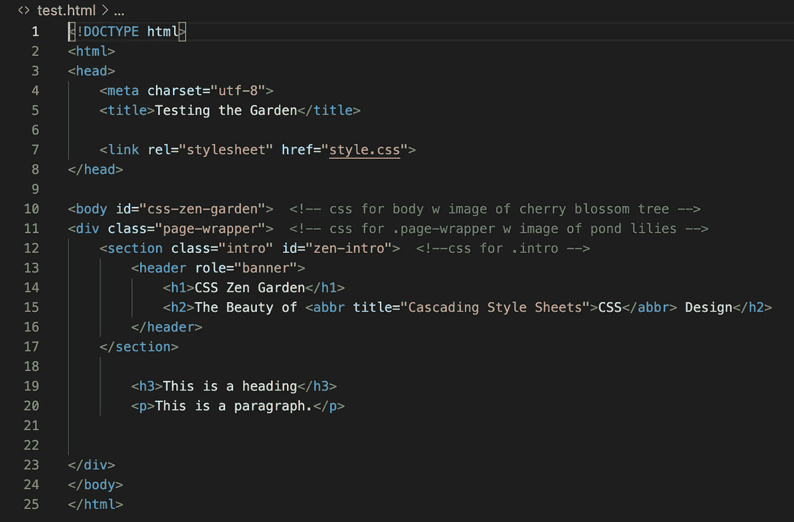
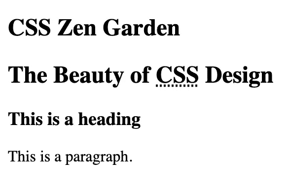
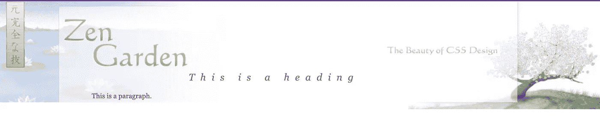
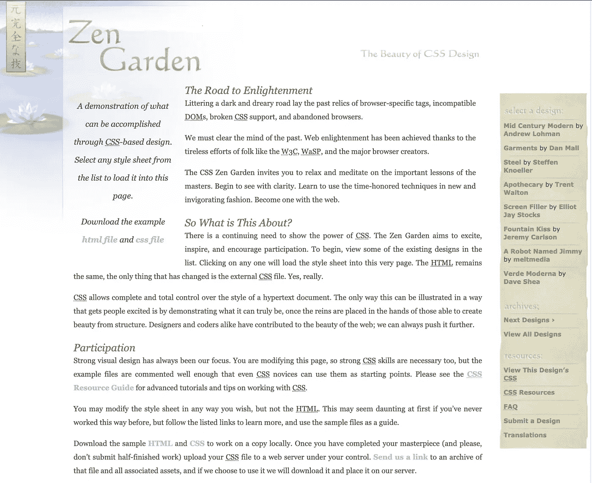

# 在 CSS 禅宗花园中寻找禅

> 原文：<https://medium.com/codex/finding-zen-in-the-css-zen-garden-fca153f4fe06?source=collection_archive---------4----------------------->

## [法典](http://medium.com/codex)


由[肖恩·斯特拉顿](https://unsplash.com/@seanstratton?utm_source=medium&utm_medium=referral)在 [Unsplash](https://unsplash.com?utm_source=medium&utm_medium=referral) 上拍摄的照片

恕我直言，我不记得在 Flatiron 学校学习 Ruby 和 JavaScript 时学了很多 CSS(层叠样式表)。如果我想知道到底发生了什么，也许在一些实验室里可以找到 CSS 文件。在任何情况下，在进入 JavaScript 最终项目之前，我们都得到了 CSS 的快速概述，以及 bootstrap 的快速概述。

我的项目是功能性的，但 CSS 是绝对缺乏的。我能够添加背景颜色和字体；移动东西，但是东西不在我想要的地方。我真的很纠结于布局，弄清楚我需要获取哪个选择器/元素，以及我需要使用哪些值来实现想要的效果。

自助可能也不是最明智的举措。我认为这比从头开始做 CSS 更容易。相反，我真的很难理解网格系统。

因此，我将花时间边做边学，并检查 CSS Zen Garden 能够实现 CSS 的这些属性和价值。

 [## CSS 禅宗花园

### 我们需要不断展示 CSS 的威力。禅宗花园旨在激发、启发和鼓励…

www.csszengarden.com](http://www.csszengarden.com/) 

## 基本术语

**选择器—** 选择具有 CSS 声明和/或 CSS 声明块
**的 HTML 元素类选择器—** 选择具有相同类名
= >的所有元素使用“.”在类名之前；。classname
**id 选择器—** 只选择一个具有给定 ID 的元素(每个元素应该有一个唯一的 id)
= >在 ID 名称前使用“#”；#idname
ie color，text-align，font
**属性值—** 定义属性的文字和/或数字
= >例如:对于颜色属性，可以列出' pink '或#ffc0cb(十六进制代码)
**CSS 声明—** 一个带有值的属性；例如:color: pink
= >使用带有选择器的 CSS 声明将其应用于 HTML 元素
**CSS 声明块—** 其中一个或多个 CSS 声明与一个选择器相关联
= >声明用大括号{ }
= >括起来，块中的每个声明必须用分号(；)
例如:

```
h1 {
 color: pink;
 font: georgia;
}
```

## 方法学

1/从 [CSS Zen Garden](http://www.csszengarden.com/) 下载样本文件，并将其命名为 index.css 和 index.css。这些将是查看我们试图模仿的视觉示例的原件。若要在浏览器中打开，请在命令行中键入' open index.html '。

2/复制 index.css 并将其重命名为 test.css(或者您喜欢的任何名称)。

3/创建一个空白的 test.html 文件(我发现用和 css 文件相似的名字命名更容易避免混淆)。若要在浏览器中打开，请在命令行中键入' open test.html '。

4/在 test.html 文件的中链接 test.css 文件。
link rel = " style sheet " href = " test . CSS ">

5/从主 index.html 文件中复制每个元素(或元素子集),并将其适当地粘贴到 test.html 文件中。刷新浏览器以查看新结果。

6/查看 test.css 文件，并查看与该元素相关的属性。观察内容在浏览器中的位置和放置方式。

7/谷歌/查找任何你不熟悉的房产。这里有一个不错的网站:【https://www.w3schools.com/】T4

8/尝试不同的属性值以查看浏览器中的变化。



test.html 的第一位代码



没有链接到 CSS 文件时在浏览器中的样子



当它链接到 CSS 文件时

## 一路上我学到了什么

1/有几种方法可以将 CSS 包含到 HTML 文件中。这里，我使用一个外部样式表文件，通过 head 部分中的<link>元素链接到 html 文件。对于大量的 CSS 来说，这似乎是最好的。

[](https://www.w3schools.com/css/css_howto.asp) [## 如何添加 CSS

### 当浏览器读取样式表时，它会根据样式表中的信息格式化 HTML 文档…

www.w3schools.com](https://www.w3schools.com/css/css_howto.asp) 

2/元素可以有一个类和 id 以及一个**角色属性**。
ex:role = " banner "；role= "文章"

> 角色属性用于可访问性、设备适配、服务器端处理和复杂数据描述。

从我收集的信息来看，角色属性似乎比 alt 属性更能准确地描述 HTML 元素的用途。

 [## 角色属性

### HTML5 角色属性的用例包括:可访问性、设备自适应、服务器端处理和…

www.w3.org](https://www.w3.org/WAI/PF/HTML/wiki/RoleAttribute) 

其他角色示例:
role = " logo "
role = " layout "
role = " link "
role = " button "

W3C 网站上列出了更多内容。

关于可访问性，如果使用了一个链接，但它的功能更像一个按钮，屏幕阅读器可以说“按钮”而不是“链接”。

易访问的富互联网应用(WAI-ARIA)被提到了很多。似乎值得找个时间研究一下。

 [## WAI-ARIA 角色

### 本页列出了涵盖 MDN 上讨论的所有 WAI-ARIA 角色的参考页面。有关角色的完整列表，请参见使用…

developer.mozilla.org](https://developer.mozilla.org/en-US/docs/Web/Accessibility/ARIA/Roles) 

3/我发现选择器包含父元素和子元素很有趣。比如说…

超文本标记语言

```
<header role=”banner”>
 <h2>The Beauty of <abbr title=”Cascading Style Sheets”>CSS</abbr> Design</h2>
</header>
```

半铸钢ˌ钢性铸铁(Cast Semi-Steel)

```
header h2 {
background: transparent url(http://csszengarden.com/001/h2.gif) no-repeat top left;margin-top: 58px;margin-bottom: 40px;width: 200px;height: 18px;float: right;text-indent: 100%;white-space: nowrap;overflow: hidden;}
```

4/此外，我知道背景的值可以是一种颜色，但我不知道它可以是一个图像。

overflow 属性指示如果内容“溢出”元素的“框”该怎么办。

6/我在这里注意到的另一件事是 h2 标签中的“abbr”元素。从没见过这个。是缩写元素。它可以有一个标题属性来描述缩写或首字母缩写词。

嗯…我看到了让缩写更易读的好处。关于 CSS，你可以在整个页面中以某种方式设计所有缩写的样式。

```
abbr {color: green;border-bottom: none:}
```

 [## :缩写元素

### HTML 缩写元素()表示缩写或首字母缩写词；可选属性可以提供扩展…

developer.mozilla.org](https://developer.mozilla.org/en-US/docs/Web/HTML/Element/abbr) 

## 现在怎么办？

我对 CSS/HTML 还有一些疑问，还有一些我正在纠结的东西，比如布局技术、网格、flexbox 等等。

我成功地重建了禅宗花园网站。接下来，我想用我自己的布局，颜色，字体，图像等来定制它。



重建禅宗花园