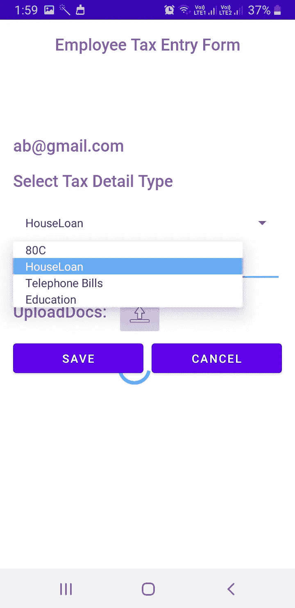

# 与科特林·MVVM 一起射击基地

> 原文：<https://medium.com/codex/fire-base-with-kotlin-mvvm-799fd954dea6?source=collection_archive---------3----------------------->


使用 Kotlin 的 MVVM 火力基地

这个故事演示了一个使用 Kotlin 的 MVVM 使用 FireBase 数据库的示例 android 应用程序。

该应用程序使用 firebase 的以下功能:

(1)认证

(2)实时数据库

(3)储存

**样本 app 简介:**

用作演示一部分的样本包含以下屏幕:

(1) **登录屏幕:**使用提供的电子邮件/密码验证登录用户

(2) **注册屏幕:**该屏幕允许用户通过 firebase 使用电子邮件/密码进行注册。

对于以上两个屏幕，我们使用 firebase 的“认证”功能。

(3) **税务信息输入屏幕:**在该屏幕中，将向用户提供 UI 以输入关于税单的信息并提交该数据。允许用户上传 pdf 文档作为账单凭证。

该屏幕使用 firebase 的“实时数据库”和“存储”功能。

(4) **税务列表:**该屏幕显示用户根据电子邮件 ID 输入的税务详细信息列表

该屏幕使用 firebase“实时数据库”。

**App 实现细节:**

步骤 1:在 firebase 控制台上注册我的应用程序，并在屏幕下方拍摄相同的内容:


为了注册我的应用程序，我按照 firebase 文档中描述的步骤进行了操作。

[](https://firebase.google.com/docs/android/setup) [## 将 Firebase 添加到您的 Android 项目

### 安装或更新 Android Studio 至其最新版本。确保您的项目满足这些要求:目标…

firebase.google.com](https://firebase.google.com/docs/android/setup) 

第二步:

启用了我的应用程序所需的功能，如下所示:

**认证**


证明

已启用电子邮件/密码作为此应用的身份验证机制。我们可以根据应用程序要求启用任何身份验证机制。

点击用户选项卡，我们可以查看注册用户列表


(b) **实时数据库:**启用实时数据库功能，保存我的应用程序的数据。

我有一个名为“taxInfo”的表。表数据表示为 FireBase 的节点，使用 NOSQL 作为底层数据库


**FireBase 云存储:**

pdf 文档或任何类型的文件都可以通过启用“存储”功能保存在 FireBase 中。当一个文件被上传到 FireBase 中时，我们会收到该文件的响应 URL，这在 DB 中很容易维护。


**App 项目结构:**

采用 MVVM 设计模式。在视图模型中处理与 FireBase 的所有交互，并提供视图所需要的数据

在 ViewModel 中，初始化 init 块中所有必需的 FireBase 特性，如下所示:

```
private var  auth: FirebaseAuth? = null
private var storage: FirebaseStorage
private var storageReference: StorageReference
private  var rootNode: FirebaseDatabase
private  var reference: DatabaseReference
var loading: MutableLiveData<Boolean> = MutableLiveData()
init {

    auth = FirebaseAuth.getInstance()    //Authentication
    storage = FirebaseStorage.getInstance()   //File/image uploads
    storageReference = storage.*reference    //Reference to the storage* rootNode = FirebaseDatabase.getInstance()   // Realtime DB
    reference = rootNode.getReference("taxInfo") //Reference to DBTable
    loading.postValue(false)

}
```

认证:

注册用户 firebase 提供以下 API:

```
authentication.createUserWithEmailAndPassword(email,password)
    .addOnCompleteListener **{**task: Task<AuthResult> **->** if(!task.*isSuccessful*){
            *println*("Registration Failed with ${task.*exception*}")
            _registrationStatus.postValue(ResultOf.Success("Registration Failed with ${task.*exception*}"))
        }else{
            _registrationStatus.postValue(ResultOf.Success("UserCreated"))

        }
        loading.postValue(false)
    **}**
```

验证用户:

```
auth?.*let***{** login**->** login.signInWithEmailAndPassword(email,password)
        .addOnCompleteListener **{**task: Task<AuthResult> **->** if(!task.*isSuccessful*){
                *println*("Login Failed with ${task.*exception*}")
                _signInStatus.postValue(ResultOf.Success("Login Failed with ${task.*exception*}"))
            }else{
                _signInStatus.postValue(ResultOf.Success("Login Successful"))

            }
            loading.postValue(false)
        **}

}**
```

注销:

```
auth?.*let* **{**authentation **->** authentation.signOut()
    _signOutStatus.postValue(ResultOf.Success("Signout Successful"))
    loading.postValue(false)
**}**
```

上传文档:

```
val ref = storageReference
    .child("/uploadedDocs/"
            + UUID.randomUUID().toString())
val uploadTask = ref.putFile(selectedImageUri)
val urlTask = uploadTask.continueWithTask(*Continuation*<UploadTask.TaskSnapshot, Task<Uri>> **{** task **->** if (!task.*isSuccessful*) {
        task.*exception*?.*let* **{** throw **it
        }** }
    return@Continuation ref.*downloadUrl* **}**)?.addOnCompleteListener **{** task **->** if (task.*isSuccessful*) {
        val downloadUri = task.*result
        println*("Downloaded URL: is ${downloadUri.*toString*()}")
       ** var downloadUrl = downloadUri.*toString*() //Return URL of uploaded doc**
        _uploadDocResult.postValue(ResultOf.Success(downloadUrl))
        loading.postValue(false)
        // addUploadRecordToDb(downloadUri.toString())
    } else {
        _uploadDocResult.postValue(ResultOf.Success("Upload Failed"))
        loading.postValue(false)
    }
**}**?.addOnFailureListener**{** _uploadDocResult.postValue(ResultOf.Success("Upload Failed"))
    loading.postValue(false)
**}**
```

将单行数据保存到实时数据库:

```
**val id: String? = reference.push().*key   //Creates unique ID to represent a row***reference.addValueEventListener(object : ValueEventListener {
    override fun onDataChange(@NonNull snapshot: DataSnapshot) {
        // inside the method of on Data change we are setting
        // our object class to our database reference.
        // data base reference will sends data to firebase.
        if (id != null) {
           ** reference.child(id).setValue(taxInfo) //Set the Dataclass object to save the data**
        }

        _saveResult.postValue(ResultOf.Success("Data Saved Successfully"))
        loading.postValue(false)
    }

    override fun onCancelled(@NonNull error: DatabaseError) {
        // if the data is not added or it is cancelled then
        // we are displaying a failure toast message.
        _saveResult.postValue(ResultOf.Success("Data Save Failed"))
        loading.postValue(false)
    }
})
```

从数据库读取数据:

```
**var checkUser: Query = reference.orderByChild("employeeEmail").equalTo(email)**

checkUser.addValueEventListener(object : ValueEventListener {
    override fun onDataChange(dataSnapshot: DataSnapshot) {
        for (postSnapshot in dataSnapshot.*children*) {
            val taxInfo= postSnapshot.getValue(TaxInfo::class.*java*)
            if (taxInfo != null) {
                taxInfoList.add(taxInfo)
            }
        }
        _taxInfoMutableLiveDataList.postValue(ResultOf.Success(taxInfoList))

    }
```

数据模型:

```
data class TaxInfo(val employeeEmail : String = "",val taxDetailType:String = "",val taxDetailAmount:String = "",val uploadUrl:String ="")
```

注意:FireBase 要求我们在 Kotlin 中用默认值初始化 dataclass 变量。否则它会抛出一个错误。确保将数据类中的变量初始化为默认值。

**源代码的 Github 链接:**

[](https://github.com/chandragithub2014/MyReferenceProject/tree/master/features/firebaseoprs) [## chandragithub 2014/my reference 项目

### 最新 JetPack 组件的 Android 代码示例参考-chandragithub 2014/my reference project

github.com](https://github.com/chandragithub2014/MyReferenceProject/tree/master/features/firebaseoprs) 

依赖关系:

[](https://github.com/chandragithub2014/MyReferenceProject/blob/master/features/firebaseoprs/build.gradle) [## chandragithub 2014/my reference 项目

### 最新 JetPack 组件的 Android 代码示例参考-chandragithub 2014/my reference project

github.com](https://github.com/chandragithub2014/MyReferenceProject/blob/master/features/firebaseoprs/build.gradle) 

```
implementation platform('com.google.firebase:firebase-bom:26.5.0')

// Declare the dependency for the Firebase Authentication library
// When using the BoM, you don't specify versions in Firebase library dependencies
implementation 'com.google.firebase:firebase-auth-ktx'
implementation 'com.google.firebase:firebase-storage:19.2.1'
// Declare the dependency for the Realtime Database library
// When using the BoM, you don't specify versions in Firebase library dependencies
implementation 'com.google.firebase:firebase-database-ktx'
```

[](https://github.com/chandragithub2014/MyReferenceProject/blob/master/build.gradle) [## chandragithub 2014/my reference 项目

### 最新 JetPack 组件的 Android 代码示例参考-chandragithub 2014/my reference project

github.com](https://github.com/chandragithub2014/MyReferenceProject/blob/master/build.gradle) 

Google play 服务依赖性:

```
classpath 'com.google.gms:google-services:4.3.5'
```

应用程序的屏幕截图:



**消防基地简介:**

Firebase 是一个后端平台，用于构建 Web、Android 和 IOS 应用程序。它提供实时数据库，不同的 API，多种认证类型和托管平台。

Firebase 是一个后端即服务，它是一个基本上为移动应用程序设计的实时数据库。

在快速成型的时代，我们可以得到聪明的想法，但有时如果花费太多的工作，它们就不适用了。通常，后端是一个限制因素——由于缺乏知识或时间，许多考虑事项从来不适用于服务器端编码。

Firebase 是一个后端即服务(BaaS ),它始于 YC11 年。它成长为谷歌云平台上的下一代应用开发平台。Firebase(一个 NoSQLjSON 数据库)是一个实时数据库，允许以树的形式存储对象列表。我们可以在不同设备之间同步数据。

以下是 Firebase 提供的功能


FireBase 功能

在 Firebase Android SDK 的帮助下，我们可以使用这些服务来创建 Android 应用程序，而无需编写任何服务器代码。

上述服务中最重要的是基本的认证、实时数据库。

FireBase 的优势:

*   Firebase 管理数据库中的实时数据。因此，它可以方便快捷地与数据库交换数据。因此，对于开发移动应用程序，如直播，聊天消息等。，我们可以使用 Firebase。
*   Firebase 允许在所有设备(iOS、Android 和 Web)之间同步实时数据，而无需刷新屏幕。
*   Firebase 集成了 Google Advertising、AdMob、Data Studio、BigQuery DoubleClick、Play Store 和 Slack 来开发我们的应用程序，实现高效、准确的管理和维护。
*   从数据库、分析到事故报告，一切都包含在 Firebase 中。因此，应用程序开发团队可以专注于改善用户体验。
*   Firebase 应用程序可以通过安全连接部署到 firebase 服务器。
*   Firebase 提供了一个简单的控制仪表板。
*   它提供了许多有用的服务可供选择。
*   不需要服务器基础设施来为应用提供数据支持。
*   它有 JSON 存储，这意味着数据和对象之间没有障碍。
*   Firebase 是无服务器的。

# 将 Firebase 添加到您的 Android 项目中:

**你可以使用以下选项之一将你的 Android 应用连接到 Firebase:**

*   [**选项 1**](https://firebase.google.com/docs/android/setup#console) : *(推荐)*使用 Firebase 控制台设置工作流程。
*   [**选项二**](https://firebase.google.com/docs/android/setup#assistant) :使用 Android Studio Firebase 助手(可能需要额外配置)。

更多信息请点击下面的链接:

[](https://firebase.google.com/docs/android/setup) [## 将 Firebase 添加到您的 Android 项目

### 安装或更新 Android Studio 至其最新版本。确保您的项目满足这些要求:目标…

firebase.google.com](https://firebase.google.com/docs/android/setup) [](https://github.com/chandragithub2014/MyReferenceProject/tree/master/features/firebaseoprs) [## chandragithub 2014/my reference 项目

### 最新 JetPack 组件的 Android 代码示例参考-chandragithub 2014/my reference project

github.com](https://github.com/chandragithub2014/MyReferenceProject/tree/master/features/firebaseoprs)