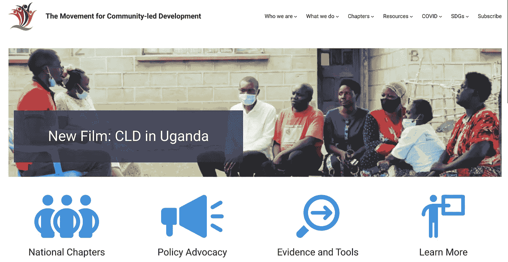
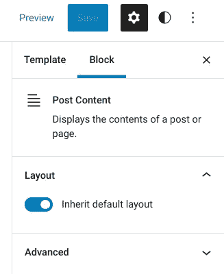
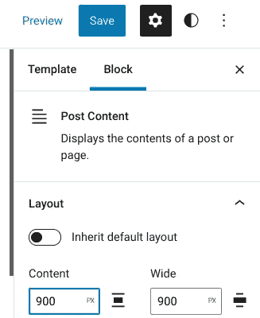

# WordPress 全站编辑的第一次冒险(FSE)

> 原文：<https://medium.com/codex/first-adventure-in-wordpress-full-site-editing-fse-25043da505b2?source=collection_archive---------13----------------------->

我第一次去 mcld.org FSE 的截图

我刚用手工制作的 PHP 经典主题建立了几个站点，新的 Gutenberg 全站点编辑器就出现了。我真的需要学这个吗？如何处理我精心调整的 CSS 呢？

当然了。在看了几个由 Jamie Marsland 制作的令人鼓舞的 YouTube 视频后，我将一个网站导出到我的本地机器上，并在 WordPress 6.0 中开始使用 Blockbase 主题。

# 团体。谁知道呢？

我对“组”块有一个初学者的概念——当我查看块列表时，我看到它不时地出现。我不知道的是，他们有比街区更多的风格设置。例如，我的页脚有深蓝色背景和白色文本，但是如何改变链接的颜色呢？友好的 Blockbase 支持人员向我展示了它隐藏在组块的文本设置中的三个点后面的位置。

# 隐藏的定制者是你的朋友

您会注意到 Blockbase 中没有使用主题定制器的链接——但是它仍然在那里！你可以进入 wp-admin/customize.php 并使用它输入额外 CSS 的能力。如果你已经为不同的彩色边框等添加了 css，这将非常方便。CSS 的效果显示在 Customizer 窗口和 life 站点中，但没有显示在 Gutenberg 编辑器中(令人烦恼)。

# 导出主题，但不导出设置

我必须弄清楚的一件事是，虽然你可以创建新的模板并导出主题以导入到你的实时站点，但你不会获得任何块或站点设置——那些进入数据库，而不是主题包。因此，虽然我的本地安装对于学习来说很好，但在我的情况下，当我访问我的实时站点时，我可以从 Blockbase 的一个新副本开始，并重复这些步骤来设置页眉、页脚甚至整个站点范围的自定义颜色。

如果我冻结了数据库本身，我可以用所有这些设置导出和导入它，但是我很确定自从我的实验以来，现场的内容已经改变了。Blockbase 的好处是我可以接受它的很多默认值。站点编辑器设置应用得如此之快，真的不成问题。

# 更改页面和文章宽度

我认为对我来说不明显的最重要的事情是如何改变宽度。帖子内容是单个帖子模板中的一个块。当你编辑它时，你会看到

在桌面模式下，Blockbase 中的默认宽度非常窄。点击“继承”按钮显示如何改变设置，我把它改为 900 像素

# 剪切和粘贴块

使用 6.0，你可以剪切和粘贴多个块，我希望我可以在本地和实时站点打开站点编辑器的情况下做到这一点，但这似乎并不奏效，甚至对于单个块也是如此。我可以剪切和粘贴文本，但不能剪切和粘贴块。如果有人知道怎么做，我会更新这个页面。

# 剩余的烦恼

我相信人们发现 FSE 最大的烦恼是古腾堡编辑器有 620 像素的宽度，即使页面设置为宽或全幅。希望他们会在 6.1 中解决这个问题！

# 通缉:FSE 小抄

关于 Wordpress.org 的全网站编辑的文档是非常全面的，并且看起来是最新的，但是它真的迫使你使用他们的教学方法深入学习。就个人而言，我更喜欢一个小抄，我希望别人而不是我来创建。