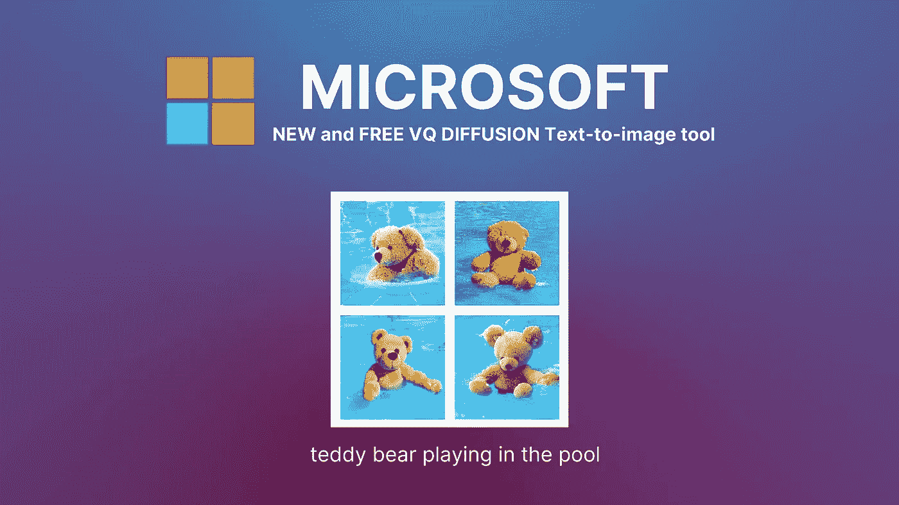

# VQ 扩散:微软新的文本到图像的人工智能工具

> 原文：<https://medium.com/codex/first-look-at-microsofts-new-text-to-image-ai-tool-vq-diffusion-4e6d3c80f5bc?source=collection_archive---------6----------------------->

吉姆·克莱德·蒙赫创造的形象

我们正处于艺术表达的新时代的尖端，在这个时代，人工智能工具将允许我们以前所未有的轻松创造出逼真的艺术印象深刻的图像。

有了这些人工智能工具，在创造令人惊叹的视觉杰作时，天空是无限的。