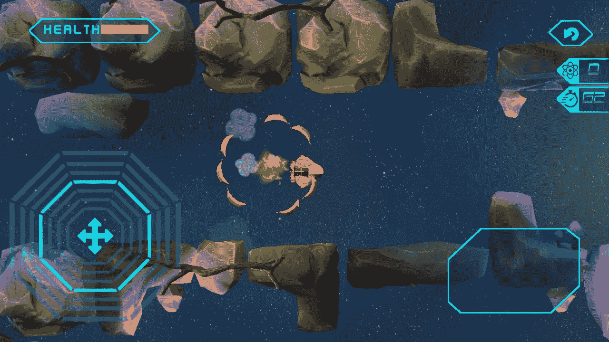

# 优化电子游戏的第一步？测量！

> 原文：<https://medium.com/codex/first-step-to-optimize-a-video-game-measure-a5f80a12985c?source=collection_archive---------20----------------------->

当然，这个故事的标题可以推广到所有的软件。在软件开发中，看到人们在不知道自己在做什么的情况下，为了让代码运行得更快而修改代码，这种情况太常见了。

这是很成问题的，原因有几个。当然，第一个是很难真正意识到这些变化是否真的有帮助。我们相对珍惜时间，等待事情发生会让时间看起来更长，甚至有时我们会过于乐观，认为事情有所改善，但事实并非如此。有一种自动化的方法来测试变更并恰当地度量它们，总是会使改进更快更好。

然而，绝对有必要进行适当的时间测量的最大原因是，对真正问题所在的直觉往往是完全错误的。软件以这种方式是违反直觉的，由于现代编译器和硬件优化，循环通过无限的数组几乎可以瞬间完成，而看似无害的做法，如将变量的生命周期保持在最短，将完全破坏您的性能。

为什么我特指视频游戏？因为我真的很喜欢给它们编程。此外，因为在处理游戏中的性能问题时，您会发现具体的问题。视频游戏需要在每一帧上从头开始绘制每一幅图像，理想情况下每秒钟要绘制 60 次。在某些情况下，比如虚拟现实，你的软件在任何一点都不会在一秒钟内更新 60 次，这一事实可能会阻止你卖掉你的游戏。不仅事情需要发生得快，而且要始终如一；一个游戏以稳定的每秒 30 帧的速度运行要比有时以每秒 60 帧的速度运行并且每隔几秒钟就有轻微的口吃要好。

# 故事

不久前，我花了几年时间开发了一款视频游戏[太空披萨](https://play.google.com/store/apps/details?id=com.jsmtux.shooterandroid)。和我开发的大多数视频游戏一样，我通常对学习游戏开发比对改善游戏体验更感兴趣。在这种情况下，我决定使用一个相当低级的框架([一夫一妻制](https://www.monogame.net/))并从头开始开发尽可能多的功能。一旦我有了一个可用的引擎来有效地创建新的关卡和体验，我就有点厌倦了。

在开发的时候，我并没有太关注游戏的性能，因为这是一个非常简单的游戏，在我的台式电脑上运行，一切似乎都很好。一旦我把游戏移植到我的安卓手机上，一切都变得非常明显。在某种程度上，我对如此糟糕的执行有点惊讶，因为我遵循了许多优化策略和良好实践:

*   平截头体剔除:仅绘制当前显示在屏幕上的元素
*   根据每个对象的材质和纹理对绘制调用进行排序
*   在帧上缓存昂贵的计算
*   使用面向数据的设计来优化 CPU 缓存的使用

难怪当你在一个 AAA 游戏中工作时，或者当你有一些技术挑战，比如大量的粒子或物体时，这些都是基本的。然而，当你是一个手工制作大部分系统的单人开发人员时，性能下降会出现在非常愚蠢的错误中，或者最多出现在你没有完全意识到的糟糕实践中。

在看到性能问题后，我花了相当长的时间试图改进许多我确信可以解决问题的随机事情。没有什么真正起作用，所以开始适当地衡量游戏的性能，以便在*改进*事情之前有一些确定性。

# 衡量视频游戏性能的问题

当我在一个专业开发工作室工作时，我有很多工具可以使用。尤其是在控制台上，我可以实时查看每个 CPU 内核的使用情况，或者查看 GPU 接收绘制命令、执行命令并通知 CPU 所用的时间。

在家里工作，在 Linux 环境下，使用大部分定制的软件，我没有这些奢侈品。我需要开发一种定制的方法来正确测量我的引擎的每个部分花费了多少时间。

我用实体组件系统(ECS)架构模式写的游戏。正确地解释它需要一篇单独的文章，但对于我们目前的范围，让我们只说它允许你定义一系列系统，如 3d 绘图，2d 绘图，物理更新，逻辑更新…它们彼此完全独立，每个游戏步骤调用一次。由于这个原因，我可以在调用每个系统之前和之后获取当前时间，并在控制台中打印出差异。完成了。

唉，没有真正完成。正如已经提到的，也可能是常识，游戏循环的每次迭代每秒至少发生 30 次；我的控制台日志充满了打印语句，根本无法理解。我试图记录最高值，这在加载游戏时会发生，但最终没有用。我会对根据我在屏幕上所做的事情来查看峰值和平均值感兴趣，仅仅停止执行是不够的。按需暂停调试器或多或少会有相同的问题。

# 一些灵感

我的爱好之一是阅读游戏开发博客和故事。我记得读到过一个开发经典游戏的问题，以及它是如何被修复的。遗憾的是，我忘了那是什么游戏。说游戏随机崩溃，开发团队没有合适的调试工具。为了找到它失败的部分，团队在播放时显示了一个彩色边框，其中颜色取决于代码的哪个部分被执行。当游戏崩溃时，它显示最后一帧，所以开发者可以知道问题出在哪里。

这可能看起来是一个非常琐碎的技术，但是它确实给了我一个从哪里开始的起点。它提示我给每个系统分配一种颜色，并根据每个系统花费的时间在屏幕上显示不同大小的图形。最终结果是:

调试信息的用法示例

在上面的图片中，你可以看到加载屏幕的截图，在左上角有调试菜单。它看起来一点也不花哨，但最终却非常有用。左栏显示了游戏中的*绘制*和*逻辑*部分一般需要多长时间，接下来的两栏显示了与之相关的每个系统需要多少时间，最后一栏显示了使用了多少内存。

在这些线下面，我还画了一些横线，这是 30fps 和 60 fps 的最大拍摄时间。这样我就知道在哪里停止优化了。

# 发现的主要问题

与我最初的直觉相反，大部分时间是在物理系统度过的。当然，我已经决定自己编写它，即使对于这个简单的用例来说，它也太简单了。

我所做的是，对于每个对象，检查是否相交，并采取适当的措施。因为我的场景是由许多小物体组成的，这将花费很长时间。

真正的物理引擎有一个“活动”对象的列表，只有那些会在任何时间点被检查。如果它们中的任何一个有一段时间没有移动，并且它不在任何大变化的附近，那么它将被从“活动”列表中移除并进入休眠状态。

我不会实施如此复杂的变化。我决定简化通用过程，只检查自上次运行以来移动过的对象。我仍在对照所有其他对象检查那个对象，但那是完全可以接受的。这已经足够好了，因为在游戏开始时，没有对象会重叠。在任何时间点，如果两个对象中的任何一个在前一帧上移动，它们都有可能重叠。

这对于在游戏过程中使所有的线足够小以适应每秒 30 帧的线来说已经足够好了。我原本以为这已经足够好了，但是…

# 需要更多的测量

每隔几秒钟，游戏就会暂停一会儿，然后继续。我在任何时间点所做的所有操作都已经被度量了，所以很明显这个问题超出了我的控制范围。

在那之前，我的大部分软件开发经验都是使用 C++之类的编译语言，少数几次使用 Javascript 性能之类的东西并不重要。看起来这个问题似乎与 C#垃圾收集器有关，但这对我来说是一个未知的领域。

由于游戏装载和卸载了大量的资产，我担心我在某个时候没有正确地管理它们。也许我在执行过程中不必要地加载了它们，或者它们在前面的阶段中变得摇摆不定，需要释放。

我在自制的调试器中增加了一行，显示我的游戏使用的内存总量。当加载时，我可以看到它大幅增长，当不再需要我的资产时，它会适当收缩。

然而，在一个绘制的帧中，每一个都占用了少量的空间，只是当垃圾收集器释放它时，偶尔会减少空间，从而导致明显的停顿。是时候找到更好的测量记忆力的方法了。我发现 C#语言也有这样的工具。我可以玩一会儿这个游戏，同时工具会跟踪对象被分配和释放的位置，并查看最常发生这种情况的位置。

由于软件的性质，我不需要为此创建任何特定的工具，因为看到整个执行过程中的累积值就足够了。

在这种情况下，答案是出乎意料的。问题主要出在这样的结构上:

在那里，lightPosition 和 lightColor 都将被创建，然后从堆中删除。在每次更新时，循环的内部会被执行数千次，这就造成了停顿。

修复非常简单，只需更改如下代码:

每次更新只创建和处理一次变量。

# 摘要

优化软件性能很难。在某些情况下，比如游戏，会变得更难。在任何情况下，获得好结果的唯一正确的方法是从正确的测量开始。花在这上面的时间很快就会有回报。