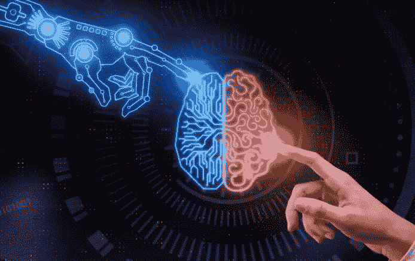

# 证明后人类时代比我们想象的更近的五项发明

> 原文：<https://medium.com/codex/five-inventions-that-are-proof-the-post-human-era-is-closer-than-we-think-c77a78c0e60f?source=collection_archive---------3----------------------->

## 后人文主义:超越/超越人文主义

由[纪录片拍摄](https://www.documentarytube.com/articles/a-few-words-about-artificial-intelligence-what-is-it)

M 当谈到机器人、人工智能和医学领域呈现的现实时，我们中的任何人都远非一无所知。我们知道每个人都有大量的智慧、财富和创造动力。然而，花点时间看看进步…