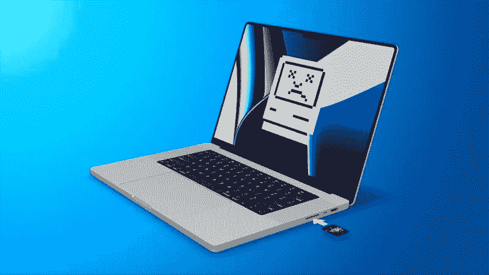

# MacBook Pro 缺少的五样东西

> 原文：<https://medium.com/codex/five-things-missing-from-macbook-pro-a2f42bcdcfb2?source=collection_archive---------11----------------------->

## MacBook Pro 以其强大的芯片、迷你 LED 屏幕和许多端口给苹果粉丝和创意专业人士留下了深刻的印象。但即使使用 MacBook Pro，仍有一些事情你无法完成。以下是一些用户仍在等待的五个功能。

**支持 UHS-III SD 卡**

[来源](https://images.macrumors.com/t/oQj-NiWg6gDWwDF6bAMljzPqSPs=/1600x0/article-new/2021/12/2021-MBP-SD-Card-Error-Feature.jpg)