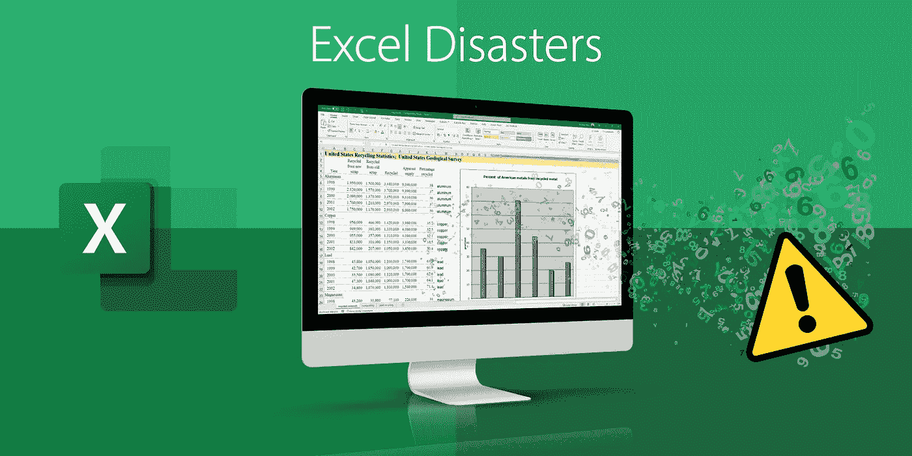

# 五次 Excel 导致灾难

> 原文：<https://medium.com/codex/five-times-excel-led-to-disaster-991f7a54b678?source=collection_archive---------2----------------------->

## 当 Excel 被误用时，可能会产生灾难性的后果

xcel 无处不在，以至于给许多人一种错误的印象，认为他们比实际上更擅长使用它。让我们面对现实:*每个人*的电脑上都有——无论是在家里还是在工作场所。但是有多少用户能够说他们知道它的所有特性和功能呢？