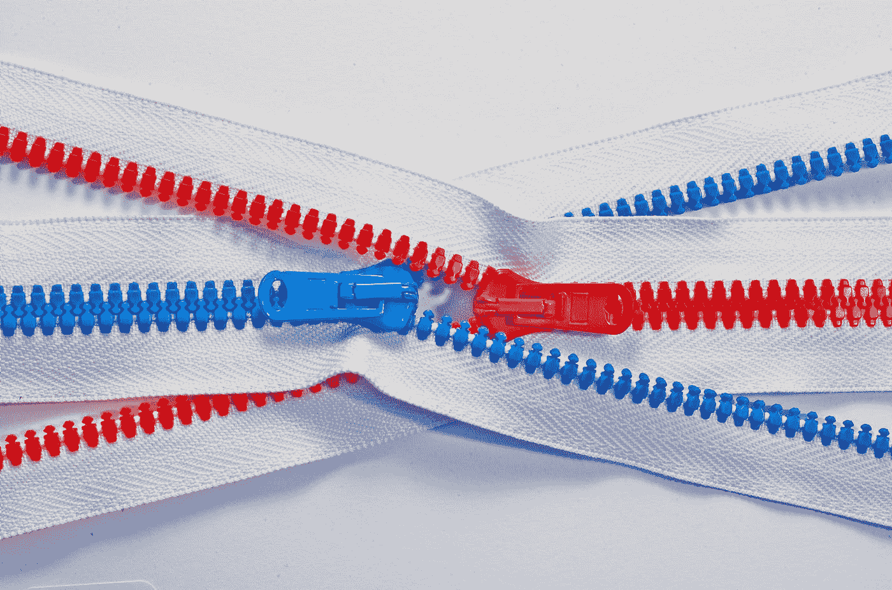

# 修复一个奇怪的 PHP Gzip 问题

> 原文：<https://medium.com/codex/fixing-a-strange-php-gzip-issue-6d761cbebe84?source=collection_archive---------5----------------------->



托马斯·索贝克在 [Unsplash](https://unsplash.com?utm_source=medium&utm_medium=referral) 上的照片

一个朋友请我帮忙弄清楚为什么他重写一些非常非常旧的软件会让他如此头疼。我通常不为朋友做事，但这看起来很简单。问题变得如此古怪，我不得不分享。

他工作的公司被黑了，原因显而易见。他们仍然在运行只能在 PHP 4.0 上运行的软件。是的，我们说的是超过 20 年的老软件。

一般来说，他能够处理现代 PHP 编码，所以我真的很好奇是什么让他陷入困境，有三个原因。

1.  他们有一个分析网站页面链接的旧软件在他重写时崩溃了，甚至没有解析标记，这很奇怪，因为它更现代，使用 XMLDocument，而且他的输出标记是有效的！
2.  尽管启用了“所有”错误报告，但错误显示在他的错误日志中，而不是输出中。
3.  许多页面在回复中发送空白的内容。

所有这些都是由一连串的编码灾难引起的，所有这些都与如何处理 HTML 输出的 gzipping / packing 有关。

# PHP。INI Zlib 是方便的，不是可靠的

他在重新编码中做的第一件事就是用老派的手动压缩方法取出 ob_start()。*在此之前，gz_handler 甚至是一个选项。他只是在 PHP 中启用了压缩。INI 包含:*

```
[zlib.output_compression](https://www.php.net/manual/en/zlib.configuration.php#ini.zlib.output-compression) = "1"
```

这实际上是什么使得第三方网站分析软件失败。它不支持 gzipped 标记，而且很明显——至少在他的主机上——输出压缩例程甚至不检查头文件是否支持压缩！

PHP / zlib 部分的 hurr-durz。

# 输出缓冲

输出开始后，许多崩溃的页面试图设置 cookies 或标题**。如果你了解 PHP——或者一般的 web 开发——你知道你不能这么做……那么为什么它在旧程序中工作呢？**

因为它在做 ob_start。从技术上来说，PHP.ini zlib 应该处理过早退出并正确压缩，但是没有，它的行为就好像错误时输出为空。因此日志和空白页中的错误。

部分修复将使用 ob_start，但错误可能仍然会在没有刷新的情况下终止。

# 解决办法？

回到手动操作，只是用更现代的方法。因为它是一个单入口程序，所以很容易在一开始就进行压缩。关闭 php.ini 压缩，返回 ob_start，但使用 gzhandler，并使用 register_shutdown_function 来设置 header()和 flush。

```
foreach (['gzip', 'x-gzip', 'x-compress'] as $type) {
  if (strpos($_SERVER['HTTP_ACCEPT_ENCODING'], $type) !== false) {
    define('CONTENT_ENCODING', $type);
    break;
  }
}ob_start(defined('CONTENT_ENCODING') ? 'ob_gzhandler' : null);
ob_implicit_flush(0);
register_shutdown_function(function() { 
  if (defined('CONTENT_ENCODING')) header(
    'Content-Encoding: ' . CONTENT_ENCODING
  );
  ob_end_flush();
});
```

检测浏览器是否支持 gzip 压缩。如果它确实以 ob_gzhandler 开始，如果不是仍然缓冲以便你可以 header()或 set cookies()直到脸色发青。关闭隐式刷新，这样我们就可以缓冲所有的输出，而不是一次只缓冲一个块。如果合适，注册 shutdown 函数来设置头，然后执行 ob_end_flush 来发送内容输出。

不需要记住在最后刷新或者盲目地希望 PHP 为你做。

# 结论

这是一个简单的修复，并让我的朋友继续调试他的重写。从几十年前我开始使用 PHP 的那一天起，我就一直使用类似的代码，因为能够在任何需要的地方使用 header 和 cookies 极大地简化了语言的使用。

它不一定漂亮，但它比大多数替代方案更好地完成了工作。

出于某种原因，php.ini 设置只是盲目地发送压缩文件，而没有检查 HTTP_ACCEPT_ENCODING 值，这让我有点沮丧。我不知道这是否正常，但如果这样就不好了。

无论如何，很容易开始去“rawrz 我可以现代化这个！”并且开始撕掉一些东西，而不考虑当初为什么做出这个决定。尤其是当文档中提到“您应该使用 PHP。请改为 INI 设置。

我经常看到，人们盲目地将“在适当的时候”的建议应用到任何事情上。看看人们为了避免使用“因为”表而跳过的疯狂的陷阱，或者 STRONG 和 EM 对 B 和 I 的误解*(所有四个标签仍然服务于独特和不同的目的)*等等。这几天，似乎每个人都在把“在适当的时候”或“首选”变成“T2”，而不是“T3”。

希望有人觉得这不是有用的，至少有趣。