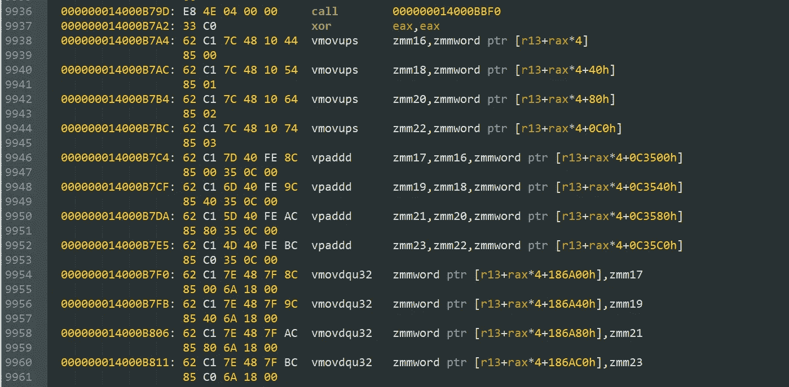

# 修复英特尔编译器的不公平 CPU 调度程序(第 1/2 部分)

> 原文：<https://medium.com/codex/fixing-intel-compilers-unfair-cpu-dispatcher-part-1-2-4a4a367c8919?source=collection_archive---------0----------------------->

## 一个提高 AMD 处理器性能的简单补丁

如果您是用 C、C++或 Fortran 编写代码的人，那么您可能听说过英特尔 C/C++编译器和英特尔 Fortran 编译器。事实上，在科学计算中，英特尔编译器通常比 GNU 或 LLVM 编译器更受青睐，因为它们在处理数字时提供了显著的提升。例如，[该](https://colfaxresearch.com/compiler-comparison/#sec-3-1)基准测试显示，英特尔 C++编译器优于各种编译器供应商，在数值计算方面比 g++快 50%。这主要是因为英特尔编译器通常在从源代码生成优化的机器代码方面表现出色。

使用英特尔编译器的另一个原因是，它有许多编译器扩展(即编程语言标准中未声明的功能)，可以更好地控制编码。然而，许多程序员认为使用非标准的编译器扩展是一种不好的做法，因为这样的代码是不可移植的。英特尔编译器在所有平台(Linux、macOS 和 Windows)上都同样出色，但在 GNU、LLVM 或 MSVC 编译器上就不一样了。其实很多 PC 视频游戏都是用 Intel C++编译器编译的。我是一名计算化学研究员，所以我所在领域的大多数软件都需要进行大量的数值计算，因此它们中的大多数都是由英特尔编译发布的。

大多数做数值计算的软件经常使用线性代数(如矩阵乘法、对角化等)。)这些操作经常被使用，因此有一些优化的库支持快速线性代数。这些被称为 BLAS(基本线性代数子程序)和 LAPACK(线性代数软件包)。此类库的常见示例包括 OpenBLAS、BLIS、英特尔 MKL。同样，英特尔的 MKL(数学内核库)通常表现最佳，大多数软件包(如 Matlab)使用英特尔 MKL 进行线性代数运算。这种库可以运行快速计算，因为它们使用 SIMD 向量指令、多线程、缓存优化等。

英特尔编译器和 MKL 库的一个主要问题是编译后的软件仅针对英特尔 CPU 进行了优化。在编译过程中，英特尔编译器会添加一些额外的代码来检查 CPUID 中的供应商字符串。如果供应商字符串是“GenuineIntel”(即英特尔处理器)，则软件使用优化的代码路径，并带有 SIMD 指令。如果供应商字符串是“AuthenticAMD”(即 AMD 处理器)或其他任何字符串，则软件将运行未优化的路径。(英特尔似乎已经在最近的更新中为英特尔 MKL 解决了这个问题。)

在这篇文章中，我将写为什么和如何发生这种 CPU 调度，以及如何修补一个编译好的软件来“修复”这个问题。

如果你想避免无聊的细节和解释，请跳到**如何修复**部分。也请阅读博客的[下一篇](https://shoubhikrmaiti.medium.com/fixing-intel-compilers-unfair-cpu-dispatcher-part-2-2-1920bf17315c)部分，我将在那里进行基准测试，看看这种修补可能带来多大的性能提升。

# 简史

这种不公平的 CPU 厂商检查早就知道了。例如，AMD 早在 2005 年就已经就这个问题写过文章。丹麦计算机科学家 Agner Fog 也在 2009 年的博客中详细描述了这一点:

> 不幸的是，使用英特尔编译器或英特尔函数库编译的软件在 AMD 和 VIA 处理器上的性能较差。原因是编译器或库可以生成一段代码的多个版本，每个版本都针对特定的处理器和指令集进行了优化，例如 SSE2、SSE3 等。该系统包含一个功能，可以检测它运行在哪种类型的 CPU 上，并为该 CPU 选择最佳的代码路径。这被称为 CPU 调度程序。然而，英特尔 CPU 调度程序不仅检查 CPU 支持哪个指令集，还检查供应商 ID 字符串。如果供应商字符串为“GenuineIntel ”,那么它将使用最佳代码路径。如果 CPU 不是来自英特尔，那么在大多数情况下，它将运行最慢的代码版本，即使 CPU 与更好的版本完全兼容。

CPU 分派是不公平的，因为代码不检查 CPU 的能力(这是完全合理的)，而是检查 CPU 是否是 Intel 的，并且不执行在任何非 Intel 处理器上都能完美运行的代码。大多数现代 AMD 处理器实现了与英特尔相同的 SIMD 指令，因此没有理由这样做。英特尔也没有选择向公众披露其编译器和库的这一缺点。

英特尔编译器的这种行为是 AMD 在 2005 年对英特尔提起的诉讼中的投诉之一。他们在 2009 年达成了法律和解。AMD 还在 2010 年与联邦贸易委员会达成和解，其中[规定](https://www.ftc.gov/news-events/news/press-releases/2010/08/ftc-settles-charges-anticompetitive-conduct-against-intel)英特尔必须公开披露他们的软件歧视英特尔和非英特尔 CPU 的事实。这个免责声明现在可以在英特尔关于性能的[页面](https://edc.intel.com/content/www/us/en/products/performance/benchmarks/overview/)的最后找到:

> 针对英特尔编译器或其它产品的英特尔优化可能不会针对非英特尔产品进行相同程度的优化。

在任何情况下，英特尔编译器和英特尔 MKL 函数库在非英特尔处理器上仍然表现不佳，甚至到目前为止(2022 年 5 月)。由于 AMD 是消费者笔记本电脑和台式机处理器的另一个主要供应商，它对 AMD 的影响最大。从法律上来说，英特尔是被允许这么做的，因为他们的软件并没有特别歧视 AMD，只是在检查自己品牌的处理器。我个人认为，英特尔的行为可能有点不道德，因为虽然它没有特别歧视 AMD 处理器，但在法律的约束下，它在功能上等同于歧视。很明显，基准测试的结果偏向于英特尔，并且许多消费者在做出购买决定时会使用基准测试的结果。

然而，这篇文章不是在讨论大公司的道德规范！！因此，让我们来详细了解一下使用了什么样的优化以及英特尔的 CPU 调度是如何工作的。

# 什么是 SIMD？

在使用英特尔编译器或 MKL 编译的软件中，优化的和未优化的机器码之间的主要区别是使用矢量指令或 SIMD(单指令多数据)。当你在电脑上运行一个软件时，它向你的 CPU 发送指令，在 CPU 的每个周期，它获取并执行一条指令。

在旧的处理器中，每条指令只能执行一次算术运算，例如一次加法或减法。然而，现代处理器有能力在一个指令周期内对多个数据执行相同的操作。这就是所谓的 SIMD，当需要进行数字处理时，它可以提供很大的性能优势。

看一个 C/C++中的具体例子就更容易理解了，在这个例子中，将两个数组的元素相加得到一个最终的数组:

```
int a[100]; // contains some numbers
int b[100]; // contains some numbers
int c[100]; // empty array// Now add a and b together
for (int i=0; i<100; i++) {
    c[i] = a[i] + b[i]; // each turn of loop does one addition
}
```

现在，如果这种类型的代码是在没有 SIMD 的情况下编译的，那么当循环执行时，每个指令周期将执行一次加法，即它将添加两个整数。

如果你用 SIMD 呢？大多数现代英特尔和 AMD 处理器都实现了一种叫做 AVX2 的 SIMD，它有 256 位寄存器。在 C/C++中，`int`整数通常是 32 位的，所以每个寄存器可以存放 8 个整数。然后，AVX2 加法指令(`vpaddd`)将在一个指令周期内将所有这 8 个整数相加。本质上，for 循环的 8 次通过将在一个循环中发生。现在，无论您是否使用 SIMD，CPU 的每个周期都花费完全相同的时间(由时钟速度规格决定)。因此，在处理数字时，使用 SIMD 可以大大提高速度。

SIMD 有不同的种类，现代矢量指令集支持更大的寄存器(即更多的数据)和更广泛的可用操作。SIMD 指令集包括 SSE、SSE2、SSE3、SSE4.1、SSE4.2、FMA、AVX、AVX2、AVX-512，按照发布的大致时间表和效率的递增顺序排列。支持较新指令集的处理器通常也支持较旧的指令集。大多数消费类 CPU 实现高达 AVX2，AVX-512 仅在一些高端英特尔处理器中可用。

# 汇编码

当编译 C/C++或 Fortran 中的源代码时，它被转换成人类不可读的机器代码(二进制)。理解它们的唯一方法是用汇编语言反汇编二进制文件。在汇编语言中，CPU 指令用名字来表示，如前面提到的`mov`或`cmp`或`vpaddd`。即使这样，阅读汇编仍然是相当困难的，因为人类不像机器算法那样思考！

如果您使用的是 Windows，则二进制文件(如*。obj 或*。exe)可以通过从 Visual Studio 命令行运行`dumpbin /disasm file.obj > output.txt`来反汇编。在 Linux 和 macOS(以及 Windows 上的 mingw)上，二进制文件可以通过`objdump -D -Mintel file.o > output.txt`反汇编。请注意，`-Mintel`标志选择英特尔语法进行反汇编，而在 Windows 上是默认的。语法只是个人喜好。



英特尔语法中二进制反汇编的一小段，展示了 AVX-512 指令

在下一节中，我将使用汇编代码来展示 CPU 调度是如何工作的。我还会解释每条指令出现时的含义。

# 英特尔编译器的 CPU 调度

英特尔编译器使用的 CPU 调度类型取决于用于编译的编译器标志。我在 Windows 上工作，所以我使用的标志将与 Linux 或 macOS 略有不同，但是，我也会提到这些平台的标志。

让我们用下面的 C++程序来添加两个填充了随机数的数组:

```
#include <array>
#include <cstdlib>
#include <ctime>
#include <algorithm>
#include <iostream>void calc() {
    constexpr long long LEN_OF_ARR = 20000;// the size of array
    std::array<int,LEN_OF_ARR> a;
    std::array<int,LEN_OF_ARR> b;
    std::array<int,LEN_OF_ARR> c;
    std::srand( (unsigned int)std::time(nullptr) );
    // fill a with random numbers    
    std::generate(a.begin(),a.end(),std::rand);
    // fill b with random numbers 
    std::generate(b.begin(),b.end(),std::rand);
    for (size_t i=0; i < LEN_OF_ARR; i++) {
        c[i] = a[i] + b[i]; // sum numbers
    }
    std::cout<<"First number of vector sum of arrays: "<<c[0]; 
}
// the calculation must be in a separate function not in main()int main() {
    calc();
}
```

将其保存为 test.cpp，然后在 Windows 上打开英特尔编译器命令行(在 Linux 源代码上为英特尔 setvars 脚本),并运行:

```
icl -arch:CORE-AVX2 -O3 test.cpp
```

如果不使用编译器标志，早期版本的英特尔 C++编译器将不使用 SIMD(即仅 x86)指令。Windows 上当前版本的英特尔编译器默认使用 SSE2 指令(可能是因为 Windows x64 内核使用 SSE，所以没有 SSE 就无法运行 64 位 Windows)，适用于包括 AMD 在内的所有处理器。在 Linux 上，默认的指令集实际上是 x86(即没有向量化)。`-arch:CORE-AVX2` [标志](https://www.intel.com/content/www/us/en/develop/documentation/cpp-compiler-developer-guide-and-reference/top/compiler-reference/compiler-options/code-generation-options/x-qx.html#x-qx)(Linux 的`-march=core-avx2`)告诉编译器默认使用 AVX2 指令集。然而，这意味着该软件不能在任何没有 AVX2 的处理器上运行。这显然不是软件开发者想要的。在我的笔记本电脑上运行 AVX2 软件。但是如果我用`-arch:COMMON-AVX512`(Linux 用`-march=common-avx512`)编译，软件不会运行，因为我的处理器不支持 AVX-512。(还有另一个标志`-Qx`或`-x`，它只为英特尔 CPU 执行额外的优化，结果可执行文件甚至不能在 AMD CPUs 上运行，它停止显示错误消息。)

因此，很多软件开发人员倾向于做的就是利用编译器的多重分派，用编译器[标志](https://www.intel.com/content/www/us/en/develop/documentation/cpp-compiler-developer-guide-and-reference/top/compiler-reference/compiler-options/code-generation-options/ax-qax.html) `-Qax`:

```
icl -QaxCORE-AVX2,COMMON-AVX512 -arch:SSE2 -Ob1 -O3 test.cpp
```

`-arch`标志决定了默认的代码路径。然而，额外的`-QaxCORE-AVX2,COMMON-AVX512`标志(Linux 上的`-axCORE-AVX2,COMMON-AVX512`)告诉编译器生成多个分派路径，一个使用 AVX2 指令，另一个使用 AVX-512 指令。这意味着编译器编写相同代码的不同版本，并添加一个调度程序，该调度程序根据处理器的能力(在英特尔 CPU 上)在运行时选择运行哪个版本。需要`-Ob1` [标志](https://www.intel.com/content/www/us/en/develop/documentation/cpp-compiler-developer-guide-and-reference/top/compiler-reference/compiler-options/inlining-options/inline-level-ob.html) ( `-inline-level=1`)来防止编译器内联函数`calc()`，稍后我将解释为什么需要这样做。

这个多调度器代码首先检查 CPU 是否是 Intel(“genuine Intel”CPUID)，如果检查成功，则代码检查处理器的能力(即，它是否能运行 AVX2 指令)，然后运行最好的一个。另一方面，如果 CPU 不是 Intel 的，那么它根本不检查功能，而是运行默认的代码路径。

# 调度员是如何工作的？

首先，反汇编目标文件(在 Windows 上是*。obj)来自多分派编译(即带有`-QaxCORE-AVX2,COMMON-AVX512`和`-Ob1` 标志)。在 Linux 上，可能需要在编译中添加`-c`标志来获得目标文件(*。o)。

我认为读取目标文件的反汇编更容易，因为在链接之后，函数和节的名字被删除，所以它们不再出现在可执行文件中。

拆卸应该从头开始(即在`main`功能处)。如果没有，那么寻找以“main:”开始的部分。让我们看看第一部分-

```
main:
  0000000000000000: 48 83 EC 28        sub         rsp,28h
  0000000000000004: B9 03 00 00 00     mov         ecx,3
  0000000000000009: 33 D2              xor         edx,edx
  000000000000000B: E8 00 00 00 00     call        __intel_new_feature_proc_init
  0000000000000010: 0F AE 5C 24 20     stmxcsr     dword ptr [rsp+20h]
  0000000000000015: 81 4C 24 20 40 80  or          dword ptr [rsp+20h],8040h
                    00 00
  000000000000001D: 0F AE 54 24 20     ldmxcsr     dword ptr [rsp+20h]
  0000000000000022: E8 00 00 00 00     call        ?calc@@YAXXZ
  0000000000000027: 33 C0              xor         eax,eax
  0000000000000029: 48 83 C4 28        add         rsp,28h
  000000000000002D: C3                 ret
  000000000000002E: 66 90              nop
```

当主程序启动时，它立即调用函数`__intel_new_feature_proc_init()`，该函数调用另一个函数`__intel_cpu_features_init()`。这是检测 CPUID 的函数，我相信它也是不公平调度背后的罪魁祸首。后面我会详细描述。在这个函数被调用后，它通过一些指令，并调用函数`calc()`(由于 C++，这里的名字被破坏了)。现在让我们看看函数的组装。

```
?calc@@YAXXZ (void __cdecl calc(void)):
  0000000000000000: 48 83 EC 08        sub         rsp,8
  0000000000000004: 48 BA FF 97 9D 18  mov         rdx,4189D97FFh
                    04 00 00 00
  000000000000000E: 48 8B 05 00 00 00  mov         rax,qword ptr [__intel_cpu_feature_indicator]
                    00
  0000000000000015: 48 23 C2           and         rax,rdx
  0000000000000018: 48 3B C2           cmp         rax,rdx
  000000000000001B: 75 09              jne         0000000000000026
  000000000000001D: 48 83 C4 08        add         rsp,8
  0000000000000021: E9 00 00 00 00     jmp         ?calc@@YAXXZ.h     ; Jump to AVX-512 version of calc
  0000000000000026: 8B 05 00 00 00 00  mov         eax,dword ptr [__intel_cpu_feature_indicator]
  000000000000002C: 25 FF 97 9D 00     and         eax,9D97FFh
  0000000000000031: 3D FF 97 9D 00     cmp         eax,9D97FFh
  0000000000000036: 75 09              jne         0000000000000041
  0000000000000038: 48 83 C4 08        add         rsp,8
  000000000000003C: E9 00 00 00 00     jmp         ?calc@@YAXXZ.V     ; Jump to AVX2 version of calc
  0000000000000041: F6 05 00 00 00 00  test        byte ptr [__intel_cpu_feature_indicator],1
                    01
  0000000000000048: 74 09              je          0000000000000053
  000000000000004A: 48 83 C4 08        add         rsp,8
  000000000000004E: E9 00 00 00 00     jmp         ?calc@@YAXXZ.A    ; Jump to SSE2 version of calc
  0000000000000053: E8 00 00 00 00     call        __intel_cpu_features_init
  0000000000000058: EB B4              jmp         000000000000000E
  000000000000005A: 66 0F 1F 44 00 00  nop         word ptr [rax+rax]
```

功能开始执行后，`rdx`被设定为常数(4189D97FFh)。然后它得到了`__intel_cpu_feature_indicator`的值，我想这个值是由函数`__intel_cpu_features_init()`设置的。然后是一个`and`指令，它只将`rax`和`rdx`之间的公共位设置为 1，然后将其放入`rax`。然后比较`rax`和`rdx`的值，只有当`rax`与`rdx`相比包含相同或额外的位时，才会返回 true。我怀疑 CPU 特性指示器返回一个设置了特定位的整数(二进制),其中每一位都表示某些特性的存在。因此，这部分代码检查 CPU 是否能够运行可执行文件中可用的最高指令集(这里是 AVX-512)。如果是，那么它继续并从`jmp`跳到`?calc@@YAXXZ.h`。如果没有，它跳转(`jne`)到第 26 行，再次进行相同的检查，但是使用不同的常数。这一次它检查较低的指令集(这里是 AVX2)。如果是，则继续到`?calc@@YAXXZ.V`。如果不是，那么它跳到第 41 行，然后测试值是否为 1。如果是，则进行到`?calc@@YAXXZ.A`。(如果不是，则它调用 CPU 特征检查器并再次开始循环)。

英特尔的特性指示器仅返回英特尔 CPU 的处理器能力。对于其他 CPU，`__intel_cpu_feature_indicator`始终返回 1，因此它总是进入`?calc@@YAXXZ.A`路径。

让我们看看`?calc@@YAXXZ.h`部分:

```
?calc@@YAXXZ.h (?calc@@YAXXZ.h):
  0000000000000000: B8 78 9F 24 00     mov         eax,249F78h
.... (some lines)
  000000000000007B: 62 C1 7C 48 10 64  vmovups     zmm20,zmmword ptr [r13+rax*4+80h]
                    85 02
  0000000000000083: 62 C1 7C 48 10 74  vmovups     zmm22,zmmword ptr [r13+rax*4+0C0h]
                    85 03
  000000000000008B: 62 C1 7D 40 FE 8C  vpaddd      zmm17,zmm16,zmmword ptr [r13+rax*4+0C3500h]
                    85 00 35 0C 00
  0000000000000096: 62 C1 6D 40 FE 9C  vpaddd      zmm19,zmm18,zmmword ptr [r13+rax*4+0C3540h]
....
```

512 位`zmm`寄存器指示这是 AVX-512 代码。`vmovups`指令从指针指示的位置将整数载入寄存器。然后`vpaddd`指令在一个周期内将加载的整数(即 16 个整数)相加。这应该会转化为大量的性能增益。然而，整数加法本质上是如此之快，以至于在你的程序中需要大量的整数加法，你才能看到明显的不同。

那`?calc@@YAXXZ.V`呢？这里可以看到 AVX2 代码的 256 位`ymm`寄存器:

```
?calc@@YAXXZ.V
.... (some lines)
  000000000000007E: C4 C1 7E 6F 64 85  vmovdqu     ymm4,ymmword ptr [r13+rax*4+40h]
                    40
  0000000000000085: C4 C1 7D FE 8C 85  vpaddd      ymm1,ymm0,ymmword ptr [r13+rax*4+0C3500h]
                    00 35 0C 00
  000000000000008F: C4 C1 6D FE 9C 85  vpaddd      ymm3,ymm2,ymmword ptr [r13+rax*4+0C3520h]
....
```

`?calc@@YAXXZ.A`部分应该包含最慢的代码，SSE2，这就是我们发现的:

```
?calc@@YAXXZ.A
.... (some lines)
  000000000000006C: 66 0F 6F 54 84 40  movdqa      xmm2,xmmword ptr [rsp+rax*4+40h]
  0000000000000072: 66 0F 6F 5C 84 50  movdqa      xmm3,xmmword ptr [rsp+rax*4+50h]
  0000000000000078: 66 0F FE 84 84 20  paddd       xmm0,xmmword ptr [rsp+rax*4+0C3520h]
                    35 0C 00
....
```

128 位的`xmm`寄存器指示 SSE 代码，`movdqa`和`paddd`指令分别加载整数并执行加法。

因此，很明显，如果不是因为`__intel_cpu_feature_indicator`为 AMD 处理器返回 1，调度程序应该可以完美地工作。该变量的值由函数`void __intel_cpu_features_init()`设置(函数的名称根据编译器和 MKL 的版本而变化)，该函数在链接期间被插入到程序中。

像我上面描述的 CPU 调度程序也存在于英特尔 MKL 库中。因此，当您链接到英特尔 MKL 函数库时，调度程序会自动进入软件。

通过使用链接器标志(`/debug:full`)进行编译，然后反汇编可执行文件，可以在汇编形式中检查函数`__intel_cpu_features_init()`。这是因为在 Windows 上，默认模式下的链接器破坏了函数的名称，因此无法从二进制文件中恢复它们。我不确定在 Linux 中会发生什么，但是我相信不需要额外的标志。

函数`__intel_cpu_features_init()`是这样工作的:

```
__intel_cpu_features_init:
  000000014001C7E0: B8 01 00 00 00     mov         eax,1
  000000014001C7E5: E9 16 00 00 00     jmp         000000014001C800
....000000014001C867: 0F A2              cpuid
  000000014001C869: 89 84 24 A0 00 00  mov         dword ptr [rsp+0A0h],eax
                    00
  000000014001C870: 89 9C 24 A4 00 00  mov         dword ptr [rsp+0A4h],ebx
                    00
  000000014001C877: 89 8C 24 A8 00 00  mov         dword ptr [rsp+0A8h],ecx
                    00
  000000014001C87E: 89 94 24 AC 00 00  mov         dword ptr [rsp+0ACh],edx
                    00
....   000000014001D364: 81 BC 24 A4 00 00  cmp         dword ptr [rsp+0A4h],756E6547h # "Genu"
                    00 47 65 6E 75
  000000014001D36F: 75 90              jne         000000014001D301
  000000014001D371: 81 BC 24 AC 00 00  cmp         dword ptr [rsp+0ACh],49656E69h # "ineI"
                    00 69 6E 65 49
  000000014001D37C: 75 83              jne         000000014001D301
  000000014001D37E: 81 BC 24 A8 00 00  cmp         dword ptr [rsp+0A8h],6C65746Eh # "ntel"
                    00 6E 74 65 6C
  000000014001D389: 0F 85 72 FF FF FF  jne         000000014001D301
```

调用该函数后，使用`cpuid`指令获取 CPU 供应商名称，然后将其存储在内存位置。关键部分包含三对`cmp`和`jne`指令。第一条指令将厂商字符串(`rsp+0A4h`)的前 4 个字节与常量`756E6547h`进行比较。现在，大多数消费类计算机都是小端的，所以这个常量被翻译成十六进制数`47 65 6E 75`，它代表字符串`Genu`。如果数字不相等，那么它跳转(`jne`)到另一行，最终将`__intel_cpu_feature_indicator`的值设置为 1。接下来的两行检查厂商字符串的第二个 4 字节是否等于字符串`ineI`，否则进行相同的跳转。最后两行将厂商字符串的第三个 4 字节与`ntel`进行比较，如果不匹配，则执行相同的跳转。

实际上，该函数正在检查 CPU 供应商字符串是否与`GenuineIntel`匹配。如果所有检查都成功，那么代码继续正常运行，并通过`__intel_cpu_feature_indicator`返回 CPU 支持的向量指令。

你可能已经注意到，我已经把做实际计算的那部分代码放在一个单独的函数中，然后从`main()`调用它，并且停止了内联，也就是说，用函数本身内部的代码替换函数调用。这迫使英特尔 C++编译器制作函数`calc()`的多个分派副本。如果你把你的计算放在 main 中，那么编译器会制作不同的`main()`副本，CPUID 检查会在软件的其他部分调用`main()`之前进行。这使得修补二进制文件变得困难(我将在下一节解释)。事实上，当主函数被分成多个分派副本时，我一直无法弄清楚检查究竟发生在哪里。我的贴片在这种情况下不起作用。所以，把你的计算放在一个单独的函数/子程序中。而不是在代码的主要部分。

# 如何修复不公平的调度员？

如果您可以访问源代码，修复调度程序的一种方法是在编译之前在源代码中添加您自己的`__intel_cpu_features_init()`函数，以便它取代英特尔的 CPU 检查器函数。Agner Fog 在他的[博客](http://__intel_cpu_features_init)和他的 C++ [优化手册](https://www.agner.org/optimize/#manual_cpp)中详细描述了这种方法。然而，源代码并不总是可用的，所以这不是很有用。许多像 MATLAB 这样的商业软件使用英特尔 MKL 库，因此它们在 AMD 上的性能受到影响。虽然英特尔似乎已经在最近的一次更新中修复了 MKL 在 AMD 上的性能问题。

在 2020 年之前，英特尔有一个未记录的环境变量(`MKL_DEBUG_CPU_TYPE`)，可以设置它以避免不公平的调度。但是，一旦关于该功能的消息传播开来，英特尔在他们的下一次更新中删除了它。

另一种无需源代码的简单修补方法是以检查 CPU 供应商 ID 的`cmp`指令为目标。即使当程序被编译(即二进制形式)时，字符串常量，即`Genu`、`ineI`、`ntel`也存在于程序中。如果我们用`Auth`、`enti`、`cAMD`替换这些常量，那么 CPU 检查将会寻找 AMD 处理器！因此，调度程序将为 AMD 处理器正确工作。

这种类型的修补可以通过十六进制编辑器在文件中查找字节来完成。我制作了一个简单的 python 脚本来自动完成这项工作。该脚本寻找三条相互接近的`cmp`指令，其中三个字符串对应英特尔 CPUID。如果找到这样的模式，那么它会将字符串常量替换为`Auth`、`enti`、`cAMD`(即`AuthenticAMD`)。修补后的代码应该可以在 AMD 上成功运行。这里有一个可用的修补程序以类似的原理工作，但它只在 Linux 上工作，并且它不检查与字符串常量比较的不同顺序(较新版本的英特尔编译器和 MKL 使用)。我的 python 脚本应该可以在 Windows 和 Linux 上运行，不会有任何问题，它会检查字符串常量顺序的所有变化。但是，它稍微不太安全，因为它在打补丁之前不会做太多检查。

python 脚本可以在我的 github repo 中的这里找到[。请记住，编辑二进制文件和可执行文件总是很危险的。因此，请务必备份您正在修改的文件。该脚本用`AuthenticAMD`替换它能找到的所有检查英特尔 CPUID ( `GenuineIntel`)的实例。我已经在我的电脑上测试过了，效果相当好。但是，无法保证这种改装是否安全。有些软件有防补丁机制，如果你修改了可执行文件，它就会停止工作。一些软件也可能有合法的理由检查 CPU 是否是英特尔的(例如，用于识别线程策略)。因此，用我提供的 python 脚本修补可执行文件时，应该非常小心。尽管如此，修补 CPU 调度程序将显示一些性能增益，特别是对于数值计算。](https://github.com/shoubhikraj/intel-cpu-patch)

要修补二进制文件，首先运行 python 脚本:

```
python find_intel_replace.py myfile.exe
```

您可以在*上运行脚本。exe 和*。仅 dll 文件。我添加了这项检查，以确保脚本不会意外修改非二进制文件。python 脚本将遍历二进制文件，并检查它可以找到可能的 Intel CPUID 检查的位置，但它不会修改二进制文件。

在检查它是否有 Intel CPUID 检查之后，您可以使用参数`--force`来修改该文件:

```
python find_intel_replace.py myfile.exe --force
```

再次重申，不要在操作系统使用的系统 DLL 或 EXE 文件上使用脚本，因为这可能会损坏您的计算机。即使你在用户安装的软件上使用它，也要备份！！

在本博客的下一部分中，我将讨论 AMD 上安装这个补丁的预期性能增益，以及其他可能的用途。

感谢阅读！请随时在回复中留下评论或问题。

Python 脚本可以在这里找到:[https://github . com/shoub hikraj/Intel-CPU-patch/blob/main/find _ Intel _ replace . py](https://github.com/shoubhikraj/intel-cpu-patch/blob/main/find_intel_replace.py)。