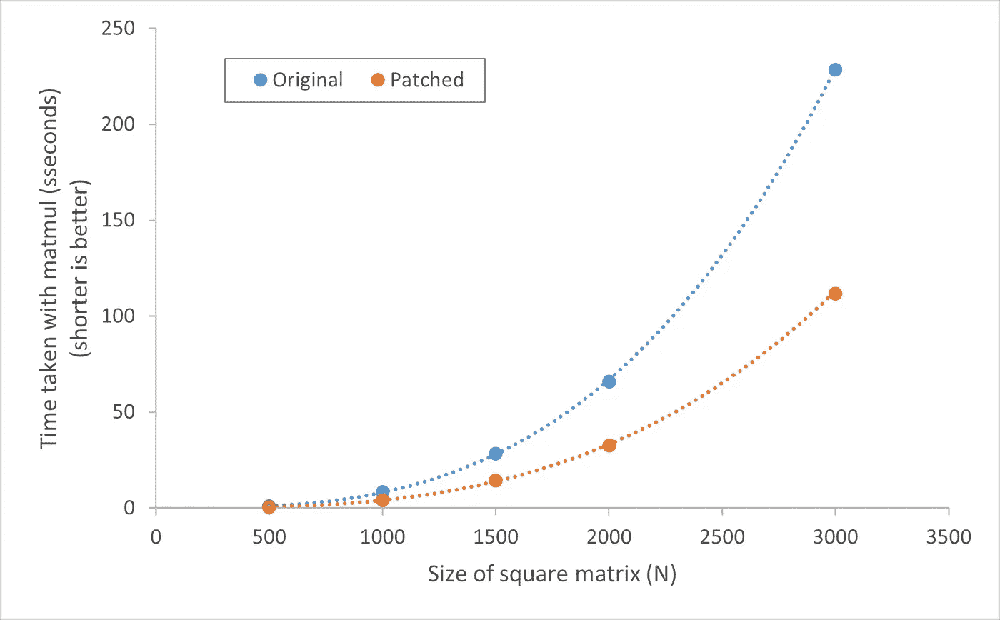
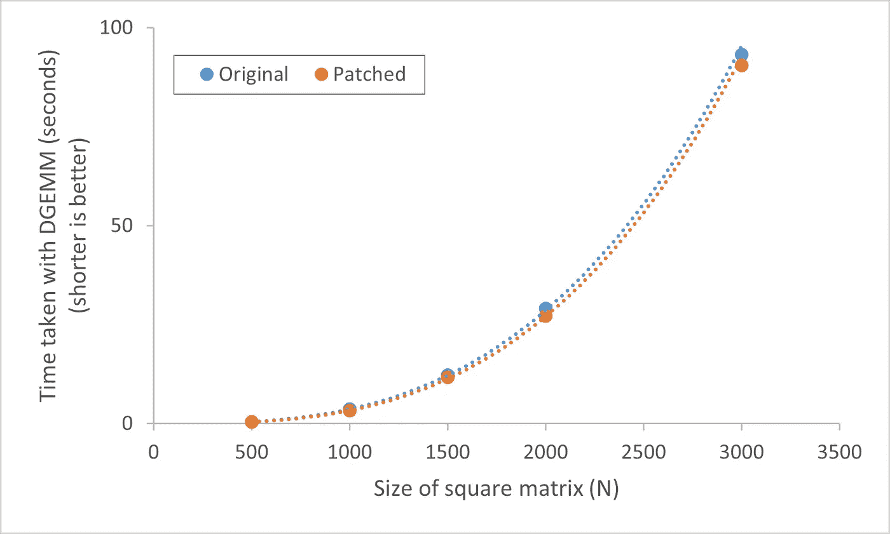
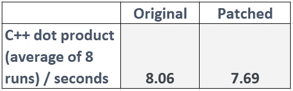
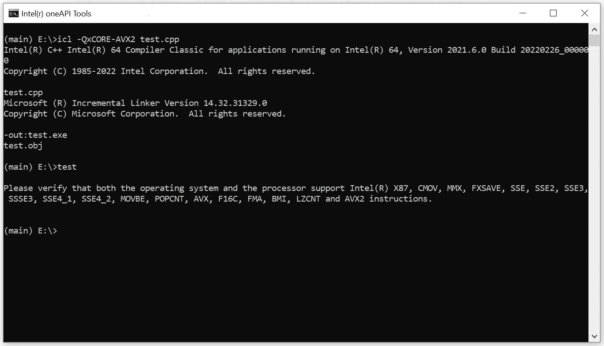
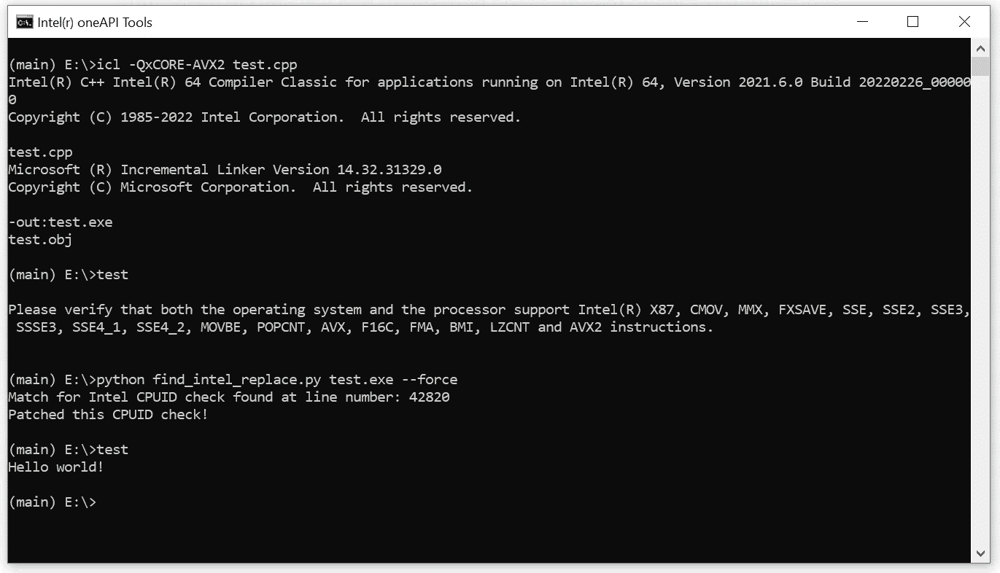

# 修复英特尔编译器的不公平 CPU 调度程序(第二部分)

> 原文：<https://medium.com/codex/fixing-intel-compilers-unfair-cpu-dispatcher-part-2-2-1920bf17315c?source=collection_archive---------4----------------------->

## 测试补丁对性能的影响

在这篇文章的[前一部分](https://shoubhikrmaiti.medium.com/fixing-intel-compilers-unfair-cpu-dispatcher-part-1-2-4a4a367c8919)中，我提到了一种修补用英特尔编译器编译或链接到英特尔 MKL 的二进制文件的方法，以规避不公平的 CPU 调度程序。补丁应该允许使用 SIMD 指令和 AMD 处理器的其他优化。

在这篇文章中，我将运行基准测试，以了解补丁带来的性能提升。请注意，使用 SIMD 指令只会提高数值应用程序的性能。如果有一个软件不做繁重的计算，那么打补丁就没有好处。还要注意，二进制补丁总是很危险的，而且总是有可能通过打补丁来破坏软件。

在所有基准测试中，我使用了英特尔 C/C++编译器、英特尔 Fortran 编译器和英特尔 MKL 2021 . 6 . 0 版。编译后的可执行文件在 Windows 系统的 AMD 锐龙 7 5800H 处理器上运行。

## **基准 Fortran 的矩阵乘法**

Fortran 提供了一个内部函数`matmul()`，允许将两个矩阵相乘。对于这个基准测试，我使用了一个 Fortran 代码，它将两个不同大小的方阵相乘，用随机实数填充(`REAL*8`，相当于 x64 上的 C `double`)矩阵乘法重复 100 次，并测量了总运行时间。

请注意，在这种情况下，我没有使用任何来自英特尔 MKL 的 BLAS 例程。我正在使用固有函数来测试编译器对于繁重的数值计算可以使用多少矢量化。源代码可以在[这里](https://github.com/shoubhikraj/intel-cpu-patch/blob/main/benchmarks/matmul-noblas-test.f90)找到。我用`QaxCORE-AVX2`编译的，因为我的笔记本电脑支持 AVX2。请注意，Windows 上的默认代码路径是 SSE2。

用 Fortran 语言实现矩阵乘法的结果

软件的原始版本和修补版本之间的结果非常不同。在原始版本(即无补丁版本)中，矩阵乘法使用 SSE2 指令。当 CPU 调度程序被修补为不歧视 AMD 处理器时，它运行更快的 AVX2 代码路径。

SSE2 `XMM`寄存器的长度为 128 位，因此它们可以在一条指令中处理 2 个`REAL*8`数字(每个 64 位)。而 AVX2 `YMM`寄存器是 256 位长，所以它们可以处理 4 个`REAL*8`数字。因此 AVX2 的效率应该大约是 SSE2 的两倍，这就是图中的结果。SSE2 和 AVX2 之间的差异对于大型矩阵(例如 3000x3000)尤为重要。在 Linux 上，您会看到更大的差异，因为编译器中的默认代码路径是 x86，即没有 SIMD 指令。

## 基准#2:采用 MKL 的矩阵乘法

MKL 提供 BLAS 例程，其中 DGEMM 是非常常用的一个。DGEMM 也可以用来乘两个矩阵。在这个基准测试中，我使用了一个 Fortran 代码，它将两个填充了随机数的固定大小的方阵相乘。矩阵乘法重复 100 次，并测量运行时间。

这一次，我使用了英特尔 MKL 来查看 MKL 是否使用 dispatcher 在 AMD 上运行慢速代码路径。英特尔[声称](https://www.intel.com/content/www/us/en/developer/articles/release-notes/intel-math-kernel-library-release-notes-and-new-features.html)已经解决了 2020.3 版 MKL 中非英特尔处理器的性能问题。源代码可以在[这里](https://github.com/shoubhikraj/intel-cpu-patch/blob/main/benchmarks/Fortran-dgemm.f90)找到。

在这种情况下，软件的修补版本和未修补版本之间似乎没有太大区别。修补 CPUID 检查器似乎确实在很小程度上提高了性能。因此，看起来英特尔确实修复了 MKL，使其能够为非英特尔处理器使用正确的矢量指令。

另一件需要注意的事情是，英特尔 MKL 的 DGEMM 例程比 Fortran 固有的`matmul()`要快。比如 3000x3000 矩阵上的 DGEMM 比带 AVX2 的`matmul()`快 25%左右。数学库的开发者通常会在很大程度上优化他们的代码，以尽可能提高效率。

## 基准#3: C++点积

[两个数组之间的点积](https://en.wikipedia.org/wiki/Dot_product)是一种将数组中相应的元素相乘，然后将结果相加的运算。我用一个 C++代码来计算两个数组的点积。由于数字的乘法和加法，FMA 指令在这里非常有用。

在这种情况下，我用`-arch:pentium -QaxCORE-AVX2`编译。我已经将基线代码路径设置为 x86(旧的奔腾处理器只使用 x86)，这样默认代码路径和 SIMD 矢量化代码路径之间的差异就更加明显了。请注意，这种情况下要完成的计算量非常小(例如，与数组乘法相比)，因此 FMA 矢量化的速度差异很小(以秒为单位)。源代码可以在[这里](https://github.com/shoubhikraj/intel-cpu-patch/tree/main/benchmarks/cpp-array-dot)找到。

阵列点积测试的结果

如您所见，FMA 指令确实提供了一点点提升。但是，正如我上面提到的，所做的计算量不足以显示时间上的巨大差异。在真正的科学应用中，会有繁重的计算，SIMD 会变得很重要。(顺便说一句，现代科学软件越来越多地使用 GPU 加速，它也使用 SIMD，只是 SIMD“寄存器”在 GPU 中，而不是在 CPU 中。并且“核心”的数量和“寄存器”的大小也比 CPU 中可用的要大得多。)

## 修补的其他用途

允许在 AMD 和其他处理器上使用英特尔编译器的自动 CPU 调度是打补丁的好处之一。另一种可能需要打补丁的情况是软件编译时带有`-Qx`标志。如果使用这个标志，那么产生的二进制文件甚至不能在非 Intel 系统上运行。

您会看到如下消息:

不幸的是，如果您以这种方式编译了二进制文件，修补 CPUID 检查器也将删除此消息并允许您的代码运行。

如您所见，打补丁消除了错误信息，软件运行良好。(注意，如果您的 CPU 不能运行 AVX2，并且您针对 AVX2 进行编译，您仍然会看到一条错误消息。)

# 结论

因此，所有这些的结果是，您可以非常轻松地利用 AMD 和其他非英特尔处理器上的英特尔 C++/Fortran 编译器自动向量化和多任务分派。您所需要的只是 python 安装。

这种方法的一个问题是，您仍然需要针对不同的非 Intel CPUs 进行不同的修改。“修复”并没有禁用英特尔的 CPU 调度，它只是改变了正在比较的 CPUID 供应商字符串。所以，如果你给程序打补丁，用`AuthenticAMD`代替`GenuineIntel`，那么程序现在只能在 AMD 处理器上正确运行。调度员将不会通过 nano 或其他东西公平地工作。

此外，以这种方式修补二进制文件存在风险。一些软件确实有合法的理由检查 CPUID 供应商字符串，例如为了正确地管理线程。(很多游戏都是这样做的，因为不同的 CPU 需要不同的线程调度才能发挥最佳效果。)正如我在上面所展示的，MKL 在没有任何补丁的 AMD 处理器上运行良好，所以补丁是不必要的。

当然，英特尔将来可能会混淆这种 CPU 检查代码，以防止打补丁。英特尔还可能在未来完全取消 CPU 供应商检查，只使用适用于所有品牌 CPU 的公平调度程序，但这似乎不太可能，因为英特尔希望在自己的 CPU 上提供最佳性能。

感谢阅读！请随时在回复中留下评论或问题。

python 脚本和基准数据可以在这里找到:[https://github.com/shoubhikraj/intel-cpu-patch](https://github.com/shoubhikraj/intel-cpu-patch)