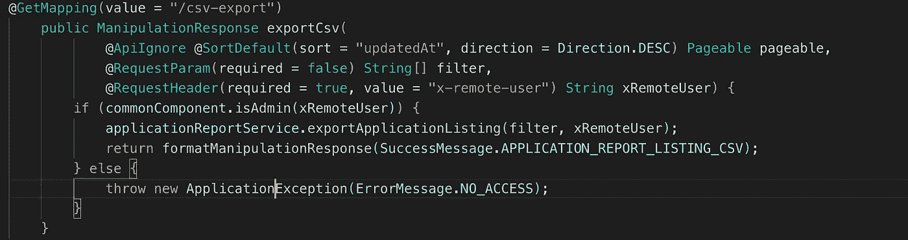
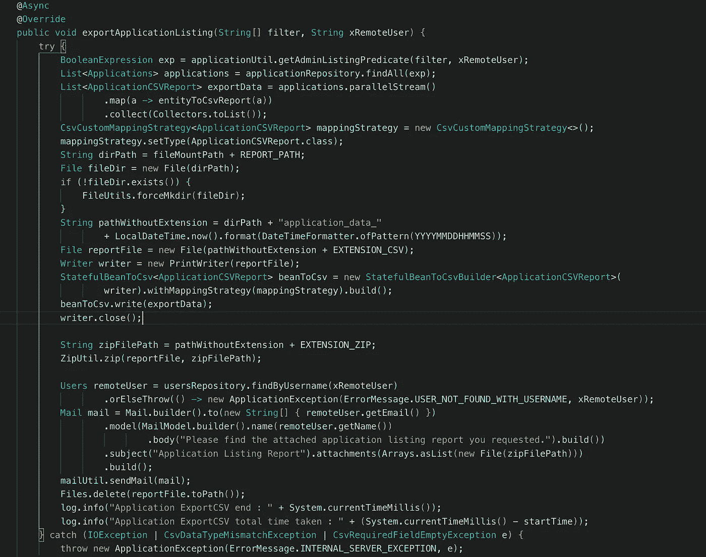
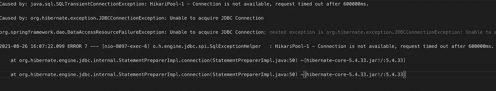
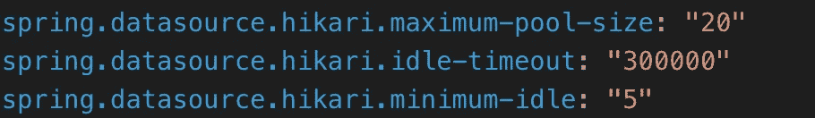
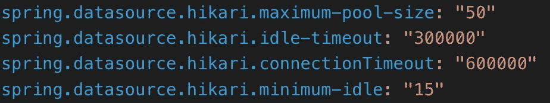
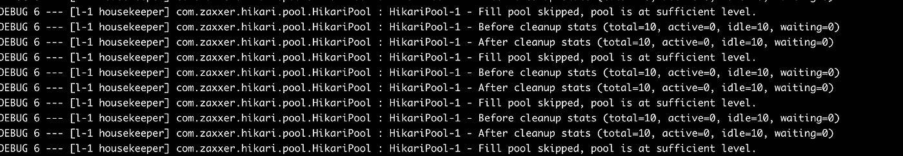
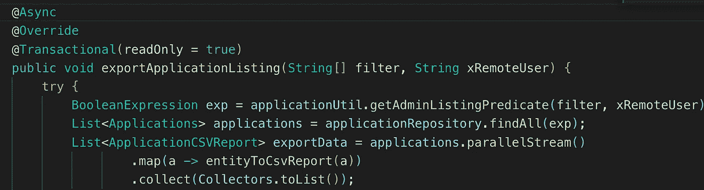

# 在 Spring Boot 修复与@Async 的生产问题

> 原文：<https://medium.com/codex/fixing-production-issue-with-async-in-spring-boot-ab4c148561d1?source=collection_archive---------1----------------------->

克林特·帕特森在 [Unsplash](https://unsplash.com?utm_source=medium&utm_medium=referral) 上拍摄的照片

我在生产中遇到了这个反复出现的问题，我想和大家分享一下。

## 前提

我们有一个 web 应用程序，其中我们为管理员提供了生成报告的功能。通过 UI 界面，他们可以对实体应用各种过滤器，并单击 Export CSV。点击该按钮后，会出现一个弹出窗口，显示“*您的报告正在处理中，将很快发送到您的邮箱*”。

实际上，我们有一个控制器，它接受请求并将其传递给包装在异步块下的服务。因为它是在后台异步处理的，所以控制器会立即返回响应。处理完成后，它调用通知服务并发送附件中包含报告的邮件。

**控制器**

休息控制器

**服务**

服务级别

# 问题

这个控制器不是我们的应用程序中最常用的 REST 控制器之一。它很少被使用，比如每个季度 2-3 次。我们在 2020 年部署了这项服务，那一年没有报告任何问题。但是在第二年(2021 年)，管理员开始抱怨他们没有收到邮件报告。奇怪？它运行了一年，从那以后没有代码部署，那么发生了什么呢？我检查了日志，发现 HikariCP 无法获得新的连接，并且在等待一定时间后超时。

**错误日志**

2021 年的错误日志

**HikariCP 配置**

HikariCP 配置

# 即时修复

在查看了 StackOverflow 上的多个资源并查看了 [HikariCP 官方文档](https://github.com/brettwooldridge/HikariCP#frequently-used)之后，我增加了最大池大小(*该值将确定到数据库后端的实际连接的最大数量*和连接超时(*该属性控制客户端等待池中连接的最大毫秒数*)并重新启动了 pods。瞧，问题解决了。一年内不会再有管理员投诉。

**新的 HikariCP 配置**

新 HikariCP 配置

# 问题重复出现

现在是 2022 年 9 月，管理员通知我没有生成报告。这就是我试图深入调试问题的时候。

# 调试问题

让我们打开 HikariCP 调试日志，看看到底发生了什么。

> logging . level . com . zax xer . hikari:TRACE
> logging . level . com . zax xer . hikari . hikari config:调试

这将开始发出如下所示的日志:

HikariCP 调试日志

当我点击控制器一次，光 CP 打开一个数据库连接，我尝试点击控制器多次，看到活动连接数不断增加。持续点击直到**连接不可用，超时问题**发生。HikariCP 已达到最大池大小，无法创建新连接。

> *清理后统计(总数=50，活跃=50，空闲=10，等待=0)*

我期望在一个异步线程完成后，另一个异步线程会重用现有的打开的连接进行处理，但这并没有发生。 ***每个异步线程都保持 DB 连接活动，并且不将其返回 HikariCP 池以供重用*** 。因此，HikariCP 必须始终为每个异步线程打开一个新的连接，直到达到最大池大小限制，并开始抱怨它无法打开新的连接，并超时有效地阻止任何新的报告请求。

太棒了，我找到问题了。那怎么修呢？

在函数中添加了@Transactional

***添加了事务块(只读，因为函数中没有插入/更新)。事务性后台确保一旦处理完成，DB 连接就被线程释放。***

> 如果你喜欢这篇文章，请花点时间为我鼓掌👏(可以多次鼓掌)，关注我，甚至请我喝咖啡[https://www.buymeacoffee.com/abhiandy](https://www.buymeacoffee.com/abhiandy)