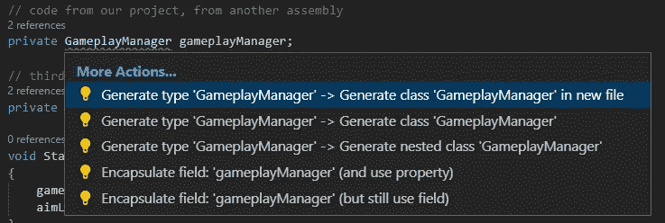

# 修复 Unity 项目中缺少程序集引用的错误

> 原文：<https://medium.com/codex/fixing-the-missing-assembly-reference-error-in-unity-projects-a1d2cee36a3e?source=collection_archive---------0----------------------->

当处理使用多个程序集或使用其他第三方包的代码时，您可能会遇到如下情况:

> 找不到类型或命名空间名称“ClassName ”(是否缺少 using 指令或程序集引用？)

您尝试使用 IDE 的 intellisense 来实现 using import，但是您得到的只是关于如何生成类文件的选项，即使导入的脚本就在那里。脚本已经导入了，那么是什么导致了这个问题呢？

> 要在一个干净的小项目中试验汇编引用，请参见 Github 上的[示例。](https://github.com/agostonr/Unity-Assembly-Reference-Example)

# 在 Unity 中使用程序集

程序集是为协同工作而构建的类型和资源的集合，并形成功能的逻辑单元。默认情况下，Unity 将你的脚本编译成一个预定义的汇编，*Assembly-CSharp.dll*，但是对于更大的项目，这种单一的方法可能会降低迭代代码变更的编译时间。通过定义程序集，您可以有效地建立模块化和可重用性。

> 在 [Unity 手册](https://docs.unity3d.com/Manual/ScriptCompilationAssemblyDefinitionFiles.html)或[中阅读更多关于组件的信息。NET docs](https://docs.microsoft.com/en-us/dotnet/standard/assembly/) 。

因此，当导入另一个包时，您正在使用它们的程序集，并且它必须在您的代码的程序集中被引用，您才能实际使用它。

# 在代码中引用另一个程序集

为了简单起见，我给你的示例项目很小，但它足以解释这个概念。

假设我们有一个`GameplayManager`控制游戏的整体状态，包括启用和禁用控件。然后我们有我们的球员的移动控制`PlayerController`和`PlayerWeapons`。为了给出一个使用第三方 Unity 包的例子，我还引用了一个导入的资产存储项目，在这个例子中是我的 [Aim Assist](https://assetstore.unity.com/packages/tools/game-toolkits/aim-assist-pro-226597) 包。

项目目录树

你可能已经熟悉了`.cs`文件。装配定义文件是`.asmdef`文件。请注意它们在项目目录中的位置。同一个级别的代码文件，或者程序集定义文件子目录下的代码文件，都属于该程序集定义。

`Gameplay`、`Player`和第三方代码是独立的组件，它们不会自动相互了解。

摘自 GameplayManager

摘自 PlayerController

摘自 PlayerWeapons

`PlayerController`和`PlayerWeapons`都依靠`GameplayManager`来告诉它控件是否被启用。`PlayerWeapons`也使用第三方包。然而，当你试图编译时，即使你添加了必要的`using`语句，你也会得到丢失的引用错误。同样令人担忧的是，你的 IDE 的智能感知并没有提示给一个类一个建议。

缺少引用，但没有 using 语句建议

# 问题的解决方案

如果你知道什么是程序集，以及程序集如何适应一个项目，这个解决方案实际上非常简单。

在 Unity 编辑器中，为你的播放器找到`.asmdef`文件:

播放器组件定义文件

打开您的检查器并查看选项:

程序集定义设置

标记字段“程序集定义引用”不包含对任何其他程序集的引用。因此，这些程序集中的所有其他代码文件对于该程序集都是不可见的。使用`GUID` s 来识别组件是 Unity 推荐的方法。

包括程序集定义

点击小`+`图标两次，创建两个参考槽。然后，我们通过单击参考槽右侧的小旋钮来选择可用的装配定义文件:

选择程序集引用文件

然后在最后，点击应用。这包括对您的`.asmdef`文件的引用:

修改后的演示。Player.asmdef 文件

现在回到您的 ide 中，调出您的导入建议，您应该会看到弹出的`using`语句:

工作进口建议

现在你应该有一个漂亮干净的 Unity 控制台窗口，显示没有装配参考错误，你可以开始了。

感谢您阅读我的文章，我希望它能帮助您解决项目的汇编引用问题。如果你对我在做什么感兴趣，请查看我的社交或资产商店。编码快乐！