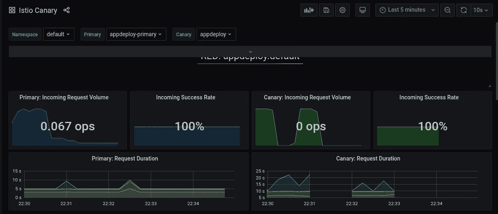
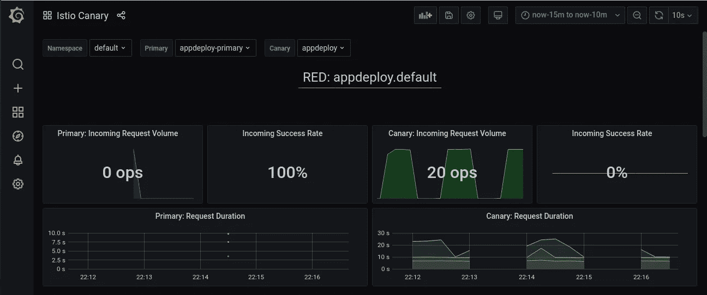

# Flagger —金丝雀部署教程

> 原文：<https://medium.com/codex/flagger-canary-deployments-tutorial-f6575fbb348a?source=collection_archive---------1----------------------->


照片由 [Unsplash](https://unsplash.com?utm_source=medium&utm_medium=referral) 上的 [Fotis Fotopoulos](https://unsplash.com/@ffstop?utm_source=medium&utm_medium=referral) 拍摄

flagger——一个简单易用的渐进式交付工具，可用于推出在云原生平台上运行的新版本应用程序，如 Kubernetes、GKE、EKS 或阿里云。它与 Istio 或 Linkerd 或 Gloo 或 Contour 等服务网格工具相集成，以了解应用指标并逐步执行推广。

金丝雀是一种用于煤矿开采的鸟，用于检测有毒气体并向矿工发出警报，类似地，金丝雀部署被用作从一个版本到另一个版本推出基于微服务的应用的策略。

Flagger 是一个 Kubernetes 操作符，开发它是为了帮助金丝雀部署应用程序。它有助于将基于微服务的应用迁移到基于云的环境中的新版本，或者简单地说，它有助于将应用从一个映像供应到新的 docker 映像。为此，它会在一定时间内持续检查已定义的服务级别协议(SLA ),并在满足这些协议的情况下逐步推出，或者在出现故障的情况下回滚。

Flagger 运行的内部机制是，每当应用程序计划更改为新版本时，它就开始读取由服务网格工具定义的指标值，并根据 SLA 采取行动，将流量路由到新版本，或将部署标记为失败，并将旧版本的应用程序保留在 echo-system 中。

Flagger 在用户希望集成到的服务网格名称空间中作为部署种类运行，可以是 Istio、Linkerd、Gloo 等。，它附带了一个名为“金丝雀”的 CRD 对象，帮助用户指定不同的参数，如应用程序的名称，SLA 定义。它还有一个 webhook 选项，可用于发送通知或用于在首次展示时运行一些负载测试流量。它还定义了不同的参数，这些参数指定了在部署应用程序之前它必须监控 SLA 的时间。此外，Flagger 可以安装 Grafana，以便在铺开时监控交通流量。

Flagger 支持不同类型的部署策略—

*   金丝雀测试——慢慢将流量转移到新版本
*   A/B 测试—基于 HTTP 头或 cookie 数据路由到不同的版本
*   蓝/绿流量—在没有服务网格的情况下运行—它只需与读取集群中指标的 Prometheus 操作器集成
*   蓝/绿镜像—可用于将流量路由到应用程序的两个版本

在这篇博客中，我们将探索一个简单的 python flask 应用程序的基于 canary 的部署，以了解 flagger 是如何工作的。我们将在启用了 Istio 的 Kubernetes 集群上安装 flagger。

先决条件

*   Ubuntu 20.04 操作系统
*   Docker 20.10 版本
*   Kubernetes 群集—此处使用带有印花布 CNI 的单节点— 1.21.1 版本
*   舵柄二进制——参见此处的[安装](https://helm.sh/docs/intro/install/)

# 安装 Istio 和 Flagger

我们现在将使用`istioctl` CLI 安装 Istio。使用以下命令下载并安装二进制文件。稍后，我们将使用它在集群上启动 Istio 服务网格。我们这里用的是 Istio 的 1.10.0 版本。

```
# To download istioctl$ curl -L https://istio.io/downloadIstio | sh -
$ cd istio-1.10.0
$ export PATH=$PWD/bin:$PATH # To install Istio using istioctl on the kubernetes cluster$ istioctl install --set profile=demo -y
✔ Istio core installed                                                                                                                        
✔ Istiod installed                                                                                                                            
✔ Ingress gateways installed                                                                                                                  
✔ Egress gateways installed                                                                                                                   
✔ Installation complete                                                                                                                       Thank you for installing Istio 1.10\.  Please take a few minutes to tell us about your install/upgrade experience!  [https://forms.gle/KjkrDnMPByq7akrYA](https://forms.gle/KjkrDnMPByq7akrYA) # Install prometheus
$ kubectl apply -f [https://raw.githubusercontent.com/istio/istio/release-1.10/samples/addons/prometheus.yaml](https://raw.githubusercontent.com/istio/istio/release-1.10/samples/addons/prometheus.yaml)# Check if all the pods are running in istio-system namespace are in running state in the kubernetes cluster$ kubectl -n istio-system get pods
NAME                                    READY   STATUS    RESTARTS   AGE
istio-egressgateway-55d4df6c6b-vn2gx    1/1     Running   0          2m58s
istio-ingressgateway-69dc4765b4-4p2vj   1/1     Running   0          2m58s
istiod-798c47d594-7nldj                 1/1     Running   0          6m34s
prometheus-8958b965-z4bkc               2/2     Running   0          5m
```

一旦我们有了运行 Istio 的 Kubernetes 集群，我们就可以使用 helm 来安装 Flagger。

```
# Adding flagger repo to helm and installing flagger CRD$ helm repo add flagger [https://flagger.app](https://flagger.app)
$ kubectl apply -f [https://raw.githubusercontent.com/fluxcd/flagger/main/artifacts/flagger/crd.yaml](https://raw.githubusercontent.com/fluxcd/flagger/main/artifacts/flagger/crd.yaml) # Installing flagger in istio's namespace$ helm upgrade -i flagger flagger/flagger --namespace=istio-system --set crd.create=false --set meshProvider=istio --set metricsServer=http://prometheus:9090 # Enabling grafana$ helm upgrade -i flagger-grafana flagger/grafana --namespace=istio-system --set url=http://prometheus.istio-system:9090 --set user=admin --set password=change-me # Enable port-forwarding to access grafana on localhost:3000$ kubectl -n istio-system port-forward svc/flagger-grafana 3000:80 # Check pods in istio-system namespace$ kubectl -n istio-system get podsNAME                                    READY   STATUS    RESTARTS   AGE
flagger-5c49576977-fvtgl                1/1     Running   0          3m28s
flagger-grafana-77b8c8df65-rszqm        1/1     Running   0          75s
istio-egressgateway-55d4df6c6b-vn2gx    1/1     Running   0          21m
istio-ingressgateway-69dc4765b4-4p2vj   1/1     Running   0          21m
istiod-798c47d594-7nldj                 1/1     Running   0          24m
prometheus-8958b965-z4bkc               2/2     Running   0          26m
```

# 部署 Python Flask 应用程序

[这里的](https://github.com/SirishaGopigiri/python-flask-app)是 python flask 应用程序的一个例子，克隆存储库以在 Kubernetes 集群中部署应用程序。

```
# Clone python flask app$ git clone [https://github.com/SirishaGopigiri/python-flask-app.git](https://github.com/SirishaGopigiri/python-flask-app.git)$ cd python-flask-app
```

在默认名称空间中启用 Istio sidecar，然后使用默认名称空间中的 deployment.yaml 文件部署应用程序。或者，如果需要，根据集群规范更改 YAML 文件。

请注意:本博客中使用的所有 YAML 文件都可以在 github repo 中获得

```
# Enable side car injection from istio in default namespace$ kubectl label namespace default istio-injection=enabled # Deploying the application in kubernetes$ kubectl apply -f deployment.yaml
deployment.apps/appdeploy created
service/appdeploy created# Check pods and service in default namespace$ kubectl get pods
NAME                         READY   STATUS    RESTARTS   AGE
appdeploy-7dcf9786cc-b2mjx   2/2     Running   0          2m17s# Check service status in default namespace$ kubectl get svc
NAME         TYPE        CLUSTER-IP       EXTERNAL-IP   PORT(S)    AGE
appdeploy    ClusterIP   10.102.160.160   <none>        5000/TCP   2m28s
kubernetes   ClusterIP   10.96.0.1        <none>        443/TCP    5h47m# Test if service is accessible$ kubectl run -i -t nginx --rm=true --image=nginx -- bash# Once in the container execute the below commandsroot@nginx:/# curl -X GET [http://appdeploy:5000](http://appdeploy:5000)
hello world!
root@nginx:/# curl -X GET [http://appdeploy:5000/return_version](http://appdeploy:5000/return_version)
Running test app on version 1.0 !!!
root@nginx:/# exit
```

金丝雀将使用 Istio 的入口网关来访问服务。使用以下命令将 istio-Ingres gateway 修补到节点端口。

```
# patch istio-ingressgateway to nodeport$ kubectl patch svc -n istio-system istio-ingressgateway --type='json' -p '[{"op":"replace","path":"/spec/type","value":"NodePort"}]'
```

现在让我们创建一个虚拟服务和网关，从 istio 的网关服务访问应用程序。使用下面的 YAML 文件。

```
# gateway.yamlapiVersion: networking.istio.io/v1alpha3
kind: Gateway
metadata:
  name: appdeploy-gateway
spec:
  selector:
    istio: ingressgateway # use Istio default gateway implementation
  servers:
  - port:
      number: 80
      name: http
      protocol: HTTP
    hosts:
    - "*"# virtualservice.yaml
apiVersion: networking.istio.io/v1alpha3
kind: VirtualService
metadata:
  name: appdeploy
spec:
  hosts:
  - "*"
  gateways:
  - appdeploy-gateway
  http:
  - match:
    - uri:
        prefix: /
    route:
    - destination:
        port:
          number: 5000
        host: appdeploy# Create the resources$ kubectl apply -f gateway.yaml
gateway.networking.istio.io/appdeploy-gateway created$ kubectl apply -f virtualservice.yaml
virtualservice.networking.istio.io/appdeploy created
```

创建资源后，提取 istio 入口网关服务的节点端口，并尝试访问应用程序。

```
# Node port for ingress-gateway$ export INGRESS_PORT=$(kubectl -n istio-system get service istio-ingressgateway -o jsonpath='{.spec.ports[?(@.name=="http2")].nodePort}')# Test application
$ curl -X GET "[http://127.0.0.1:$INGRESS_PORT/](http://127.0.0.1:$INGRESS_PORT/)"
hello world!
$ curl -X GET "[http://127.0.0.1:$INGRESS_PORT/return_version](http://127.0.0.1:$INGRESS_PORT/return_version)"
Running test app on version 1.0 !!!
```

## 为 python 应用程序创建 Canary CR

一旦我们运行了 python flask-app 部署，现在让我们用金丝雀 CRD 来配置它。使用下面的 YAML 文件。

```
# Copy the below yaml file and make necessary changes according to your deployment### canary.yamlapiVersion: flagger.app/v1beta1
kind: Canary
metadata:
  name: appdeploy
spec:
  # deployment reference
  targetRef:
    apiVersion: apps/v1
    kind: Deployment
    name: appdeploy # deployment name
  service:
    # service port number
    port: 5000
    gateways:
    - appdeploy-gateway
    hosts:
    - "*"
  analysis:
    # schedule interval (default 60s)
    interval: 1m
    # max number of failed metric checks before rollback
    threshold: 5
    # max traffic percentage routed to canary percentage (0-100)
    maxWeight: 50
    # canary increment step percentage (0-100)
    stepWeight: 10
    metrics:
    - name: request-success-rate
      # minimum req success rate (non 5xx responses)
      thresholdRange:
        min: 99
      interval: 1m
    - name: request-duration
      # maximum req duration P99
      thresholdRange:
        max: 500
      interval: 30s
    # testing (optional)
    webhooks:
      - name: acceptance-test
        type: pre-rollout
        url: [http://flagger-loadtester.default/](http://flagger-loadtester.default/)
        timeout: 30s
        metadata:
          type: bash
          cmd: "curl -sd 'test' [http://appdeploy-canary:5000/return_version](http://appdeploy-canary:5000/return_version)"
      - name: load-test
        url: [http://flagger-loadtester.default/](http://flagger-loadtester.default/)
        timeout: 5s
        metadata:
          cmd: "hey -z 1m -q 10 -c 2 [http://appdeploy-canary:5000/return_version](http://appdeploy-canary:5000/return_version)"
```

从上面的 YAML 文件中，我们可以看到，我们正在以每 1 分钟 10%的速度逐渐增加流量，一旦达到 50%的权重，我们希望宣布新版本的应用程序符合 SLA，并希望 flagger 进行首次展示。我们还计算每一分钟的 SLA，并以此为基础计算流量增长。当 canary 分析发生时，我们使用来自 flagger 的样本负载测试器来生成负载。用所需的配置创建`canary.yaml`文件。

```
# Before creating canary we need to delete the virtual service, as it will now be managed by the flagger from the above canary.yaml file$ kubectl delete -f virtualservice.yaml
virtualservice.networking.istio.io "appdeploy" deleted# Creating canary.yaml$ kubeclt apply -f canary.yaml
canary.flagger.app/appdeploy created
```

创建后，等待一段时间，让 flagger 读取部署并创建管理金丝雀的资源。它将创建以下资源

*   将当前部署缩减到 0
*   调出新部署`appdeploy-primary`
*   现有 appdeploy 服务将指向主部署。(使用`kubectl get endpoints`检查)
*   创建两个新服务`appdeploy-primary`和`appdeploy-canary`，用于在进行金丝雀分析时路由流量
*   创建一个虚拟服务，以便在进行金丝雀分析时在主服务和金丝雀服务之间分配权重。

```
# Check canary CRD
$ kubectl get canary
NAME        STATUS        WEIGHT   LASTTRANSITIONTIME
appdeploy   Initialized   0        2021-06-13T16:16:35Z# Check pods see the difference in names$ kubectl get pods
NAME                                 READY   STATUS    RESTARTS   AGE
appdeploy-primary-79595548f6-pcq9t   2/2     Running   0          118s# Check service
$ kubectl get svc
NAME                TYPE        CLUSTER-IP       EXTERNAL-IP   PORT(S)    AGE
appdeploy           ClusterIP   10.102.160.160   <none>        5000/TCP   5m12s
appdeploy-canary    ClusterIP   10.100.219.243   <none>        5000/TCP   2m12s
appdeploy-primary   ClusterIP   10.110.17.144    <none>        5000/TCP   2m11s
kubernetes          ClusterIP   10.96.0.1        <none>        443/TCP    5h50m# Check virtual service$ kubectl get vs
NAME        GATEWAYS                HOSTS   AGE
appdeploy   ["appdeploy-gateway"]   ["*"]   92s# Check deployments$ kubectl get deploy
NAME                READY   UP-TO-DATE   AVAILABLE   AGE
appdeploy           0/0     0            0           5m49s
appdeploy-primary   1/1     1            1           2m48s
```

一旦所有资源就绪，我们就使用服务名和 istio 的入口网关测试应用程序。

```
# Test if service is accessible$ kubectl run -i -t nginx --rm=true --image=nginx -- bash# Once in the container execute the below commandsroot@nginx:/# curl -X GET [http://appdeploy:5000](http://appdeploy:5000)
hello world!
root@nginx:/# curl -X GET [http://appdeploy:5000/return_version](http://appdeploy:5000/return_version)
Running test app on version 1.0 !!!
root@nginx:/# exit# Test using ingress-gateway$ curl -X GET "[http://127.0.0.1:$INGRESS_PORT/](http://127.0.0.1:$INGRESS_PORT/)"
hello world!
$ curl -X GET "[http://127.0.0.1:$INGRESS_PORT/return_version](http://127.0.0.1:$INGRESS_PORT/return_version)"
Running test app on version 1.0 !!!
```

我们现在将部署负载测试器，稍后将由 canary 分析使用。

```
# tester.yaml
apiVersion: apps/v1
kind: Deployment
metadata:
  name: flagger-loadtester
  labels:
    app: flagger-loadtester
spec:
  selector:
    matchLabels:
      app: flagger-loadtester
  template:
    metadata:
      labels:
        app: flagger-loadtester
      annotations:
        prometheus.io/scrape: "true"
        prometheus.io/port: "8080"
    spec:
      containers:
        - name: loadtester
          image: ghcr.io/fluxcd/flagger-loadtester:0.18.0
          imagePullPolicy: IfNotPresent
          ports:
            - name: http
              containerPort: 8080
          command:
            - ./loadtester
            - -port=8080
            - -log-level=info
            - -timeout=1h
          livenessProbe:
            exec:
              command:
                - wget
                - --quiet
                - --tries=1
                - --timeout=4
                - --spider
                - [http://localhost:8080/healthz](http://localhost:8080/healthz)
            timeoutSeconds: 5
          readinessProbe:
            exec:
              command:
                - wget
                - --quiet
                - --tries=1
                - --timeout=4
                - --spider
                - [http://localhost:8080/healthz](http://localhost:8080/healthz)
            timeoutSeconds: 5
          resources:
            limits:
              memory: "512Mi"
              cpu: "1000m"
            requests:
              memory: "32Mi"
              cpu: "10m"
          securityContext:
            readOnlyRootFilesystem: true
            runAsUser: 10001
---
apiVersion: v1
kind: Service
metadata:
  name: flagger-loadtester
  labels:
    app: flagger-loadtester
spec:
  type: ClusterIP
  selector:
    app: flagger-loadtester
  ports:
    - name: http
      port: 80
      protocol: TCP
      targetPort: http# Create load tester$ kubectl apply -f tester.yaml
deployment.apps/flagger-loadtester created
service/flagger-loadtester created# Check pods and services
$ kubectl get pods
NAME                                  READY   STATUS    RESTARTS   AGE
appdeploy-primary-79595548f6-pcq9t    2/2     Running   0          3m37s
flagger-loadtester-5b766b7ffc-ksl45   2/2     Running   0          32s$ kubectl get svc
NAME                 TYPE        CLUSTER-IP       EXTERNAL-IP   PORT(S)    AGE
appdeploy            ClusterIP   10.102.160.160   <none>        5000/TCP   6m24s
appdeploy-canary     ClusterIP   10.100.219.243   <none>        5000/TCP   3m24s
appdeploy-primary    ClusterIP   10.110.17.144    <none>        5000/TCP   3m23s
flagger-loadtester   ClusterIP   10.103.190.34    <none>        80/TCP     17s
kubernetes           ClusterIP   10.96.0.1        <none>        443/TCP    5h51m
```

## 滚动更新

现在，我们将 python 应用程序映像更改为新版本，以开始金丝雀分析，并查看 flagger 如何进行滚动更新。

```
# Change the image$ kubectl set image deployment/appdeploy appdeploy=quay.io/sirishagopigiri/python-testapp:v2
deployment.apps/appdeploy image updated
```

更新后，您可以检查部署，我们会发现在不同的部署名称下运行的应用程序的两个版本。我们还可以检查服务端点，以查看哪个 pod 被标记到哪个服务。

```
# Check deployments
$ kubectl get deployments
NAME                 READY   UP-TO-DATE   AVAILABLE   AGE
appdeploy            1/1     1            1           8m38s
appdeploy-primary    1/1     1            1           5m37s
flagger-loadtester   1/1     1            1           2m31s# Check pods
$ kubectl get pods -o wide
NAME                                  READY   STATUS    RESTARTS   AGE     IP               NODE          NOMINATED NODE   READINESS GATES
appdeploy-9477df584-cg6kt             2/2     Running   0          86s     192.192.43.137   harrypotter   <none>           <none>
appdeploy-primary-79595548f6-pcq9t    2/2     Running   0          5m25s   192.192.43.190   harrypotter   <none>           <none>
flagger-loadtester-5b766b7ffc-ksl45   2/2     Running   0          2m20s   192.192.43.191   harrypotter   <none>           <none># Check service endpoints
$ kubectl get ep
NAME                 ENDPOINTS             AGE
appdeploy            192.192.43.190:5000   8m41s
appdeploy-canary     192.192.43.137:5000   5m41s
appdeploy-primary    192.192.43.190:5000   5m41s
flagger-loadtester   192.192.43.191:8080   2m34s
kubernetes           192.168.1.102:6443    5h53m# Check canary CRD
$ kubectl get canary
NAME        STATUS        WEIGHT   LASTTRANSITIONTIME
appdeploy   Progressing   20       2021-06-13T16:21:33Z
```

最后，我们可以使用 curl 命令来查看服务连续性是否得到维护。

```
# Testing using nginx
$ kubectl run -i -t nginx --rm=true --image=nginx -- bash# Once in the container execute the below commandsroot@nginx:/# curl -X GET [http://appdeploy:5000](http://appdeploy:5000)
hello world!
root@nginx:/# curl -X GET [http://appdeploy:5000/return_version](http://appdeploy:5000/return_version)
Running test app on version 1.0 !!!
root@nginx:/# curl -X GET [http://appdeploy-primary:5000/return_version](http://appdeploy-primary:5000/return_version)
Running test app on version 1.0 !!!
root@nginx:/# curl -X GET [http://appdeploy-canary:5000/return_version](http://appdeploy-canary:5000/return_version)
Running test app on version 2.0 !!!# Testing using ingress-gateway
$ curl -X GET "[http://127.0.0.1:$INGRESS_PORT/](http://127.0.0.1:$INGRESS_PORT/)"
hello world!
$ curl -X GET "[http://127.0.0.1:$INGRESS_PORT/return_version](http://127.0.0.1:$INGRESS_PORT/return_version)"
Running test app on version 1.0 !!!
$ curl -X GET "[http://127.0.0.1:$INGRESS_PORT/return_version](http://127.0.0.1:$INGRESS_PORT/return_version)"
Running test app on version 2.0 !!!
$ curl -X GET "[http://127.0.0.1:$INGRESS_PORT/return_version](http://127.0.0.1:$INGRESS_PORT/return_version)"
Running test app on version 1.0 !!!
$ curl -X GET "[http://127.0.0.1:$INGRESS_PORT/return_version](http://127.0.0.1:$INGRESS_PORT/return_version)"
Running test app on version 1.0 !!!
```

我们可以注意到，只有当我们显式调用`appdeploy-canary`服务时，请求才会被路由到新版本。

由于对`appdeploy`服务的 curl 请求仍然只返回版本 v1，因此应用程序的服务连续性得以保持。

但是对于入口控制器，流量分布发生在两个版本之间(4 个请求中的 1 个被路由到 v2)，因为我们将滚动更新策略指定为步长权重。

请注意:探索 A/B 测试策略，以停止在入口处分发流量，并根据报头处理请求。

检查负载测试器和 flagger 日志以获得更多信息或金丝雀 CRD。

```
# Check logs
$ kubectl logs <loadtester pod>
$ kubectl -n istio-system logs <flagger-pod># Check canary CRD
$ kubectl get canary
NAME        STATUS        WEIGHT   LASTTRANSITIONTIME
appdeploy   Progressing   30       2021-06-13T16:22:32Z
```

下面是一些来自 flagger 的日志

```
{"level":"info","ts":"2021-06-13T16:16:35.835Z","caller":"controller/events.go:33","msg":"Initialization done! appdeploy.default","canary":"appdeploy.default"}
{"level":"info","ts":"2021-06-13T16:19:32.970Z","caller":"controller/events.go:33","msg":"New revision detected! Scaling up appdeploy.default","canary":"appdeploy.default"}
{"level":"info","ts":"2021-06-13T16:20:33.034Z","caller":"controller/events.go:33","msg":"Starting canary analysis for appdeploy.default","canary":"appdeploy.default"}
{"level":"info","ts":"2021-06-13T16:20:33.227Z","caller":"controller/events.go:33","msg":"Pre-rollout check acceptance-test passed","canary":"appdeploy.default"}
{"level":"info","ts":"2021-06-13T16:20:33.561Z","caller":"controller/events.go:33","msg":"Advance appdeploy.default canary weight 10","canary":"appdeploy.default"}
{"level":"info","ts":"2021-06-13T16:21:33.439Z","caller":"controller/events.go:33","msg":"Advance appdeploy.default canary weight 20","canary":"appdeploy.default"}
{"level":"info","ts":"2021-06-13T16:22:33.191Z","caller":"controller/events.go:33","msg":"Advance appdeploy.default canary weight 30","canary":"appdeploy.default"}
{"level":"info","ts":"2021-06-13T16:23:33.462Z","caller":"controller/events.go:33","msg":"Advance appdeploy.default canary weight 40","canary":"appdeploy.default"}
{"level":"info","ts":"2021-06-13T16:24:33.278Z","caller":"controller/events.go:33","msg":"Advance appdeploy.default canary weight 50","canary":"appdeploy.default"}
{"level":"info","ts":"2021-06-13T16:25:33.601Z","caller":"controller/events.go:33","msg":"Copying appdeploy.default template spec to appdeploy-primary.default","canary":"appdeploy.default"}
{"level":"info","ts":"2021-06-13T16:26:33.003Z","caller":"controller/events.go:45","msg":"appdeploy-primary.default not ready: waiting for rollout to finish: 1 old replicas are pending termination","canary":"appdeploy.default"}
{"level":"info","ts":"2021-06-13T16:27:35.184Z","caller":"controller/events.go:33","msg":"Routing all traffic to primary","canary":"appdeploy.default"}
{"level":"info","ts":"2021-06-13T16:28:43.266Z","caller":"controller/events.go:33","msg":"Promotion completed! Scaling down appdeploy.default","canary":"appdeploy.default"}
```

一旦金丝雀达到 50 重量，滚动更新会自动发生，主 pod 会被 v2 版本替换。

```
# Check canary CRD
$ kubectl get canary
NAME        STATUS      WEIGHT   LASTTRANSITIONTIME
appdeploy   Succeeded   0        2021-06-13T16:28:42Z# Check pods - new pod created
$ kubectl get pods
NAME                                  READY   STATUS    RESTARTS   AGE     IP               NODE          NOMINATED NODE   READINESS GATES
appdeploy-primary-8ddc7bdfd-hwtm4     2/2     Running   0          4m15s   192.192.43.138   harrypotter   <none>           <none>
flagger-loadtester-5b766b7ffc-ksl45   2/2     Running   0          11m     192.192.43.191   harrypotter   <none>           <none># Check deployments
$ kubectl get deploy
NAME                 READY   UP-TO-DATE   AVAILABLE   AGE
appdeploy            0/0     0            0           17m
appdeploy-primary    1/1     1            1           14m
flagger-loadtester   1/1     1            1           11m# Check services
$ kubectl get svc
NAME                 TYPE        CLUSTER-IP       EXTERNAL-IP   PORT(S)    AGE
appdeploy            ClusterIP   10.102.160.160   <none>        5000/TCP   17m
appdeploy-canary     ClusterIP   10.100.219.243   <none>        5000/TCP   14m
appdeploy-primary    ClusterIP   10.110.17.144    <none>        5000/TCP   14m
flagger-loadtester   ClusterIP   10.103.190.34    <none>        80/TCP     11m
kubernetes           ClusterIP   10.96.0.1        <none>        443/TCP    6h2m# Check endpoints
$ kubectl get ep
NAME                 ENDPOINTS             AGE
appdeploy            192.192.43.138:5000   17m
appdeploy-canary     <none>                14m
appdeploy-primary    192.192.43.138:5000   14m
flagger-loadtester   192.192.43.191:8080   11m
kubernetes           192.168.1.102:6443    6h3m# Check service requests$ curl -X GET "[http://127.0.0.1:$INGRESS_PORT/return_version](http://127.0.0.1:$INGRESS_PORT/return_version)"
Running test app on version 2.0 !!!# Check with nginx
$ kubectl run -i -t nginx --rm=true --image=nginx -- bash
# Once in the container execute the below commands
root@nginx:/# curl -X GET [http://appdeploy:5000](http://appdeploy:5000)
hello world!
root@nginx:/# curl -X GET [http://appdeploy:5000/return_version](http://appdeploy:5000/return_version)
Running test app on version 2.0 !!!
```

这表明滚动更新成功完成！！！

有关服务指标和其他详细信息，请查看 Grafana 仪表板，使用 http://localhost:3000 访问



显示主部署和 canary 部署的成功率和请求持续时间

## 回滚场景

我们现在将尝试将应用程序升级到新版本，在新版本中，我们返回的 HTTP 响应代码是 500，而不是 200。在这种情况下，我们试图更新 flagger，但由于请求失败，它将保留以前的版本。

```
# Update image to a new version
$ kubectl set image deployment/appdeploy appdeploy=quay.io/sirishagopigiri/python-testapp:v3
```

继续检查金丝雀 CRD 和日志以获取更多信息。

```
# Check Canary
$ kubectl get canary
NAME        STATUS        WEIGHT   LASTTRANSITIONTIME
appdeploy   Progressing   10       2021-06-13T16:40:33Z# Check pods
$ kubectl get pods -o wide
NAME                                  READY   STATUS    RESTARTS   AGE   IP               NODE          NOMINATED NODE   READINESS GATES
appdeploy-65fff955ff-t65fj            2/2     Running   0          62s   192.192.43.143   harrypotter   <none>           <none>
appdeploy-primary-8ddc7bdfd-hwtm4     2/2     Running   0          15m   192.192.43.138   harrypotter   <none>           <none>
flagger-loadtester-5b766b7ffc-ksl45   2/2     Running   0          21m   192.192.43.191   harrypotter   <none>           <none># Check endpoints
$ kubectl get ep
NAME                 ENDPOINTS             AGE
appdeploy            192.192.43.138:5000   28m
appdeploy-canary     192.192.43.143:5000   25m
appdeploy-primary    192.192.43.138:5000   25m
flagger-loadtester   192.192.43.191:8080   22m
kubernetes           192.168.1.102:6443    6h13m# Check service requests***# Using nginx***
$ kubectl run -i -t nginx --rm=true --image=nginx -- bash
# Once in the container execute the below commands
root@nginx:/# curl -X GET [http://appdeploy:5000](http://appdeploy:5000)
hello world!
root@nginx:/# curl -X GET [http://appdeploy:5000/return_version](http://appdeploy:5000/return_version)
Running test app on version 2.0 !!!
root@nginx:/# curl -X GET [http://appdeploy-primary:5000/return_version](http://appdeploy-primary:5000/return_version)
Running test app on version 2.0 !!!
root@nginx:/# curl -v -X GET [http://appdeploy-canary:5000/return_version](http://appdeploy-primary:5000/return_version)
*   Trying 10.100.219.243...
* TCP_NODELAY set
* Expire in 200 ms for 4 (transfer 0x5610595d8fb0)
* Connected to appdeploy-canary (10.104.13.182) port 5000 (#0)
> GET /return_version HTTP/1.1
> Host: appdeploy-canary:5000
> User-Agent: curl/7.64.0
> Accept: */*
> 
***< HTTP/1.1 500 Internal Server Error***
< content-type: text/html; charset=utf-8
< content-length: 35
< server: envoy
< date: Sun, 13 Jun 2021 15:58:50 GMT
< x-envoy-upstream-service-time: 26
< 
* Connection #0 to host appdeploy-canary left intact
***Running test app on version 3.0 !!!******# Using istio ingress-gateway***
$ curl -X GET "[http://127.0.0.1:$INGRESS_PORT/return_version](http://127.0.0.1:$INGRESS_PORT/return_version)"
Note: Unnecessary use of -X or --request, GET is already inferred.
*   Trying 127.0.0.1:31543...
* TCP_NODELAY set
* Connected to 127.0.0.1 (127.0.0.1) port 31543 (#0)
> GET /return_version HTTP/1.1
> Host: 127.0.0.1:31543
> User-Agent: curl/7.68.0
> Accept: */*
> 
* Mark bundle as not supporting multiuse
***< HTTP/1.1 500 Internal Server Error***
< content-type: text/html; charset=utf-8
< content-length: 35
< server: istio-envoy
< date: Sun, 13 Jun 2021 15:57:37 GMT
< x-envoy-upstream-service-time: 2
< 
* Connection #0 to host 127.0.0.1 left intact
***Running test app on version 3.0 !!!***
```

从上面的服务请求测试中我们可以看到，尽管新版本返回了一个响应，但是 HTTP 响应代码是 500。正因为如此，金丝雀分析失败了，因为我们在金丝雀 CRD(canary.yaml)中提到过成功率是衡量指标之一。
弗拉格日志供参考

```
{"level":"info","ts":"2021-06-13T16:39:32.888Z","caller":"controller/events.go:33","msg":"New revision detected! Scaling up appdeploy.default","canary":"appdeploy.default"}
{"level":"info","ts":"2021-06-13T16:40:33.136Z","caller":"controller/events.go:33","msg":"Starting canary analysis for appdeploy.default","canary":"appdeploy.default"}
{"level":"info","ts":"2021-06-13T16:40:33.203Z","caller":"controller/events.go:33","msg":"Pre-rollout check acceptance-test passed","canary":"appdeploy.default"}
{"level":"info","ts":"2021-06-13T16:40:33.353Z","caller":"controller/events.go:33","msg":"Advance appdeploy.default canary weight 10","canary":"appdeploy.default"}
{"level":"info","ts":"2021-06-13T16:41:33.603Z","caller":"controller/events.go:33","msg":"Advance appdeploy.default canary weight 20","canary":"appdeploy.default"}
{"level":"info","ts":"2021-06-13T16:42:32.944Z","caller":"controller/events.go:45","msg":"Halt appdeploy.default advancement success rate 0.00% < 99%","canary":"appdeploy.default"}
{"level":"info","ts":"2021-06-13T16:43:33.203Z","caller":"controller/events.go:33","msg":"Advance appdeploy.default canary weight 30","canary":"appdeploy.default"}
{"level":"info","ts":"2021-06-13T16:44:32.951Z","caller":"controller/events.go:45","msg":"Halt appdeploy.default advancement success rate 0.00% < 99%","canary":"appdeploy.default"}
{"level":"info","ts":"2021-06-13T16:45:33.084Z","caller":"controller/events.go:33","msg":"Advance appdeploy.default canary weight 40","canary":"appdeploy.default"}
{"level":"info","ts":"2021-06-13T16:46:32.911Z","caller":"controller/events.go:45","msg":"Halt appdeploy.default advancement success rate 0.00% < 99%","canary":"appdeploy.default"}
{"level":"info","ts":"2021-06-13T16:47:33.404Z","caller":"controller/events.go:33","msg":"Advance appdeploy.default canary weight 50","canary":"appdeploy.default"}
{"level":"info","ts":"2021-06-13T16:48:33.273Z","caller":"controller/events.go:45","msg":"Halt appdeploy.default advancement success rate 0.00% < 99%","canary":"appdeploy.default"}
{"level":"info","ts":"2021-06-13T16:49:32.907Z","caller":"controller/events.go:45","msg":"Halt appdeploy.default advancement success rate 0.00% < 99%","canary":"appdeploy.default"}
{"level":"info","ts":"2021-06-13T16:50:32.954Z","caller":"controller/events.go:45","msg":"Rolling back appdeploy.default failed checks threshold reached 5","canary":"appdeploy.default"}
{"level":"info","ts":"2021-06-13T16:50:33.154Z","caller":"controller/events.go:45","msg":"***Canary failed! Scaling down appdeploy.default","canary":"appdeploy.default***"}
```

一旦更新失败，金丝雀 CRD 就会更新为相同的状态。最后，我们还可以使用 curl 检查服务状态，curl 会返回 2.0 版本。

```
# Check Canary Status
$ kubectl get canary
NAME        STATUS   WEIGHT   LASTTRANSITIONTIME
appdeploy   Failed   0        2021-06-13T16:50:33Z# Check service requests
$ curl -X GET "[http://127.0.0.1:$INGRESS_PORT/return_version](http://127.0.0.1:$INGRESS_PORT/return_version)"
Running test app on version 2.0 !!!# Check with nginx
$ kubectl run -i -t nginx --rm=true --image=nginx -- bash
# Once in the container execute the below commands
root@nginx:/# curl -X GET [http://appdeploy:5000](http://appdeploy:5000)
hello world!
root@nginx:/# curl -X GET [http://appdeploy:5000/return_version](http://appdeploy:5000/return_version)
Running test app on version 2.0 !!!
```

检查格拉夫纳的服务成功率



金丝雀部署的成功率为 0%

# 结论

Flagger 是一个 Kubernetes 操作器，当它与 Gitops 集成时，在测试应用程序方面有很大的优势。这有助于开发运维工程师在将其部署到生产环境之前，确保没有集成测试失败。它还提供了渐进式流量路由的优势，以保持服务的连续性。它还具有 A/B 测试策略支持，当应用程序所有者希望不同的版本服务于不同的人群(如在同一个 Kubernetes 集群上工作的开发人员和测试人员)时，这将是一个巨大的增值。

## 参考资料:

1.  [https://docs.flagger.app/](https://docs.flagger.app/)
2.  https://istio.io/latest/
3.  [https://istio . io/latest/docs/setup/getting-started/#下载](https://istio.io/latest/docs/setup/getting-started/#download)
4.  [https://istio.io/latest/docs/ops/integrations/prometheus/](https://istio.io/latest/docs/ops/integrations/prometheus/)
5.  [https://istio . io/latest/docs/tasks/traffic-management/ingress/ingress-control/](https://istio.io/latest/docs/tasks/traffic-management/ingress/ingress-control/)
6.  [https://flask.palletsprojects.com/en/2.0.x/](https://flask.palletsprojects.com/en/2.0.x/)