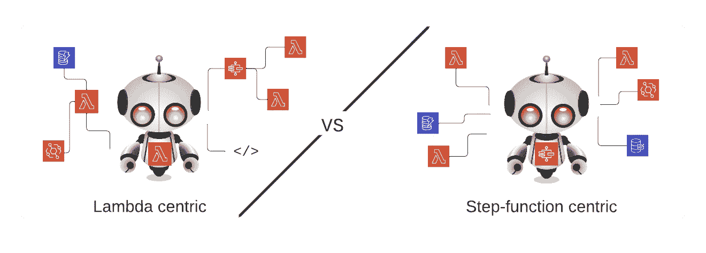
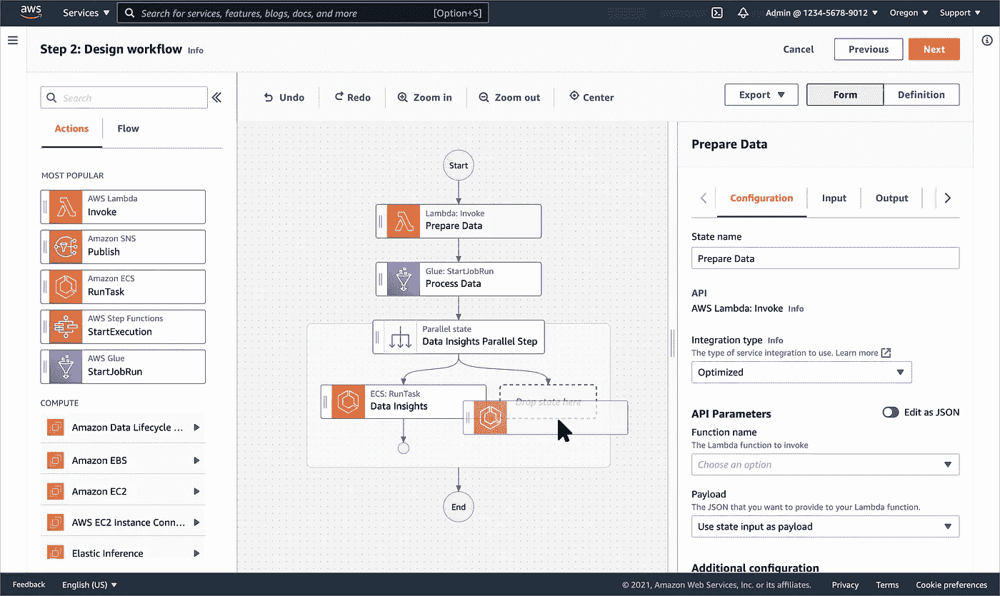
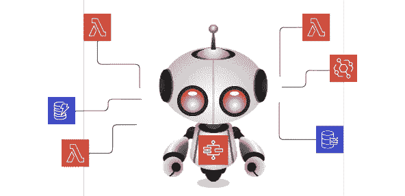

# 在无服务器中翻转业务规则代码

> 原文：<https://medium.com/codex/flipping-business-rules-in-serverless-a78df3b5170e?source=collection_archive---------9----------------------->

λ与阶跃函数

在五年的时间里，我对无服务器环境中不断变化的业务规则进行了定位。在过去，Lambdas 控制着整个领域，包含了我所有的业务规则，我越来越多地看到业务逻辑被分割和分散到外围服务中。AWS Step-functions 已经成为一个真正强大的服务，可以取代 AWS Lambda 的角色。本文探讨了这种新风格架构的利与弊。

> 让我们把阶跃函数放在我们平台的核心！

# Lambda 到底在不在驾驶座上？

不久前，我写了一篇名为“[管理无服务器意大利面](/codex/managing-serverless-spaghetti-c2fb1a7db73e)”的博客。半年后，我想以不同的方式思考其中的含义。在我之前的博客文章中，我写了从 lambdas 中提取业务规则和配置的缺点，以及您可以做些什么。今天，我想采取不同的视角，拥抱它。如果你有使用阶跃函数的经验，你可以跳过介绍。

## 小步骤功能介绍

“步骤功能”已经成为我近年来最喜欢的服务之一。它提供了一种创建流程、可视化和管理系统状态的方法。使用条件句，你可以创建流，甚至循环。它创建了有限状态机，一旦打开，你可以跟踪和追踪它们的执行。更多的解释，你可以阅读它的 [AWS 文档](https://aws.amazon.com/step-functions/getting-started/)。

阶跃函数编辑器

# 您平台的核心功能

我认为 step 的功能是作为**协调者**或**指挥者**。AWS 服务过去是一组不相连的工具，其中我的 lambdas 包含“粘合代码”来连接这些不同的服务，现在您可以使用 step 函数作为粘合函数。

AWS 步骤-负责协调的功能

拥有超过 200 个集成的 step-function 现在可以直接进行大量的 AWS 集成，而无需使用 Lambdas。就平台架构而言，我建议切换到原生集成应该是一种深思熟虑的行为。混合和匹配阶跃函数风格将不可避免地导致系统业务规则的不可见性。

在阶跃函数本地交互中，您的 Lambdas 仍然有一些作用。但我喜欢将它们视为小型公用事业。所以:**业务规则和决策应该剥离出来，迁移到状态机**。剩下的是一组微功能，它们提供了 AWS 无法比拟的*实用功能*。

## 关于 AWS 阶跃函数用于本地集成的思考

在将 Lambda 代码迁移到阶跃函数之前，您可能需要考虑一些后果和基本原理。

## **优点**

*   如果你投资使用阶跃函数，你可能会节省 lambda 执行的成本，这取决于它是如何实现的。
*   通过将条件外化到阶跃函数流结构，实现业务逻辑的可见性。
*   如果你阻止了太多的多样性，这是一个防止λ弹球的好方法。

## **缺点**

*   数据处理的成本可能会上升，因为阶跃函数的本机集成可能会导致更复杂的状态机和更多的步骤(因此成本更高)。
*   基础架构脚本将主宰应用程序的前景。虽然我喜欢像 CDK 这样的现代工具，但我认为你的业务规则的可见性并不等同于应用程序级别的编码。
*   基础设施项目的代码质量通常会纠缠到堆栈级别，甚至更高。在应用程序中，我们花了几十年的时间来改进解决方案的抽象和隔离。我还没有看到类似的设施来自 CDK 框架或地形。
*   阶跃函数的测试实践并不等同于应用程序级别的众多工具。今天，需要一种集成测试方法来测试状态机执行的复杂性。

# 要不要全力以赴 AWS 阶跃函数？

我认为 AWS step-functions 是一个非常好的服务。使用它通常会给我带来极大的快乐，尤其是在低音量的交互中。总之，我建议将它用于重要的业务逻辑。这样，它包装的价值与成本模型更匹配。对于数百万次执行，这种模式可能会变得过于昂贵。

你需要考虑的最重要的事情是，这将会是一个大滑坡。有人可能会说，向阶跃函数的过渡会让你进入某种低代码领域。改进的[工作室](https://aws.amazon.com/blogs/aws/new-aws-step-functions-workflow-studio-a-low-code-visual-tool-for-building-state-machines/) UI 提供了一个视觉上吸引人的交互来模拟你的状态机。然而，市场上也有类似的工具(例如 Outsystems 和 Mendix)。那么，您不应该一直使用更成熟的工具吗？最大的区别是与 AWS 服务的本机集成。这在当前的低代码产品中是无与伦比的。因此，根据你的要求，这可能是你的新的最好的朋友。

阶跃函数或 lambda 封装了您环境中的大部分业务逻辑吗？请在评论中告诉我！