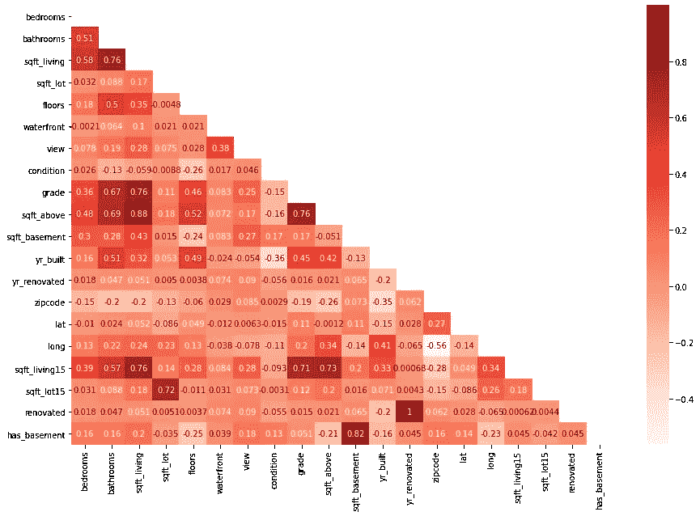
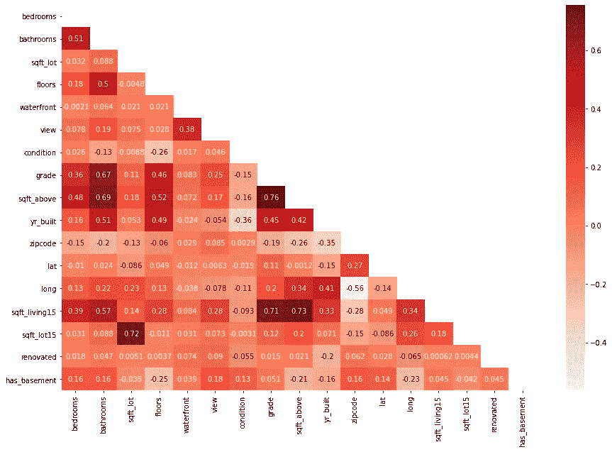
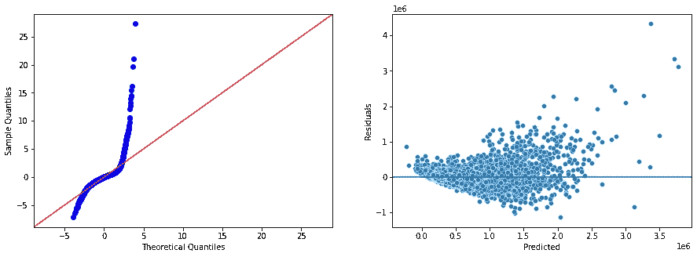
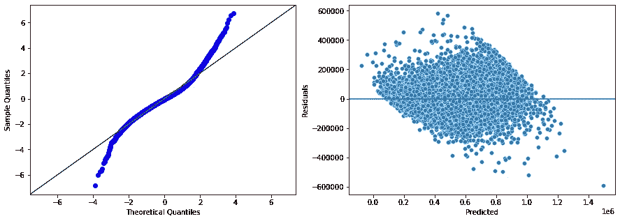

# 用数据科学翻转家园

> 原文：<https://medium.com/codex/flipping-homes-with-data-science-1b3f5823865f?source=collection_archive---------3----------------------->

## 多元线性回归模型如何帮助你的下一个家庭翻转。


照片由 [Kae Ng](https://unsplash.com/@ffkae?utm_source=medium&utm_medium=referral) 在 [Unsplash](https://unsplash.com?utm_source=medium&utm_medium=referral) 上拍摄

房地产市场最近火了起来。房屋售价高于要价有很多原因，比如抵押贷款利率下降导致的供应短缺，以及人们现在能够让自己的钱获得更多价值。这一因素和其他因素导致了市场的绝对疯狂。这不可避免地导致购房者难以找到好的交易。对于房屋租赁者来说，即使他们找到了交易，利润率也开始变得非常微薄。

> 如果你想赚钱，你必须花钱——普劳图斯

那么，数据科学如何帮助确保你花在翻新房子上的钱花得值呢？或者换句话说，你如何通过装修来最大化你家的潜在销售价格？答案是多元线性回归模型。

多元线性回归模型是一种机器学习模型，它试图解释多个自变量和因变量之间的关系。将自变量视为房屋的不同属性(如卧室数量、总面积或装修质量)，将因变量视为建模预测的“目标”，在这种情况下就是房屋的销售价格。

# 我们从哪里开始？

首先，我们需要有数据才能施展数据科学的魔法。很多县都有自己的房地产数据集，随时可用。您可以使用最新的数据集，执行探索性数据分析(EDA)并进行清理。一旦您的数据经过清理变得非常干净，我们就可以继续构建模型了。

我说了建立模型吗？嗯……不完全是。在构建模型之前，我们需要确保我们的数据符合线性回归模型的假设:

1.  线性
2.  无多重共线性
3.  残差正态性
4.  残差的同方差

# **什么是线性？**

线性本质上是检查和确认每个自变量与因变量之间的关系是线性的。为此，您可以运行一个快速循环来绘制这些关系，并直观地检查它们。下面是我在从事[类似项目](https://github.com/ebtezcan/dsc-phase-2-project)时使用的代码片段。

```
fig, ax = plt.subplots(nrows = len(df.columns), figsize=(10,200))for i, col in enumerate(df.columns):
    ax[i].scatter(df[col], df[target])
    ax[i].set_xlabel(col)
    ax[i].set_ylabel(target)
    ax[i].set_title(f”{col} vs. {target}”)
```

确认线性后，我们可以继续检查多重共线性。

# **什么是多重共线性？**

多重共线性意味着您的自变量之间有很强的相关性。这是一个问题，因为如果独立变量(在这种情况下，房屋的属性)相互影响，这将在您的数据中引入噪声，并且您将无法专注于这些属性与目标的关系，或者在这种情况下，房屋的销售价格。

要消除多重共线性，我们有一些选择:我们可以选择性地删除高度相关的列，或者运行岭回归或套索回归(这是另一个值得单独讨论的主题)。现在，让我们假设我们将删除一些列。首先，您可以创建一个相关矩阵，显示您正在处理的数据帧的相关值。这可以通过对您的数据帧使用以下代码来实现:

```
mask = np.zeros_like(df.drop(‘price’, axis=1).corr())
mask[np.triu_indices_from(mask)] = Truefig, ax = plt.subplots(figsize=(15,10))sns.heatmap(df.drop(‘price’, axis=1).corr(),
            annot=True, mask=mask, cmap=’Reds’)
```



在移除多重共线性特征之前，我为类似项目制作的相关矩阵。sqft_living 列显示了特别高的相关值(> 0.75，是我的阈值)

在我的项目中，我选择了删除选项，并选择设计一些额外的功能来完整地保留一些被删除的信息，这也被称为功能工程。这是我完成后矩阵的样子:



移除多重共线性特征后的相关矩阵相同。所有值都是<0.75 except for grade and sqft_above. Check out my GitHub for more information on why I left those columns in.

# **正态性和残差的同方差性**

残差显示实际数据点和最佳拟合线之间的误差量。我们希望我们的误差量是正态分布的，并且是同方差的。简单来说，我们不希望模型的误差因为自变量的不同值而急剧增加或减少。如果我们有一个异方差模型，我们的模型的准确性将不会一致。我们将在模型的每次迭代后检查这些指标，并根据需要对残差进行调整以达到正态性和同方差性。

# **所有的假设都被验证了，现在怎么办？**

好了，现在我们知道所有的假设是什么，我们已经验证了线性并处理了多重共线性，我们可以继续构建模型了(这次是真的)。该过程从将数据分为训练集和测试集开始。这使我们能够用我们拥有的一部分数据点来训练我们的模型，然后测试它在不引入偏差的情况下预测我们目标的能力。Scikit-learn 的 train_test_split 非常适合这个目的。您可以使用以下代码导入该方法:

```
from sklearn.model_selection import train_test_split
```

你可以像这样得到你的 x 和 y 值:

```
X_train, X_test, y_train, y_test = train_test_split(X, y)
```

您还可以选择为 test_size 和 train_size 参数输入一个值，以将数据分割从默认的 75%-25%进行更改。查看[文档](https://scikit-learn.org/stable/modules/generated/sklearn.model_selection.train_test_split.html)了解更多信息。

# **我的数据集被拆分了，下一步怎么办？**

构建模型的过程是一个迭代过程，我们将根据残差的正态性和同方差性、模型的 R 值和系数的 p 值不断调整我们的模型。如果你不想一次又一次地复制和粘贴你的代码，函数在这里会很有帮助。

```
import statsmodels.api as sm
import statsmodels.formula.api as smf
import matplotlib.pyplot as plt
import seaborn as snsdef model_lin_reg(df, target=’price’): features = ‘ + ‘.join(df.drop(target, axis=1).columns)
    f = f”{target}~”+features
    model = smf.ols(f, df).fit()
    display(model.summary()) fig, ax = plt.subplots(ncols=2, figsize=(15,5)) #qqplot to check normality of residuals
    sm.graphics.qqplot(model.resid,line=’45',
    fit=True, ax=ax[0]) #scatter plot to check for homoscedasticity of residuals
    sns.scatterplot(x=model.predict(df, transform=True),
    y=model.resid, ax=ax[1])
    ax[1].set_ylabel(‘Residuals’)
    ax[1].set_xlabel(‘Predicted’)
    plt.axhline();

    return model
```

这是一个例子，展示了我的模型在迭代前后的样子。我们可以看到残差变得更加正态和均方。如果你想知道更多关于我从第一个模型到最后一个模型的步骤，你可以看看[我的笔记本](https://github.com/ebtezcan/dsc-phase-2-project/blob/main/notebook.pdf)。



调整前，QQ 图(左)显示非正态分布，残差(右)呈锥形，显示异方差性。



调整后，QQ 图相对正常，残差更加均方。

# 完成这些工作后，我们如何使用我们的模型来翻转房屋呢？


[Jason Leung](https://unsplash.com/@ninjason?utm_source=medium&utm_medium=referral) 在 [Unsplash](https://unsplash.com?utm_source=medium&utm_medium=referral) 上的照片

我们从模型中得到的一个输出是参数的系数，或者换句话说，**参数对房屋销售价格的影响**。例如，我们可以预测给房子增加一个地下室或升级房子的装修最终会如何改变销售价格。这是一个非常强大的工具，在权衡翻新的成本和收益时尤其有用。如果完成那个阁楼空间并因此给房子增加宜居的平方英尺将花费你 25，000 美元，但这次翻新预计将使房子的价值增加 50，000 美元，那么继续进行这个项目可能是个好主意。

你也可以看看每个参数的**效应大小，算出房屋的哪些属性对其销售价格影响最大。由于您正在查看的系数是根据参数的单位进行调整的，因此您需要缩放数据以查看参数如何相互叠加。例如:卧室数量的系数可能是 100，000，而宜居平方英尺的系数可能是 100，因为平方英尺是以百或千表示的，而卧室数量是个位数。**

因此，一个多元线性回归模型可以作为你装修的参考，告诉你应该关注什么，不应该关注什么。通过只翻新那些最有价值的东西——或者用最少的钱产生最大的影响——你可以增加你的利润，让你的房子成为这个街区最贵的房子。你不喜欢数据科学的力量吗？

**了解更多信息:**

点击[这里](https://github.com/ebtezcan/dsc-phase-2-project)，查看我在 GitHub 上的完整笔记本和分析。