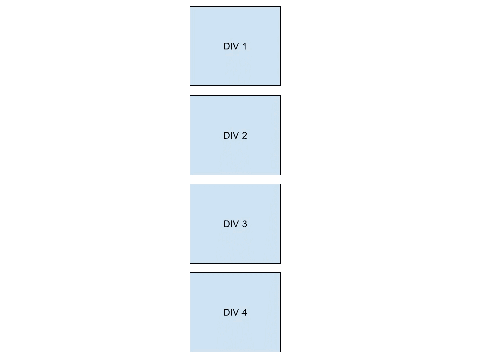

# 浮动或柔性盒

> 原文：<https://medium.com/codex/float-or-flexbox-6d8bda2bf2d5?source=collection_archive---------2----------------------->

## [抄本](http://medium.com/codex)

在我的 CSS Zen Garden 实验中，我发现了 CSS float 属性毫不费力的魔力。它允许我把一个文本块放在左上角，这样它看起来像嵌套一样，主体在右边和底部围绕着它。


浮动摘要文本的正文环绕

在标题中，floats 还允许我将一个图像放在左侧，将另一个图像放在右侧。这消除了处理左右边距和填充的需要。


图像浮动在左右两边的页眉

在这个初始版本中，float 属性使用了 3 次。

1/IMG 1 = > float:left；

2/ IMG 2 => float:右；

3/summary = > float:left；

只是一些无辜的 CSS 和一切都很好。直到我被告知，如果可能的话，我应该使用 Flexbox，并避免使用 floats。好吧，该死。

## 目录

1/ [Flexbox 尝试](#4009)
2/ [什么是浮动？它是如何工作的？](#a894)
3/ [并排浮动](#3747)
4/ [清除浮动](#6f06)
5/ [浮动的许多问题](#1e36)

# Flexbox 尝试

对于我的禅宗花园的新的重新设计，我已经取消了所有 3 个先前的浮动。不是因为我被告知永远不要使用浮动，而是因为我希望我的元素更加居中和间隔。

顶部的

有一个标题，一个 div 作为我的图像占位符，另一个 div 用于简短的摘要。

首先，我想在添加最终的样式和图片之前，将这 3 个元素放置在我想要的位置。我不仅希望元素在页面上水平居中，还希望文本和图像在它们的块内居中。

这篇来自自由代码营的文章看起来很有希望…

[](https://www.freecodecamp.org/news/how-to-center-anything-with-css-align-a-div-text-and-more/) [## 如何用 CSS 居中对齐一个 Div，文本等等

### 使事物居中是 CSS 最困难的方面之一。这些方法本身通常并不难…

www.freecodecamp.org](https://www.freecodecamp.org/news/how-to-center-anything-with-css-align-a-div-text-and-more/) 

按照“如何使用 Flexbox 将 Div 水平居中”一节中的说明，我将`display:flex;`和`justify-content:center;`应用到父元素的 CSS 中(<部分>)。


水平柔性盒

呀！我的 3 个元素现在并排挤压在一起，我不知道该怎么办。

也许需要垂直？向下滚动到“如何使用 Flexbox 垂直居中 Div”部分，我将`display:flex;`和`align-items:center;`应用到父元素(<部分>)。


垂直柔性盒

嗯…这也不是我想要的。

也许我需要通过结合这两种方法，用 Flexbox 使它垂直和水平居中？

```
display:flex;justify-content: center;align-items: center;
```

没有。这并没有改变什么。

也许 Flexbox 不适合这种情况，或者我没有正确使用它。

很快，我将深入研究 Flexbox，因为它是制作响应式布局的现代方式。

现在，我将恢复使用基本属性，如文本对齐、填充和边距。


最终截面布局

# 什么是浮动？它是如何工作的？

> float 属性是一个定位属性，用于更改元素在页面自然流动中的位置，并将其推到容器的左侧或右侧。— [鼓胀](http://tympanus.net/codrops/css_reference/float/)

你可能已经注意到，当你编写几个块元素时，比如

、

# 和，它们只是堆叠在一起，没有任何样式。这就是它“流动”的方式。从上到下，一个在另一个下面。

浮动一个元素，就是把它从“流”中取出来，放在页面左侧或右侧，放在它的“父元素”中。

float 属性的值可以是 left、right 或 inherit。

向左浮动将使元素浮动到左上角，下面的内容将在它的右侧换行。

向右浮动将使元素浮动到右上方，下面的内容将在左侧环绕它。

Inherit 意味着它继承其父元素的浮点值。默认值为无。

浮动将导致下面的同级元素扩展和/或上移以填充空间。这也可能导致浮动元素位于其他元素的前面，挡住它们的视线。

为了解决这个问题，下面的元素也需要浮动，以提供一个内联的水平外观。或者，他们需要有一个 **clear** 属性，告诉它左右两边或者两边都不要有任何东西。

# 并排浮动

假设在一个

元素中有 4 个元素。

堆叠的 4 个正方形格子

如果所有的

元素都向左浮动，它们将依次被推到左边。

```
div { float: left;}
```


4 平方分格，水平

像这样的浮动元素也可以创建列。或者，在主要内容旁边浮动一个侧边栏。

如果你把所有的东西都向右浮动，它们将被反向排序。


4 平方分，反向

注意:如果所有的子元素都是浮动的，父元素将会折叠，并且可能从视图中“消失”,因为它不再包含任何内容。

# 清除漂浮物

为了避免父元素折叠和非浮动元素被推到浮动元素后面，我们可以使用一个 **clear** 属性。

**清除**属性的值可以是左、右或两者。它指示不允许浮动元素在其旁边浮动的位置。

值为 left 表示元素不允许位于其左侧。

right 值意味着元素不允许出现在其右侧。

两者都意味着它两边都不能有元素。

1/可以在浮动元素后添加一个额外的空元素，比如一个

或，并给它一个 **clear** 属性来“清除”容器的浮动。

```
footer { clear: both;}
```

或者，如果你想给 html 添加一个样式属性…

```
<footer style=“clear: both;”></footer>
```

通过在父容器的底部添加一个不允许在其两侧有浮动元素的元素，这鼓励父容器扩展以包含它。

这样做的缺点是，您会向页面添加额外的 HTML。如果你有几个包含浮动元素的容器，你就在页面上添加了大量的空的、笨重的 HTML，这通常是一个糟糕的做法。

2/清除浮动的一个更流行的方法是给被浮动元素的父元素添加一个**溢出**属性，这样它的高度将会扩展以适应被浮动的元素。

**溢出**属性指示如何处理元素内的额外内容，即“溢出”内容。

它的值可以是 hidden 或 auto。

隐藏意味着它将切断或隐藏额外的内容，否则会溢出容器的边缘。它保持父容器的原始高度，同时约束其中的内容。

Auto 意味着它将滚动条添加到元素中。

```
.parent-div { overflow: hidden; /* or */ overflow: auto;}
```

3/最好的技巧是在伪元素 之后使用 [**。它通过在父类中所有其他内容之后添加一个伪元素来清除浮动，没有任何副作用或额外的 HTML。**](http://tympanus.net/codrops/css_reference/after)

然后，对这个伪元素使用 clear 属性和一些额外的样式。


:在鼓室伪元素之后

这将清除浮动并扩展父元素以包含所有浮动的子元素。

# 浮动的许多问题

由于浮动从页面流中弹出的性质，您必须对它周围的元素进行样式化，以获得您想要的布局。浮动并不是用来管理页面的完整布局的。这就是 Flexbox 和 Grid 派上用场的地方。谨慎使用浮动

如果一个元素向左浮动，另一个元素向右浮动，起初看起来可能还不错。然后，调整页面大小，两者之间的间距会发生变化，因为它们可能会发生冲突和重叠。

关于大小调整，子元素必须等于或小于父元素的宽度，以便并排浮动。这也包括边距和填充。如果这一切都不适合在一条线上，那么它不会在旁边浮动。

关于浮动还有几个奇怪的地方，如果你打算使用它们，我鼓励你去读一读(当然，要谨慎)。

 [## 漂浮物

### 浮动 CSS 属性将元素放在其容器的左侧或右侧，允许文本和内联元素…

developer.mozilla.org](https://developer.mozilla.org/en-US/docs/Web/CSS/float) [](https://css-tricks.com/all-about-floats/) [## 关于浮动的一切| CSS-技巧

### Float 是一个 CSS 定位属性。要了解它的目的和起源，我们可以看看印刷设计。在印刷品中…

css-tricks.com](https://css-tricks.com/all-about-floats/) [](https://www.hongkiat.com/blog/css-floats/) [## 在五个问题中解释 CSS 浮动

### CSS“浮动”(浮动元素)使用起来很简单，但是一旦使用，它对周围元素的影响有时…

www.hongkiat.com](https://www.hongkiat.com/blog/css-floats/) 

[鼓室——浮动](http://tympanus.net/codrops/css_reference/float/)