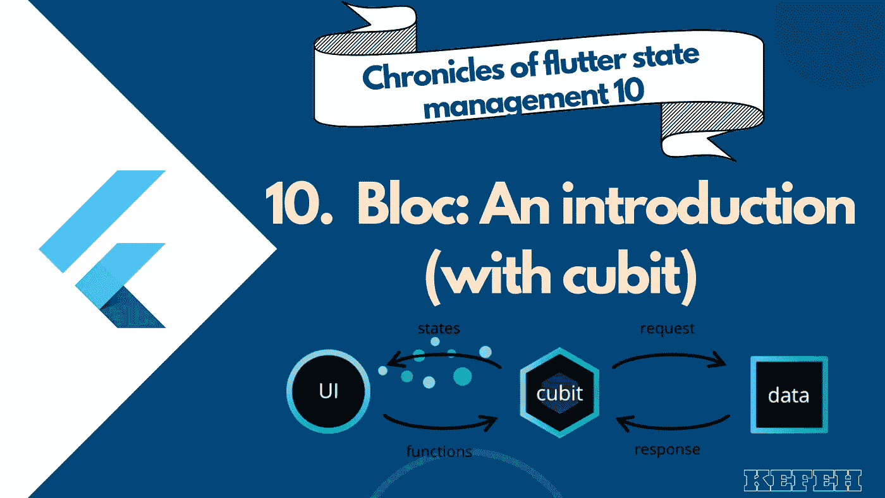
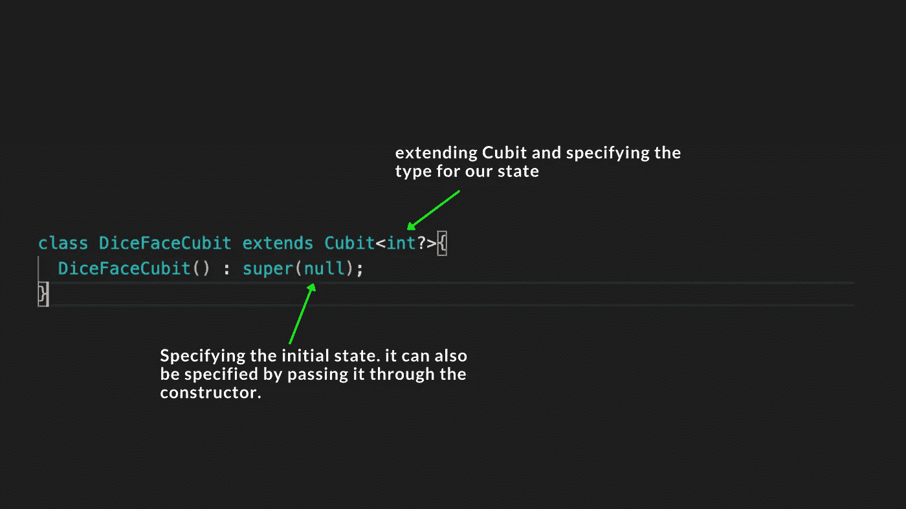
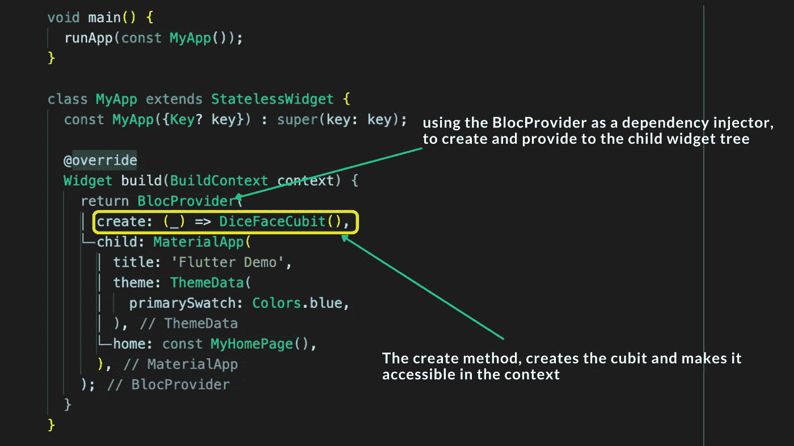
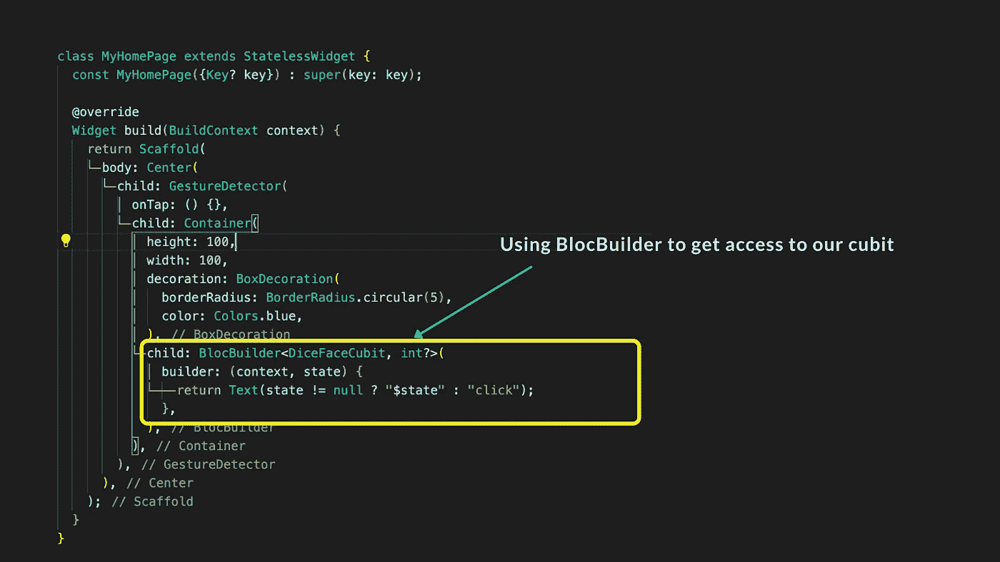
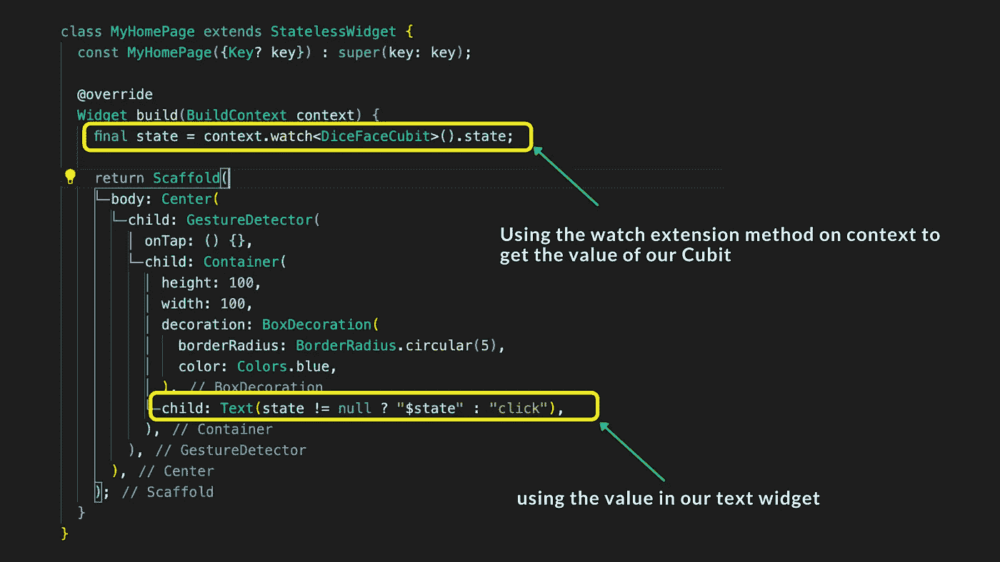
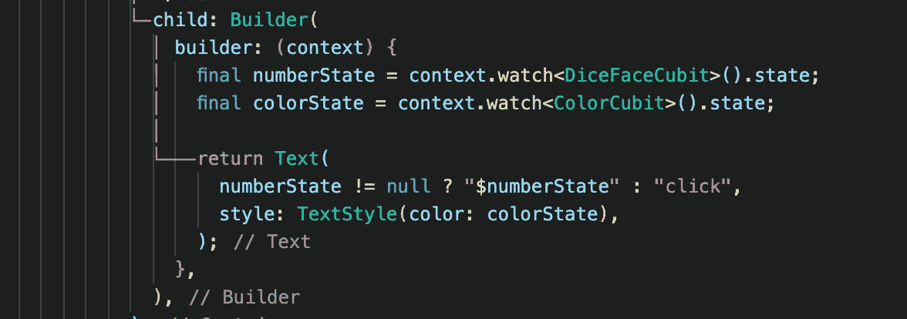
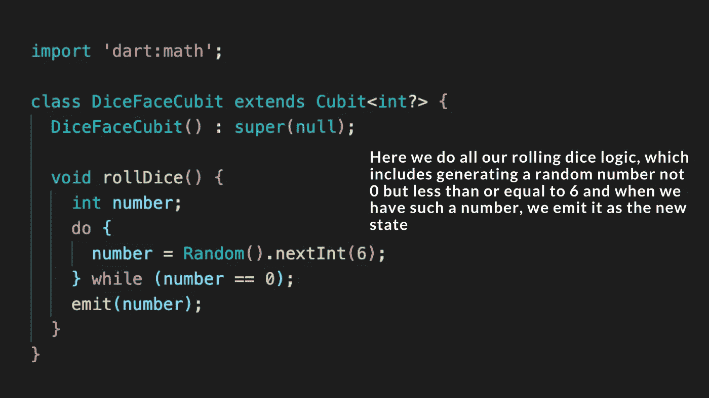
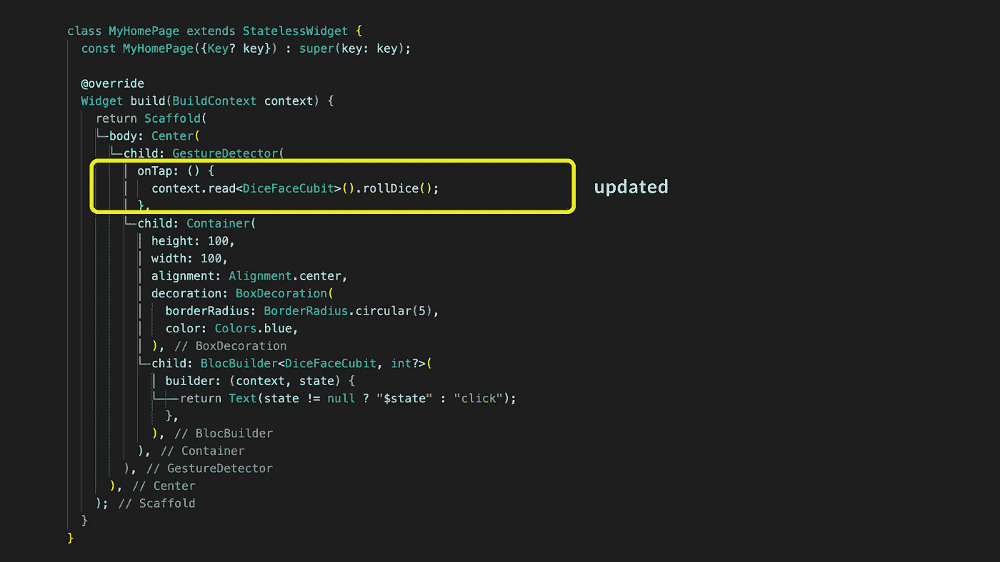

# 颤振阻滞:介绍(与丘比特)

> 原文：<https://medium.com/codex/flutter-bloc-an-introduction-with-cubit-7eae1e740fd0?source=collection_archive---------0----------------------->

# 颤振状态管理编年史 10。

在 flutter 中有许多状态管理解决方案是我特别喜欢的一点。这些不同的状态管理解决方案不仅为我们提供了基于所述包制定的“协议”来管理应用程序状态的想法或规则，而且还帮助我们实施特定的设计模式和文件夹结构，在某些情况下，在您正在进行的特定项目中，这使得某个解决方案比其他解决方案更可取。

本质上，Bloc 是一个建立在流和反应式编程设计概念之上的状态管理解决方案，使用提供者来促进其注入到小部件树中。

> 这里，我假设您事先了解提供者(不太强制性)，构建上下文和通知程序，如 ChangeNotifiers 和 StateNotifiers。如果你不知道，请随时查看[这篇由你真正的](/geekculture/providers-an-introduction-5b139f58d283)撰写的可爱文章。

***你可能会问，既然有这么多其他国家管理解决方案，为什么还要关心 bloc 呢？***

我会告诉你要关心。

***为什么？***

Bloc 的构建采用了不同的通知更改的概念，而不是使用通知程序，它使用流，任何需要使用状态的人，只需订阅该状态的特定流，每当状态有新的更改时，它就会被简单地发出并使用(是的，这并不简单，但您会明白这一点)。Flutter 和 dart 已经有了内置的方法来使用带有错误处理和不同状态的流，这是一个很好的用例。

因此，如果你有一个严重依赖流的应用程序，或者需要“类似流”的控制，那么考虑使用 bloc。

***还没完吧？***

当然不是。

事实上，集团帮助了我们

1.  将业务逻辑从表示中分离出来，并为状态提供一个真实的来源，以及逻辑和表示之间的一种通信方式。是的，我知道，大多数国家管理解决方案都是这样，但值得注意的是，bloc 也是这样。
2.  Bloc 使状态变化可预测，并易于重放以前的状态和跟踪状态变化，因为它是一个状态值流。听起来很酷，对吧？实现撤销和重做之类的功能变得很容易。
3.  由于块代码是纯 dart 代码，可以在 angular dart 和 flutter 以及所有 dart 前端风格之间灵活地重复使用，因此它有助于在您的应用程序内外重复使用代码。
4.  dart 中的反应式编程(RxDart)非常强大，事实上，bloc 是基于它构建的，这意味着如果需要，您可以利用 RxDart 的功能，但如果没有，bloc 提供了足够简单的抽象，非常适合用于简单的解决方案。值得注意的是，bloc 构建在 RxDart 等之上的事实并不会使它变得沉重或笨重，RxDart 毕竟只是 Dart。

本质上，每一个优秀的 flutter 开发者都希望考虑到他们的应用程序的每一个状态，加载、已加载、错误状态等应用程序的每一个交互，从而做出适当的反应。Bloc 就是基于这一点构建的，目的是让监听这些交互变得容易，并对重要的状态做出适当的响应，同时不要忘记它进行测试的简易性。

*太好了，既然我们关心 bloc* 😅*，让我们来看看如何使用它。*

首先，bloc 有两个不同的抽象，cubit 和 bloc，(它们扩展了 BlocBase 类)

Cubit 是一个简单的 case bloc，它是一个流组件，使用函数将小部件之间的交互传递给 cubit，也是一个流，小部件使用这个流来发出状态变化。(实际上，这不仅仅是关于作为交互源的小部件，而是 cubits 可以公开用于触发状态变化等的函数的事实)。

在结构上，Cubit 看起来与 [StateNotifiers](/flutter-community/provider-with-statenotifiers-19b2c4f9d65c) 非常相似，这使得它在一定程度上适合那些来自提供者(Riverpod 背景)的人。

**让我们来看一个使用 Cubit** 的简单例子

首先，让我们安装 bloc，

> 这里有两个需要关注的包，bloc 和 flutter bloc。Bloc 是 bloc 包的核心，包含 bloc 和 Cubits 等主要核心构建块，独立于 flutter(可由任何 dart 框架使用)。 **Flutter_bloc** 是一个包含一些元素的包，这些元素将用于构建依赖于 Flutter 的 ui，如 BlocProvider 和 BlocBuilder。
> 
> 你可以在 vs 代码中使用添加依赖功能，搜索 flutter_bloc 和 bloc，或者我们也可以运行**flutter pub add flutter _ bloc**和 **flutter pub add bloc** 来添加这两个包。
> 
> 然后它们将被添加到您的 **pubspec.yaml**

现在我们已经运行了，让我们试着实现一个简单的随机数生成器，它返回一个 1-6 范围内的数字，比如说一个低级的骰子滚动。

所以，我们首先创建一个腕尺来处理这个

> Cubit 只是一个从 BlocBase 扩展(继承)的类，由于它的定义，它总是需要一个初始状态。如果我们不指定状态类型，状态会被自动假定为动态类型。

就这么简单，我们已经创建了我们的 cubit，我们希望它有一个整数状态，但是当没有掷骰子的时候就为 null。我们可以继续在我们的应用程序中使用它。

这个想法是这样的，我们有一个蓝色的骰子(实际上它只是一个蓝色的方块:-)，当点击它时，它会向我们显示骰子的任意一面(显示 1-6 范围内的任何数字)，最初在任何点击之前，我们希望提示用户点击。首先，就像 inheritedWidgets 和 Providers 一样，为了能够使用我们创建的任何 cubit，我们需要将它注入到 widget 树中的一个点上，该点对于我们提供的 widget 是可访问的。在我们的例子中，我们使用名为 BlocProvider 的 flutter_bloc 库中的小部件，将它注入 MyApp 小部件中。

> BlocProvider 接受一个[Create]函数，该函数负责创建[Bloc]或[Cubit]以及一个[child],该函数将通过 BlocProvider.of(context)访问实例。它被用作一个依赖注入(DI)小部件，因此一个[Bloc]或[Cubit]的单个实例可以提供给一个子树中的多个小部件。

因此，将创建和提供我们的 Cubit 放在 MyApp 小部件中意味着它下面的每个小部件都可以访问 Cubit。

在这之后，我们继续使用我们的肘。我们可以像这样使用小部件 BlocBuilder 来使用它

或者使用上下文中的扩展，这些扩展为我们提供了读取、观察和选择等方法。

使用扩展方法观察

***但是你可能会问它们为什么不一样？***

*   这是对我们应用程序性能的主要限制，以确保我们尽可能利用最少数量的小部件重建，因此能够限制只对必要的小部件进行重建将对性能有很大帮助。因此，如果您有一个独立的小部件，它完全依赖于 Cubit 提供的状态，因此如果状态发生变化，它总是会被重新构建，那么使用 context.watch 是一个不错的选择。但是，如果您有一个较大的小部件，而该小部件只有某一部分依赖于 Cubit/bloc，那么使用 BlocBuilder 将重新构建限制在该小部件上是合适的。
*   BlocBuilder 是专门为管理块的生命周期而构建的，因此非常适合在小部件树中使用，除非您希望在函数中使用 state 或 Cubit/bloc，例如在 onTap 中，扩展方法将派上用场，或者需要范围重建的特定小部件依赖于超过 1 cuit/bloc，在这种情况下您需要使用一些东西。

主体中包含多个状态的构建器的示例

现在让我们回到正题上来，好吗？😅

所以我们在小部件上使用了 Cubit，但是如果我们意识到，我们没有办法改变这个值，那么，我们该怎么做呢？

在我们的 cubit 中，我们希望能够产生一个新的状态，幸运的是，有一个暴露的状态变量供我们使用，不幸的是，我们不能到处给状态变量分配新的状态值，因为，这个暴露的状态变量实际上是一个引擎盖下的 getter，这意味着，我们只能读取它的值，而不能直接设置新的值。这是有意义的，因为我们希望每当我们设置一个新的状态时，我们希望它通知所有使用该状态的区域它已经被更新，以防需要重建，然后提供新的更新值，对于那些使用过 ChangeNotifiers 的人，你会意识到要做到这一点，我们更新状态，然后调用函数“notifyListeners”来为我们做这项工作。相反，bloc 库为我们处理这个问题，并为我们提供了一个名为 emit 的方法，这个 emit 方法，正如它所说的那样，向所有侦听它的人发出一个新状态，如果发出的状态与以前的状态相同，则不做任何事情，这实际上帮助我们在没有明显变化时防止不必要的重建。

然后，我们更新 onTap 方法，在点击时调用 rollDice 方法

所以我们完成了，我们已经探索了 Cubit 类，并向 flutter_bloc 介绍了我们自己。你可以在下面找到完整的工作代码。在下一篇文章中，我们将深入探讨 bloc 类，它是如何从 Cubit 升级的，以及如何充分利用 Bloc 包。

[https://github . com/kefeh/bloc _ example/blob/main/lib/main . dart](https://github.com/kefeh/bloc_example/blob/main/lib/main.dart)

感谢阅读。