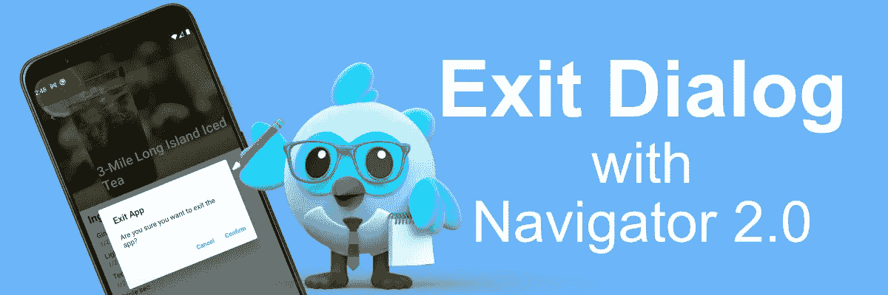

# 使用 Navigator 2.0 捕捉 Android 上的按键

> 原文：<https://medium.com/codex/flutter-case-study-catching-back-button-presses-on-android-when-using-navigator-2-0-d4d42e4718f6?source=collection_archive---------6----------------------->

## 颤振案例研究



欢迎阅读颤振新系列文章的第一篇。我最近开始浏览与颤振相关的 StackOverflow，也许我可以回答这个问题，以帮助初露头角的颤振爱好者。时不时地，我会遇到一个问题，我觉得需要一篇文章来解释这个问题和解决方案，也许还需要一些细节来解释为什么会出现这个问题。我将这些文章命名为**案例研究**，我期待着深入挖掘我遇到的有趣的、晦涩的或过于普通的问题。废话少说，让我们开始我们的第一个案例研究。

如果你觉得这篇文章的标题值得一读，那么毫无疑问，你已经在 Flutter pre-1*Navigator 2.0*中体验过在 Android 上捕捉按钮按压，但是这里有一点复习。我们简单地将小部件树包装在一个`WillPopScope`小部件中，并提供一个`onWillPop`回调。这里有一个例子，捕捉后退按钮的按下，并提供一个`AlertDialog`来确认应用程序退出。

```
WillPopScope(
  onWillPop: () async {
    final shouldPop = await showDialog<bool>(
      context: context,
      builder: (context) {
        return AlertDialog(
          title: Text('Exit App'),
          content: Text('Are you sure you want to leave the app?'),
          actions: [
            TextButton(
              child: Text('Cancel'),
              onPressed: () => Navigator.pop(context, false),
            ),
            TextButton(
              child: Text('Confirm'),
              onPressed: () => Navigator.pop(context, true),
            ),
          ],
        );
      },
    ); // if the dialog is dismissed by tapping outside of the barrier
    // the result is null, so we return false
    return shouldPop ?? false;
  },
  child: // continue with widget tree here
)
```

正如你所看到的，用户在`AlertDialog`中的输入会告诉我们他们是否真的想离开应用程序，我们可以将结果传递给`WillPopScope`小部件。

如果您在使用 *Navigator 2.0* 时尝试过这种方法，那么您会发现`WillPopScope`不再捕捉按钮按压。这是因为在 *Navigator 2.0* 中，`RouterDelegate`的`popRoute`方法负责处理操作系统弹出当前路径的请求(后退按钮按下)，我们可以在方法的文档中看到:

> 该方法应该返回一个 boolean [Future]来指示该委托是否处理该请求。返回 false 将弹出整个应用程序。

按下后退按钮后，设计实现会立即弹出整个应用程序。因此，我们必须在扩展`RouterDelegate`类时覆盖它，并根据我们的需要处理后退按钮按压。

```
@override
Future<bool> popRoute() async {
  // check if we have pages in the stack to pop before
  // attempting app exit
  if (_pages.length > 1) {
    // handle popping the current page off of the stack
    return Future.value(true);
  } final result = await showDialog<bool>(
    // get the context from the navigatorKey defined
    // in your RouterDelegate class
    context: navigatorKey!.currentContext!,
    builder: (context) {
      return AlertDialog(
        title: const Text('Exit App'),
        content: const Text('Are you sure you want to exit the app?'),
        actions: [
          TextButton(
            child: const Text('Cancel'),
            onPressed: () => Navigator.pop(context, true),
          ),
          TextButton(
            child: const Text('Confirm'),
            onPressed: () => Navigator.pop(context, false),
          ),
        ],
      );
    },
  ); // if the dialog is dismissed by tapping outside of the barrier
  // the result is null, so we return false
  return shouldPop ?? false;
}
```

如果您不需要按后退按钮在应用程序中向后导航，而需要一直显示退出应用程序对话框，您可以省略第一个 *if 语句。*

**注意:**您可能已经注意到，在这两种方法中，对话框的结果是相反的。这是因为当使用`WillPopScope`时，我们告诉小部件它是否应该从`Navigator`弹出范围(*真=弹出，假=不弹出*)。当使用 *Navigator 2.0* 时，我们告诉`Router`我们是否已经处理了请求(*真=已处理，假=未处理*)。当我们报告自己没有处理时，`Router`通过退出 app 来处理。

这就是全部了。通过将您的逻辑从`WillPopScope`的`onWillPop`回调转移到`RouterDelegate`的`popRoute`方法，您可以在使用 *Navigator 2.0* 时轻松处理后退按钮按压。

如果你想更深入地研究 *Navigator 2.0* 并获得关于将应用程序转换为 *Navigator 2.0* 的深入教程，请查看我的从 [*开始的 3 部分系列:更简单的 Flutter Navigator 2.0 指南:第一部分*](/geekculture/a-simpler-guide-to-flutter-navigator-2-0-part-i-70623cedc93b) 。

感谢您的阅读！如果您觉得这篇文章很有帮助，并且想阅读更多的案例研究，请鼓掌并关注。编码快乐！