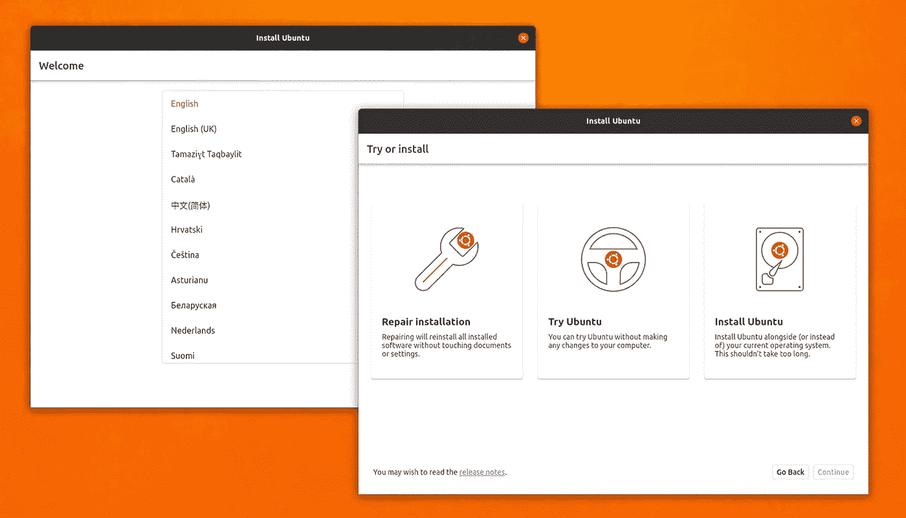

# 扑，争夺。NET 的毛伊岛

> 原文：<https://medium.com/codex/flutter-competition-for-nets-maui-23adb4cc8b8b?source=collection_archive---------0----------------------->

我想用一个简单易懂且安全的代码库来开发跨平台的应用程序。与。NET 即将推出毛伊岛，鉴于我之前的文章，你可能会认为我会立刻被它吸引。不要误会我，我已经尝试了一些预览。然而，有一些警告:Linux 支持还没有计划，macOS 开发需要 Big Sur 或 Preview 4 以后的版本。

虽然我对使用专有软件和操作系统没有任何问题，但在开发软件或游戏时，我总是会考虑 Linux。大苏尔的支持对我来说有点问题。我用的是一台 2013 款 iMac，从技术上来说，这款苹果电脑不需要任何额外的破解就能运行，但没有得到苹果的官方支持。黑客怀疑这与那些试图在该型号上安装大苏尔的人报告的关于可选融合驱动的[问题有关。](https://github.com/barrykn/big-sur-micropatcher#compatibility-of-various-mac-models)

Ubuntu 的新安装程序正在用 Flutter 编写

由于我在毛伊岛的大肆宣传，颤振不一定在我的雷达上。然后一个朋友分享了一篇关于 Ubuntu 获得一个用 Flutter 写的新安装程序的文章，我的兴趣开始达到顶峰。直到另一个朋友开始使用激起我好奇心的框架为他的公司编写应用程序，我才开始尝试。

颤动就像毛伊岛。您使用一个代码库为每个平台编写一个图形应用程序。它使用[反应范式](https://flutter.dev/docs/development/data-and-backend/state-mgmt/declarative)，s [支持热重装](https://flutter.dev/docs/development/tools/hot-reload)，一切都是小部件——一切。在 iOS 和 Android 以及 macOS、Windows 和 Linux 上开发和运行您的应用程序的能力不仅令人印象深刻，而且非常好。

# 镖

当然，说到 Flutter 就不能不提 Dart 了。Dart 是 Google 解决 Javascript 问题的尝试——请注意，这是在 WebAssembly 之前。然而，它遭到了潜在的分裂网络的批评，并被重写以编译成 Javascript。在这之后的某个地方，Flutter 诞生了。

我在涉足 Swift 和 Go 等其他语言时，一直使用 ether C#和 Rust。当时，我对语言漠不关心。2.12 中对[零安全的支持帮助我尝试了 Dart 和 Flutter。](/dartlang/announcing-dart-2-12-499a6e689c87)

到目前为止，我对 Dart 的体验非常好。从来没有想过我会完全用 VS 代码编写一个图形应用程序——我已经被 ide 宠坏了——但这正是我一直在做的事情！

# 采用

[Tizen 正在获得颤振支持](https://9to5google.com/2021/05/18/samsung-tizen-flutter-sdk-galaxy-watch/)

不出所料，谷歌正在用 Flutter 吃他们自己的狗粮。体育场、广告和助理都使用它，根据他们的[展示](https://flutter.dev/showcase)。让人有些震惊的是[扑力 Fuschia 的接口](https://arstechnica.com/gadgets/2021/05/google-launches-its-third-major-operating-system-fuchsia/)。

由于我与公司有关的[问题，我已经放弃谷歌的 I/O 很多年了。所以当我发现](https://tonytins.medium.com/my-dwindling-trust-in-google-e0b4fa948c9)[他们谈论今年的颤振](https://www.zdnet.com/article/google-io-2021-flutter-2-2-adds-monetization-hooks-as-it-gains-traction/)时，你可以感到惊讶不止。我觉得他们正在为 Fuschia 很快成为主流做准备，因为它在 I/O 结束后刚刚在 Nest Hubs 上发布。

但真正有趣的是，三星已经开始将 Flutter 移植到他们的 Tizen 平台，可能是由于 Wear OS 和 Tizen 平台的合并。它已经支持 Xamarin。不幸的是，您只能从 Windows 开发这些应用程序。根据源代码，这个[似乎不是颤振端口](https://github.com/flutter-tizen/flutter-tizen)的情况。

虽然毛伊岛的未来在发布之前仍不确定，但谷歌已经在 Flutter 上领先一步。看看这两个人如何竞争会很有趣。不幸的是，由于上述问题，*与我有关*，我可能不得不放弃毛伊岛而支持 Flutter。