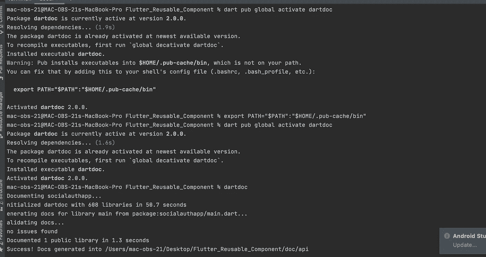
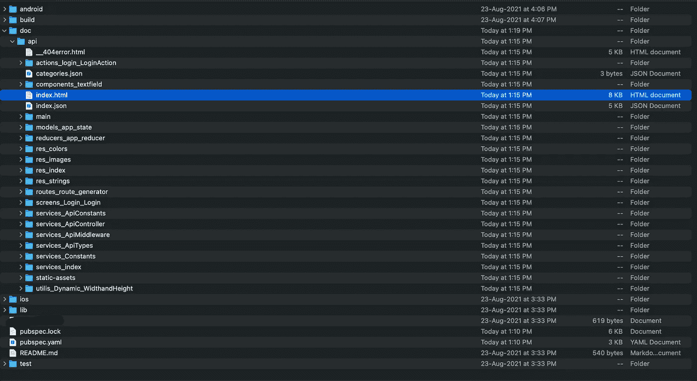
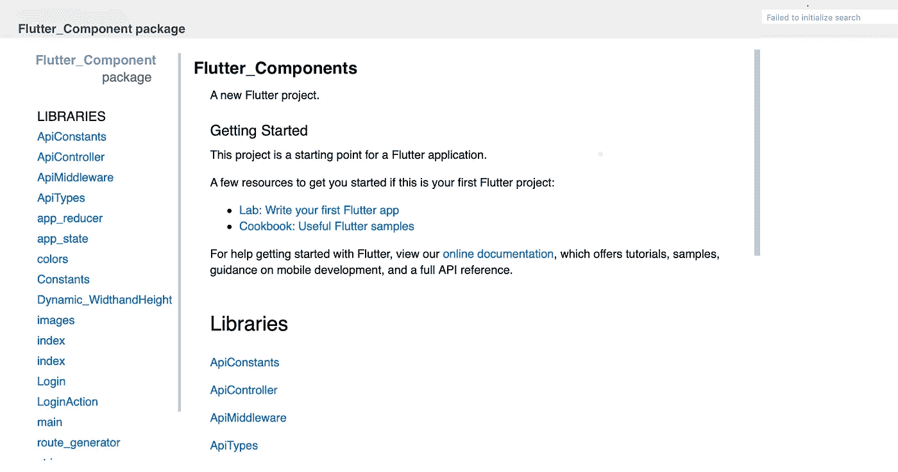

# 颤动飞镖文件

> 原文：<https://medium.com/codex/flutter-dart-documentation-791371ff2e0f?source=collection_archive---------0----------------------->


在这篇文章中，我们将看到如何以一种孤立的方式有效地编写 flutter 代码文档。这提高了代码的质量和清晰度。

注释是用“高级”英语语句描述你的程序要做什么的“艺术”。注释最好在真正为你的程序写代码之前**完成。**

## 评论

以下提示适用于您不希望包含在生成的文档中的注释。

## 不要在文档中使用块注释。

```
***Good:***
void greet(String name) {
  // Assume we have a valid name.
  print('Hi, $name!');
}***Bad:***
void greet(String name) {
  /* Assume we have a valid name. */
  print('Hi, $name!');
}
```

您可以使用块注释(`/* ... */`)来临时注释掉一段代码，但是所有其他注释都应该使用`//`。

# Dartdoc 颤振工具/插件

使用`[***dartdoc***](https://pub.dev/packages/dartdoc/install)`为您的 Dart 包生成 HTML 文档。

## 生成文档

从一个包的根目录运行`***dartdoc***`。您的软件包必须使用`***dart analyze***`或`***flutter analyze***`进行正确分析。以下是 dartdoc 记录自身的一个示例:

```
$ dartdoc
**Documenting** dartdoc...
**Initialized** dartdoc **with** 766 libraries **in** 63.9 seconds
**Generating** docs **for** library dartdoc **from** package:dartdoc/dartdoc.dart...
**Validating** docs...
no issues found
**Documented** 1 public library **in** 17.9 seconds
**Success**! **Docs** generated into <path to dartdoc>/doc/api
```

默认情况下，文档以静态 HTML 文件的形式生成到`***doc/api***`目录。

运行`***dartdoc -h***`查看可用的命令行选项。

## 文档注释

文档注释特别方便，因为 dartdoc 会解析它们并从中生成漂亮的文档页面。文档注释是出现在声明之前的任何注释，使用 dartdoc 寻找的特殊的`///`语法。

## 务必使用`///`文档注释来记录成员和类型。

使用 doc 注释而不是常规注释使 dartdoc 能够找到它并为它生成文档。

```
***Good:*** /// The number of characters in this chunk when unsplit.
int get length => ...***Bad:***
// The number of characters in this chunk when unsplit.
int get length => ...
```

# 考虑为私有 API 编写文档注释。

文档注释不仅仅是针对库的公共 API 的外部消费者。它们也有助于理解从库的其他部分调用的私有成员。

## 一定要用一句话的总结来开始文档注释。

以简短的、以用户为中心的描述开始你的文档注释，以句号结尾。一个句子片段往往就足够了。为读者提供足够的背景，让他们确定自己的方向，决定是应该继续阅读还是去别处寻找问题的解决方案。

```
/// Deletes the file at [path] from the file system.
void delete(String path) {
  ...
}
```

## 请务必将 doc 注释的第一句单独放在单独的段落中。

在第一句后加一个空行，把它分成单独的段落。如果不止一句解释是有用的，把其余的放在后面的段落里。

这有助于你写出一个概括文档的紧凑的第一句话。此外，像 dartdoc 这样的工具在类和成员列表等地方使用第一段作为简短的总结。

```
/// Deletes the file at [path].
///
/// Throws an [IOError] if the file could not be found. Throws a
/// [PermissionError] if the file is present but could not be deleted.
void delete(String path) {
  ...
}
```

## 避免与周围环境的冗余。

一个类的 doc 注释的读者可以清楚的看到这个类的名字，它实现了什么接口等等。当读取成员的文档时，签名就在那里，封闭类也很明显。这些都不需要在 doc 注释中详细说明。相反，重点解释读者*不知道*已经知道的东西。

```
class RadioButtonWidget extends Widget {
  /// Sets the tooltip to [lines], which should have been word wrapped using
  /// the current font.
  void tooltip(List<String> lines) {
    ...
  }
}
```

## 首选用第三人称动词开始函数或方法注释。

文档注释应该关注代码*做什么*。

```
/// Returns `true` if every element satisfies the [predicate].
bool all(bool predicate(T element)) => ...

/// Starts the stopwatch if not already running.
void start() {
  ...
}
```

## 更喜欢用名词短语开始变量、getter 或 setter 注释。

类的文档注释通常是程序中最重要的文档。它们描述了类型的不变量，建立了它所使用的术语，并为类成员的其他 doc 注释提供了上下文。这里的一点额外努力可以使所有其他成员更容易记录。

```
/// A chunk of non-breaking output text terminated by a hard or soft newline.
///
/// ...
class Chunk { ... }
```

## 考虑在文档注释中包含代码示例。

```
/// Returns the lesser of two numbers.
///
/// ```dart
/// min(5, 3) == 3
/// ```
num min(num a, num b) => ...
```

人类擅长从例子中归纳，所以即使一个简单的代码样本也能让 API 更容易学习。

## 请在文档注释中使用方括号来引用范围内的标识符。

如果将变量、方法或类型名称用方括号括起来，那么 dartdoc 会查找名称并链接到相关的 API 文档。括号是可选的，但是当你引用一个方法或者构造函数的时候，它可以让你更清楚。

```
/// Throws a [StateError] if ...
/// similar to [anotherMethod()], but ...
```

若要链接到特定类的成员，请使用由点分隔的类名和成员名:

```
/// Similar to [Duration.inDays], but handles fractional days.
```

点语法也可以用来引用命名的构造函数:

```
/// To create a point from polar coordinates, use [Point.polar()].
```

## 务必将文档注释放在元数据注释之前。

```
/// A button that can be flipped on and off.
@Component(selector: 'toggle')
class ToggleComponent {}
```

# 降价

您可以在您的文档注释中使用大多数的 markdown 格式，dartdoc 将使用 markdown 包对其进行相应的处理。

已经有成千上万的指南向你介绍 Markdown。它的普及是我们选择它的原因。这里有一个简单的例子，让您了解支持的内容:

```
/// This is a paragraph of regular text.
///
/// This sentence has *two* _emphasized_ words (italics) and **two**
/// __strong__ ones (bold).
///
/// A blank line creates a separate paragraph. It has some `inline code`
/// delimited using backticks.
///
/// * Unordered lists.
/// * Look like ASCII bullet lists.
/// * You can also use `-` or `+`.
///
/// 1\. Numbered lists.
/// 2\. Are, well, numbered.
/// 1\. But the values don't matter.
///
///     * You can nest lists too.
///     * They must be indented at least 4 spaces.
///     * (Well, 5 including the space after `///`.)
///
/// Code blocks are fenced in triple backticks:
///
/// ```dart
/// this.code
///     .will
///     .retain(its, formatting);
/// ```
///
/// The code language (for syntax highlighting) defaults to Dart. You can
/// specify it by putting the name of the language after the opening backticks:
///
/// ```html
/// <h1>HTML is magical!</h1>
/// ```
///
/// Links can be:
///
/// * https://www.just-a-bare-url.com
/// * [with the URL inline](https://google.com)
/// * [or separated out][ref link]
///
/// [ref link]: https://google.com
///
/// # A Header
///
/// ## A subheader
///
/// ### A subsubheader
///
/// #### If you need this many levels of headers, you're doing it wrong
```

## 避免过度使用降价。

当有疑问时，少格式化。格式的存在是为了照亮你的内容，而不是取代它。语言是最重要的。

## 避免使用 HTML 格式。

它*可能*在很少的情况下对像表格这样的东西有用，但是在几乎所有的情况下，如果它太复杂而不能用 Markdown 表达，你最好不要表达它。

## 代码块最好用反斜杠。

Markdown 有两种方法来表示代码块:将代码每行缩进四个空格，或者用一对三反勾“栅栏”线将代码括起来。前一种语法在诸如 Markdown 列表之类的内容中使用时是脆弱的，在 Markdown 列表中缩进是有意义的，或者当代码块本身包含缩进的代码时。

反勾号语法避免了这些缩进问题，允许您指示代码的语言，并且与内联代码使用反勾号是一致的。

```
/// You can use [CodeBlockExample] like this:
///
/// ```dart
/// var example = CodeBlockExample();
/// print(example.isItGreat); // "Yes."
/// ```
```

# 查看文档

您可以直接从文件系统中查看生成的文档，但是如果您想使用搜索功能，您必须用 HTTP 服务器加载它们。

在本地运行 HTTP 服务器的一个简单方法是使用`dhttpd`包。例如:

```
**$** pub global activate dhttpd
**$** dhttpd --path doc/api
```

在浏览器中导航至`http://localhost:8080`;搜索功能现在应该可以工作了。

# 链接结构

dartdoc 生成具有可预测链接结构的静态文件。

```
index.html                          *# homepage*
index.json                          *# machine-readable index*
library-name/                       *# : is turned into a - e.g. dart:core => dart-core*
  ClassName-**class**.html              *# "homepage" for a class (and enum)*
  ClassName/
    ClassName.html                  *# constructor*
    ClassName.namedConstructor.html *# named constructor*
    method.html
    property.html
  CONSTANT.html
  property.html
  top-level-function.html
```

文件名*区分大小写*。

# 从文件中排除

`dartdoc`不会为文档注释中带有`@nodoc`标签的 Dart 元素及其子元素生成文档。

# 例子



**安装并运行 dartdoc**



**在您的项目文件夹 doc/api/内..**

在您的项目中运行 dartdoc 后，它会创建一个名为 ***doc*** 的文件夹，我们知道 dartdoc 只创建 api 文档，因此会创建 ***api*** 文件夹，项目 api 文档已完成，其结构如上面的截图所示



**索引文档中的 HTML 页面**

# 结论

许多开发人员没有写足够的文档，要么是因为他们没有看到价值，要么是因为他们觉得没有时间。你不需要成为那些开发者中的一员。只需一点时间和大量的练习，你就可以为你的代码添加文档，使阅读它成为你和其他人的乐趣。

***感谢您阅读文章，祝您的代码文档一切顺利***