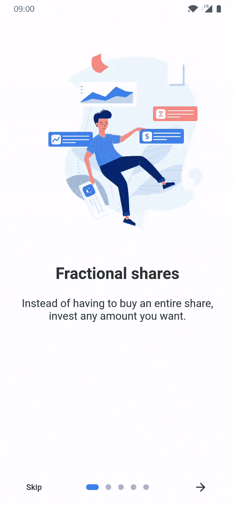

# 颤动:介绍屏幕

> 原文：<https://medium.com/codex/flutter-introduction-screen-25c3b3efc099?source=collection_archive---------7----------------------->

图片来源:谷歌图片

你可以使用一个介绍屏幕来解释你的软件，例如，在启动器上。这个小部件设计不错，适应性很强。

只需将 introduction_screen 作为依赖项添加到您的 pubspec.yaml 文件中。

有许多参数可以访问；但是，在示例的下一部分中只指定了其中的几个。请参考[文件](https://pub.dev/packages/introduction_screen)中所有可访问参数的列表。

> **注意:**如果你只想显示一次简介屏幕(例如在应用程序启动时)(已经显示或没有显示)，使用 SharedPreferences(或类似的东西)来保存状态。这个包对此没有责任。

让我们开始工作吧。

# listPagesViewModel

页面列表由 listPagesViewModel 表示。

PageViewModel 是页面的基础。下面是一个 PageViewModel 的例子。

# 页面视图模型

只有标题、正文、图像和页面装饰在这里定义(您可以定义任何小部件)

来自文档的图像源

现在，让我们从我们的介绍屏幕开始吧，因为它已经不碍事了。先做一个***introduction _ screen . dart***文件。

想知道 buildImage、getPageDecoration 和 getDotsDecorator 是什么？我们一个一个去。

*   **buildImage:** 添加图像的常用方法，以图像路径作为参数。

*   **getPageDecoration:** 自定义页面的常用方法。

*   **getDotsDecorator:** 另一个包 dots indicator 被 introduction_screen 使用。

我们可以根据自己的意愿定制圆点。但是选择是有限的。

> **注意:**如果不给出下一个参数，下一个按钮将不会出现。如果希望出现跳过按钮，请使用 skip 参数并设置
> 
> showSkipButton: true。
> 
> 只有在`showDoneButton: true`时才需要`done`参数。

下面是一些带有“完成”、“跳过”和“后退”按钮的示例。

*   **带有完成按钮的介绍屏幕**

*   **带跳过按钮的介绍屏幕**

*   **带后退按钮的介绍屏幕:**

在第一页上,“后退”按钮不可见。

然后，我们将命令我们的 ***main.dart*** 在应用程序启动时显示介绍屏幕。

这就是全部了。我们的介绍性屏幕已成功完成。

> 许多参数可以用来定制你想要的介绍！只需点击进入[文档](https://pub.dev/packages/introduction_screen)即可更深入了解。

源代码可以在 [Github](https://github.com/vinodbaste/introduction-screens-in-flutter) 上找到。

 [## GitHub-vinodbaste/简介-抖动中的屏幕

### 此时您不能执行该操作。您已使用另一个标签页或窗口登录。您已在另一个选项卡中注销，或者…

github.com](https://github.com/vinodbaste/introduction-screens-in-flutter) 

*感谢您抽出时间阅读本文。如果你觉得这个帖子有用又有趣，请鼓掌推荐。*

*如果我做错了什么，请在评论中提出来。我很想进步。*