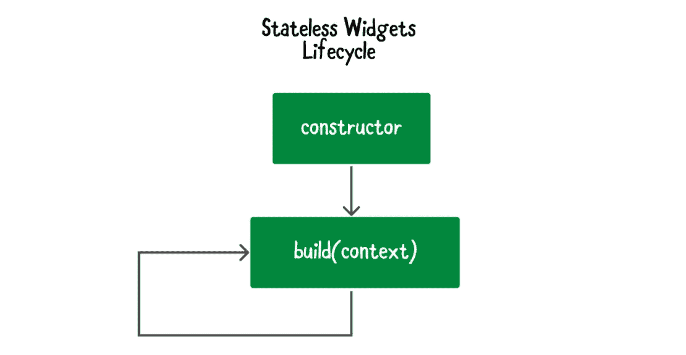
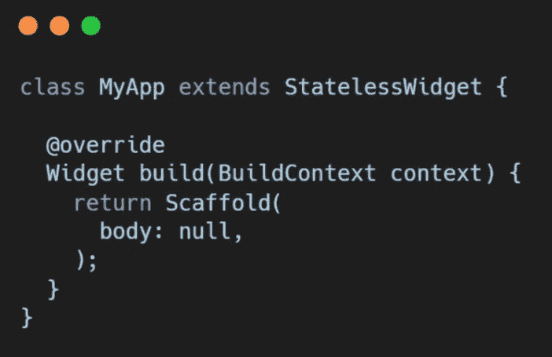
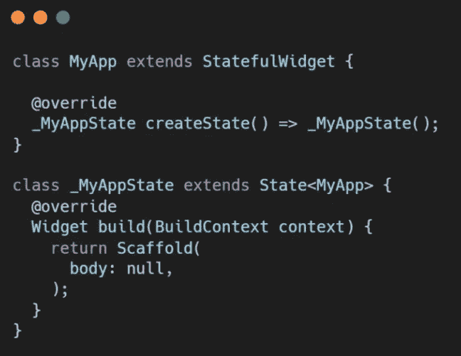
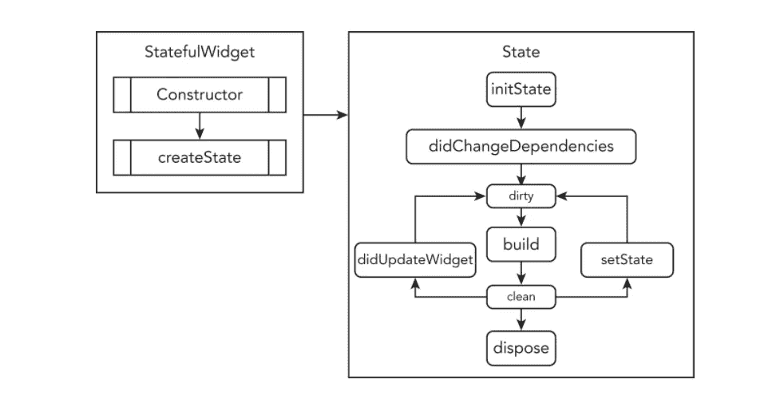
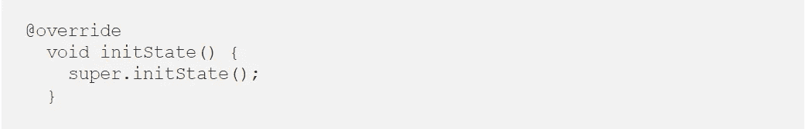
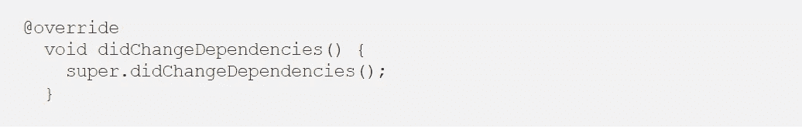
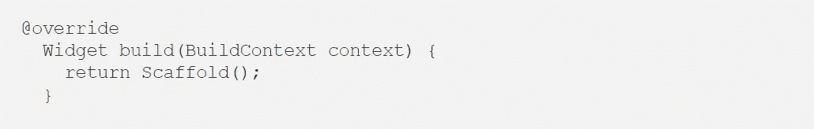
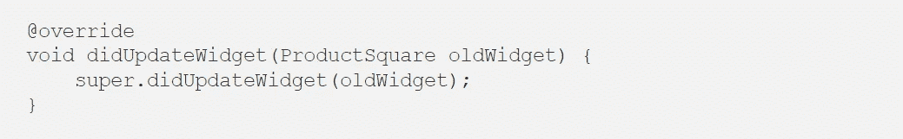
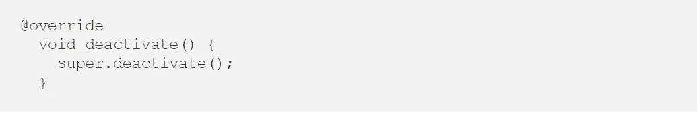

# 颤振:Widgets 生命周期资产管理

> 原文：<https://medium.com/codex/flutter-lifecycle-an-in-depth-look-783b07e8f706?source=collection_archive---------6----------------------->

图片来源:谷歌

我们将经历 flutter widgets 的生命周期。在移动开发中，每个移动应用程序都有自己的一组任务，必须逐一完成…例如，如果我们打开我们的应用程序，他们将首先构建应用程序，然后按照场景处理它。

flutter 中的一切都是一个小部件，大多数 flutter 应用程序都是以 StatelessWidget 或 StatefullWidget 开始的。

无状态小部件生命周期

如果你的类是从 StatelessWidget 扩展而来的，那就意味着这个页面只是创建了 Widget 设计，并没有改变它们。

无状态小部件语法

如果您的类从 StatefulWidget 扩展，它将根据您的规范进行修改。这是一个一次性的构建，会根据您的操作进行更新。

有状态小部件语法

让我们从谈论 StatefulWidget 的生命周期开始。

有状态小部件生命周期

*   ***createState()***:当框架被告知要构建 StatefulWidget 时，它马上调用 createState()。
    在树中的特定点，它为这个小部件构建可变状态。

在 StatefulWidget 的生命周期中，框架可以多次调用该方法。例如，如果小部件被多次添加到树中，框架将为每个位置产生一个不同的状态对象。类似地，如果小部件从树中移除，然后重新插入，框架将执行 createState 来构建新的状态对象，从而简化状态对象的生命周期。

*   ***【initState()*:**这是小部件形成时，在类函数 Object()之后调用的第一个函数。InitState 只被调用一次。它必须使用 super.initState()。

当这个项目被添加到树中时，它被称为。对于它产生的每个状态对象，框架将精确地调用这个函数一次。覆盖此方法以执行依赖于上下文(即此对象添加到树中的位置)或用于设置此对象的小部件(即小部件)的初始化。

*   ***didChangeDependencies():***第一次构造小部件时，在 initState 之后立即调用 didChangeDependencies()。

当这个状态对象的依赖关系改变时，这个方法被调用。
如果前面的构建调用引用了随后更改的 InheritedWidget，框架将使用此方法将更改告知此对象。这个函数可以安全地调用`BuildContext.dependOnInheritedWidgetOfExactType`。因为框架在依赖关系更新后不断调用 build，子类很少覆盖这个函数。一些子类覆盖了这个方法，因为当它们的依赖关系改变时，它们需要执行一些昂贵的工作(例如，网络获取),并且每次构建都这样做成本太高。

在小部件的生命周期中可能会被多次调用(例如，当键盘出现和消失时)。

*   ***build():*** 经常使用这种策略。它必须返回一个小部件，这是必要的。

它描述了这个小部件所代表的用户界面的组件。
框架在各种情况下都会调用这个方法。

这个小部件的 BuildContext 包含关于它在树中的构造位置的信息。例如，上下文给出了树中这个位置的继承部件。该状态对象的 context 属性始终与 BuildContext 参数相同，并且在该对象的生存期内保持不变。

***didUpdateWidget():***如果父小部件发生变化，必须重新构建这个小部件(因为需要给它提供不同的数据)，但运行时类型保持不变，就调用这个小部件。这是因为 Flutter 正在重用一个长期存在的状态。在这种情况下，您可能希望重新初始化一些数据，就像在 initState 中一样。

***deactivate():*** 当状态从树中移除时被调用，尽管它可能在当前移帧完成之前被重新插入。因为状态对象可以从树中的一个地方转移到另一个地方，所以存在这种技术。

***dispose():***当状态对象被永久删除时，dispose()被调用。您应该取消订阅和取消任何动画，流和其他使用这种技术的服务。

*感谢您花时间阅读本文。如果你觉得这个帖子有用又有趣，请鼓掌推荐。*

如果我做错了什么，请在评论中提出来。我很想进步。