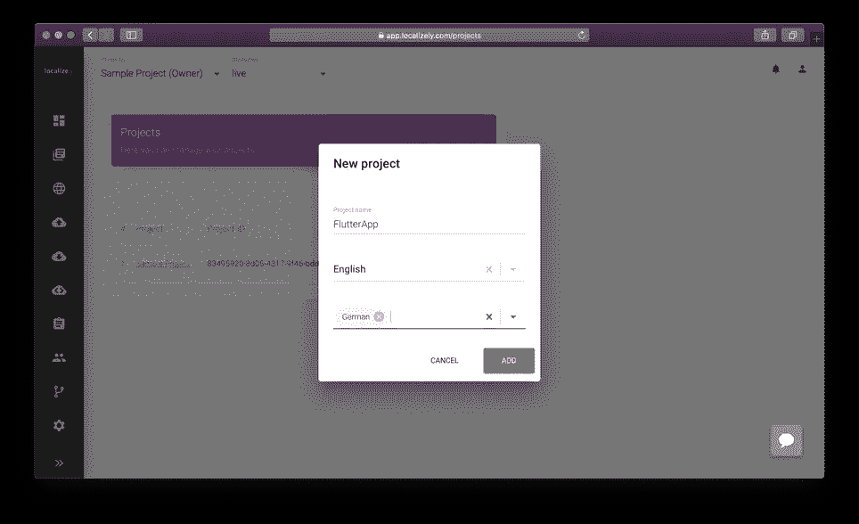
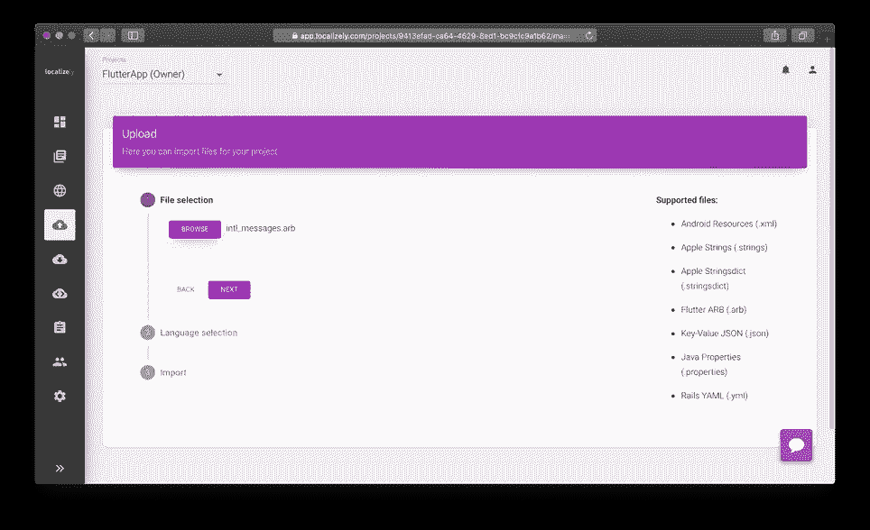
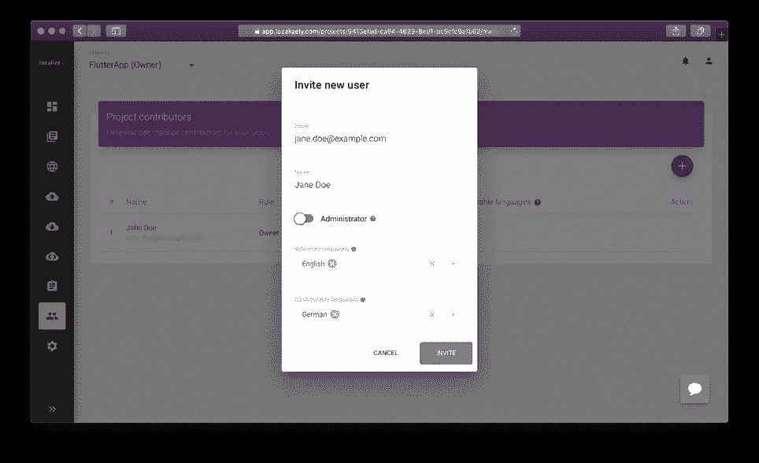
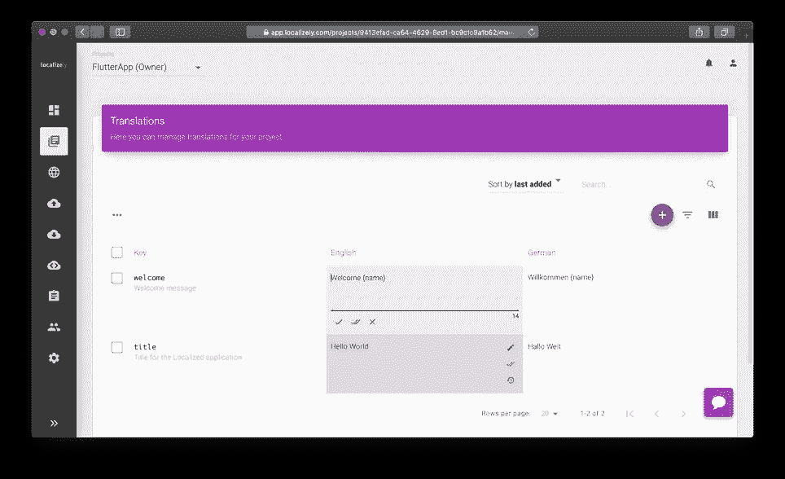
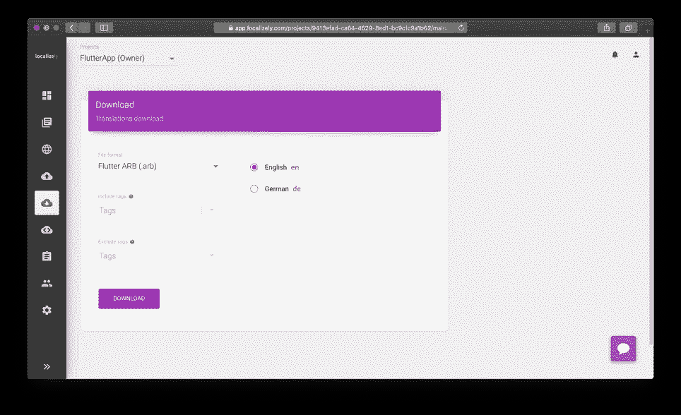

# 颤振本地化:逐步-本地化

> 原文：<https://medium.com/codex/flutter-localization-step-by-step-localizely-149c4b37ebe6?source=collection_archive---------6----------------------->

为 Android 和 iOS 应用提供一个代码库听起来很有吸引力。过去，我们在这方面没有什么好的经历。但最近，Flutter 正在用自己的方式解决这个问题。然而，如果你为不同的市场开发一个应用程序，你很可能需要为你的终端用户支持多种语言。目前，有几种方法可以实现这一点。下面，你会发现一种最常用的颤振定位方法。

# 第 1 部分:设置您的 Flutter 应用程序

最近，Flutter 推出了一种基于`gen_l10n`工具的[定位](https://localizely.com/blog/internationalization-vs-localization/#definition-of-localization-l10n)的新方法。该工具在构建阶段自动生成本地化文件。在接下来的章节中，您将了解如何使用这个新的本地化工具。

本指南中使用的所有代码示例都可以在 [GitHub repo](https://github.com/localizely/flutter-gen-l10n-example) 上获得。

# 步骤 1:添加依赖关系

首先，让我们将必要的依赖项添加到`pubspec.yaml`文件中。

```
dependencies:
  # Other dependencies...
  flutter_localizations:
    sdk: flutter
  intl: ^0.17.0
```

接下来，从终端运行以下命令来下载它们:

```
flutter pub get
```

# 步骤 2:启用本地化文件的生成

要启用本地化文件的自动生成，请更新`pubspec.yaml`文件的`flutter`部分。

```
flutter:
  generate: true
  # Other config...
```

# 步骤 3:配置本地化工具

在 Flutter 项目的根目录下创建一个新的`l10n.yaml`文件。该文件将保存`gen_l10n`工具的配置。您可以在本文档的[中找到配置选项的完整列表。但是，在本指南中，我们将只使用其中的几个:](https://docs.google.com/document/d/10e0saTfAv32OZLRmONy866vnaw0I2jwL8zukykpgWBc/edit#heading=h.upij01jgi58m)

*   `arb-dir` -包含翻译文件的目录路径。
*   `template-arb-file` -模板 arb 文件的名称，该文件将作为生成 Dart 本地化文件的基础。
*   `output-localization-file` -输出本地化和本地化委托类的文件名。

下面，您可以找到本指南中使用的`l10n.yaml`文件的内容。

```
arb-dir: lib/l10n
template-arb-file: intl_en.arb
output-localization-file: app_localizations.dart
```

# 步骤 4:添加翻译文件

接下来，让我们添加包含三个 [ARB](https://localizely.com/flutter-arb/) 文件的`l10n`目录:`intl_ar.arb`、`intl_en.arb`和`intl_es.arb`。这些文件将分别保存阿拉伯语、英语和西班牙语的翻译。下面，您可以看到添加这些文件及其内容后的项目结构。

```
FLUTTER_PROJECT
|-- ...
|-- android
|-- ios
|-- lib
|   |-- l10n
|       |-- intl_ar.arb
|       |-- intl_en.arb
|       |-- intl_es.arb
|   |-- main.dart
|-- pubspec.yaml
|-- ...
```

`intl_ar.arb`文件:

```
{
  "helloWorld": "مرحبا بالعالم!"
}
```

`intl_en.arb`文件:

```
{
  "helloWorld": "Hello World!"
}
```

这个`intl_es.arb`文件:

```
{
  "helloWorld": "¡Hola Mundo!"
}
```

**注意:**[Flutter ARB](https://localizely.com/flutter-arb/)文件允许 [ICU 语法](https://localizely.com/blog/quick-guide-to-icu-message-format/)出现在消息中。然而，`gen_l10n`工具仍处于积极开发阶段，还不完全支持整个 ICU 语法。报告的问题:[消息中的多个/嵌套复数和选择](https://github.com/flutter/flutter/issues/86906)，[生成器忽略复数形式:零、一和二](https://github.com/flutter/flutter/issues/84291)。

## iOS 应用程序的本地化

根据[官方文档](https://docs.flutter.dev/development/accessibility-and-localization/internationalization#localizing-for-ios-updating-the-ios-app-bundle)，对于 iOS 应用，需要用支持的区域设置列表更新`Info.plist`文件。然而，有迹象表明这可能很快会自动化。在此之前，您应该手动添加如下所示的代码片段，以支持 iOS 应用程序的本地化。

`ios/Runner/Info.plist`文件:

```
<key>CFBundleLocalizations</key>
<array>
  <string>ar</string>
  <string>en</string>
  <string>es</string>
</array>
```

# 步骤 5:运行应用程序来触发代码生成

要触发本地化文件的生成，您需要运行应用程序。之后，您将能够在`.dart_tool`文件夹下看到生成的代码。

```
FLUTTER_PROJECT
|-- .dart_tool
|   |-- ...
|   |-- flutter_gen
|       |-- gen_l10n
|           |-- app_localizations.dart
|           |-- app_localizations_ar.dart
|           |-- app_localizations_en.dart
|           |-- app_localizations_es.dart
|       |-- ...
|-- android
|-- ios
|-- lib
|-- ...
```

**注:**每次运行、热重装、热重启或运行`flutter pub get`命令时，都会触发代码生成。

默认情况下，`gen_l10n`工具将本地化文件生成为一个合成包。因此，这些文件不会签入版本控制系统(即 Git)。然而，如果出于某种原因，你想用版本控制系统跟踪这段代码，你需要用`synthetic-package`和`output-dir`配置参数更新你的`l10n.yaml`文件。

`l10n.yaml`文件:

```
# Other config...
synthetic-package: false
output-dir: lib/l10n
```

# 第六步:更新应用程序

接下来，用`localizationsDelegates`和`supportedLocales`道具更新`MaterialApp`小部件。为此，导入生成的`app_localizations.dart`文件并传递所需的值。

`AppLocalizations.localizationsDelegates`代表以下列表:

*   生成的本地化代理—提供来自 ARB 文件的本地化消息，
*   `GlobalMaterialLocalizations.delegate` -为材料部件提供本地化消息，
*   `GlobalCupertinoLocalizations.delegate` -为 Cupertino 部件提供本地化消息，
*   `GlobalWidgetsLocalizations.delegate` -为小工具提供文本方向。

这些代理允许我们在整个应用程序中使用不同的语言，没有太多的麻烦。此外，他们将 Material 和 Cupertino 的小工具本地化为大约 78 种语言(例如 Material 的日期选择器)，并在应用程序中设置文本方向。

`AppLocalizations.supportedLocales`表示支持的语言环境列表。

`main.dart`文件:

```
import 'package:flutter/material.dart';
import 'package:flutter_gen/gen_l10n/app_localizations.dart';void main() {
  runApp(const MyApp());
}class MyApp extends StatelessWidget {
  const MyApp({Key? key}) : super(key: key);[@override](http://twitter.com/override)
  Widget build(BuildContext context) {
    return MaterialApp(
      // ...
      localizationsDelegates: AppLocalizations.localizationsDelegates,
      supportedLocales: AppLocalizations.supportedLocales,
      // ...
    );
  }
}
```

此外，要查看一切是如何工作的，请将下面显示的代码片段粘贴到代码中的某个位置。

```
Text(AppLocalizations.of(context)!.helloWorld)
```

最后，热重装应用程序。如果您从一开始就遵循了所有的步骤，您应该能够看到翻译后的信息。请注意，每当您将设备的语言更改为阿拉伯语、英语或西班牙语时，上述消息都会更新。

## 文本方向:从左到右和从右到左

尽管大多数语言都是 LTR(从左到右)，我们应该知道也有 RTL(从右到左)语言。在本指南中，我们添加了一种 RTL 语言，即阿拉伯语。每当你用这种语言打开应用程序时，你应该会注意到你的布局变化。通常，Flutter 会更新应用程序中的文本方向，以符合所选的语言环境。在大多数情况下，您不需要做任何调整。但是，如果您的布局只是为 LTR 语言创建的，或者使用了一些硬编码的值，那么您就有可能破坏它。因此，请注意，将 RTL 语言添加到您的应用程序中可能还需要对您的布局进行一些更改。

## **获取选择的区域设置**

要获取小部件树的所选区域设置，请使用下面的代码片段。

```
Locale selectedLocale = Localizations.localeOf(context);
```

## 覆盖区域设置

在一些罕见的情况下，您可能想要覆盖部件树的一部分的区域设置。为此，您应该使用`Localizations.override`工厂构造函数。下面，您可以看到一个例子，其中有规律地显示了`helloWorld`消息，并且覆盖了区域设置。

```
[@override](http://twitter.com/override)
Widget build(BuildContext context) {
  return Column(
    children: [
      Text(AppLocalizations.of(context)!.helloWorld),
      Localizations.override(
        context: context,
        locale: const Locale('es'),
        // Using a Builder here to get the correct BuildContext.
        child: Builder(
          builder: (BuildContext context) {
            return Text(AppLocalizations.of(context)!.helloWorld);
          },
        ),
      ),
    ],
  );
}
```

## 以编程方式更改应用程序语言

到目前为止，我们已经看到了 Flutter 如何检测设备语言(用户的首选语言)并根据它调整应用程序。此外，我们已经看到了如何覆盖应用程序的某些部分的语言。但是如果我们需要在应用程序中支持手动语言切换器呢？很难吗？一般来说不是。您只需要在`MaterialApp`小部件中将选定的区域设置作为`locale`道具进行传递。更多详情，请查看[本例](https://github.com/localizely/flutter-gen-l10n-example)。

# 第 2 部分:管理您的 Flutter 本地化

用两种语言管理一对字符串容易吗？当然可以。但是，随着你添加更多的功能和扩展到更多的市场，你的应用程序将增长到十几种语言的数千个字符串。以下是如何自动化您的文本字符串本地化:

# 步骤 1:在本地创建一个项目

一旦您注册了[本地化的](https://localizely.com/)，只需转到 [**我的项目**](https://app.localizely.com/projects) 页面并点击`+`按钮(或者如果您希望首先更熟悉本地化的特性，请浏览示例项目)。为您的项目命名，并设置您的主要语言和其他语言。如果需要，您可以稍后更改主要语言。



每个项目都有一个唯一的 ID(可以在 [**我的项目**](https://app.localizely.com/projects) 页面中找到)，使用 [API](https://api.localizely.com/swagger-ui/index.html) 时需要用到。

# 第二步:上传你的文件

将您的主 ARB 文件导入到本地。进入**上传**页面，选择文件，确认。或者，您可以首先在本地添加字符串键。



# 第三步:邀请团队成员

本地化工作是一项团队工作。通过点击侧面菜单中的图标切换到**贡献者**部分，并开始添加队友。任何用户都可以被授予管理权限，即与您拥有相同的项目权限。对于非管理员贡献者，您可以指定对项目的每种语言的访问，将某些语言指定为引用(只读)或贡献(读取和更新)。只有管理员有权访问字符串密钥更改、导入、导出、设置等。



# 第四步:翻译

本地化的**翻译**页面上有一个编辑器，提醒翻译管理常用的 Excel 表格。您可以随意探索示例项目，或者只是看一下[入门](https://localizely.com/getting-started/)指南，以掌握基本概念和选项。



# 第五步:下载文件

翻译部分完成了。如何将本地化数据从 Localizely 中取出，并使其在您的 Flutter app 中可用？

有两个选项:

*   **选项 1:手动下载**

点击项目侧菜单中的**下载**图标，选择 **Flutter ARB** 作为导出格式。点击**下载**获取文件。然后移动下载的**。arb** 文件到您的项目中，替换现有的本地化，就这样。



*   **选项 2:通过 API 下载**

根据您的项目部署设置，您可能想要使用[本地化 API](https://api.localizely.com/swagger-ui/index.html)——它为您提供了一种自动生成和下载本地化文件的简单方法。

如果你对翻译的即时更新感兴趣，而不需要新版本，请查看[无线翻译更新](https://localizely.com/flutter-over-the-air/)功能。它将让你纠正错别字，优化文本，并随时更新翻译。

通过使用本[指南](https://localizely.com/blog/flutter-localization-step-by-step/?tab=automated-using-flutter-intl)中解释的 Flutter Intl 插件，可以进一步简化工作流程。

*最初发表于*[*https://localizely.com*](https://localizely.com/blog/flutter-localization-step-by-step/?tab=using-gen-l10n)*。*