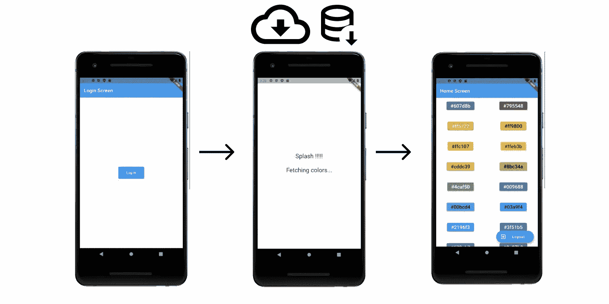
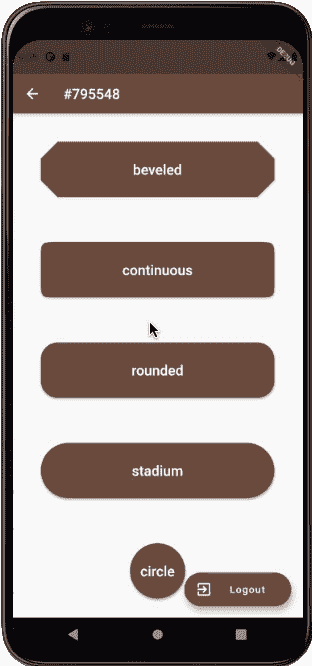

# 用于认证和引导的 Flutter Navigator 2.0 第 4 部分:引导

> 原文：<https://medium.com/codex/flutter-navigator-2-0-for-authentication-and-bootstrapping-part-4-bootstrapping-6ff60c845331?source=collection_archive---------1----------------------->

## [法典](http://medium.com/codex)

*   [第一部分:简介](https://ulusoyca.medium.com/flutter-navigator-2-0-for-authentication-and-bootstrapping-part-1-introduction-d7b6dfdd0849)
*   [第二部分:用户互动](https://ulusoyca.medium.com/flutter-navigator-2-0-for-authentication-and-bootstrapping-part-2-user-interaction-5dc043e7e44a)
*   [第三部分:认证](https://ulusoyca.medium.com/flutter-navigator-2-0-for-authentication-and-bootstrapping-part-3-authentication-93dbcb5f0f0a)
*   **第 4 部分:引导**
*   [第五部分:网络](https://ulusoyca.medium.com/flutter-navigator-2-0-for-authentication-and-bootstrapping-part-5-web-eeb4835804df)

在本系列的第三部分[中，我们探索了带有认证用例的 Navigator 2.0 API。在本文中，我们处理**引导过程**并相应地构建导航栈。](https://ulusoyca.medium.com/flutter-navigator-2-0-for-authentication-and-bootstrapping-part-3-authentication-93dbcb5f0f0a)

让我们从阐明我所说的自举是什么意思开始。据**网站:**

> **…自举是启动计算机时发生的启动过程…虽然自举通常与系统[引导序列](https://techterms.com/definition/bootsequence)相关联，但它也可以由单个应用程序使用。例如，一个程序在打开时可能会自动运行一系列命令。这些命令可以处理用户设置、检查更新和加载动态库...它们被认为是引导进程，因为它们在程序启动时自动运行。**

**在许多应用中，当应用启动时，首先检查认证状态。如果用户登录，应用程序通过从本地和远程数据源获取用户数据来做好准备。通常，闪屏会一直显示给用户，直到应用程序准备好。在本文中，我们将重点放在从应用程序启动开始的屏幕导航，直到应用程序显示带有用户特定数据的主屏幕。**

****

## **颜色仓库**

**在前面的示例中，颜色列表是从 Flutter 的`[Colors](https://api.flutter.dev/flutter/material/Colors-class.html)`类中直接访问的。在这个示例中，我们在引导过程中异步访问来自`[ColorsRepository](https://github.com/ulusoyca/Flutter-ShareWhatYouKnow/blob/develop/lib/002-navigator-2/data/colors_repository.dart)`类的颜色。`[fetchColors()](https://github.com/ulusoyca/Flutter-ShareWhatYouKnow/blob/develop/lib/002-navigator-2/data/colors_repository.dart#L22)`方法从`[Colors](https://api.flutter.dev/flutter/material/Colors-class.html)`类返回相同的颜色列表，延迟 3 秒。**

**通常，存储库模式用于抽象数据访问。因此，我们不应该在这里实现数据访问逻辑。然而，在我们的例子中，我们在存储库类中实现了数据访问逻辑，以便用更少的代码进行简单的解释，并且更加关注实际的主题。**

## **该应用程序**

**当应用程序启动时，`[Router](https://api.flutter.dev/flutter/widgets/Router-class.html)`小部件被实例化，并位于应用程序小部件树的顶部，与前面的示例一样。在这个示例中，我们使用 [*提供者状态管理模式*](https://pub.dev/packages/provider) ，通过`[ColorsViewModel](https://github.com/ulusoyca/Flutter-ShareWhatYouKnow/blob/develop/lib/002-navigator-2/viewmodels/colors_view_model.dart)`和`[AutViewModel](https://github.com/ulusoyca/Flutter-ShareWhatYouKnow/blob/develop/lib/002-navigator-2/viewmodels/auth_view_model.dart)`类将`[ColorsRepository](https://github.com/ulusoyca/Flutter-ShareWhatYouKnow/blob/develop/lib/002-navigator-2/data/colors_repository.dart)`和`[AuthRepository](https://github.com/ulusoyca/Flutter-ShareWhatYouKnow/blob/develop/lib/002-navigator-2/data/auth_repository.dart)`一起注入到 app 中。**

## **路由器授权**

**颜色状态列表与`_loggedIn`、`_selectedColorCode`和`_selectedShape`状态一起保存在`[RouterDelegate](https://api.flutter.dev/flutter/widgets/RouterDelegate-class.html)`类的`_colors`属性中。**

**让我们看看初始化`[RouterDelegate](https://api.flutter.dev/flutter/widgets/RouterDelegate-class.html)`类时会发生什么:**

*   **`[RouterDelegate](https://api.flutter.dev/flutter/widgets/RouterDelegate-class.html)`向`[AuthRepository](https://github.com/ulusoyca/Flutter-ShareWhatYouKnow/blob/develop/lib/002-navigator-2/data/auth_repository.dart)`询问认证状态，并等待直到接收到结果。**
*   **同时，`[Router](https://api.flutter.dev/flutter/widgets/Router-class.html)`小工具调用`[RouterDelegate](https://api.flutter.dev/flutter/widgets/RouterDelegate-class.html)`的`build`方法，`SplashScreen`获取*检查登录状态*显示给用户，如前文所述。**
*   **当收到认证状态时，`[RouterDelegate](https://api.flutter.dev/flutter/widgets/RouterDelegate-class.html)`通知`_loggedIn`的 setter 方法内的`Router`小部件。**
*   **`Router`小部件要求`[RouterDelegate](https://api.flutter.dev/flutter/widgets/RouterDelegate-class.html)`相应地构建导航栈。**

***如果用户已经登录***

*   **从`RouterDelegate`和`SplashScreen`的`build`方法返回带有`_splashStack`的导航器小部件，用于*获取颜色*显示给用户。**

*   **`[RouterDelegate](https://api.flutter.dev/flutter/widgets/RouterDelegate-class.html)`从`[ColorsRepository](https://github.com/ulusoyca/Flutter-ShareWhatYouKnow/blob/develop/lib/002-navigator-2/data/colors_repository.dart#L22)`类中请求颜色。它调用`[ColorsRepository.fetchColors()](https://github.com/ulusoyca/Flutter-ShareWhatYouKnow/blob/develop/lib/002-navigator-2/data/colors_repository.dart#L22)`方法，并等待，直到它收到颜色。**
*   **当获取颜色列表时，`[RouterDelegate](https://api.flutter.dev/flutter/widgets/RouterDelegate-class.html)`设置`colors`状态，并通知其 setter 方法中的`Router`小部件。**
*   **`Router`小部件要求`RouterDelegate`构建`_loggedInStack`导航栈。**

****

***如果用户没有登录***

*   **从`build`方法返回带有`_loggedOutStack`的导航器小部件，并向用户显示`LoginScreen`。**
*   **当在`LoginScreen`内部调用`onLogin`回调时，`loggedIn`状态被设置为真，并通知`Router`小工具。**
*   **从`[RouterDelegate](https://api.flutter.dev/flutter/widgets/RouterDelegate-class.html)`的`build`方法返回带有`_splashStack`的导航器小部件，并且*获取颜色*显示给用户。**
*   **`ColorsRepository.fetchColors()`方法被调用。**
*   **当获取颜色列表时，`RouterDelegate`设置`colors`状态，并在其 setter 方法中通知`Router`小部件。**
*   **`Router`小部件要求`[RouterDelegate](https://api.flutter.dev/flutter/widgets/RouterDelegate-class.html)`构建`_loggedInStack`导航栈。**

****

**与之前的示例应用程序不同的是，`_splashStack`还考虑了`_colors`状态。如果还没有获取`_colors`并且用户已经登录，应用程序应该显示`SplashScreen`，因为它正在等待来自`ColorsRepository`的颜色。`_loggedInStack`和`_loggedOutStack`与第二个样品完全相同。**

**在这个示例应用程序中，我们将颜色列表与用户相关联。因此，当用户注销时，我们通过将`_colors`、`_selectedColorCode`和`_selectedShape`状态设置为`null`来清除状态。我们还应该调用`[ColorsRepository.clearColors()](https://github.com/ulusoyca/Flutter-ShareWhatYouKnow/blob/develop/lib/002-navigator-2/data/colors_repository.dart#L30)`方法来清除与用户相关的数据。**

## **颜色视图模型**

**`[ColorsViewModel](https://github.com/ulusoyca/Flutter-ShareWhatYouKnow/blob/develop/lib/002-navigator-2/viewmodels/colors_view_model.dart)`和`[AuthViewModel](https://github.com/ulusoyca/Flutter-ShareWhatYouKnow/blob/develop/lib/002-navigator-2/viewmodels/auth_view_model.dart)`类扩展了`[ChangeNotifier](https://api.flutter.dev/flutter/foundation/ChangeNotifier-class.html)` mixin，它们使用[提供者状态管理库](https://flutter.dev/docs/development/data-and-backend/state-mgmt/simple)被注入到应用程序树小部件中。`ViewModel`类用于表示数据获取过程的状态。对于许多开发人员来说，使用提供者模式的状态管理是否完全是 MVVM(模型-视图-视图模型)是有争议的。我不打算解释我在这方面的观点，以便将重点更多地放在导航主题上。**

**子部件访问视图模型中的`loggingIn`、`loggingOut`、`fetchingColors`和`clearingColors`状态，以判断操作是否已经开始、正在进行和完成。**

## **注销工厂**

**按下`[LogoutFab](https://github.com/ulusoyca/Flutter-ShareWhatYouKnow/blob/develop/lib/002-navigator-2/002-03-mobile-only-with-auth-and-bootstrap/widgets/logout_fab_03.dart)`小工具时:**

*   **`[AuthViewModel.logout](https://github.com/ulusoyca/Flutter-ShareWhatYouKnow/blob/develop/lib/002-navigator-2/viewmodels/auth_view_model.dart#L35)`被称为。该方法将`AuthViewModel`中的`logingOut`状态设置为`true`，并调用`notifyListeners`，这将导致`LogoutFab`的重建。**
*   **`LogoutFab`小工具显示一个带有`CircularProgresIndicator`的浮动动作按钮(fab)**
*   **当`logout`过程完成后，`AuthViewModel`内的`logingOut`状态被置为`false`，并通知`LogoutFab` widget。**
*   **这一次，`LogoutFab`小部件的重建将不会被注意到，因为随后的`colorsViewModel.clearColors()`调用会将`clearingColors`状态设置为`true`，这将导致另一次重建。**
*   **`[LogoutFab](https://github.com/ulusoyca/Flutter-ShareWhatYouKnow/blob/develop/lib/002-navigator-2/002-03-mobile-only-with-auth-and-bootstrap/widgets/logout_fab_03.dart)`将被重建，带有`CircularProgresIndicator`的 FAB 再次显示。**
*   **当`clearColors()`过程完成后，`AuthViewModel`内的`clearingColors`状态被设置为`false`并通知`LogoutFab`小程序。**
*   **同样，重建将不会被注意到，因为随后的`onLogout`调用将导致在`[RouterDelegate](https://api.flutter.dev/flutter/widgets/RouterDelegate-class.html)`内重建导航历史，结果，`LoginScreen`将被显示。**

## **主屏幕、彩色屏幕、形状屏幕**

**我们希望`HomeScreen`、`ColorScreen`和`ShapeScreen`具有相同的逻辑，以便每当按下`LogoutFab`时，用户都会收到文本通知，告知`logout`正在清除颜色列表。**

**这些小部件内部的状态管理非常简单。如果`AUthViewModel.logingOut`或`ColorsViewModel.clearingColors`为真，我们显示`InProgressMessage`，它是一个定制的小部件，向用户显示操作名称和屏幕名称。**

****

# ****免责声明****

**请注意，在这个示例应用程序中，用于确定当前应用程序状态的所有属性都单独存储在`[RouterDelegate](https://api.flutter.dev/flutter/widgets/RouterDelegate-class.html)`类中，以便于演示和解释。不建议这样做，因为在应用程序开发过程中，这些属性的数量会随着时间的推移而增加，如果将它们都存储起来，会造成过度的破坏。我们需要用一个*干净的*架构来应用最佳实践。例如，我们不需要在`[RouterDelegate](https://api.flutter.dev/flutter/widgets/RouterDelegate-class.html)`中存储`colors`列表。事实上，我们不应该将存储库类注入到`[RouterDelegate](https://api.flutter.dev/flutter/widgets/RouterDelegate-class.html)`中，因为`[RouterDelegate](https://api.flutter.dev/flutter/widgets/RouterDelegate-class.html)`类不需要知道找出应用程序状态需要哪些存储库。相反，我们可以使用依赖注入库来注入与存储库交互的用例类。尽管干净的体系结构超出了本系列文章的范围，但是如果读者不熟悉这个主题，我强烈建议进一步阅读。**

# **结论**

**在本文中，我们学习了如何构建导航堆栈来响应由引导导致的应用程序状态变化。你可以在 [Github 页面](https://github.com/ulusoyca/Flutter-ShareWhatYouKnow/tree/develop/002-navigator2)找到源代码。该项目包括多个`main.dart`文件。运行这个示例应用程序最简单的方法是右键单击`main_002_03.dart`文件并选择`Run 'main_002_03.dart'`。**

**到目前为止，我们在移动应用程序中使用 Navigator 2.0 API。所有这些示例也适用于 Web 应用程序，但是用户体验会很差，因为 Web 浏览器的地址栏不会随着导航栈的更新而更新。[在下一篇文章](https://ulusoyca.medium.com/flutter-navigator-2-0-for-authentication-and-bootstrapping-part-5-web-eeb4835804df)中，我们将学习如何解析和恢复 Web URL 链接并相应地导航。**

**特别感谢 Jon Imanol Durán 审阅了本系列的所有文章，并给了我有用的反馈。如果你喜欢这篇文章，请按下鼓掌按钮，启动 [Github 库](https://github.com/ulusoyca/Flutter-ShareWhatYouKnow)。**