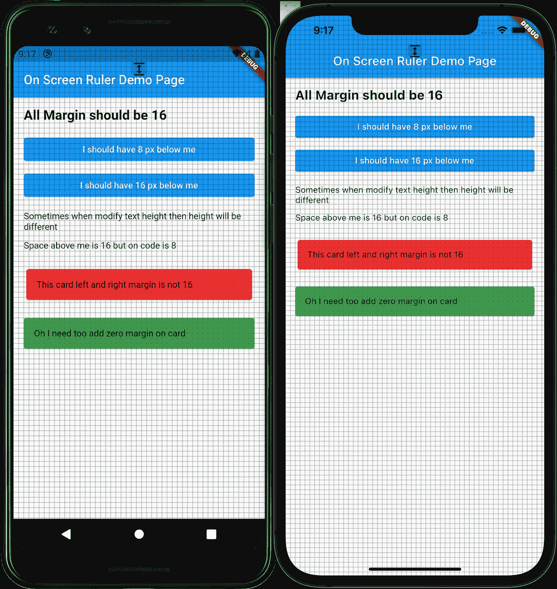
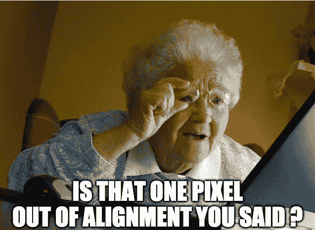
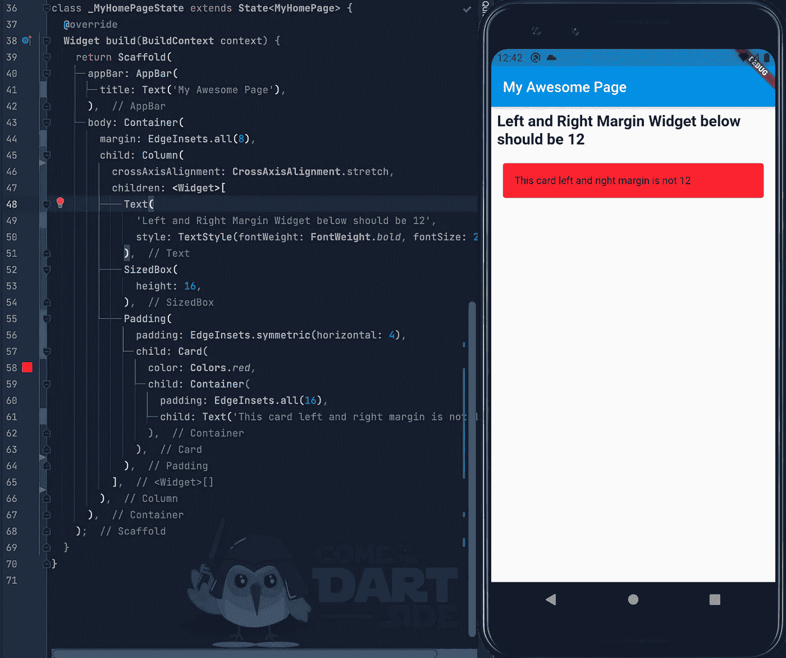
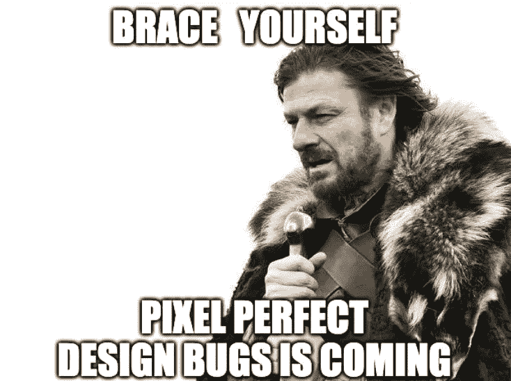

# 立即让您的 Flutter 应用程序达到像素级完美

> 原文：<https://medium.com/codex/flutter-pixel-perfect-9660c4b2f129?source=collection_archive---------3----------------------->



在 Flutter 中构建标准 UI 既简单又快速。使用来自 Flutter 团队和社区的许多小部件集合，您可以用用户友好和直观的语言在两个平台上构建一个简单的 UI。

在 Flutter 中，您可以嵌套任意深度的小部件，而不用担心性能，并且在 Flutter 中推荐嵌套小部件。事实上，如果你有一个很大的部件，那么很有可能你可以或者需要把它分割成更小的部件。

构建一个好的应用程序是困难的，但是构建一个像素级完美的应用程序要困难 100 倍，尤其是如果你有一个没有适当代码约定的大团队。在某种程度上，您将拥有一个很大的小部件集合，其中包含许多默认值、可选值和配置。

如果你有一个不担心所有 UI 细节的客户，你确实需要进一步阅读。如果你的客户或老板注重细节，你需要一些额外的时间来检查所有的 UI 细节。不言而喻，当你的客户说尺寸不对，但你真的无法分辨时，这是多么令人困惑。



让我给你展示一下通常会搞砸的事情的可能性，这导致了一个修复 Flutter 中 1 像素问题的任务。

最简单的例子是，假设您需要创建一张左右边距为 12px 的卡片，您最终编写了下面的代码。



也许你会认为，因为容器有 8px 的边距，所以你只需要添加 4px 的填充，就可以使第 57 行的 Card 小部件有 12px，但是在屏幕上，它不是 12px，而是 16px。卡片小部件中容器的默认边距有四个额外像素。

这只是你可以从 Flutter 中使用的大量小部件中的一个例子，以及你的团队创建的定制小部件。理想情况下，小部件不能有填充或空白。你创建的窗口小部件也不应该有任何大小，所有的大小都应该由父窗口小部件控制，但是错误或异常总是在项目中发生。因此，让我们来讨论如何让你的生活更轻松。

# 下一步是什么

为了确保你的 UI 逐像素显示，你可以使用这个棒极了的[Flutter Pixel Perfect Package](https://pub.dev/packages/pixel_perfect)在你的应用程序上放置叠加图片。类似于 chrome 中的 [PerfectPixel](https://chrome.google.com/webstore/detail/perfectpixel-by-welldonec/dkaagdgjmgdmbnecmcefdhjekcoceebi?hl=en) 。

问题是每次你想在 UI 上检查像素是否完美时，把设计团队的每张图片都放在 assets 文件夹中很麻烦，所以最实用的检查尺寸的方法是用尺子。如果你是 Mac 用户，也许你知道 [xScope](https://xscopeapp.com) 应用程序或 [Redline](https://red-lines-tools.web.app) 工具，它们具有在整个屏幕上逐像素绘制覆盖网格的功能。

在 Flutter 中，在现有应用的基础上绘制网格非常简单。如果你使用 MaterialApp 作为你的主要小部件，那么你只需要在 builder 函数中画出标尺。

```
**class** **MyApp** **extends** **StatelessWidget** {
  **@override**
  Widget build(BuildContext context) {
    **return** MaterialApp(
      builder: (context, widget) {
        **return** Text('Im always here on top of all your screen');
      },
      home: MyHomePage(),
    );
  }
}
```

下一个问题是如何在你的应用程序上画一个 8px 的正方形来填满整个屏幕？

简单的方法是使用 SizedBox**T5(**height:8，width: 8)，用 SizedBo 填充整个屏幕。然而，如果你这样做了，你也会在你的应用程序上绘制很多 SizedBox 部件。或者，您可以使用 [CustomPainter](https://api.flutter.dev/flutter/rendering/CustomPainter-class.html) 手动绘制。你只需要知道设备的宽度和高度，然后用 drawRect 为整个屏幕画一个 8px 的正方形方框。

```
class **GridPainter** extends **CustomPainter** {
  **double** deviceWidth;
  **double** deviceHeight;

  **GridPainter*(***this.deviceWidth, this.deviceHeight***)***;

  @override
  void paint***(*Canvas** canvas, **Size** size***) {*** var paint = Paint()
      ..strokeWidth = 1
      ..style = **PaintingStyle**.stroke
      ..strokeCap = **StrokeCap**.round;

    for ***(***var i = -***(***deviceHeight / 2***)***; i ***<*** deviceHeight; i += 8***) {*** for ***(***var j = -***(***deviceWidth / 2***)***; j ***<*** deviceWidth; j += 8***) {*** canvas.drawRect***(*** Offset***(***j.toDouble(), i.toDouble()***)*** & Size***(***8, 8***)***,
            paint***)***;
      ***}
    }
  }*** @override
  **bool** shouldRepaint***(*CustomPainter** oldDelegate***) {*** return false;
  ***}*** }
```

接下来，在您需要在 MaterialApp 小部件上的 builder 函数中返回的小部件中使用 GridPainter。

```
@override
**Widget** build***(*BuildContext** context***) {*** var width = **MediaQuery**.*of****(***context***)***.size.width;
  var height = **MediaQuery**.*of****(***context***)***.size.height;
  return Stack***(*** children: ***[*** widget.child,
        Center***(*** child: IgnorePointer***(*** child: CustomPaint***(*** painter: GridPainter***(***width, height***)***,
            ***)***,
          ***)***,
        ***)***,
    ***]***,
  ***)***;
***}***
```

之后，你只需要考虑如何隐藏或显示网格的自己的实现，你可以对代码进行注释，并在需要显示标尺时启用它。现在，您可以在应用程序中快速验证微件的大小。

双击演示页面标题上方的黑色**“**图标，亲自尝试一下。

# 现在怎么办？

如果需要快捷方式，可以查看这个包。

[](https://pub.dev/packages/on_screen_ruler) [## on_screen_ruler |颤振包

### 在你的应用程序上画一个 8px 的正方形，如果你的客户有鹰眼，你会需要这个。1.去拿…

公共开发](https://pub.dev/packages/on_screen_ruler) 

现在，如果您的老板或客户抱怨并告诉您有一个像素没有对齐，您可以展示标尺并讨论比一个像素没有对齐更重要的问题，但不要忘记如果您的客户或您的测试人员知道这一点，他们也可以很容易地发现对齐错误。

