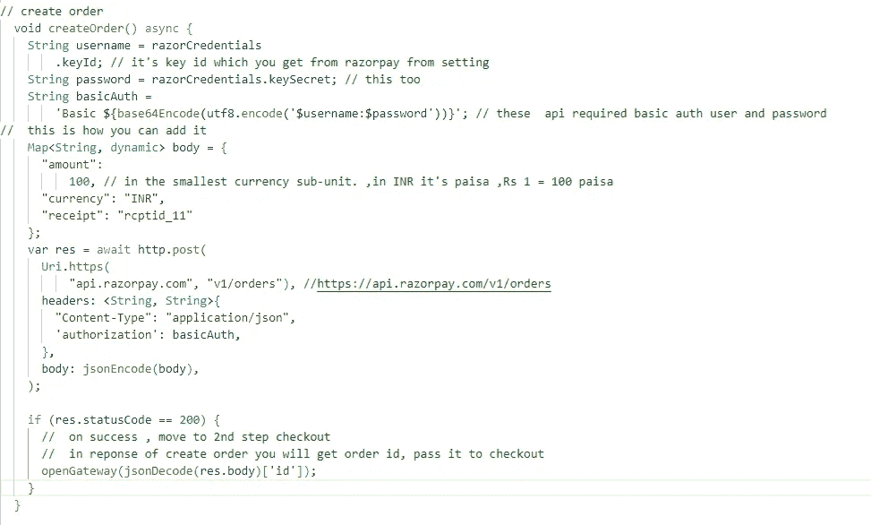

# flutter——razor pay 支付网关集成

> 原文：<https://medium.com/codex/flutter-razorpay-payment-gateway-integration-9aeb6210e914?source=collection_archive---------5----------------------->

有很多支付网关可以集成到你的应用程序中，其中之一是 Razorpay。这是一个流行的和最常用的支付网关之一。

在本文中，我们将看到如何将 Razorpay 集成到 flutter 应用程序中。


# **所需插件**

1- [razorpay_flutter](https://pub.dev/packages/razorpay_flutter)

2- [http](https://pub.dev/packages/http)

我们将使用 http 插件进行 API 调用。

# **添加 Proguard 规则(仅适用于 Android)**

如果您在构建中使用 Proguard，您需要在 Proguard 文件中添加以下代码行


proguard-rules.pro

# 在 IOS 上启用 UPI 意图

通过在您的应用程序的结账表单上启用 UPI Intent，为您的客户提供更好的支付体验。在 UPI 意向流中:

1.客户在您的 iOS 应用程序中选择 UPI 作为支付方式。显示支持意向流的 UPI 应用列表。例如 PhonePe、Google Pay 和 Paytm。

2.客户选择偏好的应用程序。UPI 应用程序打开时会显示预先填充的付款详情。

3.客户输入 UPI PIN 码完成交易。

通过在您的应用程序的结账表单上启用 UPI Intent，为您的客户提供更好的支付体验。在 UPI 意向流中:

1.客户在您的 iOS 应用程序中选择 UPI 作为支付方式。显示支持意向流的 UPI 应用列表。比如 PhonePe，Google Pay，Paytm。

2.客户选择他们喜欢的应用程序。UPI 应用程序打开时会显示预先填充的付款详情。

3.客户输入他们的 UPI PIN 以完成他们的交易。

4.一旦支付成功，客户将被重定向到您的应用程序或网站。

要在 iOS 集成中启用此功能，您必须在应用的 info.plist 文件中进行以下更改。


信息列表

# **所需的最低版本**

对于 **Android** ，请确保您的应用程序的最低 API 级别为 19 或更高。

对于 **iOS** ，请确保您的应用的最低部署目标是 iOS 10.0 或更高版本。此外，不要忘记为您的项目启用位代码。

让我们开始编码…

# 创建 Razorpay 实例

import ' package:razor pay _ flutter/razor pay _ flutter . dart '；

final _razorpay = Razorpay()。

# 附加事件侦听器

该插件使用基于事件的通信，并在支付失败或成功时发出事件。

事件名称通过`Razorpay`类中的常量`EVENT_PAYMENT_SUCCESS`、`EVENT_PAYMENT_ERROR`和`EVENT_EXTERNAL_WALLET`公开。

在`Razorpay`实例上使用`on(String event, Function handler)`方法来附加事件监听器。


initState (main.dart)中的侦听器

处理程序将在类中定义为:


要清除事件侦听器，请在`Razorpay`实例上使用`clear`方法。


完整 Razorpay 流程可以分为 3 个部分

1-创建订单

2-结帐

3-签名验证

让我们一个一个地看这些部分

# 创建订单

订单是支付过程中的一个重要步骤。

*   应该为每笔付款创建一个订单。
*   您可以使用订单 API 创建订单。它是一个服务器端 API 调用。
*   响应中收到的 order_id 应该被传递给 checkout。这将订单与付款联系起来，并保护请求不被篡改。



创建订单

# 添加结帐选项

传递结账选项。确保您通过了在对上一步的响应中收到的`order_id`。


检验

# 处理监听器中的响应

如果成功，我们将验证签名


# 验证签名

这是一个强制步骤，用于确认返回到成功付款的结帐表单的详细信息的真实性。

**在你的服务器上生成签名**

你得下载 Razorpay PHP SDK。

您可以下载或运行 composer 命令来安装 Razorpay PHP SDK。

[计] 下载

从 GitHub 的发布部分下载最新的 [razorpay-php.zip 文件](https://github.com/razorpay/razorpay-php/releases/)。razorpay-php.zip 是预编译的，包含了所有的依赖项。

使用编写器命令

您可以使用 composer 命令安装 Razorpay。在您的 Composer 上运行下面的命令:解压缩 SDK 文件，并将 Razorpay.php 文件包含在您的项目中。

```
Install using Composercomposer **require** razorpay/razorpay:2.*
```


在服务器上验证的 PHP 代码

**调用验证码**


查看 GitHub 上的完整代码。

[](https://github.com/aniket-yadav/razorpay_demo) [## GitHub-ani ket-yadav/razor pay _ demo

### 此时您不能执行该操作。您已使用另一个标签页或窗口登录。您已在另一个选项卡中注销，或者…

github.com](https://github.com/aniket-yadav/razorpay_demo)