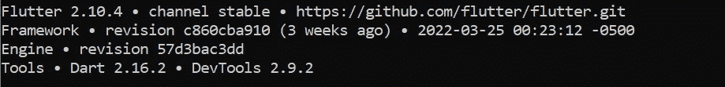
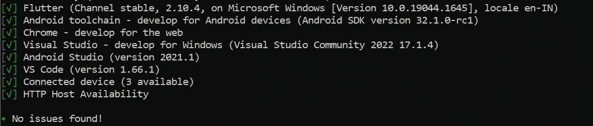
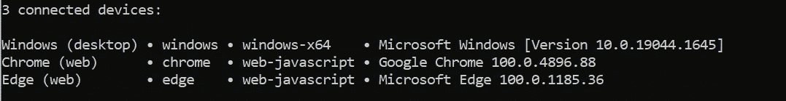
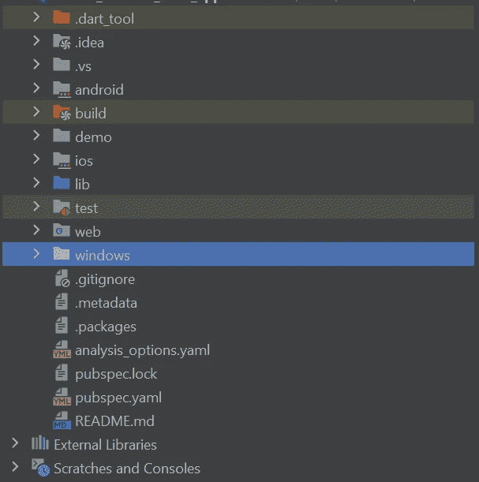

# Flutter:为 Windows 桌面应用设置

> 原文：<https://medium.com/codex/flutter-set-up-for-windows-desktop-app-593c49a3501?source=collection_archive---------9----------------------->


图片来源:谷歌图片

lutter 以其跨平台和高性能的应用程序而闻名，这些应用程序可以在移动、网络、桌面和嵌入式设备上运行。

很长一段时间，对 Flutter 的桌面支持都是实验性的，但是随着 **Flutter 2.0** 的发布，桌面支持(macOS、Linux 和 Windows)现在已经可以在 Flutter 的稳定分支上使用了。

我们将学习如何在 Windows 桌面操作系统上安装 Flutter SDK，并使用它来创建应用程序。

## 构建 Flutter 桌面应用程序需要以下先决条件。

*   [你的系统上配置了 Flutter SDK](https://docs.flutter.dev/get-started/install) 。
*   一个支持 Flutter 的 IDE， [Android Studio](https://developer.android.com/studio/install) ， [IntelliJ IDEA](https://www.jetbrains.com/idea/download/) ，或者 [VS Code](https://code.visualstudio.com/) 。

> **需要 Flutter 2.0** 或更高版本才能在稳定通道上访问 Flutter 桌面功能。

**运行以下命令检查您的颤振版本:**

```
flutter --version
```

输出应该类似于这样:



输出

# 配置平台

根据将构建 Flutter 应用程序的操作系统，还有一些额外的先决条件。

> **注意:**创建一个桌面 app，你要在目标平台上构建——比如 macOS 的 app 要在 macOS 上构建，Linux 的 app 要在 Linux 上构建，Windows 的 app 要在 Windows 上构建。

## **为 Windows 应用程序设置 Flutter:**

若要创建 Windows 应用，你需要在电脑上安装以下软件:

*   Visual Studio 2022
*   对于 Win32:安装“使用 C++进行桌面开发”工作负载
*   对于 UWP:安装“通用 Windows 平台开发”工作负载

Flutter 默认为 Windows 上的 **Win32** 创建应用。您可以使用以下命令来启用它:

```
flutter config --enable-windows-desktop
```

你必须在 *Flutter dev 频道*上创建 UWP(通用 Windows 平台)应用。运行这些命令:

```
flutter channel dev
flutter upgrade
flutter config --enable-windows-uwp-desktop
```

**颤振医生**应该运行一次，看看有没有问题没有整改。输出应该是这样的:



输出

如果你运行**颤振设备**的话，窗口应该是可访问的设备之一:



输出

## 制作新的 Flutter 桌面应用程序

一旦您启用平台来构建应用程序，您可以简单地使用 **flutter create** 命令来生成一个具有桌面支持的新项目。

从命令行运行以下命令:

```
flutter create <project_name>
```

将<project name="">替换为您想要使用的项目名称。</project>

现在，在您首选的 IDE 中打开该项目。

也可以使用 VS Code、Android Studio、IntelliJ IDEA 之类的 IDE 开发新的 Flutter app。

用 ide 打开项目后，查看一下项目中可用的目录。你会看到除了 android、ios 和 web，还有一个 **macos** 、 **linux** 或 **windows** 目录(取决于你启用的桌面平台)。



项目目录

## 在 Windows 上运行

要使用 Win32 在 Windows 上运行软件，请按照下列步骤操作:

```
flutter run -d windows
```

在命令行中使用以下命令在 UWP 模式下执行应用程序:

```
flutter run -d winuwp
```

或者，您可以简单地使用以下命令来运行执行应用程序:

```
flutter run
```

## **参考文献**

*   [**在桌面上飘起**](https://flutter.dev/multi-platform/desktop?gclid=Cj0KCQjwjN-SBhCkARIsACsrBz54PAEyFH0Pv5Q_9Cxn7lWxuRfOzpNVTcnbtseTvRBnVoX0O8cAaD0aAmrJEALw_wcB&gclsrc=aw.ds)
*   [**颤振 2.10 在这里**](https://www.googleadservices.com/pagead/aclk?sa=L&ai=DChcSEwiEuI2pipX3AhX_kmYCHRZ4DSIYABACGgJzbQ&ohost=www.google.com&cid=CAESbOD2y2QjqQ8Y5LwJLOftToaaZzPYsUPwC4IhKNihlrw_SIhBRLj20NEEh0Jupgfd4u4tpgu-KCEP0utyXGbyANcURKr4fCo4ia7JwU01eNoO_7kP4CKqwU7Trcz173MsK3aLQ4R4_eUG8WDPSg&sig=AOD64_3b6aCwcTw19rwQ9jqhazsvWGisrw&ved=2ahUKEwi9xYWpipX3AhU-ILcAHSAPCQgQqyQoAXoECAIQBg&adurl=)

*感谢您花时间阅读本文。如果你觉得这个帖子有用又有趣，请鼓掌推荐。*

*如果我做错了什么，请在评论中提出来。我很想进步。*