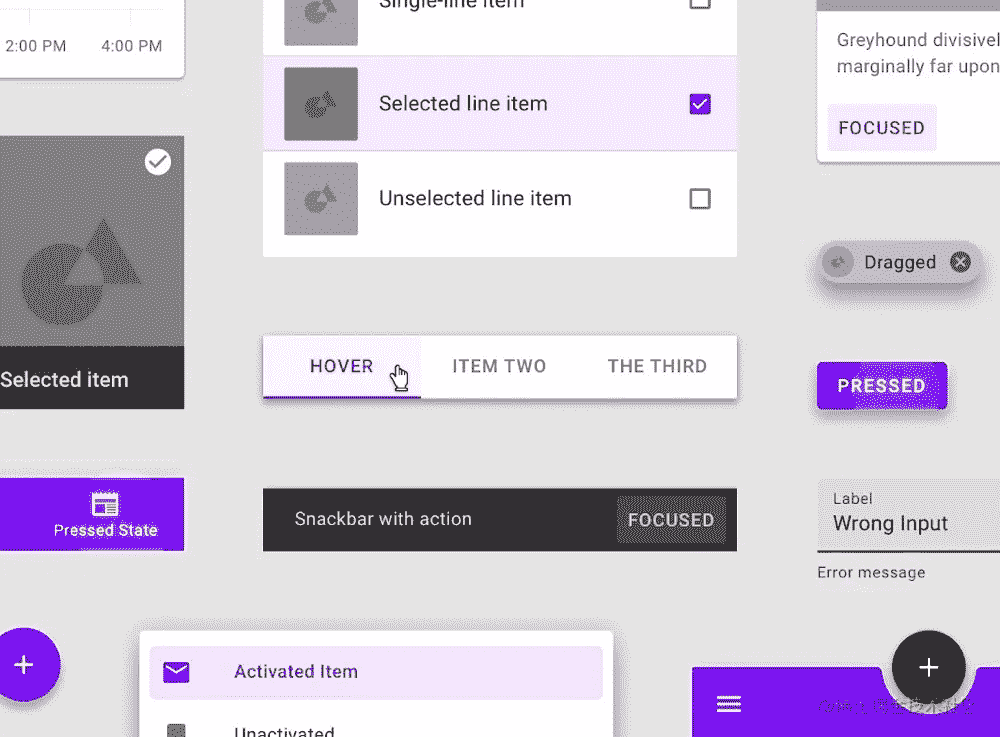
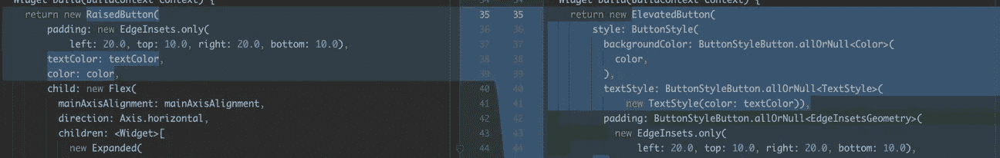
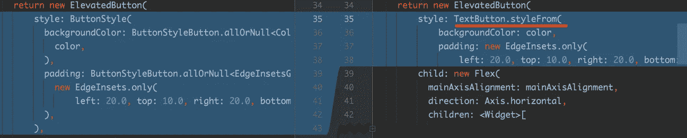
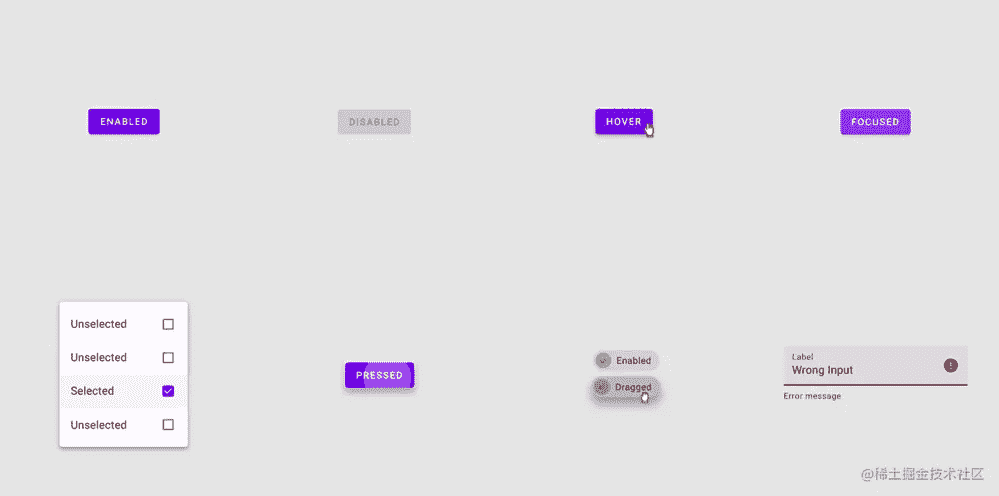
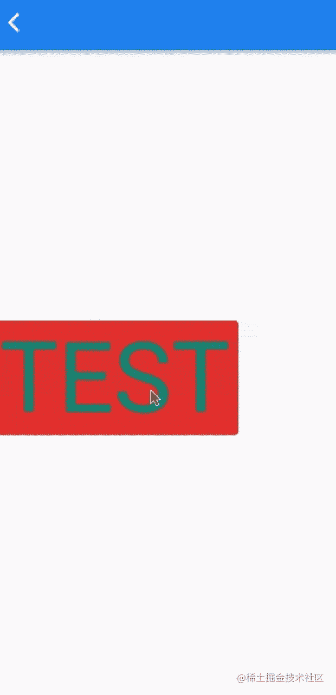
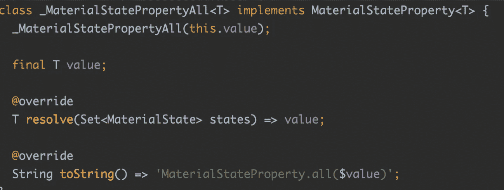
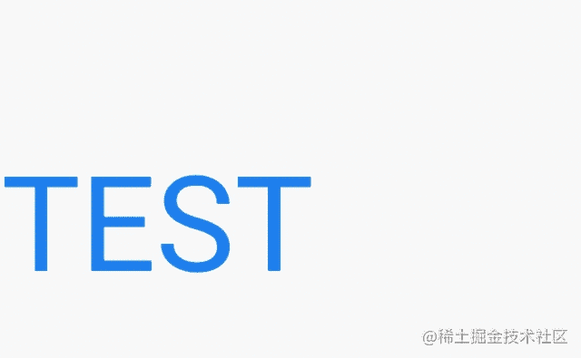
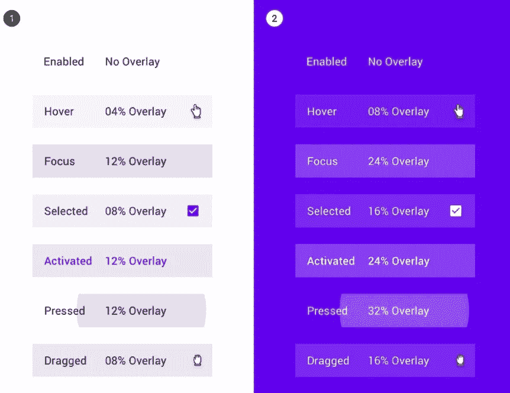
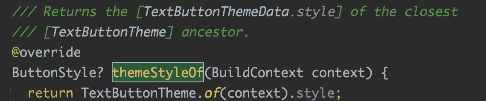

# 按钮样式和材质状态属性的抖动技巧

> 原文：<https://medium.com/codex/flutter-skill-of-buttonstyle-and-materialstateproperty-2e6d7003982d?source=collection_archive---------4----------------------->

你还记得去年 Flutter 2 发布的时候，除了 null safety 之外，还有一系列关于 Widget 的突破性变化，比如:

> `FlatButton`被标记为已弃用，需要替换为`TextButton`

现在我们有了 flutter 3，你确定你对`*TextButton*`或者`MaterialStateProperty` 有足够的了解吗？

**为什么** `**TextButton**` **与** `**MaterialStateProperty**` **相关联？**

首先说到`MaterialStateProperty` ，就不得不提材质设计。**`**MaterialStateProperty**`**的设计理念是基于材质设计兼容整个平台的交互。****

****

**我相信当你从 Fluter 1 换到 Fluter 2 的时候，你应该有这个疑问:**

> ****为什么**`**FlatButton**`**`**RaisedButton**`**被弃用，而代之以**`**TextButton**`**`**RaisedButton**`**？********

********

****以前只需要使用`textColor`、`backgroundColor`或者其他参数来设置颜色，而现在使用`ButtonStyle`在代码量方面会造成很多麻烦。****

****当然，后续，Flutter 也提供了`styleFrom`**等静态方法来简化代码，但是本质上切换到** `**ButtonStyle**` **是什么意思呢？什么是** `**MaterialStateProperty**` **？******

********

****首先，我们来看看`MaterialStateProperty`。`MaterialStateProperty`中有一个`MaterialState`枚举，包括:****

*   ****禁用:当小部件或元素不能交互时****
*   ****悬停:交互悬停时****
*   ****聚焦:在键盘交互中突出显示****
*   ****选中:例如，复选框的选中状态****
*   ****按下:由鼠标、键盘或触摸发起的点击或点击****
*   ****拖动:当用户长按并移动小工具时****
*   ****错误:处于错误状态，如文本字段错误****

********

****所以答案是:随着 Web 和桌面平台的发布，原有的`FlatButton`已经不能很好地满足新交互的需求，比如鼠标悬停在键下的交互。****

****于是，`**TextButton**` **开始使用** `**MaterialStateProperty**` **组成** `**ButtonStyle**` **来支持不同平台下的 UI 状态显示。******

****在此之前，如果你需要多平台改编，你可以写这个。你需要处理许多不同的状态条件来产生无数的 `if`或`case`:****

```
**getStateColor(Set<MaterialState> states) {
    if (states.contains(MaterialState.hovered)) {
      /// hovered and focused 
      if (states.contains(MaterialState.focused)) {
        return Colors.red;
      } else {
        return Colors.blue;
      }
    } else if (states.contains(MaterialState.focused)) {
      return Colors.yellow;
    }
    return Colors.green;
  }**
```

****但是现在，你只需要继承`MaterialStateProperty`然后使用 [@override](http://twitter.com/override) `resolve`方法。****

****例如，`TextButton` 中的悬停效果默认在`_TextButtonDefaultOverlay` 实现中传递，以便`primary.withOpacity` 实现悬停效果。****

```
**@immutable
class _TextButtonDefaultOverlay extends MaterialStateProperty<Color?> {
  _TextButtonDefaultOverlay(this.primary); final Color primary; @override
  Color? resolve(Set<MaterialState> states) {
    if (states.contains(MaterialState.hovered))
      return primary.withOpacity(0.04);
    if (states.contains(MaterialState.focused) || states.contains(MaterialState.pressed))
      return primary.withOpacity(0.12);
    return null;
  } @override
  String toString() {
    return '{hovered: ${primary.withOpacity(0.04)}, focused,pressed: ${primary.withOpacity(0.12)}, otherwise: null}';
  }
}**
```

********

****事实上，在`TextButton`内部，默认情况下，所需的`MaterialState`效果也是通过`styleFrom`配置的，包括:****

*   ****`_TextButtonDefaultForeground`:用于通过`onSurface?.withOpacity(0.38)`改变颜色来处理禁用****
*   ****`_TextButtonDefaultOverlay`:通过`primary.withOpacity`进行悬停、聚焦、按压改变颜色****
*   ****`_TextButtonDefaultMouseCursor`:不能处理鼠标光标；****

****其余参数都是通过熟悉的`ButtonStyleButton.allOrNull` 方法，其中的参数不需要特殊处理。****

******但是** `**ButtonStyleButton.allOrNull**` **的作用是什么？******

****实际上，`ButtonStyleButton.allOrNull`是基于`MaterialStateProperty.all` 可空版本，实现了`resolve`接口的`MaterialStateProperty`。****

****如果不需要支持 null，也可以直接使用`MaterialStateProperty.all`。****

```
****static** MaterialStateProperty<T>? allOrNull<T>(T? value) => value == **null** ? **null** : MaterialStateProperty.all<T>(value);**
```

********

****当然，如果您不想创建一个新的类，但是想定制逻辑，如下面的代码所示，您也可以使用`resolveWith`静态方法:****

```
**TextButton(
  style: ButtonStyle(
      backgroundColor: MaterialStateProperty.resolveWith((states) {
    if (states.contains(MaterialState.hovered)) {
      return Colors.green;
    }
    return Colors.transparent;
  })),
  onPressed: () {},
  child: new Text(
    "TEST",
    style: TextStyle(fontSize: 100),
  ),
),**
```

********

****Google 在对 Widget 做出`MaterialState`的 UI 响应时，也遵循了 Material Design 的设计规范，比如 hover `primary.withOpacity(0.04);` 因此`TextButton`和`ElevatedButton`都遵循类似的规范:****

********

****另外，有时候你不想每个地方都单独配置 style，需要配合 Theme 来实现。****

****其实`TextButton`、`ElevatedButton`、`OutlinedButton`都是`ButtonStyleButton`的子类。它们都遵循以下原则:****

```
**final ButtonStyle? widgetStyle = widget.style;
    final ButtonStyle? themeStyle = widget.themeStyleOf(context);
    final ButtonStyle defaultStyle = widget.defaultStyleOf(context);
    assert(defaultStyle != null);

    T? effectiveValue<T>(T? Function(ButtonStyle? style) getProperty) {
      final T? widgetValue  = getProperty(widgetStyle);
      final T? themeValue   = getProperty(themeStyle);
      final T? defaultValue = getProperty(defaultStyle);
      return widgetValue ?? themeValue ?? defaultValue;
    }
复制代码**
```

> ****如:`return widgetValue ?? themeValue ?? defaultValue;`。****

****所以，比如当你需要全局去除水波纹效果时，如下面的代码所示，你可以修改`ThemeData`的`TextButtonTheme`来实现，因为`TextButton`中的`themeStyleOf`使用了`TextButtonTheme`。****

```
**theme: ThemeData(
  primarySwatch: Colors.blue,
  textButtonTheme: TextButtonThemeData(
    // remove
    style: ButtonStyle(splashFactory: NoSplash.splashFactory),
  ),
),**
```

********

****最后做个总结:****

*   ****如果只是简单配置背景色，可以直接使用`styleFrom`****
*   ****如果单独配置，可以使用`ButtonStyleButton.allOrNull`****
*   ****如果你需要灵活性，你可以使用`ButtonStyleButton.resolveWith`或者实现`MaterialStateProperty.`或者`resolve`****