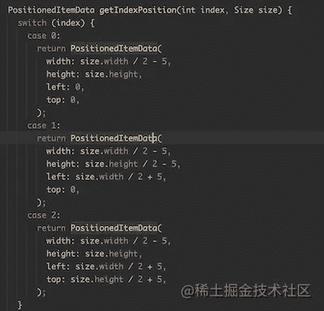
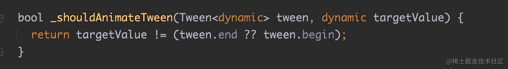
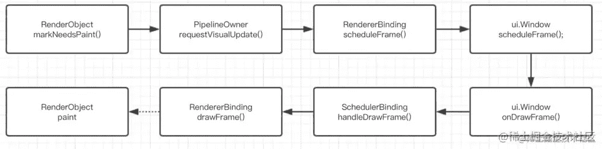
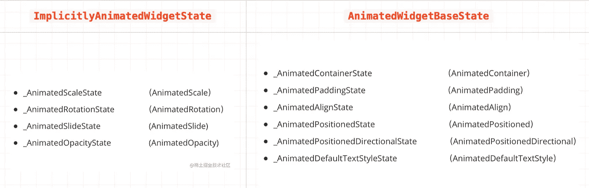
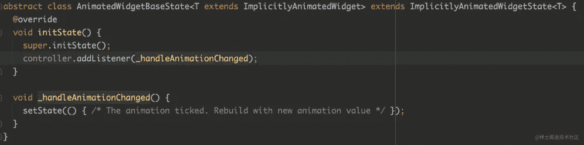
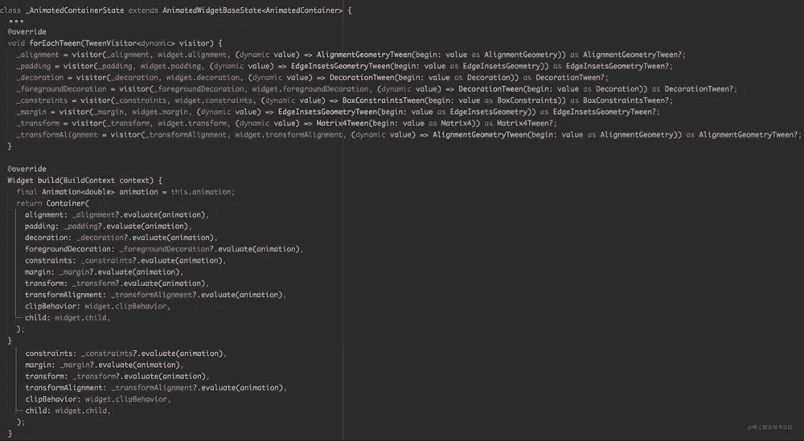
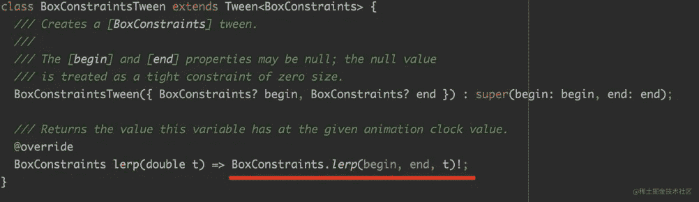
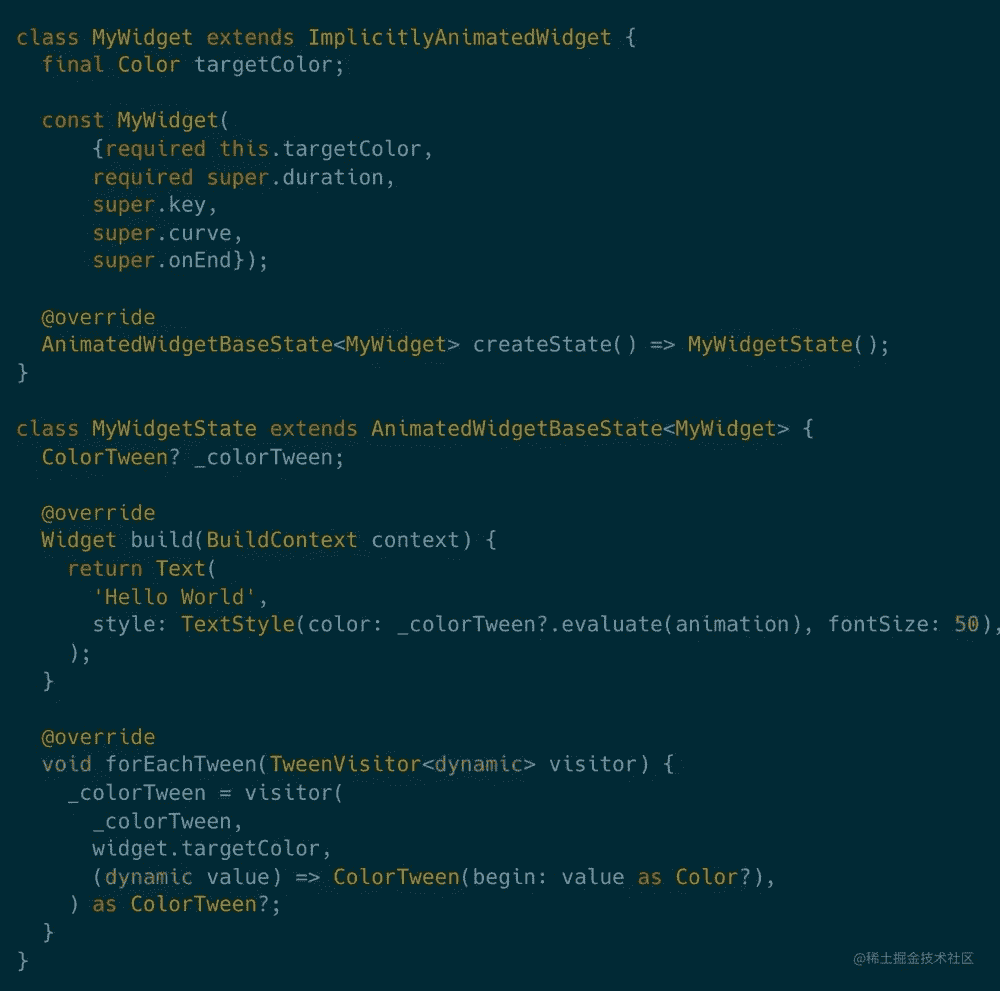
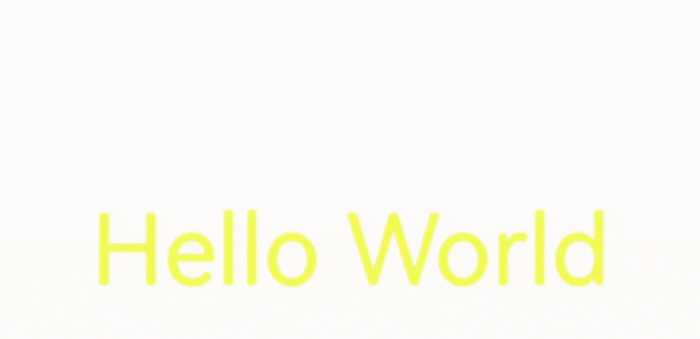

# 趣味动画的飘动技巧

> 原文：<https://medium.com/codex/flutter-skill-of-interesting-animation-d12325b3020d?source=collection_archive---------9----------------------->

在本章中，我们将分析颤振中的动画技巧。

首先我们来看下面的 Gif。如果想达到以下动画切换效果，怎么考虑？


# 动画

其实在颤振中实现类似的动画效果是很简单的。你甚至不需要定制布局。
首先，我们需要使用`AnimatedPositioned`和`AnimatedContainer`:

*   `AnimatedPositioned`用于动画显示`Stack`中的位置
*   `AnimatedContainer`用于制作尺寸变化的动画

接下来，我们定义一个`PositionItem`，将`AnimatedPositioned`和`AnimatedContainer`嵌套在一起，并使用`PositionedItemData`来改变它们的位置和大小。

```
class PositionItem extends StatelessWidget {
  final PositionedItemData data;
  final Widget child;

  const PositionItem(this.data, {required this.child});

  @override
  Widget build(BuildContext context) {
    return new AnimatedPositioned(
      duration: Duration(seconds: 1),
      curve: Curves.fastOutSlowIn,
      child: new AnimatedContainer(
        duration: Duration(seconds: 1),
        curve: Curves.fastOutSlowIn,
        width: data.width,
        height: data.height,
        child: child,
      ),
      left: data.left,
      top: data.top,
    );
  }
}
class PositionedItemData {
  final double left;
  final double top;
  final double width;
  final double height;

  PositionedItemData({
    required this.left,
    required this.top,
    required this.width,
    required this.height,
  });
}
```

之后我们只需要将`PositionItem`放在`Stack`下面，然后通过`LayoutBuilder`获取`parent`的大小，根据`PositionedItemData`调整`PositionItem`的位置和大小，就可以轻松实现初始的动画效果。

```
child: LayoutBuilder(
  builder: (_, con) {
    var f = getIndexPosition(currentIndex % 3, con.biggest);
    var s = getIndexPosition((currentIndex + 1) % 3, con.biggest);
    var t = getIndexPosition((currentIndex + 2) % 3, con.biggest);
    return Stack(
      fit: StackFit.expand,
      children: [
        PositionItem(f,
            child: InkWell(
              onTap: () {
                print("red");
              },
              child: Container(color: Colors.redAccent),
            )),
        PositionItem(s,
            child: InkWell(
              onTap: () {
                print("green");
              },
              child: Container(color: Colors.greenAccent),
            )),
        PositionItem(t,
            child: InkWell(
              onTap: () {
                print("yello");
              },
              child: Container(color: Colors.yellowAccent),
            )),
      ],
    );
  },
),
```

如下图，您可以通过每次切换相应的索引来调整相应项目的大小和位置，从而触发`AnimatedPositioned`和`AnimatedContainer`产生动画效果，类似于初始动画的动画效果。



> [https://github . com/CarGuo/gsy _ flutter _ demo/blob/master/lib/widget/anim _ switch _ layout _ demo _ page . dart](https://github.com/CarGuo/gsy_flutter_demo/blob/master/lib/widget/anim_switch_layout_demo_page.dart)

如果你对实现原理不感兴趣，这就是结局。你从上面学到了一点技巧:

> 改变`**AnimatedPositioned**`和`**AnimatedContainer**`的任何参数，都可以使其产生动画效果。它们的参数与`Positioned`和`Container`完全相同，因此可以用来无缝替换`Positioned`和容器。只需要配置`duration`等附加参数即可。

# 先进的

`AnimatedPositioned`和`AnimatedContainer`是如何实现动画效果的？这里我们将介绍一个抽象的父类:`ImplicitlyAnimatedWidget`。

> 几乎所有以 animated 开头的小部件都继承自它。既然是用来做动画的，`ImplicitlyAnimatedWidget`一定是`StatefulWidget`。不出意外，它的实现逻辑主要在于`ImplicitlyAnimatedWidgetState`，我们后面会展开。

首先，让我们回顾一下在 Flutter 中使用动画的要求:

*   `AnimationController`:用于控制动画的开始和暂停
*   `TickerProvider`:用于创建`AnimationController`所需的 Vsync 参数。一般来说，`SingleTickerProviderStateMixin`是最常用的
*   `Animation`:用于处理动画的值，如`CurvedAnimation`
*   接收动画的对象:例如`FadeTransition`

Flutter 中的动画从 ticker 开始。当我们在状态下使用`with TickerProviderStateMixin`时，意味着我们有能力执行动画:

> Flutter 每画一帧，`Ticker`就会同步执行`AnimationController`中的`_tick`方法，然后执行`notifyListeners`改变`Animation`的值，从而触发状态的`setState`或者 RenderObject 的`markNeedsPaint`更新接口。

例如，如下面的代码所示，而这部分代码是高度重复的。因此，对于这部分逻辑，官方提供了一个`ImplicitlyAnimatedWidget`模板。

```
class _AnimatedOpacityState extends State<AnimatedOpacity>
    with TickerProviderStateMixin {
  late final AnimationController _controller = AnimationController(
    duration: const Duration(seconds: 2),
    vsync: this,
  )..repeat(reverse: true);
  late final Animation<double> _animation = CurvedAnimation(
    parent: _controller,
    curve: Curves.easeIn,
  );

  @override
  void dispose() {
    _controller.dispose();
    super.dispose();
  }

  @override
  Widget build(BuildContext context) {
    return Container(
      color: Colors.white,
      child: FadeTransition(
        opacity: _animation,
        child: const Padding(padding: EdgeInsets.all(8), child: FlutterLogo()),
      ),
    );
  }
}
```

比如上面的淡入淡出动画，`ImplicitlyAnimatedWidgetState`只需要实现`forEachTween`方法和`didUpdateTweens`方法，而不需要实现`AnimationController`和`CurvedAnimation`。

```
class _AnimatedOpacityState extends ImplicitlyAnimatedWidgetState<AnimatedOpacity> {
  Tween<double>? _opacity;
  late Animation<double> _opacityAnimation;

  @override
  void forEachTween(TweenVisitor<dynamic> visitor) {
    _opacity = visitor(_opacity, widget.opacity, (dynamic value) => Tween<double>(begin: value as double)) as Tween<double>?;
  }

  @override
  void didUpdateTweens() {
    _opacityAnimation = animation.drive(_opacity!);
  }

  @override
  Widget build(BuildContext context) {
    return FadeTransition(
      opacity: _opacityAnimation,
      alwaysIncludeSemantics: widget.alwaysIncludeSemantics,
      child: widget.child,
    );
  }
}
```

**当** `**opacity**` **改变时** `**ImplicitlyAnimatedWidgetState**` **如何触发动画？**

关键在于`forEachTween`的实施:

当`opacity`更新后，`forEachTween`将被调用。此时，内部`_shouldAnimateTween`确定值是否已经改变。如果目标值已经改变，基类中的`AnimationController.forward`将被执行开始动画。



> 这里补充一个内容:`FadeTransition`会调用`_opacityAnimation`增加兼容性。当`AnimationController`开始执行动画时，会触发`_opacityAnimation`执行`markNeedsPaint`。如下图所示，`markNeedsPaint`最终会触发RenderObject 的重绘。



所以在这里我们知道:通过继承`ImplicitlyAnimatedWidget`和`ImplicitlyAnimatedWidgetState`，可以更方便的实现一些动画效果。《快门》中很多默认的动画效果都是通过它实现的。

> 另外，在`ImplicitlyAnimatedWidget`模板中，除了`ImplicitlyAnimatedWidgetState`之外，官方还提供了另一个子类`AnimatedWidgetBaseState`。

实际上，flutter 中常用的动画控件都是通过`ImplicitlyAnimatedWidget`模板实现的，如下图所示，分别是 flutter 中常用动画控件继承的状态:



这两种状态之间差异可以简单地理解为:

*   `ImplicitlyAnimatedWidgetState`主要配合各种`*Transition` Widget 使用，比如`AnimatedOpacity`中的`FadeTransition`和`AnimatedScale`中的`ScaleTransition`，因为`ImplicitlyAnimatedWidgetState`不使用setState，而是通过触发 RenderObject 的`markNeedsPaint`来更新界面
*   `**AnimatedWidgetBaseState**`在原来的`**ImplicitlyAnimatedWidgetState**`的基础上增加了自动`**setState**`，这样它可以做一些更灵活的动画，比如我们前面用过的`AnimatedPositioned`和`AnimatedContainer`



其实，`AnimatedContainer`本身就是一个很有代表性的实现。如果你看看它的源代码，你会发现它的实现非常简单。你只需要实现`forEachTween`中参数对应的`Tween`实现即可。



比如我们前面改的`width`和`height`其实就是改了`Container`的`BoxConstraints`，所以对应的实现是`BoxConstraintsTween`。`BoxConstraintsTween` 继承了`Tween`，主要实现了`Tween`的`lerp`方法。



在 Flutter 中，使用`lerp`方法实现插值:动画时在`beigin`和`end`之间进行`BoxConstraint`线性插值，其中 t 为动画时钟值下的变化值，例如:

> 计算 100x100 到 200x200 的过程中需要的一些中间过程的大小。

如下面的代码所示，通过继承`AnimatedWidgetBaseState`，然后使用`ColorTween` `lerp`，可以快速实现下面文字的渐变效果。

