# MediaQuery 的颤振技巧及性能优化

> 原文：<https://medium.com/codex/flutter-skill-of-mediaquery-and-performance-optimization-2fbf9c532fea?source=collection_archive---------3----------------------->

每个人在颤振中应该都离不开`MediaQuery`，比如通过`MediaQuery.of(context).size`获取屏幕大小，或者通过`MediaQuery.of(context).padding.top`获取状态栏的高度。

首先，我们需要简单解释一下`MediaQuery.of`，因为`MediaQueryData`中有几个类似的参数:

*   `viewInsets`:被系统用户界面完全遮挡的部分尺寸，如键盘高度
*   `padding`:是状态栏和底部安全区，但键盘弹出时底部会变成 0
*   `viewPadding`:和`padding`一样，但是弹出键盘时底部不会改变

比如在 iOS 上，如下图所示，无论是否弹出键盘，都可以看到`MediaQueryData`中一些参数的变化:

*   `viewInsets`:键盘未弹出时为 0，键盘弹出后底部变为 336
*   `padding`:弹出键盘前后的区别在于`bottom`由 34 改为 0
*   `viewPadding`:键盘弹出前后数据不变

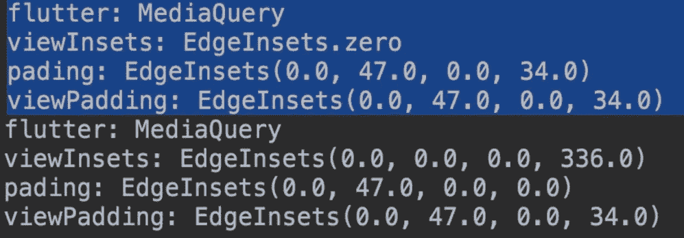

> 我们可以看到`MediaQueryData`中的数据会根据键盘状态发生变化。因为`MediaQuery`是一个`InheritedWidget`，所以我们可以使用`MediaQuery.of(context)`来获取 MaterialApp 中的`MediaQueryData` 。

那么问题就来了。`InheritedWidget`的更新逻辑是通过注册的`Context`绑定的，也就是说`MediaQuery.of(context)`本身就是一个绑定行为，然后`MediaQueryData`和键盘状态相关。

因此，键盘的弹出可能导致使用`MediaQuery.of(context)`触发器重建，例如:

如下面的代码所示，我们在`MyHomePage`中使用了`MediaQuery.of(context).size`并打印出来，然后跳转到`EditPage`并弹出键盘。现在这个时候会发生什么？

```
class MyHomePage extends StatelessWidget {
  @override
  Widget build(BuildContext context) {
    print("######### MyHomePage ${MediaQuery.of(context).size}");
    return Scaffold(
      body: Container(
        alignment: Alignment.center,
        child: InkWell(
          onTap: () {
            Navigator.of(context).push(CupertinoPageRoute(builder: (context) {
              return EditPage();
            }));
          },
          child: new Text(
            "Click",
            style: TextStyle(fontSize: 50),
          ),
        ),
      ),
    );
  }
}class EditPage extends StatelessWidget {
  @override
  Widget build(BuildContext context) {
    return Scaffold(
      appBar: AppBar(
        title: new Text("ControllerDemoPage"),
      ),
      extendBody: true,
      body: Column(
        children: [
          new Spacer(),
          new Container(
            margin: EdgeInsets.all(10),
            child: new Center(
              child: new TextField(),
            ),
          ),
          new Spacer(),
        ],
      ),
    );
  }
}
```

如日志所示，可以看到键盘弹出的过程。因为底部变了，所以`MediaQueryData` 也变了，导致`MyHomePage`是看不见的，但也是在键盘弹出的过程中不断构建的。

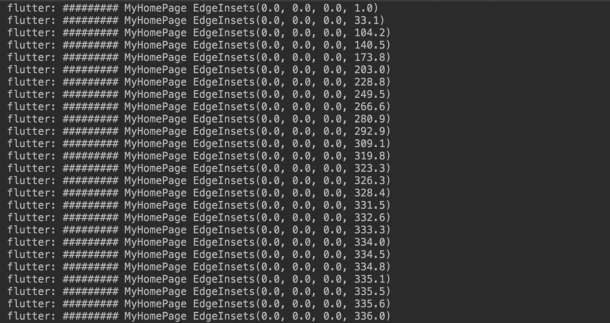

> 想象一下如果你用`MediaQuery.of(context)`，然后打开 5 页。这时，当你在第五页弹出键盘时，也会触发前四页的重建，这时你可能会卡住。

那么如果我不在`MyHomePage` 的构建方法中直接使用`MediaQuery.of(context)`，那么在`EditPage`中弹出键盘不会导致`MyHomePage`触发构建吗？

> 答案是肯定的，没有`MediaQuery.of(context).size`，弹出`EditPage`中的键盘时`MyHomePage`不会重建。

所以提示 1:小心在`Scaffold`外使用`MediaQuery.of(context)`，你现在可能会觉得奇怪`Scaffold`外是什么。不要紧，稍后我会继续解释。

那么这里可能有人要说了:我们用`MediaQuery.of(context)` 从`MaterialApp`得到`MediaQueryData`？如果改变了，难道不应该引发下面的孩子重建吗？

> 这其实和页面路由有关，也就是常说的`PageRoute`的实现。

如下图所示，由于是嵌套结构，实际上弹出的键盘确实会触发`MaterialApp`下子节点的重建。因为`MediaQuery`被设计在`Navigator`上，弹出的键盘自然会触发`Navigator`的重建。

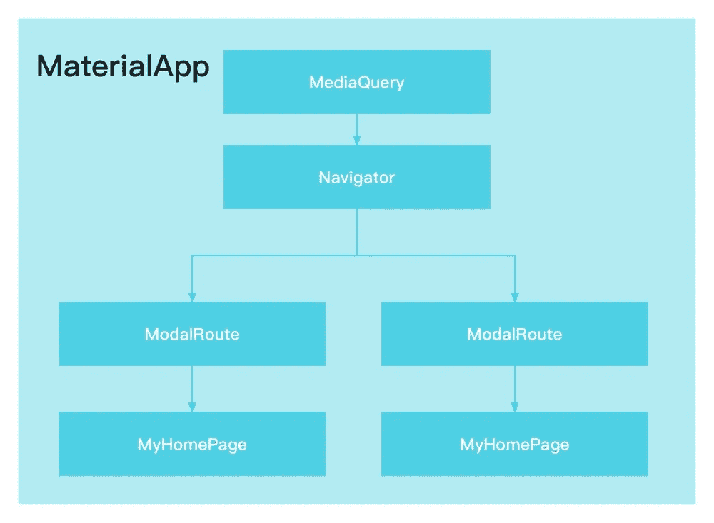

但是`Navigator`引发了重建。为什么不重建所有的路由页面？
这与路由对象的基类`ModalRoute`有关，因为在它内部，`_modalScopeCache`参数缓存了小部件，正如注释所说:

> 我们缓存了模态范围中不随帧变化的部分

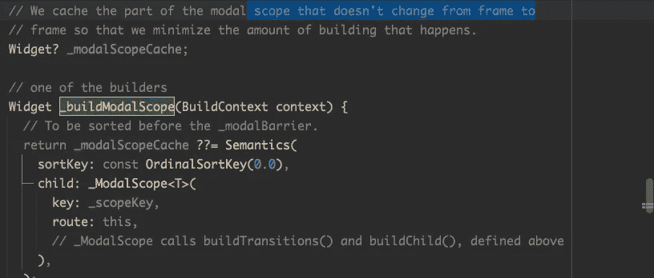

例如，显示了以下代码:

*   首先，定义一个`TextGlobal`，并在其构建方法中输出“######## TextGlobal”
*   然后在`MyHomePage`中定义一个全局`TextGlobal globalText = TextGlobal()`；
*   然后在`MyHomePage`里加上三个`globalText`
*   最后点击`FloatingActionButton`触发`setState(() {});`

```
class TextGlobal extends StatelessWidget {
  const TextGlobal({Key? key}) : super(key: key);

  @override
  Widget build(BuildContext context) {
    print("######## TextGlobal");
    return Container(
      child: new Text(
        "测试",
        style: new TextStyle(fontSize: 40, color: Colors.redAccent),
        textAlign: TextAlign.center,
      ),
    );
  }
}
class MyHomePage extends StatefulWidget {
  final String? title;
  MyHomePage({Key? key, this.title}) : super(key: key);
  @override
  _MyHomePageState createState() => _MyHomePageState();
}

class _MyHomePageState extends State<MyHomePage> {
  TextGlobal globalText = TextGlobal();
  @override
  Widget build(BuildContext context) {
    print("######## MyHomePage");
    return Scaffold(
      appBar: AppBar(),
      body: new Container(
        alignment: Alignment.center,
        child: Column(
          crossAxisAlignment: CrossAxisAlignment.center,
          mainAxisAlignment: MainAxisAlignment.center,
          children: [
            globalText,
            globalText,
            globalText,
          ],
        ),
      ),
      floatingActionButton: FloatingActionButton(
        onPressed: () {
          setState(() {});
        },
      ),
    );
  }
}
```

有趣的事情来了。如下图日志所示，`"######## TextGlobal"` 除了构建之初的输出，还有`setState(() {});` 根本没有被触发，没有重建，这其实是和上面`ModalRoute`类似的行为:键盘的弹出导致`MediaQuery`触发`Navigator`执行重建，但是重建不会影响`ModalRoute`。

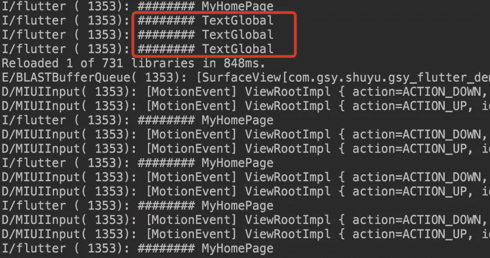

其实这种行为在`Scaffold`中也有体现。如果你看一下`Scaffold`的源代码，你会发现`MediaQuery.of(context)` 在`Scaffold`中被广泛使用。

例如，在上面的代码中，如果你为`MyHomePage`的`Scaffold`配置了一个 3333 `ValueKey`，当`EditPage`中的键盘弹出时，`MyHomePage`的`Scaffold`会触发 rebuild，但是因为它使用了`widget.body`，所以不会导致`body`中的对象重建。

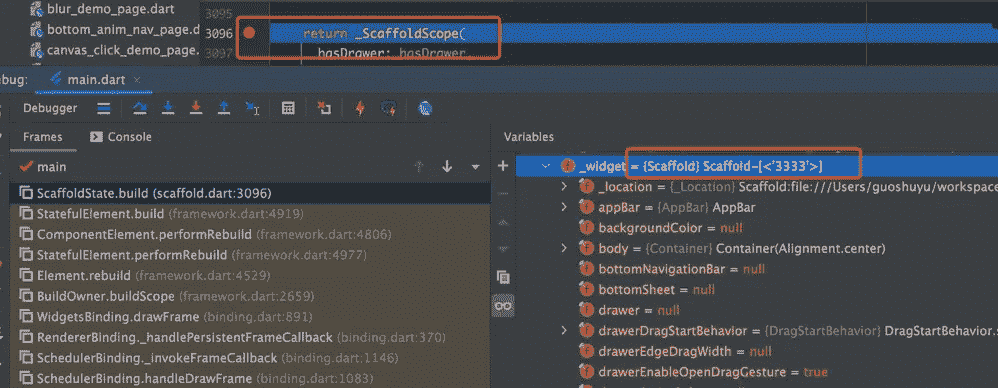

> 如果`MyHomePage`被重建，build 方法中所有配置的`new`对象都将被重建；但如果`MyHomePage`中的`Scaffold`内部触发了 rebuild，则不会导致`MyHomePage`中 body 参数对应的子体执行 rebuild。

是不是太抽象了？举一个简单的例子，如下面的代码所示:

*   我们定义了一个`LikeScaffold`小部件，它使用`widget.body`来传递子部件。
*   在`LikeScaffold`里面，我们用`MediaQuery.of(context).viewInsets.bottom`来模仿`Scaffold`里的`MediaQuery`
*   在`MyHomePage`中使用`LikeScaffold`，为`LikeScaffold`体配置一个生成器，输出`"############ HomePage Builder Text "`进行观察
*   跳转到`EditPage`页面，打开键盘

```
class LikeScaffold extends StatefulWidget {
  final Widget body;

  const LikeScaffold({Key? key, required this.body}) : super(key: key);

  @override
  State<LikeScaffold> createState() => _LikeScaffoldState();
}

class _LikeScaffoldState extends State<LikeScaffold> {
  @override
  Widget build(BuildContext context) {
    print("####### LikeScaffold build ${MediaQuery.of(context).viewInsets.bottom}");
    return Material(
      child: new Column(
        crossAxisAlignment: CrossAxisAlignment.center,
        mainAxisAlignment: MainAxisAlignment.center,
        children: [widget.body],
      ),
    );
  }
}
····
class _MyHomePageState extends State<MyHomePage> {
  @override
  Widget build(BuildContext context) {
    var routeLists = routers.keys.toList();
    return new LikeScaffold(
      body: Builder(
        builder: (_) {
          print("############ HomePage Builder Text ");
          return InkWell(
            onTap: () {
              Navigator.of(context).push(CupertinoPageRoute(builder: (context) {
                return EditPage();
              }));
            },
            child: Text(
              "FFFFFFF",
              style: TextStyle(fontSize: 50),
            ),
          );
        },
      ),
    );
  }
}
```

可以看到“`"####### LikeScaffold build 0.0`”和“`############ HomePage Builder Text"`”开始是正常执行的，然后键盘弹出后，“`####### LikeScaffold build`”跟随键盘动画连续输出底部的大小，而`"############ HomePage Builder Text "`因为是`widget.body` 实例所以没有输出。

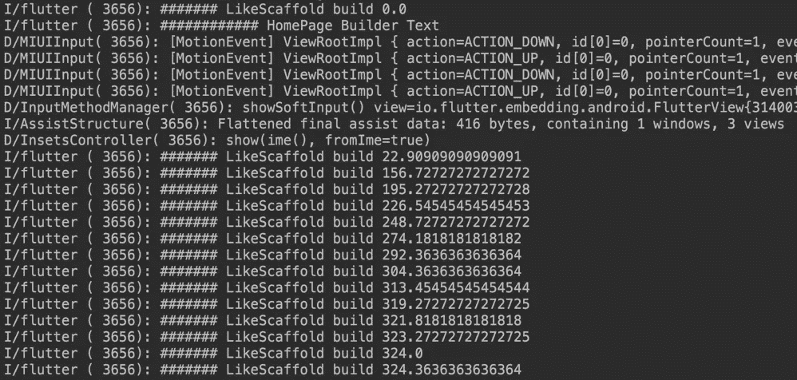

所以通过这个例子我们可以看到，虽然`MediaQuery.of(context)` 在`Scaffold`中被广泛使用，但是影响范围被约束在`Scaffold`之内。

接下来，我们继续看修改的例子。如果`LikeScaffold`上再多一个`Scaffold`，输出结果会是什么？

```
class _MyHomePageState extends State<MyHomePage> {
  @override
  Widget build(BuildContext context) {
    var routeLists = routers.keys.toList();
    ///多加了个 Scaffold
    return Scaffold(
      body:  new LikeScaffold(
        body: Builder(
        ·····
        ),
      ),
    );
}
```

答案是`LikeScaffold`中的`####### LikeScaffold build`不会因为键盘的弹跳而输出，也就是说`LikeScaffold`虽然用了`MediaQuery.of(context)`，但是不会因为键盘的弹跳而再重建。

因为此时`LikeScaffold`是`Scaffold`的子代，`MediaQuery.of(context)`是指`Scaffold`内部处理的`MediaQueryData`。

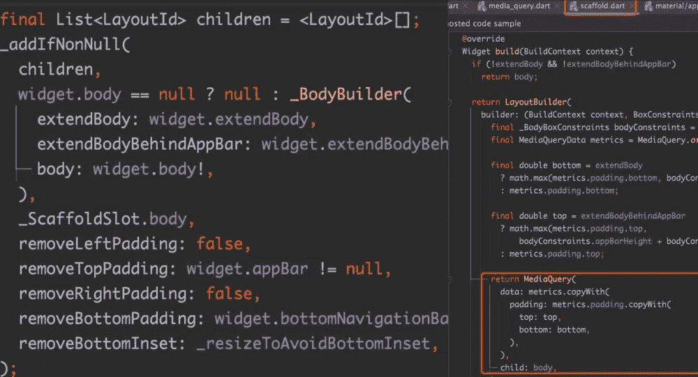

> 类似的流程在`Scaffold`还有很多。例如，是否移除该区域的 paddingTop 和 paddingBottom 将根据`body`中是否有`Appbar`和`BottomNavigationBar`来决定。

你想到什么了吗？为什么用`MediaQuery.of(context)`获取填充，有的 top 是 0，有的不是 0，原因是你从哪里获取的上下文。

例如，如下面的代码所示，作为`Scaffold`的子节点，我们在`MyHomePage`和`ScaffoldChildPage`中打印`MediaQuery.of(context).padding`:

```
class MyHomePage extends StatelessWidget {
  @override
  Widget build(BuildContext context) {
    print("MyHomePage         MediaQuery padding: ${MediaQuery.of(context).padding}");
    return Scaffold(
      appBar: AppBar(
        title: new Text(""),
      ),
      extendBody: true,
      body: Column(
        children: [
          new Spacer(),
          ScaffoldChildPage(),
          new Spacer(),
        ],
      ),
    );
  }
}
class ScaffoldChildPage extends StatelessWidget {
  @override
  Widget build(BuildContext context) {
    print("ScaffoldChildPage  MediaQuery padding: ${MediaQuery.of(context).padding}");
    return Container();
  }
}
```

如下图所示，可以看出`ScaffoldChildPage` 中获得的 paddingTop 为 0 是因为此时`MyHomePage`有一个`Appbar`，因为`ScaffoldChildPage`获得的`MediaQueryData`已经被`MyHomePage`中的`Scaffold`重写。

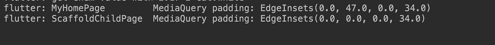

如果此时将`BottomNavigationBar`加到`MyHomePage`上，可以看到`ScaffoldChildPage`的底部会从 34°变成 90°。

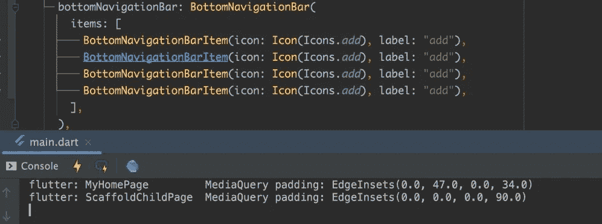

这里你可以看到 of 中的上下文对象对`MediaQuery.of`非常重要:

*   如果页面`MediaQuery.of`使用了`Scaffold`之外的上下文并获得了顶层`MediaQueryData`，那么当键盘弹出时，会导致页面被重新构建
*   如果`MediaQuery.of` 使用了`Scaffold`中的上下文，那么我们得到了`Scaffold`在该区域的`MediaQueryData`，比如上面描述的 body。同时，得到的`MediaQueryData`也会因`Scaffold`的不同配置而变化

所以如下图所示，有些人会通过在推送的路线对应的地方嵌套`MediaQuery`来做一些拦截处理，比如设置文本不可伸缩，但实际上这样会导致键盘在弹出和收回时触发各页面的连续重建，比如第 2 页弹出键盘的过程，第 1 页的连续重建。

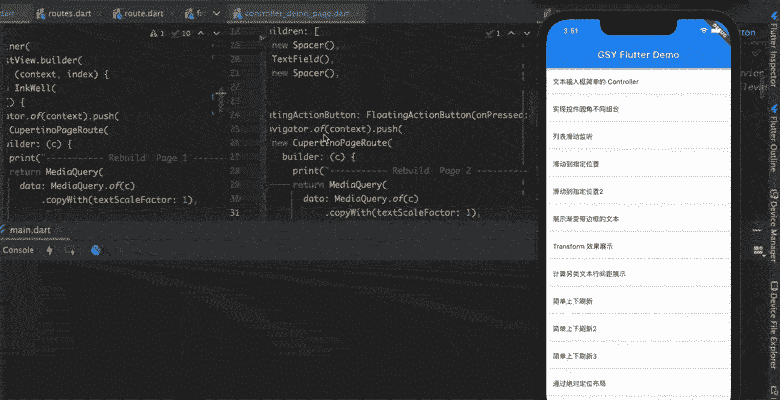

所以如果需要做一些全局拦截，建议通过`useInheritedMediaQuery`做全局处理。

```
return MediaQuery(
  data: MediaQueryData.fromWindow(WidgetsBinding.instance!.window).copyWith(boldText: false),
  child: MaterialApp(
    useInheritedMediaQuery: true,
  ),
);
```