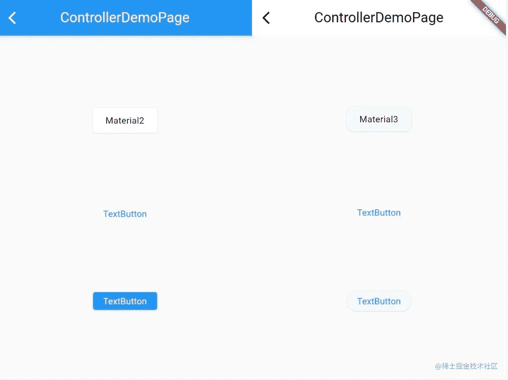
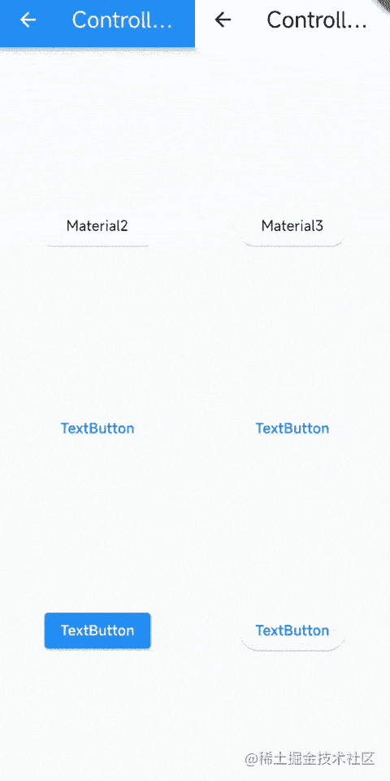
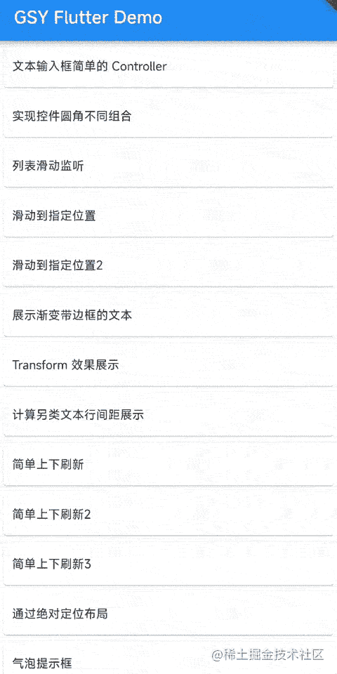
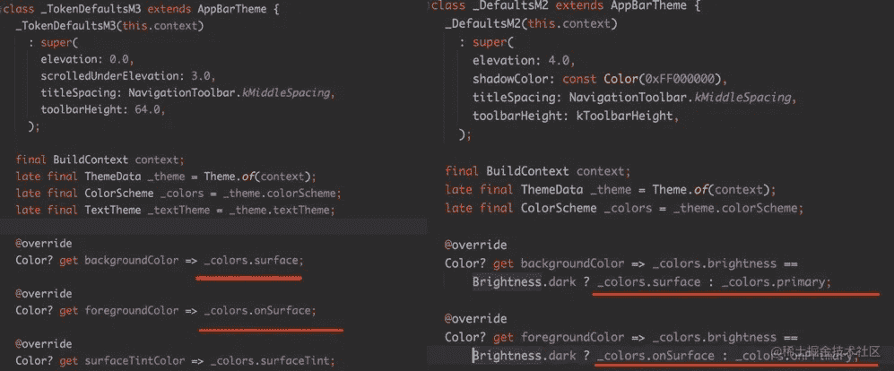
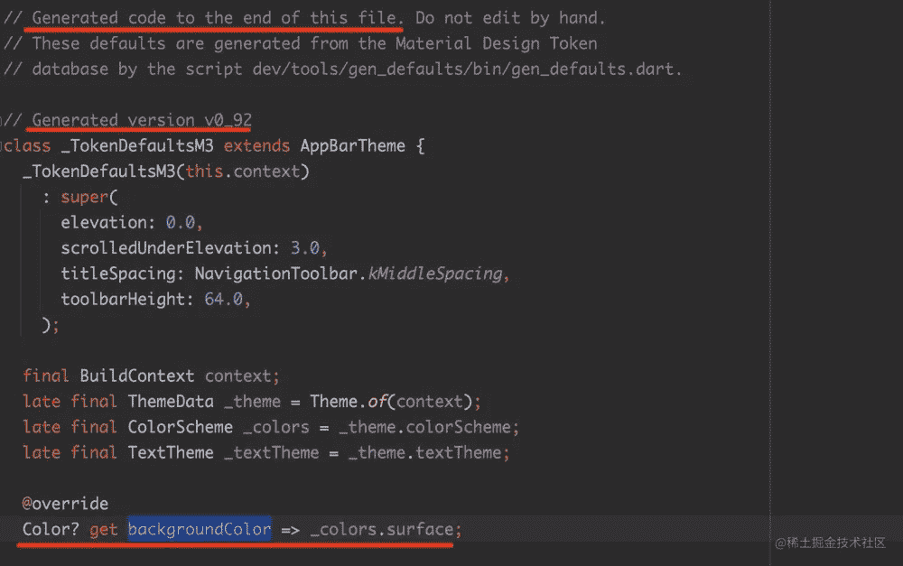
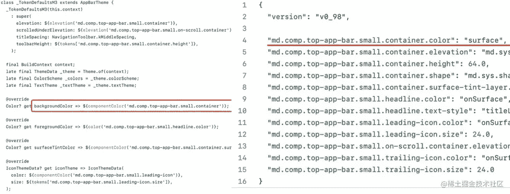
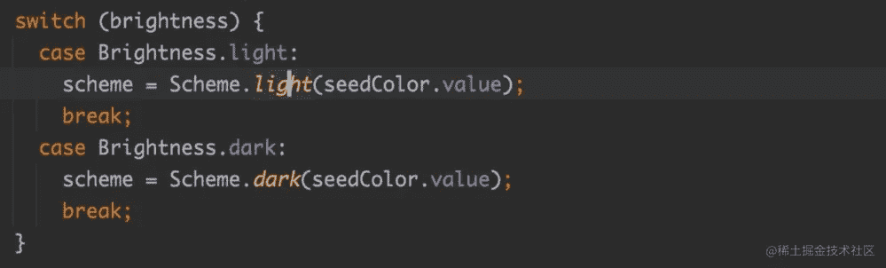
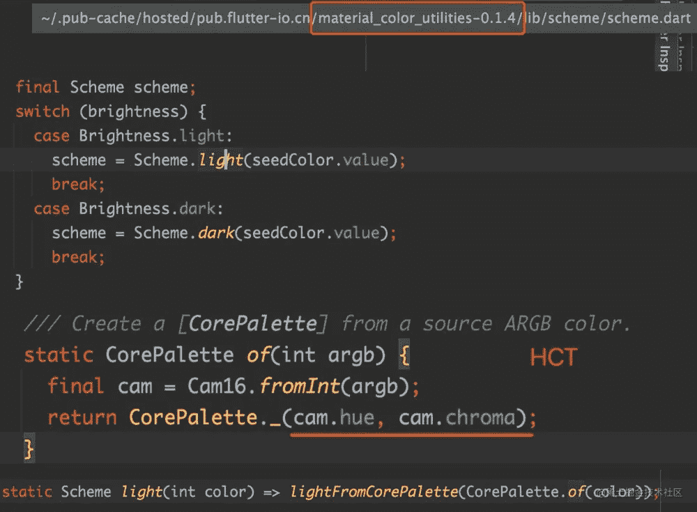
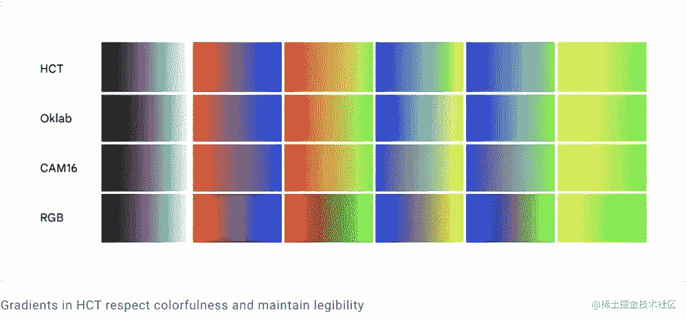
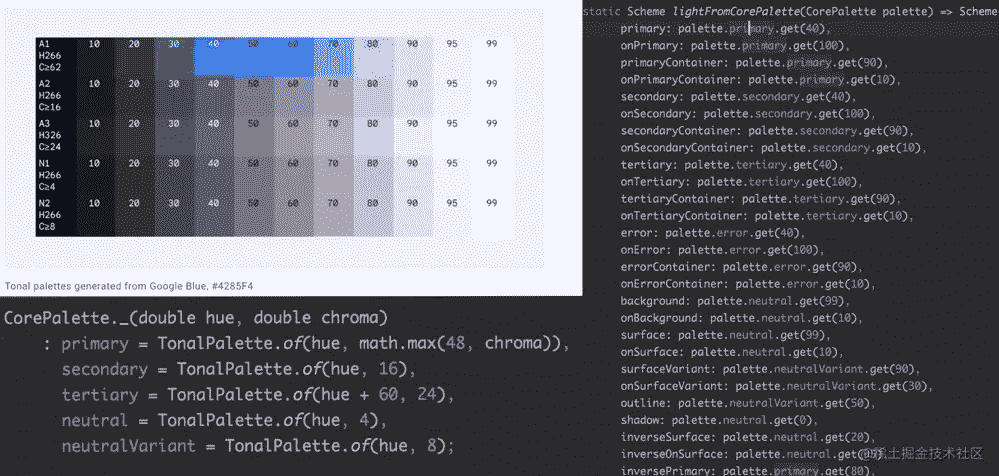

# 主题扩展和材料的颤振技巧 3

> 原文：<https://medium.com/codex/flutter-skill-of-themeextensions-and-material3-3e3e95bf591d?source=collection_archive---------2----------------------->

`**ThemeExtensions**` **`**Material3**`，它们都是旋舞 3 的重要组件，我想你可能听说过，但还没用过。**

# **主题扩展**

**相信大家在 Flutter 中都用过`Theme`。比如可以通过修改全局`ThemeData`来调整一些样式，比如全局去除`InkWell`和`TextButton`的点击效果。**

```
theme: ThemeData(
   primarySwatch: Colors.blue,
   // remove InkWell  splash  click
   splashFactory: NoSplash.splashFactory,
   // remove InkWell click highlight
   highlightColor: Colors.transparent,
   textButtonTheme: TextButtonThemeData(
     // remove TextButton splash click
     style: ButtonStyle(splashFactory: NoSplash.splashFactory),
   ),
),
```

**当然，开发者也可以使用`Theme.of(context)`来读取`ThemeData`的一些全局样式，从而使你的 Widget 配置更加灵活。**

**但是如果`ThemeData`中没有参数，那你需要什么，或者你希望这个参数只被特定的小工具使用？**

****颤振 3 为我们提供了一个解决方案:** `**ThemeExtensions**` **。****

**开发人员可以通过继承`ThemeExtension`并覆盖`copyWith`和`lerp`方法来定义扩展的`ThemeData`参数，例如:**

```
@immutable
class StatusColors extends ThemeExtension<StatusColors> { static const light = StatusColors(open: Colors.green, closed: Colors.red); static const dark = StatusColors(open: Colors.white, closed: Colors.brown);

  const StatusColors({required this.open, required this.closed});

  final Color? open;
  final Color? closed;

  @override
  StatusColors copyWith({
    Color? success,
    Color? info,
  }) {
    return StatusColors(
      open: success ?? this.open,
      closed: info ?? this.closed,
    );
  }

  @override
  StatusColors lerp(ThemeExtension<StatusColors>? other, double t) {
    if (other is! StatusColors) {
      return this;
    }
    return StatusColors(
      open: Color.lerp(open, other.open, t),
      closed: Color.lerp(closed, other.closed, t),
    );
  }

  @override
  String toString() => 'StatusColors('
      'open: $open, closed: $closed'
      ')';
}
```

**之后，您可以将上面的`StatusColors`配置到`Theme`的`extensions`，然后使用`Theme.of(context).extension<StatusColors>()`读取配置的参数。**

```
theme: ThemeData(
  primarySwatch: Colors.blue,
  extensions: <ThemeExtension<dynamic>>[
    StatusColors.light,
  ],
),

·····

@override
Widget build(BuildContext context) {

  /// get status color from ThemeExtensions 
  final statusColors = Theme.of(context).extension<StatusColors>();

  return Scaffold(
    extendBody: true,
    body: Container(
      alignment: Alignment.center,
      child: new ElevatedButton(
          style: TextButton.styleFrom(
            backgroundColor: statusColors?.open,
          ),
          onPressed: () {},
          child: new Text("Button")),
    ),
  );
}
```

**很简单，对吧？**

**通过`ThemeExtensions`，第三方包在编写 Widget 时也可以提供相应的`ThemeExtensions`对象，从而实现更加灵活的样式配置支持。**

# **材料 3**

**Material3 是 Google 在 Android 12 中提出的新 UI 设计规范。现在在 Flutter 3 中，可以通过`useMaterial3: true`打开配置支持。**

```
theme: ThemeData(
  primarySwatch: Colors.blue,
  useMaterial3: true,
),
```

**当然，在你开始Material3 之前，你需要对它有一定的了解，因为它对 UI 风格还是有很大影响的。**

**如下图所示，在`primarySwatch: Colors.blue`中，`AppBar`、`Card`、`TextButton`和`ElevatedButton`的默认样式不同:**

****

**您可以看到圆角和默认颜色已经更改。例如:**

*   **点击效果和默认的`Dialog`样式已经改变**
*   **Android 上默认的列表滚动效果也改变了**

********

**目前来看，以下小部件主要受《颤振 3》中`useMaterial3`的影响。可以看出，大部分具有交互效果的微件主要受影响:**

*   **[警报对话框]**
*   **[应用程序栏]**
*   **[卡片]**
*   **[对话]**
*   **[升高按钮]**
*   **[浮动操作按钮]**
*   **[材料]**
*   **[导航栏]**
*   **[导航轨道]**
*   **[大纲按钮]**
*   **[拉伸光标]**
*   **[GlowingOverscrollIndicator]**
*   **[文本按钮]**

****但是 Material3 和 Material2 有什么区别呢？****

**以`AppBar`为例，我们可以看到 M2 和 M3 的背景色采集方法是不同的。**

**在 M3，没有`Brightness.dark`的判定，是否意味着 m3 不支持暗黑模式？**

****

**在回答这个问题之前，我们先来看看`_TokeDefaultsM3`有什么特别之处？**

**从源代码可以看到，`_TokeDefaultsM3`是脚本自动生成的，当前版本号是`v0_92`，所以 m3 和 M2 最大的区别之一就是它的样式代码现在是自动生成的。**

****

**从 [gen_defaults](https://link.juejin.cn/?target=https%3A%2F%2Fgithub.com%2Fflutter%2Fflutter%2Ftree%2Fca2d60e8e2344d8c0ed938869f7c974cb745e841%2Fdev%2Ftools%2Fgen_defaults%2Flib) 可以看出，基本上涉及到的 M3 都是使用模板从数据下的数据中自动生成的。比如`Appbar`的`backgroundColor`指向`surface`。**

****

**M3 的默认风格之所以不再需要`Brightness.dark` 判断，是在 M3 使用的`ColorScheme`中做出的。**

****

****其实** `**colorScheme**` **才是旋舞 3.0 中主题颜色的核心，以后**`**primaryColorBrightness**`**`**primarySwatch**`**等参数都会被丢弃。******

****因此，如果你还在使用`primarySwatch`，你将在`ColorScheme.fromSwatch`中使用方法把`primarySwatch` 转换成`ColorScheme`。****

```
**ColorScheme.fromSwatch(
  primarySwatch: primarySwatch,
  primaryColorDark: primaryColorDark,
  accentColor: accentColor,
  cardColor: cardColor,
  backgroundColor: backgroundColor,
  errorColor: errorColor,
  brightness: effectiveBrightness,
);**
```

****此外，还可以使用`ColorScheme.fromSeed`或`colorSchemeSeed`直接在`ThemeData`中配置`ColorScheme`。****

******但是，什么是** `**ColorScheme**` **？******

```
**theme: ThemeData(
  colorScheme: ColorScheme.fromSeed(seedColor: Color(0xFF4285F4)),
  useMaterial3: true,
),**
```

****这其实涉及到一个很有意思的知识点:Material3 下的 HCT 颜色包:[**material-color-utilities**](https://link.juejin.cn/?target=https%3A%2F%2Fgithub.com%2Fmaterial-foundation%2Fmaterial-color-utilities)。****

****在 Material3 中，颜色不是完全按照 RGB 计算的，而是通过[material-color-utilities](https://link.juejin.cn/?target=https%3A%2F%2Fgithub.com%2Fmaterial-foundation%2Fmaterial-color-utilities)进行转换。****

****通过内部的`CorePalette`对象，RGB 将被转换成 HCT 相关值进行计算和显示。****

********

****HCT 实际上是色调、色度和色调的缩写。HCT 色彩空间可以通过谷歌的开源[材质-颜色-工具](https://link.juejin.cn/?target=https%3A%2F%2Fgithub.com%2Fmaterial-foundation%2Fmaterial-color-utilities)插件轻松访问。****

****目前这个 repo 支持 dart、Java、typescript 等语言。此外，c/c++和 Object-C 也将很快得到支持。****

********

****受益于 HCT，`ColorScheme.fromSeed(seedColor: Color(0xFF4285F4))` 可以通过一个 seedcolor 直接生成一系列主题色，这也是 material3 可以有更多主题色的原因。****

********

> ****[https://material.io/blog/science-of-color-design](https://material.io/blog/science-of-color-design)****

****好了，现在你可以问你的设计师:你知道 HCT 是什么吗？****