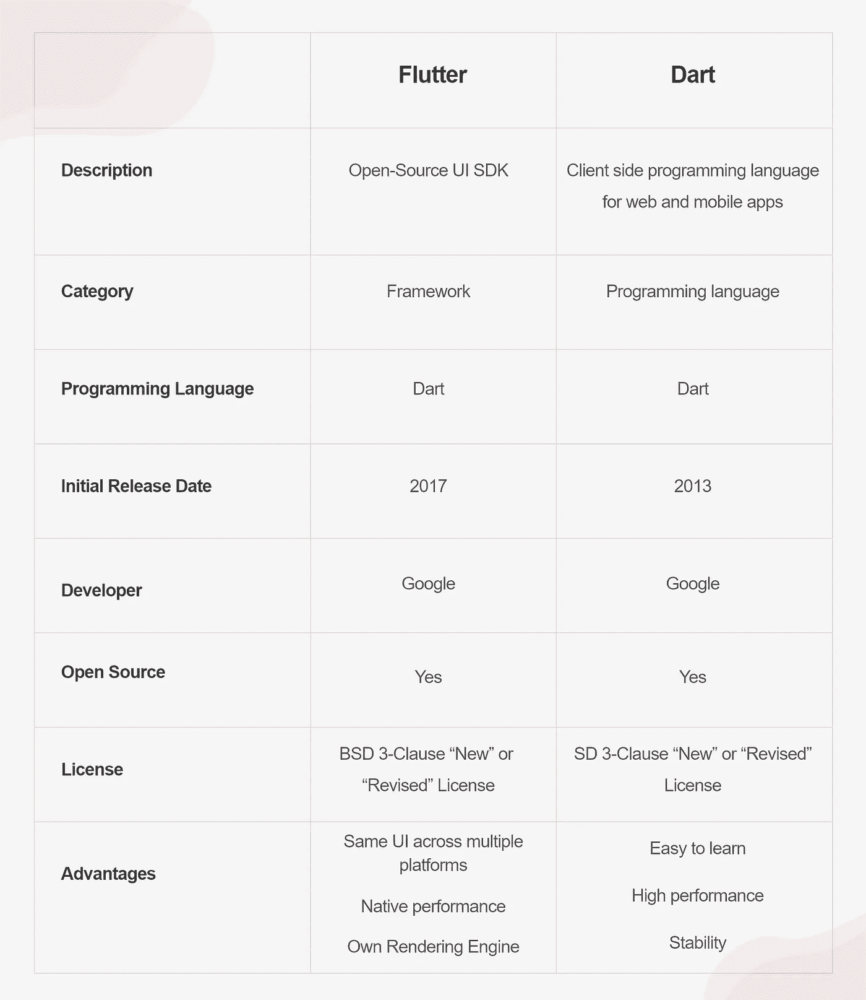

# Flutter vs. Dart:什么对 App 开发最好？

> 原文：<https://medium.com/codex/flutter-vs-dart-for-mobile-app-development-which-is-better-99290a8dc1d7?source=collection_archive---------4----------------------->

只有当涉及到客户的移动设备时，移动应用程序开发才能突出您的品牌名称。它接触到的人越多，对你公司的声誉就越好。

您可以通过使用跨平台框架(如 React Native、Xamarin 或 Flutter)来加速应用程序开发。我们建议在本文中进行颤振与飞镖对比分析。为什么我们选择他们进行移动应用开发？

Flutter 和 Dart 是两种可能符合你标准的 app 开发技术。您可以很容易地发现这两种应用程序开发技术的特点和优势，然后做出明智的决定，选择哪一种适合您的应用程序。

# 什么是颤振？

Flutter 是一个开源的跨平台开发框架，用于构建可扩展的高性能应用。企业和企业家依靠 Flutter 开发一流的软件解决方案来促进他们的业务增长。而且，Flutter 使用的是 Dart 语言。

Flutter 提供了几个突出的功能，使 Flutter 开发者能够将它们集成到应用程序中。

# 颤振框架的特点

在应用程序开发中，Flutter Framework 的一些重要特性包括:

## **1。热重装**

当使用其他编程语言时，应用程序开发人员不得不花费大量时间来思考屏幕上任何与编码相关的变化。

但是有了 Flutter，他们可以享受更快的代码重载。Flutter 的热重新加载功能是添加到应用程序架构中的一个强大工具，使开发人员能够在屏幕上实时查看结果。这样，开发人员可以在不损失内存的情况下添加功能和修复错误。

你也可以[雇佣印度的 flutter 开发者](https://www.quytech.com/hire-flutter-developers.php)来创建顶级的跨平台应用。

## 2.巨大的部件库

Flutter 提供了大量内置小部件。此外，它还提供了一套令人惊叹的动画设计，允许开发人员为他们的客户设计一个互动和迷人的应用程序。

此外，Flutter 的创建者考虑到用户的需求，向 Flutter 库中添加了一些小部件。

## 3.高效的用户界面

Flutter 包括一个便携式和高度组织化的 GPU(图形处理单元)，它提供了一个用户界面，让开发人员可以在多个界面上工作。

## 4.对 IDE 的支持

Flutter 提供了一系列流行的集成开发环境(ide ),它们有效地存在于强大的开发人员社区中。这包括 Xcode、Visual Studio 代码和 Android Studio。

## 5.Google Firebase 协助

软件开发人员可以通过 Flutter 框架轻松获得 Google Firebase 后端支持。开发人员可以利用这种可访问性来交付可伸缩的应用程序。

# Dart 是什么？

Dart 是一种开源的面向对象编程语言，用于开发 iOS 和 Android 应用程序。您可以使用相同的代码库来构建应用程序。

此外，您可以将 Dart 代码转换为桌面平台和移动平台的本机代码。Dart 提供了各种令人惊叹的功能来构建令人惊叹的应用程序。

# 省道核心特征

## 1.丰富的图书馆

Dart 包括许多有用的预建库，包括 Math、Convert、HTML、SDK、Core 等等。此外，Dart 为开发人员提供了将 Dart 代码组织到所需库中的工具，这些库具有适当的名称间距。开发人员可以通过 import 语句重用库。

## 3.通用编译

Dart 提供了以闪电般的速度编译代码的工具。它引入了两种类型的编译过程——JIT(及时)和 AOT(不成熟)。有了它，开发人员可以轻松地传播 Dart 编程语言，并在现代网站浏览器中高效地运行它们。

## 4.基于安全的语言

Dart 是一种类型安全的编程语言，这意味着开发人员可以使用它进行运行时检查和静态类型检查，以验证变量值总是与同一变量的静态类型匹配。

## 5.社区

Dart 拥有一个由活跃的开发人员组成的庞大社区，他们在该领域拥有丰富的知识。这个社区包括来自世界各地的开发人员。所以，如果你在用 Dart 编码时遇到任何问题，你总能找到一个可靠的帮手来帮助你。你也可以在印度雇佣应用开发者来为你的企业构建高效的应用。

# **颤振与飞镖:快速概述**

# 结论

既然我们已经讨论了 Flutter 和 Dart 这两种前沿 app 开发技术的独有特性和优势，那么现在你一定有了更好的理解。

不过，在做出最终决定之前，我建议你与任何一家顶尖的[颤振开发公司](https://www.quytech.com/flutter-app-development.php)取得联系。确保您选择的框架符合您开发市场主导型应用程序的标准。

仅此而已！