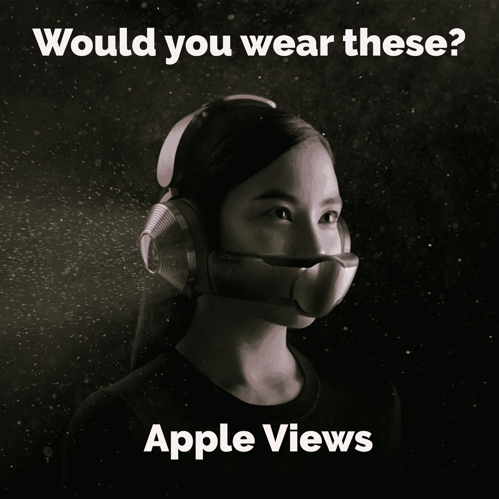
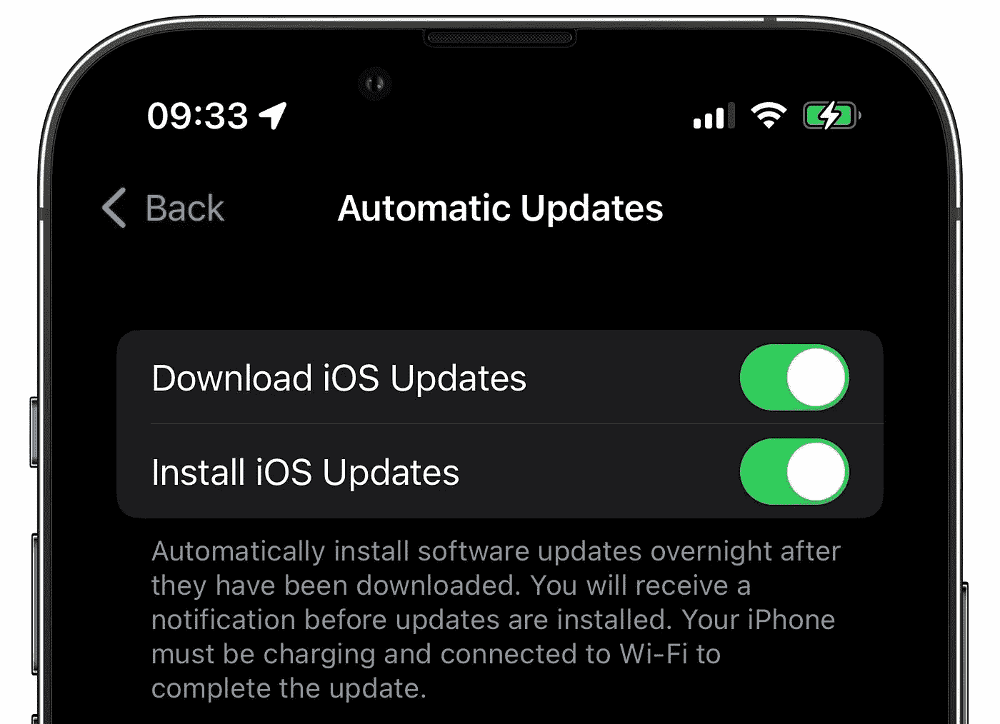
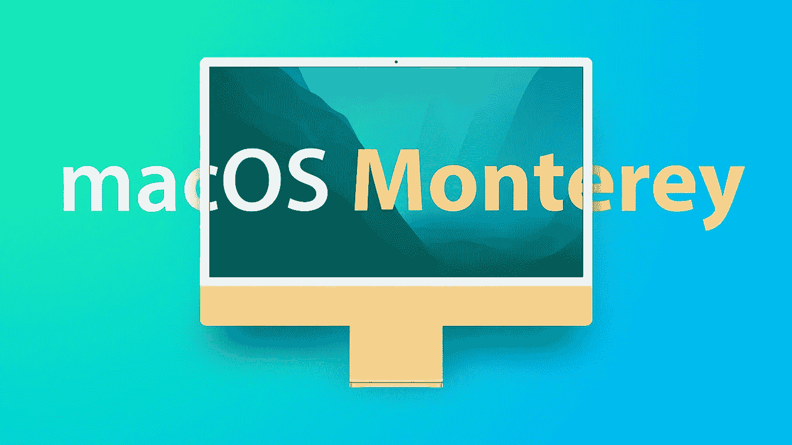
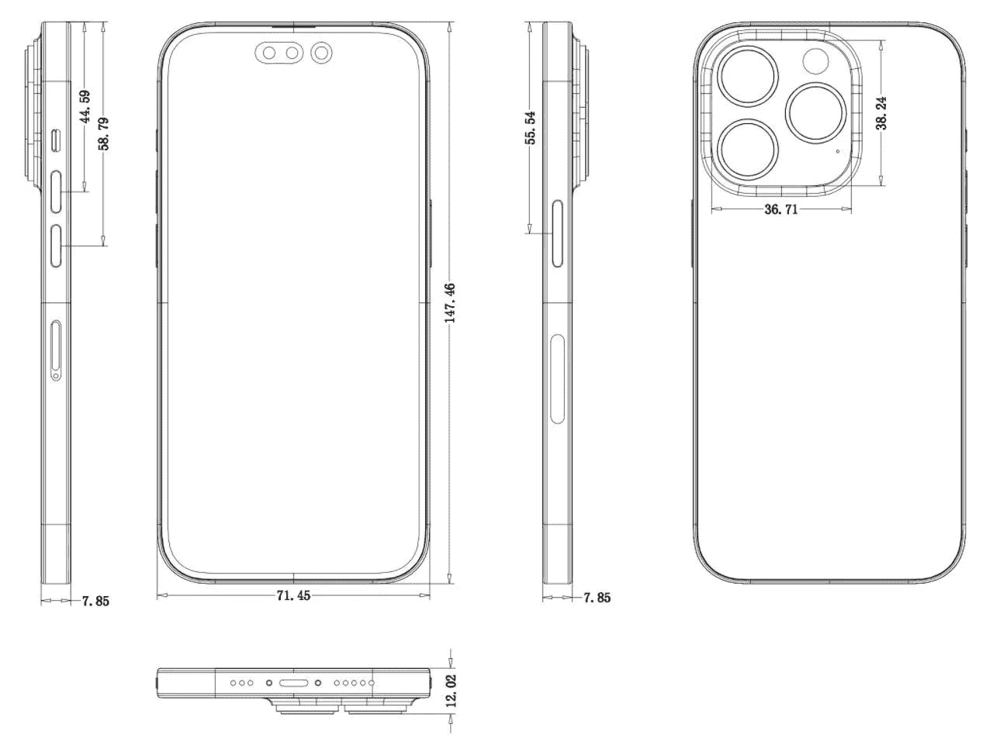
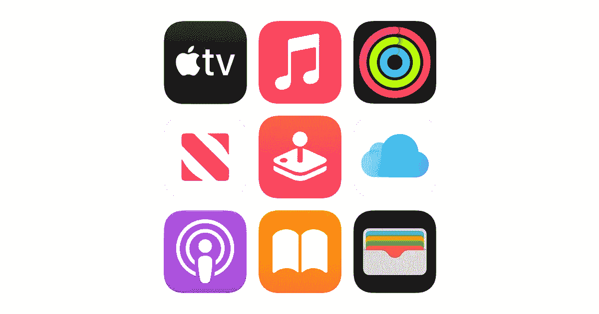
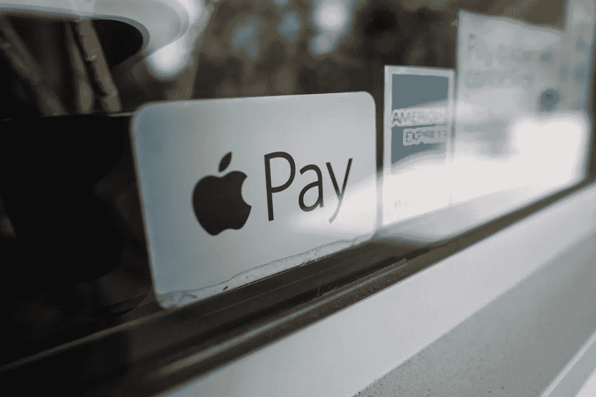
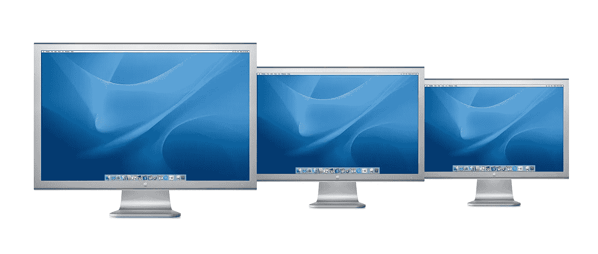

# 折叠式苹果电脑再次成为新闻，苹果进军金融市场

> 原文：<https://medium.com/codex/folding-macs-are-news-again-and-apple-move-in-to-the-financial-market-f0eaeaa46b42?source=collection_archive---------16----------------------->

## 【2022 年 3 月 28 日—4 月 1 日

新款戴森耳机

## **戴森降噪耳机**

所以，我不确定这是不是一个愚人节玩笑，但我认为不是。这位英国发明家和他的团队似乎已经设计出了他们的第一款可穿戴产品。代号为*戴森区*的耳机正在研发中，它们是消除噪音、净化空气的耳机。我告诉你知道的谎言。它是面部下部的过滤器和顶部的高端耳机。说它看起来很奇怪是一种保守的说法，但戴森通常提供质量，设计是公司的 DNA。尽管起初你会认为这是对疫情的回应，戴森告诉我们它已经开发了六年。 ***嗯嗯嗯——真的？***

 [## AirPods Pro vs Beats Fit

### 我刚买了一双 AirPods Pro。我做了正确的选择吗？

medium.com](/codex/airpods-pro-vs-beats-fit-88a994d27634) 

iOS 自动更新

## iUpdate

那么，你是那种一发布更新就去设置并安装的人吗，或者，你只是在等待自动更新完成它的工作吗？如果你属于后一种阵营，并且曾经想知道为什么你的更新会在 3-4 周后出现，那么我有你想要的答案。通过 MacRumours，我听说 iPhone 用户 Mateusz Buda 问了软件工程高级副总裁 Craig Federighi 同样的问题。答案其实非常简单。我们早期采用者基本上是试验品！他们让我们这些热心、忠诚的男孩和女孩下载更新，并等待反馈。然后，3-4 周后，在修复了小精灵之后，自动更新就推出了。 ***简单的时候真的知道为什么。***

mac OS Monterey 12.3.1 更新

## 说到更新——蒙特雷更新

12.3.1 从今天开始提供，解决了监视器和蓝牙设备连接问题。在*系统偏好>软件更新*里找到的，我花了大概 10 分钟运行安装。

iPhone SE

 [## 战斗开始了！

### iPad Air v iPad Pro——哪个适合你？

medium.com](/codex/y-ipad-the-fight-is-on-b6a2ba27b898) 

## 我们拒绝了

几周前发布的最新款 iPhone SE 并不流行。备受期待的是，这是我们知道将在最近的苹果活动中推出的产品之一。基于 iPhone 8，设计，退一步说，嗯，累。苹果似乎有点傲慢地认为我们会买他们推出的任何东西。但是不行，群众已经投票了！据日经亚洲报道，由于需求低迷，产量已经大幅削减。官方将其部分归咎于乌克兰战争、通货膨胀和能源价格飙升。iPhones 的产量将比预测的少 20%。据估计，出货量将达到 1500-2000 万部，而不是预期的 2500-3000 万部。 ***真相可能只是它的废话！***

iPhone 14 示意图

## **越大越好**

似乎就在不久前，乔恩·普罗瑟收到消息说 2022 年的 iPhone 14 上的摄像头凸起将会，嗯，不在那里！早期的消息称，这款手机将在很大程度上借鉴标志性的 iPhone 4 的造型。由于承诺恢复冲洗后置摄像头，我们曾希望这种情况会成为过去。然而，本周我可以报告说，这种冲击不仅会继续存在，而且实际上会比以往更加突出。可靠的郭明志认为，随着今年的相机可能是一个 48MP 的野兽，颠簸将会增长。我想所有的技术都要去某个地方，对吗？

加拿大的苹果地图新用户

## 你好加拿大

加拿大苹果地图用户现在是 iPhone 上详细地图世界的一部分。蒙特利尔、多伦多和温哥华的居民现在可以享受所有最新的地图功能，如土地覆盖、海拔和详细的道路标记。它最初于去年 9 月在伦敦、洛杉矶和纽约首次亮相，为 iPhone 上的地图带来了一个全新的维度。要从所有升级中受益，你需要安装 iOS 15、iPadOS 15、macOS Monterey 或 watch OS 8 或更高版本。 ***如果我离开了这个家，我敢肯定这该有多好！***

 [## 太阳出来了！

### 随着今年 WWDC 的预计日期泄露，我们可以期待什么？

medium.com](/codex/here-comes-the-sun-9fe01350de9c) 

仅在苹果上

## 仅在苹果上

去年，苹果在其网站上增加了一个名为“仅在苹果上”的页面。仅在苹果上包括 Apple TV+(大粉丝！)，街机，健身，还有 iCloud。但是，我怀疑大多数人购买 Mac、iPhone 或 iPad 是否是因为这些额外的好处。苹果一直不愿意在安卓系统上提供这些服务，因为它认为这会损害销售。然而，反过来看，情况可能完全相反。如果 Android 用户尝试并体验了这些应用程序，并且爱上了它们，那会怎么样！如果它们比 Android 世界中提供的任何东西都好呢？这实际上可以为苹果赢得更多用户。去年，至少将 Android 用户纳入 FaceTime 通话的举措表明，这家总部位于加州的科技巨头正朝着正确的方向前进。

折叠 MAC？

## 苹果确实会折叠

所以，本周《折叠新闻》又回来了，这次是由关键人物郭明志带来的。在推特上说，他去年的预测需要根据它们何时出现进行调整。郭怡广现在暗示，第一款折叠式苹果产品最早可能在 2025 年问世。似乎屏幕将是 9 英寸的 OLED 面板。 ***抱歉，我还是不感兴趣！你呢？***

新的苹果金融服务

## 支付处理

苹果正在向金融领域拓展，本周有消息称，他们打算为未来的金融产品开发自己的支付处理技术和基础设施。旨在减少他们对外部合作伙伴的依赖，这是一个有点雄心勃勃的多年战略的一部分，最终将把广泛的财务任务内部化。他们希望进行自己的风险评估、信用检查和支付处理。苹果的前进似乎没有尽头。

Apple TV+和体育直播

## 体育直播

在上个月的巅峰表演活动上，苹果宣布了他们在直播体育赛事方面的首次尝试。现在，球员和管理层之间的长期争端已经解决，第一场现场比赛的日期已经确定。这场比赛将于 4 月 8 日在纽约大都会队和华盛顿国民队之间进行。任何订阅了 Apple TV +的人，只要有合适的设备，都可以在线观看。没有额外的费用。我试过一次棒球——非常有趣！

苹果手表新闻

## 注意&小心

最新的 Apple Watch 更新，watchOS 8.5 于 3 月份发布。它购买了许多新功能，包括一些新的表情符号，但更新并不都是好消息。Apple Watch 7 系列的佩戴者报告称，它破坏了他们手机的快速充电功能。似乎有些混乱，这个问题是否只涉及第三方充电器，或者这个问题是否也影响到真正的苹果充电器。该功能允许 series 7 用户在大约 45 分钟内将手机从 0%充电到 80%。在谈论 Apple Watch 的同时，本周有传言称，Series 3 手机将于今年停产。它将于 2022 年第三季度退出，计算能力无法满足新 watchOS 的要求被认为是主要原因。 ***我还没有苹果手表。我错过了吗？***

今年我们会看到更多的苹果显示器吗？

## 最后—显示器

如果你希望一个低于 1000 美元的工作室展示，似乎不确定它是否会成为现实。人们原本希望苹果会推出一款比新款 27 英寸显示器更小的显示器，以增加他们的显示器阵容。如果是这样的话，这将与 2000 年代中期苹果出售 Cinema Display 系列产品的情况类似。马克·古尔曼报告称，今年唯一的计划是超高端 7K 显示器，它将取代当前的 6K Pro XDR 面板。一些人仍然抱有希望，认为 24 英寸 iMac 的屏幕可以成为一个独立的面板。我刚刚订购了我的工作室展示——要等两个月！

如果我错过了什么新闻，请告诉我，我会在下周报道——当然，这要归功于你自己！

## 在你走之前

你订阅媒体了吗？我只是高端博客网站 Medium 的众多作者之一。这是如此好的价值，你可以加入这里[https://medium.com/membership](https://medium.com/membership)

加入我的幕后邮件列表[https://www.talkingtechandaudio.com](https://www.talkingtechandaudio.com)

最初发表于 2022 年 4 月 1 日 https://www.talkingtechandaudio.com/blog。