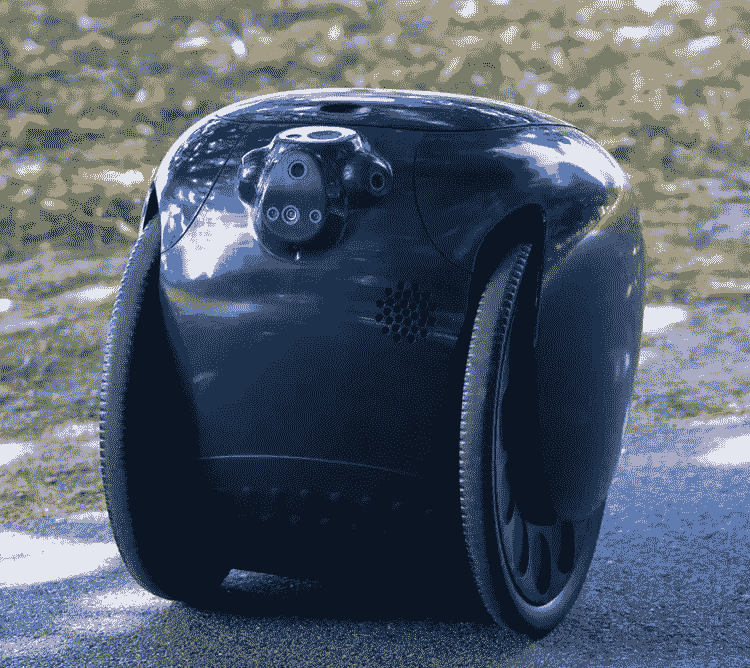

# 机器人跟随/携带技术:新事物？

> 原文：<https://medium.com/codex/following-carrying-technology-in-robots-something-new-1a11fbe02301?source=collection_archive---------16----------------------->

## Gita 和 Gitamini 携带/跟随机器人

[gita(比亚乔媒体)](https://mygita.com/blog/gita-users-are-leaving-their-cars-behind)

把这个归档在新的东西下，但是这是我们真正需要的东西吗？这些机器人会跟着你，同时还会帮你拿东西。我指的是皮亚乔快进的 **gita** 和 **gitamini** 。