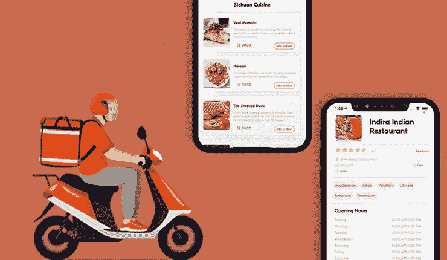
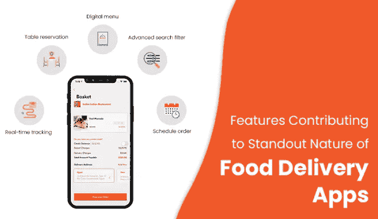

# 食品交付应用程序开发——需要记住的阶段

> 原文：<https://medium.com/codex/food-delivery-app-development-stages-to-remember-afa449f88e2f?source=collection_archive---------13----------------------->

如何搭建送餐 App

食品交付应用程序开发阶段

疫情见证了按需应用的崛起，例如在线食品交付应用脱颖而出。这些应用程序让顾客很容易在家门口快速获得食物。由于在那个时期人们被限制在自己的房子里，这些解决方案得到了最大限度的利用。这导致在线食品交付市场的收入流成倍增长，今天的估值为 3233.0 亿美元。预计到 2027 年利润在 4662.0 亿美元左右。这些数字表明，当传统餐馆进入开发送餐应用程序的过程时，它将获得收入，并最大限度地提高客户参与度。

我们将在下面的文章中详细介绍这个领域。阅读这篇文章，你会对这款应用的受欢迎程度有一个大致的了解，并列举造成这种情况的原因。**此外，您将获得以下领域的培训-**

1.  为什么一款送餐 app 会受欢迎？受欢迎的原因
2.  快速送餐应用程序中有哪些功能？
3.  食品配送企业应该通过应用程序来增强运营能力的原因？
4.  食品交付应用程序开发过程中要遵循的步骤
5.  开发一个送餐 app 要多少钱？

那么，你准备好通过开发在线送餐应用进入这个竞争激烈的送餐业务了吗？阅读下面的内容，利用这些解决方案建立一个有利可图的送餐帝国，并提高您的收入。

# 在线食品交付应用受欢迎的原因

阅读下面的文字，了解在线食品交付应用程序受欢迎的原因。

*   在线食品配送市场具有极其有利可图的前景，预计到 2030 年收入将达到 3000 亿美元。
*   为顾客节省时间，让他们在家门口获得快速送餐服务，并与亲朋好友一起享用丰盛的菜肴。
*   它有助于食品配送业务在更大比例的客户中提高知名度，并获得更多收入。
*   允许餐馆获得更高的投资回报，并在竞争中脱颖而出。

了解了这些解决方案受欢迎的不同因素后，现在让我们深入研究该应用程序包含的独特功能，这些功能也有助于其脱颖而出。

另请阅读: [5 个要记住的食品配送克隆应用开发策略](https://www.fooddeliveryclone.com/blog/food-delivery-clone-app-development-steps/?utm_source=Medium&utm_medium=MB&utm_campaign=MB&utm_id=MB)

# 有助于食品配送应用程序脱颖而出的特性

送餐应用

了解了赋予在线食品交付应用独特光环的因素，你就能理解到底是什么让这个解决方案如此受欢迎。这使我们现在准备好进入食品交付应用程序开发的旅程。这需要遵循一些重要的步骤，下面将重点介绍这些步骤。

# 如何进行送餐 App 开发？

正如前面提到的，食品配送应用程序已经数字化了将食物送到客户手中的方式。对于那些寻求将传统餐厅的运营数字化的人来说，它是一种鼓励，使他们能够使用定制的食品交付解决方案，也称为食品交付克隆。目前，市场上排名前 5 的食品交付克隆应用是 UberEats、Deliveroo、DoorDash、GrubHub 和 Swiggy。这五个因素一直是食品配送初创公司的激励因素，以确保他们也可以建立类似于上述解决方案的解决方案。这是因为该应用程序操作简单，功能独特。

因此，如果你也是他们中的一员，希望让他们的餐厅拥有广泛的客户群，在发展过程中遵循这些步骤，并开始通过你提供的快速送餐服务获得前所未有的收入。

## 1.研究

研究你的竞争对手，了解他们简化送餐服务的方式。评估他们的应用程序中是否有任何缺失的元素，这些元素的加入将提升您的价值，并使您的应用程序在最终客户中获得更多的可见性。这也需要关注他们的设计，这样你才能知道哪种设计适合你。

## 2.技术堆栈—谨慎选择

你需要使用技术堆栈，让你的在线食品交付应用程序能够稳定运行。

这里有一些你可以特别使用的。

*   swift for iOS/Flutter/React Native
*   Java for Android/Flutter/React Native
*   节点。JS/Express。后端和 API 的 JS
*   做出反应。前端的 JS
*   数据库的 MongoDB
*   服务器的 AWS
*   PayPal、Braintree、EWallets、Stripe 支付
*   推送通知的 Twilio

## 3.分析收入模式并做出适当的商业选择

你的在线送餐应用程序的最终目标是帮助你通过你提供的送餐服务获得收益。因此，当你开发这些应用程序时，你必须选择合适的收入模式。有两种模式可以选择——基于从餐厅收取的佣金和基于送货费。研究一个能让你最大限度获利的，并据此做出选择。

## 4.与海外的按需送餐应用程序开发公司联系

这是一个重要的阶段，你需要确保在食品交付应用程序开发过程中跨越。换句话说，当你开发应用程序时，你需要确保与海外的一家公司取得联系。这将帮助您节省时间和成本，确保解决方案的质量一流，并确保您可以在短时间内获得客户的关注。

在开发送餐应用程序时，遵循所有这些步骤，您可以确保您的企业能够获得简化送餐方式的解决方案。它也将帮助你使你的餐馆设置得到提高知名度。然而，了解食品交付应用程序的开发成本非常重要，这样您可以节省时间和资金。此外，您可以允许操作无缝进行。

# 食品配送应用程序开发成本

当你采用原生[送餐应用开发](https://www.fooddeliveryclone.com/)时，平均成本将在 25000 美元到 30000 美元之间。而当你执行跨平台的食品交付应用程序开发时，你必须承担的资金将在 30，300 美元到 35，000 美元之间。

注意-基于应用程序中包含的高级功能集、复杂的功能集和整体应用程序设计，成本可能会上升。

# 关键要点

阅读这份全面的指南，你会明白，对于一个传统的餐馆来说，在线送餐应用程序是塞翁失马，焉知非福。然而，开发并不像听起来那么容易。它需要对竞争对手和目标市场进行彻底的研究。此外，它需要专注于技术栈，并使用那些可以让应用程序有效运行的技术栈。最后，它需要与正确的合作伙伴建立联系，以便在食品交付应用程序开发期间轻松利用资金和时间。

# 包扎

如果你是一家传统餐厅，想要通过应用程序成为价值 965 亿美元的食品配送市场的一部分，现在正是时候。在疫情之后，企业使用该解决方案实现运营数字化已经成为一种必然，这样他们就可以让 it 获得竞争优势。这要求他们在构建应用程序时遵守一些步骤。