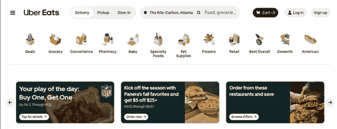
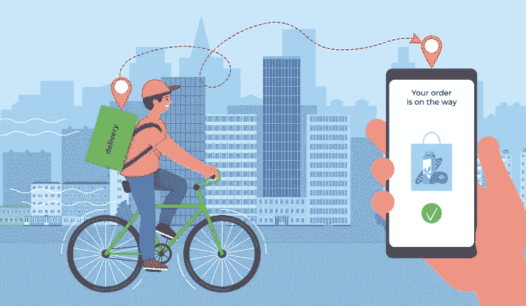

# 送餐克隆——如何做一个像 UberEats 这样的 App？

> 原文：<https://medium.com/codex/food-delivery-clone-how-to-make-an-app-like-ubereats-3655f183cf37?source=collection_archive---------9----------------------->

## UberEats 克隆应用

送餐 App

你是否打算开发一款订餐应用，提供 UberEats 类型的顶级送餐服务？什么事？那么你来对地方了。超过 8100 万用户使用其服务，因此该应用程序名列前茅也就不足为奇了。造成这种情况的主要因素是它提供的支持，使饭菜在任何时间都能很容易地送到顾客手中。这是为什么那些寻求数字化食品配送业务的人正在努力建立一个类似于食品配送巨头的解决方案的主要因素。

想知道造成这种情况的因素是什么，或者您是否在经营一个传统的送餐机构，希望为您提供的送餐服务插上翅膀？这篇文章是给你的。

# 关于 UberEats

图片来源:ubereats.com

UberEats 在 45 个国家的 6000 多个城市提供送餐服务，是一款受欢迎的食品订购应用程序，自创建以来，其受欢迎程度增长了数倍。看看下面的统计数据，深入了解这个领域-

*   2021 年，其收入为 83 亿美元
*   让[的 8100 万用户](https://www.businessofapps.com/data/uber-eats-statistics/)利用其服务
*   拥有超过 [90 万家餐饮合作伙伴](https://www.businessofapps.com/data/uber-eats-statistics/)

了解了这些数字，你就会明白，这款应用确实在用户、餐厅、配送合作伙伴中有着显著的影响力，其中最突出的是那些寻求为他们的餐厅设置插上翅膀的人。

# UberEats 的特点使其与众不同

> ***为用户***

1.  计划订单
2.  多次付款
3.  自定义菜单

> ***为交货伙伴***

1.  收益报表
2.  路线优化
3.  佣金跟踪报告

> ***为餐厅***

1.  销售报告
2.  报告和分析
3.  菜单管理

了解了这些特性，你就能明白最初到底是什么让它如此受欢迎。这就是为什么像 UberEats 克隆应用程序这样的定制按需食品交付应用程序的开发在食品业务初创公司中越来越多。

# 关于 UberEats 克隆应用的一切

UberEats clone app 是为送餐克隆打造的定制送餐解决方案[。它是可定制的，易于修改。这为企业提供了支持，使其能够根据未来的业务需求对应用程序进行更新，这样他们就可以进行扩展，并获得前所未有的利润。](https://www.fooddeliveryclone.com/)

这些基础知识足以描述为什么它对那些计划推动他们的食品配送系统的人来说是一个福音，而这个系统直到现在才被数字化。

如果你也是他们中的一员，计划通过开发一个类似的应用程序来为他们的餐厅设置一个数字基础，我们列出了以下几点，这将使旅程更加顺利。

# 如何开发像 UberEats 这样的送餐 App？普通

食品配送

**1。进行详细研究**

当你打算进入开发 UberEats 这样的送餐 app 的旅程时，调研是极其重要的。因此，一定要彻底研究你的竞争对手在做什么，了解你的客户想要什么，以及当前的解决方案是否满足他们的需求。这将给你一个应用程序设计的想法，你应该实现创建一个无缝地满足这些需求的应用程序。

2.**选择合适的商业模式**

有两种模式可供选择-仅订单模式和订单模式以及订单和交付模式。详细了解这两个[送餐 app 开发模式](https://www.fooddeliveryclone.com/blog/food-aggregators-vs-multi-delivery-services/?utm_source=WP&utm_medium=WP&utm_campaign=WP&utm_id=1)。了解它们的基本原理、优缺点，以及与采用它们相关的挑战。最后研究一下，模型是否与你的商业理念同步。这将使您的选择正确，并确保您可以通过您开发的最终解决方案最大限度地利用收入。

3.**了解 100%顺利运营的技术堆栈**

为了确保你得到一个运行顺畅的食品交付应用程序，你必须选择强大的技术栈。这将确保撞车事故得到彻底降低。因此，您可以使用 Node.js、Express.js 作为后端，Twilio 作为 SMS，Google Maps 作为位置。这些将允许食品订单跟踪和功能很容易通过应用程序来执行。

4.**外包送餐克隆应用开发服务**

最后，最好外包送餐克隆 app 开发服务。换句话说，开发一个像 UberEats 这样的送餐 app，最好是在旅途中节省成本。为此，将服务外包到海外。上网查看不同公司的投资组合。从他们中挑选一个符合您需求的候选人，并联系他们的客户支持专家。这将使你清楚地了解他们是否适合你。

仔细遵循这些步骤，你可以成功地构建一个像这家送餐巨头这样的食品订购应用程序，并从第一天开始就利用你的利润。然而，也要关注成本方面。

# 开发像 UberEats 这样的食品交付应用程序的成本

印度、欧洲和美国这三个国家被推荐提供食品配送克隆应用程序开发服务，因为它们以一流的方式提供这些服务。因此，当你投资 UberEats 克隆应用程序时，印度开发者的大致成本将在每小时 10 美元至 80 美元之间。在欧洲，每小时 30 到 90 美元。最后，在美国，你必须每小时花费 50 到 100 美元。

为了确保成本保持不变，请确保这些功能仍然是食品交付应用程序特有的。此外，确定技术栈不是太先进。最后，保持应用程序设计简单。所有这些将确保最终的解决方案不会为你的食品业务启动消耗太多的资金，相反，它节省了成本。

# 包扎

UberEats 改变了送餐设置的整体运营。这大大提高了他们的知名度。这是你应该投资建立一个类似于巨人的送餐 app 的一个主要原因。使用不太先进的技术，或者联系专门从事送餐克隆应用开发服务的送餐应用开发公司。