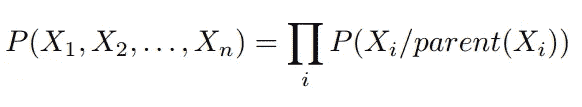
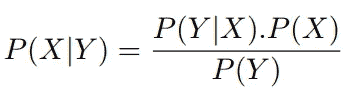
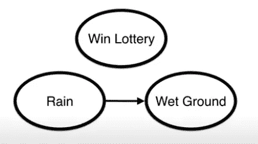
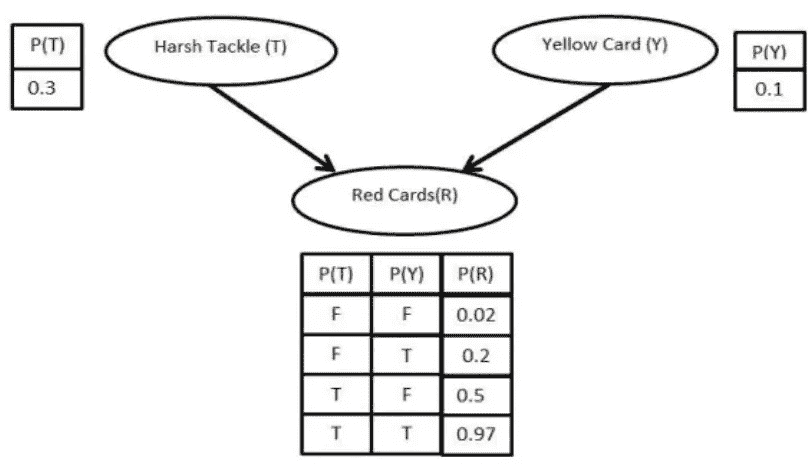
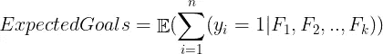
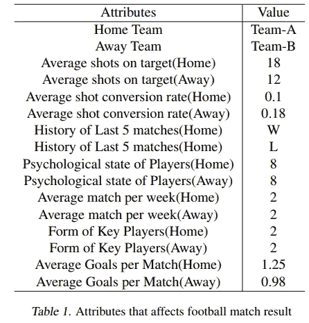
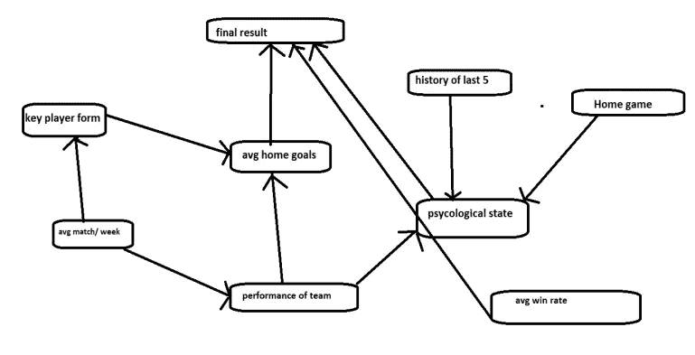
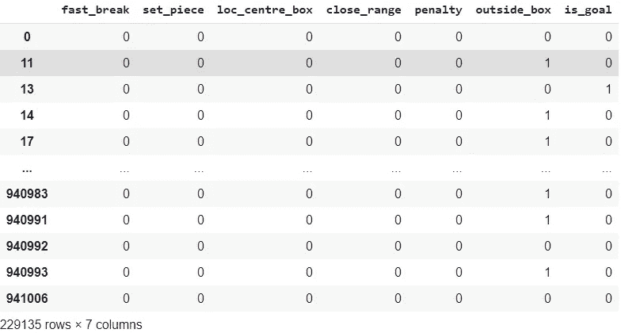
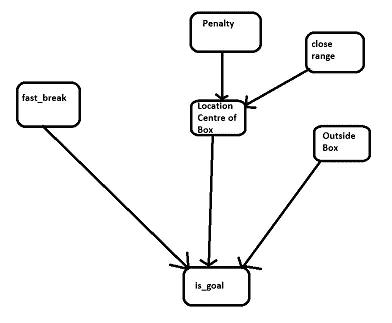

# 足球分析:使用贝叶斯网络分析 xG(预期目标)

> 原文：<https://medium.com/codex/football-analytics-using-bayesian-network-for-analyzing-xg-expected-goals-705e63e597c2?source=collection_archive---------7----------------------->

# 介绍

足球是世界上最受关注的运动。在过去的几年里，足球预测变得越来越流行。在这个开放的互联网世界中，人们提出了许多令人兴奋的模型来评估足球队赢得、输掉或平局的概率。本博客将重点分析与 xG(预期目标)足球比赛。预期进球模型可以预测射门是否会进球，并有助于分析足球比赛。

# 什么是贝叶斯网络

贝叶斯网络已经成为对特定领域的一组变量之间的关系进行概率建模的流行方式。贝叶斯网络是有向无环图，其节点定义了特定的随机变量，连接节点的有向边表示节点之间的条件依赖。

贝叶斯网络通过链规则表示联合分布:



贝叶斯网络的主要思想来自托马斯·贝叶斯法则(贝叶斯定理) :



P (X)是 X 的先验概率或边际概率
P(X | Y)是给定 Y 的 X 的后验概率或条件概率
P(Y | X)是给定 X 的 Y 的条件概率(数据 Y 的似然性)。
P(Y)是数据 Y(证据)的先验概率或边际概率。

**考虑贝叶斯网络**的真实例子，其中网络的节点是:中奖彩票(L)、雨(R)和湿地(W)。



以上贝叶斯网络告诉我们，联合概率因式分解的形式为:P(L，R，W) = P(L) P(R) P(W | R)。这里“L”完全独立于其他事件，而“R”和“W”是相关的，即如果下雨，则有可能是湿地。

让我们考虑另一个与足球有关的贝叶斯网络的例子。鉴于两个事件恶劣铲球和黄牌影响红牌。P(T)为 0.3 的概率意味着，被认为粗暴的球员有 0.3 的机会进行铲球，而被认为合法的球员有 0.7 的机会进行铲球。考虑到这名球员犯下了严重的铲球，并且已经得到了一张黄牌，这名球员有 0.97 的机会得到一张红牌。



我们可以假设粗暴铲球和黄牌是独立的事件。此外，如果一名球员没有黄牌，也没有恶劣的铲球，那么得到红牌的可能性几乎是不可能的(0.02)。我们可以通过使用贝叶斯规则并考虑节点之间的依赖性来计算得到红牌的概率，

P(R)= P(R | TY)* P(T n Y)+P(R | T ' Y)* P(T ' n Y)+P(R | TY ')* P(T n Y ')+P(R | T ' Y ')* P(T ' n Y ')

# 什么是预期目标(xG)？

xG 是射门得分的概率，即射门入网的几率。xG 是通过一个球员在那个位置得分的次数与他在那个位置尝试得分的次数之比来计算的。

xG 的范围可以在 0 和 1 之间，xG 为 0 表示未达到目标，xG 为 1 表示保证达到目标。假设 xG 是 0.2，这意味着 10 次射门中只有两次转化为进球。射门转化为进球的概率取决于各种特征，如球员的位置、身体部位、进攻类型、任意球、点球、助攻类型等。

**xG 型号:**

人脑可以通过观看比赛直观地判断出哪些机会更有可能得分，哪些机会不太可能得分。像人类一样，在预测射手离我们有多近、射手是谁、射门角度是多少、脚是否无力等等时，会考虑各种事情。同样，如果给定影响目标可能性的最重要特征，机器学习算法也可以学习这一点。

我们可以将每次射门建模为伯努利随机变量 X，其中 X = 1 表示进球，X = 0 表示失误。如果我们想计算一个团队的预期目标，我们可以将多个伯努利随机变量相加(每次投篮都不同)，并可以估计一个团队的预期目标数。例如，考虑 A 队，其 5 次射门最终进球的概率为:(0.02，0.1，0.3，0.4，0.1)，则 A 队的预期进球值为 0.92。

pᵢ是一个队在 iᵗʰ射门得分的概率，yᵢ = Bernoulli(pᵢ，Fᵢ是射门所依赖的事件，那么一个队的预期进球数是:



# xG 是怎么用的？

*   将 xG 与实际进球得分进行比较可以表明球员的运气。例如，如果一名球员的 xG 高于实际进球，这将是糟糕的射门或运气不好的结果，同样，如果一名球员的得分高于其 xG，这将是好运或个人才华的结果。
*   xG 可以用来评估团队，预测未来表现。例如，如果一支球队在赛季初的表现低于平均水平，看看他们的 xG 就可以知道这种势头是否会继续下去。
*   xG 可用于预测比赛结果，比赛结果可进一步用于投注。

# 贝叶斯网络示例:

有很多因素会影响足球比赛的结果。寻找不同属性之间关系的难点之一。以下是影响足球比赛结果的主要因素:1。过去 5 场比赛的历史，2。主场比赛，3。球员的心理状态，4。平均一周比赛 5 场。关键球员的形式，6。平均主场进球，7 个。平均胜率，8。该队所有队员的表现等。



根据上面的示例属性，下面是贝叶斯网络的样子，



# 方法描述:

**探索数据集:**

使用的数据集:【https://www.kaggle.com/secareanualin/football-events 

数据长度= 229135 x 28

```
**event_type **                              
0 Announcement,1 Attempt, 2 Corner, 3 Foul, 4 Yellow card, 5 Second yellow card ,6 Red card, 7 Substitution, 8 Free kick won, 9 Offside, 10 Hand ball, 11 Penalty conceded
**event_type2**
12 Key Pass  yes , 13 Failed through ball, 14 Sending off, 15 Own goal**shot_place**
1 Bit too high, 2 Blocked, 3 Bottom left corner, 4 Bottom right corner, 5 Centre of the goal, 6 High and wide, 7 Hits the bar, 8 Misses to the left, 9 Misses to the right, 10 Too high, 11 Top center of the goal, 12 Top left corner, 13 Top right corner
**shot_outcome**
1 On target, 2 Off target, 3 Blocked, 4 Hit the bar
**location**
1 Attacking half, 2 Defensive half, 3 Centre of the box, 4 Left wing, 5 Right wing, 6 Difficult angle and long range, 7 Difficult angle on the left, 8 Difficult angle on the right, 9 Left side of the box, 10 Left side of the six yard box, 11 Right side of the box, 12 Right side of the six yard box, 13 Very close range, 14 Penalty spot, 15 Outside the box, 16 Long range, 17 More than 35 yards, 18 More than 40 yards, 19 Not recorded
**bodypart**
1 right foot, 2 left foot, 3 head
**assist_method**
0 None, 1 Pass, 2 Cross, 3 Headed pass, 4 Through ball
**situation**
1 Open play, 2 Set piece, 3 Corner, 4 Free kick
```

**数据准备:**

由于我们的模型仅基于镜头，我们将仅考虑 event_type = 1(即，当进行尝试时)。射门得分的概率取决于各种因素，这里我们只考虑几个因素，比如-1。位置，2。身体部位，3。形势，4。辅助 _ 方法。这些栏目将考虑下面陈述的许多事件，这些事件将考虑:

```
'fast_break','no_assist', 'assist_pass', 'assist_cross', 'assist_header''assist_through_ball','open_play', 'set_piece', 'corner', 'free_kick', 'loc_centre_box', 'loc_diff_angle_lr', 'diff_angle_left', 'diff_angle_right','left_side_box', 'left_side_6ybox', 'right_side_box', 'right_side_6ybox', 'close_range','penalty', 'outside_box', 'long_range', 'more_35y', 'more_40y', 'not_recorded', 'right_foot','left_foot', 'header'
```

现在，我们将为我们的贝叶斯网络选择前 5 个特征，它们是快速突破、位置中心框、近距离、惩罚、框外、目标，并将它们转换成二进制。

我们的新数据框如下所示:



**模型依赖:**

```
sklearn, pandas, pgmpy, numpy
```

**模型实现:**

从我们的数据集来看，很明显我们需要一个二元分类器。我们数据集中的每个条目将包含各种事件和一个变量，表明它是否是一个目标。我们很难选择哪个分类器最适合我们的问题。所以我们会选择逻辑回归和贝叶斯网络。当数据是分类的并且贝叶斯网络可以预测离散输出的联合概率时，逻辑回归对线性依赖很有效。除了选择分类器，我们将测量这个分类器的性能差异。下一步是将数据集划分为相应的训练集和测试集，以确保我们的模型在看不见的数据上表现良好。

# 结果:

**贝叶斯网络 DAG :**



**贝叶斯网络:**

模型精度:

```
Train data length = 226843
Test data length = 2292
No of Goals in Test Data = 257
No of Goals correctly predicted = 27
No of Not-Goals correctly predicted = 2020
Accuracy for Goals = 10.5%
Model accuracy (including goals & not-goals)= 89.3%
```

混淆矩阵:

```
True Positive = 27
True Negative = 2020
False Positive = 15
False Negative = 230
```

**逻辑回归:**

模型精度:

```
Train data length = 226843
Test data length = 2292
No of Goals in Test Data = 257
No of Goals correctly predicted = 21
No of Not-Goals correctly predicted = 2029
Accuracy for Goals = 8.1%
Model accuracy (including goals & not-goals)= 89.4%
```

混淆矩阵:

```
True Positive = 21
True Negative = 2029
False Positive = 6
False Negative = 236
```

我们得到的结果是，通过使用相同的参数，逻辑和贝叶斯网络中的训练数据长度和特征是完全相同的。我们可以看到两个模型预测了几乎相同的结果。

# 处理不平衡数据集:

不平衡数据集是一种标注不平衡的数据集。例如，在一场比赛的 40 次射门中，只有 1 到 3 次射门得分。在这种情况下，少数派比多数派更重要。使用准确性来评估我们的模型不是一个好的措施，例如，如果我们的模型预测所有 40 次射门都是无进球的，那么它也可以达到 85%的准确性，事实上它没有学到任何东西。

为了处理不平衡的数据集，我们可以使用逆标签分布。在我们的例子中，我们有一个 40:1 的比例，所以我们将分配 40 个权重给少数群体，1 个权重给多数群体标签。如果我们的模型对少数民族标签给出了错误的预测，那么惩罚将是 40。

# 结束语和未来工作:

我们的模型强调贝叶斯网络及其能力的重要性。可以通过添加更多事件来改进该模型。例如，当尝试射门时，我们也可以通过使用它来考虑对手球员的位置，这将降低进球的概率，即使尝试在禁区内射门。因此，在改进的数据集的帮助下，我们可以增加团队可以用于改进的预测。一些未来的工作是:

*   创建一个更加以玩家为中心的模型——我们可以使用玩家属性做出更好的预测。比如球员的投篮精度，或者关于强脚的知识可以更好的预测球队表现。
*   一个未来的扩展可以是，预测预期助攻，预期红牌，预期处罚等。
*   我们可以使用贝叶斯网络来预测未来的事件，比如将要尝试多少次投篮。

参考资料:

[1] Nazim Razali1，Aida Mustapha，Sunariya Utama，Roshidi Din
*【利用贝叶斯网络预测足球比赛结果综述】。*
【2】纳齐姆·拉扎利 1、艾达·穆斯塔法 1、法伊兹·艾哈迈德·亚提姆 2、鲁哈亚·阿齐兹
*【利用贝叶斯网络预测英超足球比赛结果】。*
【3】法尔津·奥拉米普尔、帕里纳兹·埃斯坎达里安、费泽·萨达特·莫兹内布*【西班牙联赛贝叶斯网络足球结果预测——巴萨队】。*
【4】预期目标
*https://footballphilosophy.org/*

**GitHub:** [足球分析](https://github.com/iamskv7/FootballAnalytics_BayesianNetworks/blob/main/Model_Notebook.ipynb)