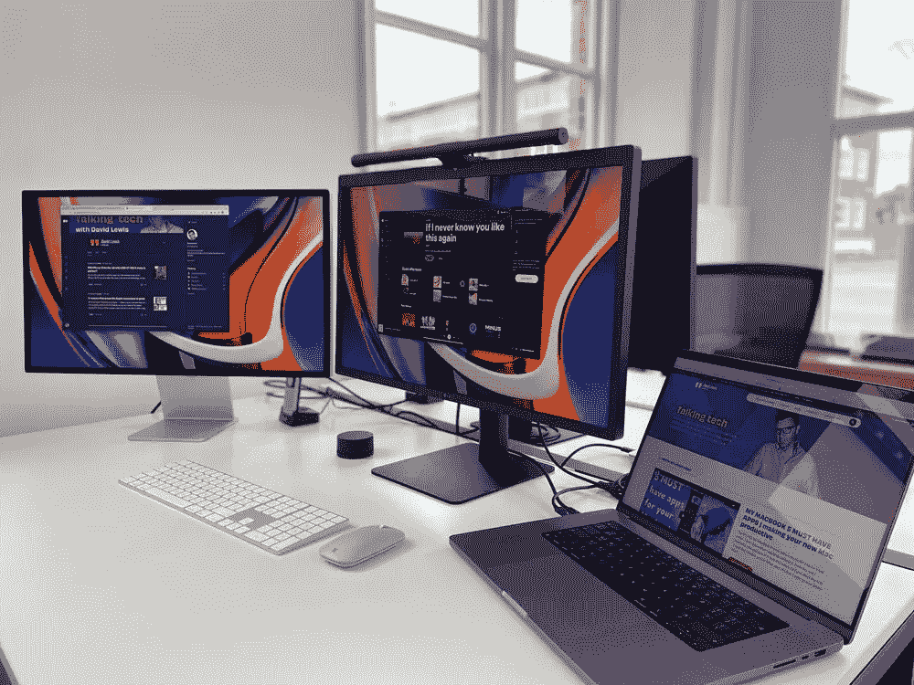
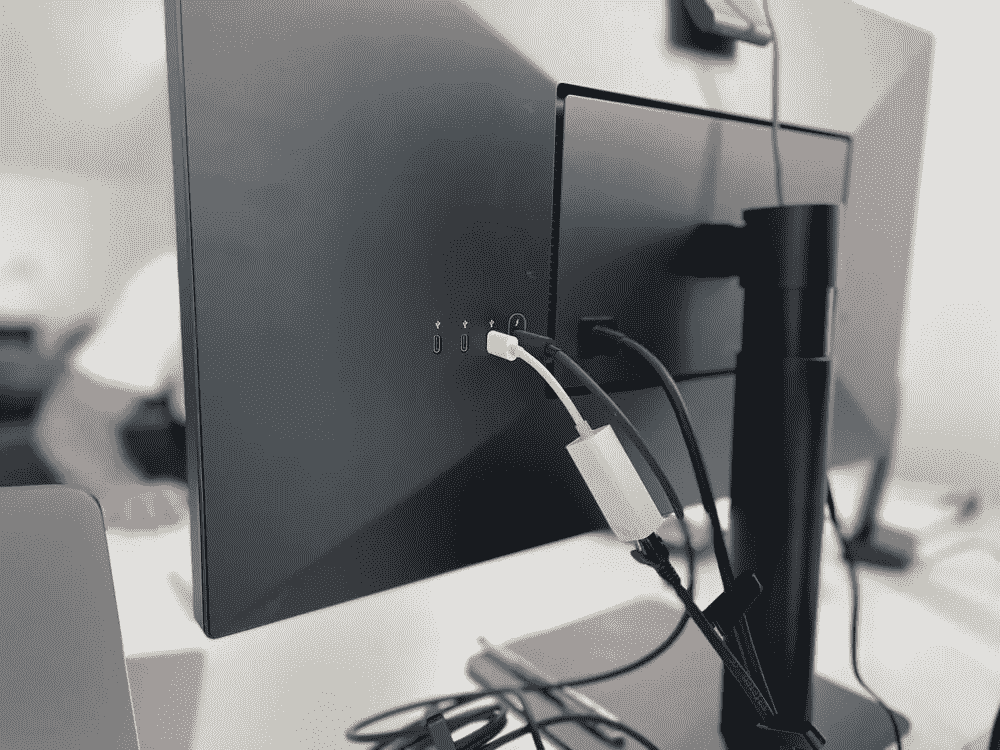
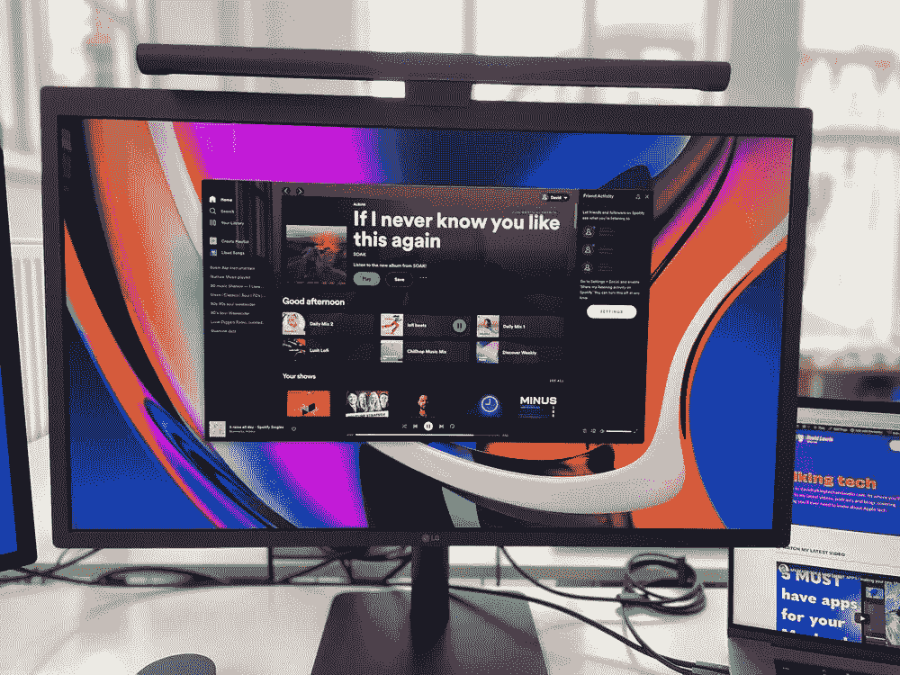
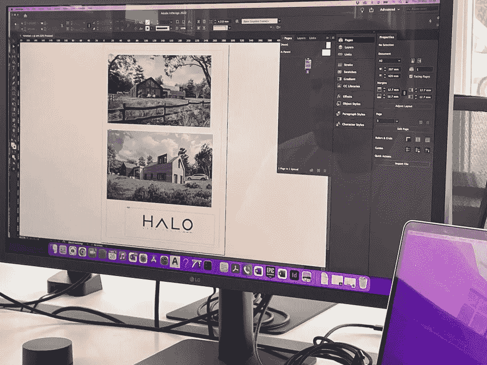

# 很长一段时间，LG Ultrafine 都是第一…但它还是王者吗？

> 原文：<https://medium.com/codex/for-a-long-time-the-lg-ultrafine-was-1-but-is-it-still-king-27f6455ca041?source=collection_archive---------2----------------------->

## 来自苹果公司的工作室展示已经出现，并撼动了这艘船。肩并肩，他们如何比较？

图片由作者提供

我从事苹果电脑，尤其是 iMac 已经十多年了。我已经习惯了惊人的视网膜显示。但是当苹果公司在三月份宣布 5K 工作室显示器的时候，我知道我想要一个。我买它还不到一个月…今天我对比了一下 LG 超细 5K 屏幕。工作室展示物有所值吗？

## 为什么要买它

我知道今年我想买一台新的苹果电脑。我们现在正处于苹果公司的最佳时机，他们生产的一些最好的硬件可供我们使用。好吧，你不能*实际上*因为供应短缺买它，但那是另一个[博客](/codex/the-closed-loop-system-f1b2ee23a151)的。但是只要在苹果的[网站](https://www.apple.com/uk/mac/)上查看一下目前有什么优惠就可以了！苹果硅改变了一切。第一次，我打算买一台笔记本电脑作为我的主要工作。交易已经相当确定了，当工作室展示宣布的时候…游戏结束了！我现在可以拥有我的*移动*蛋糕，也可以吃它……在办公桌上用 MPB *和*工作室显示器工作，然后自由创作，只用液态视网膜、迷你 LED 16 英寸 MacBook 显示器工作。我可以告诉你，这是我有过的最好的设置。

 [## iPhone 15 会是第一个带 USB-C 的吗？会让它变得完美吗？

### 我们离今年的 iPhone 14 的发布还有好几个月的时间，但是就像往常一样…

medium.com](/codex/will-iphone-15-be-the-1st-with-usb-c-will-it-make-it-perfect-1a007d72fb14) 

这是我拥有的第一台独立的苹果显示器。过去，我曾被 5K LG Ultrafine 所诱惑。然而，当我动心的时候，苹果已经不再销售它们了(事后看来，这显然是他们即将重返显示器市场的迹象)。今天，我有机会将我的显示器与 LG 面板并排放置，看看它们的对比如何。

早些时候，我去拜访了我在 [Halo Architects](https://www.haloarchitects.co.uk) 的朋友，他们是一个蓬勃发展、充满活力、由 Mac 驱动的创意建筑师团队(假设你已经猜到了最后一点！).我在那里花了一些时间，仔细比较这些展示…以下是我的想法。

## 在桌子上

图片由作者提供

一开箱，你就知道你是在用 Studio Display 处理苹果产品。它有风格，坚实的重量和感觉，当然，它包在商标铝，背面有一个大的黑色标志。LG 是笨重的！对此不要有任何误解。支架很坚固。那个监视器哪儿也去不了。相比之下，工作室的展示当然要轻一些。说到那个支架，当然你在 LG 得到的一个奢侈品是一个完全可调节的支架；高度和倾斜度。我的显示器是标准型号，只有倾斜。LG 确实延伸到了一个更好、更舒适的工作高度。苹果可以接受这个“L”——你必须为高度调节的奢华多付 400 英镑！

 [## 证明苹果生态系统伟大的 6 个理由

### 我们都听说过生态系统——今天我突然意识到它是多么真实

medium.com](/codex/6-reasons-that-prove-the-apple-ecosystem-is-great-bf5ee37007f2) 

工作室显示器的整体外观和感觉更像苹果，但 LG 塑料的说法具有误导性。这是一个高质量的显示器，只是没有苹果公司对它的赞誉。

## 面板和连接

图片由作者提供

据称，它是相同的面板，但与苹果的相比，视觉上有了明显的改善。两者都拥有 5120×2880 的分辨率和 P3 色彩，但 100 尼特的额外亮度对加州人的观看条件产生了影响。看着同一个视频(一个来自苹果网站)，它在苹果选项上更清晰、更有活力。我的显示器是如此的新，显然，没有死细胞或平点。我今天看到的 LG 大约有 18 个月了，并且没有任何这样的缺陷。两者的视角相同，都是 178/178 度。不知何故，我们都觉得演播室的展示整体上更大。

端口选择为您的 MacBook 提供了相同的雷电 3 连接器，也将为其充电。您还有三个其他 USB-C 端口用于外设。LG 的屏幕表面进行了低反射处理，这是一大乐事。在我查看这个面板的环境中，它提供了更舒适的用户体验。当然，我可以在我的显示器上享受纳米纹理玻璃的好处…但是信用卡必须再拿出来！只是这次又多了 300！

## 声音的

图片由作者提供

这是工作室在这方面的一大胜利。苹果公司在最近的 MAC 电脑上大肆宣传他们的扬声器，事实也的确如此。我的 16 英寸 MacBook 上的扬声器对于一般的听力来说绰绰有余。27 寸显示器的更好。有了更多的空间和空气，声音比笔记本电脑更好。显示屏提供了更丰富、更饱满的声音，老实说，让 LG 落在了后面。我不认为我会想听那些 LG 扬声器很长时间，并希望很快买一些桌面显示器。他们又瘦又平，腹部低于平均水平。当然，当使用杜比全景声播放音乐或视频时，您还可以在录音室显示器上获得 Siri 支持和空间音频。你还会得到一个三路麦克风排列，有一定程度的噪音压缩。

## 照相机

苹果公司昨天发布了最新的显示器固件更新，这肯定有所帮助。偏色不太像橙色，肤色通常更真实。框架也得到了改善。中央舞台是聪明的，但在很大程度上不是我会用得上的东西。今天，当我还是光晕的人的时候，我第一次看到它不仅仅是我一个人在工作。广角镜头的宽度令人咋舌。但是，总的来说，相机仍然很弱，LG 的要好得多。它的颜色和清晰度都更合我的意。固件更新改善了我显示器上的一个糟糕的摄像头，但它仍然有相当多的图像噪声。我的 1080p C920 罗技仍然胜出，超过这两个，虽然。

## 结论

图片由作者提供

现在这两个屏幕都像母鸡的牙齿一样稀有。我认为 LG 甚至可能停产。要说哪个更好，是一个硬喊。工作室显示器的整体视觉元素更好，有额外的 100 尼特亮度帮助。苹果显示器上的扬声器更好，但 LG 的摄像头更好，而且它有高度可调的支架。纯粹作为展示，它们相当势均力敌。苹果显示器胜出，但只有*才是*。

一直有关于 LG 显示器不可靠性的传言和故事，但今天再次与 Halo 交谈，他们有三个，他们没有任何问题，他们每天都有 12 个小时的锻炼！

苹果公司制造高支架和防反射涂层的利润欲望很难原谅，但这是库比蒂诺巨头的典型特征。LG 至少比标价便宜 400 英镑，这是一大笔钱。街区里新来的孩子值得额外的钱吗？很难说。我对自己的选择并不不满，但是，我又一次成为了众矢之的！

如果你的预算超出了 400 美元，而且你能证明这是合理的，那就买苹果屏幕吧。但是，如果你发现一个 LG，特别是打折的，抢购吧。这是一个很棒的面板。

尽管如此，今天展出的最好的面板是我的 16 英寸 MacBook 上的迷你 LED XDR 显示屏。天堂！

*特别感谢* [*光环建筑师*](https://www.haloarchitects.co.uk) *获得 LG 超细显示器。*

## 在你走之前

[**加入我的幕后邮件列表**](https://www.talkingtechandaudio.com)

*原载于 2022 年 5 月 26 日 https://talkingtechandaudio.com***。**