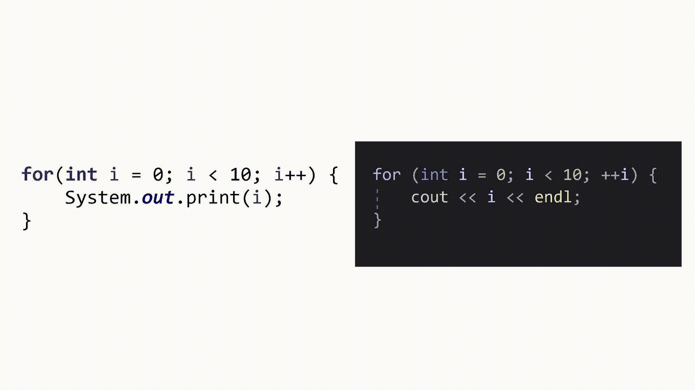
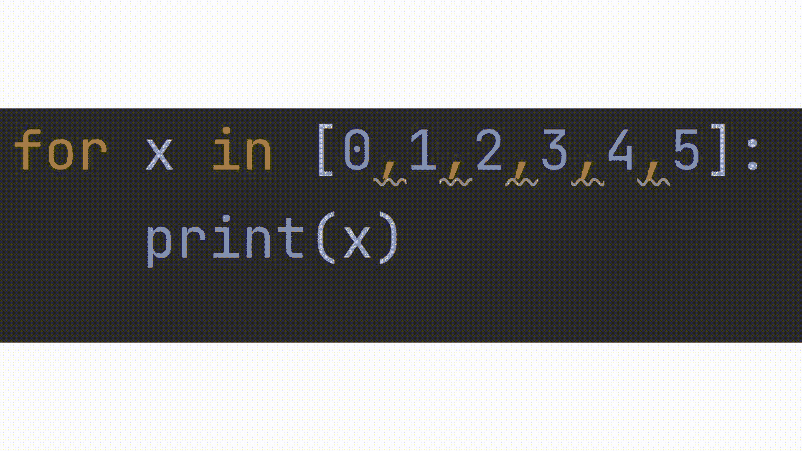
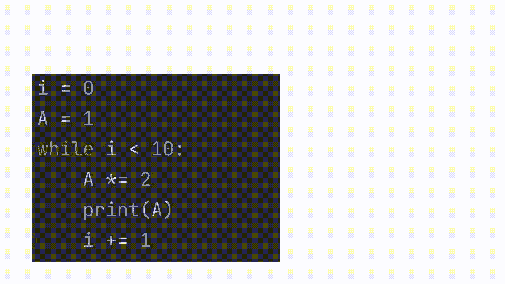

# 为了清楚起见

> 原文：<https://medium.com/codex/for-clarity-88bbf393e3c?source=collection_archive---------11----------------------->

马丁·威尔纳在 [Unsplash](https://unsplash.com?utm_source=medium&utm_medium=referral) 上的照片

知识成为你生命中许多门的钥匙和许多机会的途径。知识是得到你想要的东西的工具，但是谨慎也很重要，因为知识也是骄傲的来源。

作为一名家教，我帮助过各种各样的人。我注意到那些对学习编程充满热情的*与那些将课程作为要求的人的特点:做比最低限度更多的事情，而不是蔑视完成作业。不要把学习当成第一次玩飞镖。把答案扔来扔去，然后希望完成工作让你达到目标，这不是办法。做出有根据的猜测是可以的，但是你必须愿意学习。*

*作为一个追求知识的旅行者，你必须意识到你很可能会沿着同一条路往回走。我看到许多人在学习编程时纠结和反复思考的话题之一就是循环。最简单地说，循环是一种在满足一个或多个条件时重复代码块的方式。当这些条件改变时， ***重复*** 将结束，代码的其余部分将继续。现在，如果你专攻一门编程语言，那也不会太糟糕，因为你可以学习到这种语言中与循环相关的更小的细节。当你用多种语言的知识丰富你的专业知识时，问题就出现了。基本的概念是存在的，但它们之间的差异促使我们每个人在学习时保持警觉。*

*现在我将回顾一些关于循环的 ***概念*** ，这些概念看起来很基本，但是回顾它们是很重要的。最小的差异也可能是最大的障碍。我将重点介绍 C++、Java 和 Python，它们是大多数行业中使用最多的语言。*

# ***为循环***

*在 Java 和 C++中，有两种类型的“for 循环”:简单 for 循环和 for-each 循环。*

*简单 for 循环有 4 个基本部分:*

***第 1 节**是我们开始一切的地方:一个或多个变量被**设置**。此部分仅运行一次。此处设置的变量用作**条件变量**，并将用于设置循环继续重复的条件。*

***第 2 部分**是设置 ***比较*** 的地方，从而设置循环运行的条件。该部分将至少运行*一次*(第一次比较作为第一次进入循环的决定因素)。只要条件保持“真”,在每次迭代之后，这个部分将反复运行。*

***第 3 段**是循环的更新段，其中条件变量在每次迭代后得到 ***更新*** 。*

***当且仅当第 2 部分的条件保持为“真”时，第 4 部分**运行。该部分 4 有时被称为回路的主要/内部部分。虽然前 3 个部分都包含在一行中，但是第 4 部分可以占用 ***多行*** 。*

**

*现在我们进入 for 循环的下一个版本:" ***For-each*** "循环:*

*For-each 循环有 3 个部分:*

***这种 for 循环的第 1 节**与第 1 节非常相似，都设置了一个变量。一个主要的区别是，在这一节中，我们没有给它一个默认的初始值。*

***第 2 节**是已经填充了变量的集合。所述变量必须是一个 ***集合*** ，最常见的是一个数组/列表或一个字符串(它是一个字符集合)。这个循环将一次获取集合 ***中的每个元素*** ，将元素的值放入我们在第 1 节设置的变量中。*

***每次我们从 section 2 集合中获取一个元素并将其放入 section 1 变量时，Section 3** 就会运行。该循环将有效地使迭代次数 ***等于集合中的元素数量*** 。您不必在第 3 节中包含第 1 节变量，因此这完全取决于您以及您的代码的需求。*

**

*Python 确实是一种强大的编程语言。但它确实与 **Java** 和 **C++** 有区别。我想指出的一个区别是，python 中没有“简单 for 循环”。Python 编程语言中唯一可用的 for 循环是 for each 循环(在 Python 中称为“for in”循环)。在编写代码时，这可能看起来无关紧要，但在将代码从一种语言翻译成另一种语言的情况下，这就变得复杂了。在这种情况下，我们可能不得不做一些人所谓的 for 循环模拟，这是使用 while 循环完成的。现在，这种模拟可以用手头的 3 种语言中的任何一种来完成，但是如果我们需要 python 中的“简单循环”,这可能是必要的。*

*要做这个" ***模拟*** "必须设置简单 for 循环的不同部分，但它看起来与实际 for 循环有点不同(请看插图)。本质上，条件变量将在循环之前设置，条件部分(第 2 部分)将在 while 循环的括号部分设置；最后，更新部分(第 3 部分)将在第 4 部分的末尾完成。这种设置有效地为您提供了循环行为。成功！*

**

*当然，对于与 for 循环相关的细节还有更深入的解释和分析，但这只是一瞥。不要急于在短时间内学会所有的东西:密集地学习基础知识，你将在你的知识之旅中拥有坚实有力的基础。如果你有任何问题要问我，请随意。我们都在一起。让我们一起成为伟大的程序员。*